# 我饿

## 问题的解答

## 课程大纲

### 看懂图片

> 电气原理图
>
> 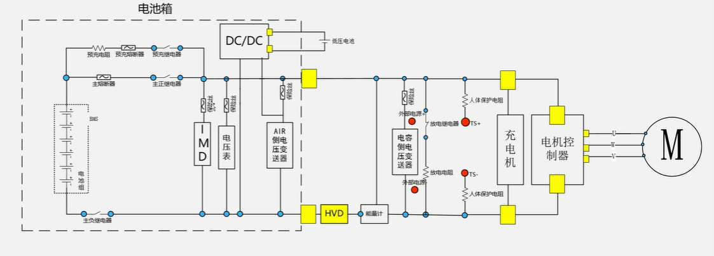

> 安全回路原理图
>
> 

> 整车硬件逻辑图
>
> 

### 看懂字

**全国大学生方程式竞赛的规则：**

电池箱隔离继电器(AIR)的规则：

1. 规则和检查表
2. 电池电气的检查详解，有相应的参考答案（目标）
3. 电气系统表：告诉组委会我们的答案是什么（提前提交纸质的，交给组委会进行提前的排查），之后会有一个审核的反馈表。只有文档通过才会有线下的车检的资格(ESF审核反馈表)**相当于模拟考试**

知乎：规则解释的文章：

## 电池

### 电池的基本参数

> 封装形式
>
> 软包电池（小批量的制作，比较贵），圆柱形的电池（单个的比较小，但是比较便宜，所以需要多个封装在一起），方壳电池

> 内部的结构
>
> 锂离子电池

> 电池的物理参数
>
> > **电压**
> >
> > 最高电压
> >
> > 额定电压
> >
> > 最低电压
>
> > **电流**
> >
> > 最大的放电电流
> >
> > 最大充电电流
> >
> > 倍率（与充电的时间相关）
>
> > **容量**
> >
> > 电池放电的性能：1A*h=3600C，代表能放出电子的数量
>
> > **能量：**
> >
> > 千瓦*时，简称为度

------

> 模组将电池分成子模块
>
> 
>
> 降低操作的危险性，将箱子分开时，最高的电压是小块的电压
>
> 方法：
>
> - 铜排压接
> - 手工电焊的方式

> 维护插头：

------

钴酸锂电池：昂贵，倍率高，危险

## 预充电和AIR

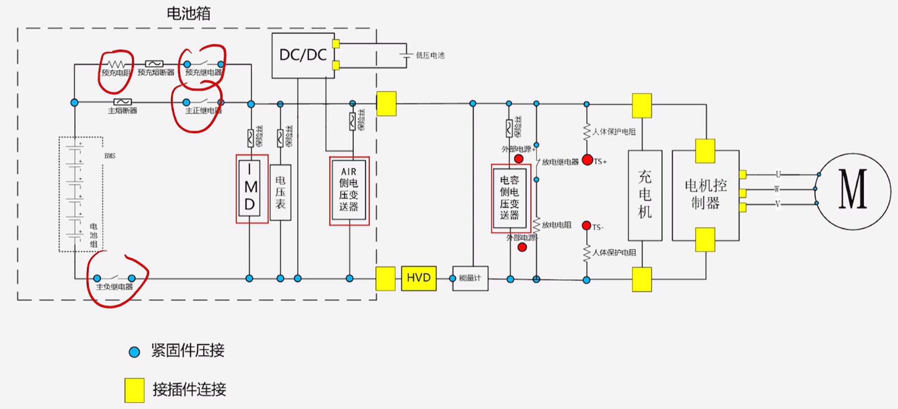

预充回路的电阻：功率电阻，短路所产生的比较大的功率，这种黄色的电阻，或者是陶瓷的功率电阻

 电阻的过载能力

> AIR：主正，主负的高压直流接触器（继电器）
>
> 有些会有四个线，有两个线是辅助的触电，描述主接触器的状态（同开同关的辅助触点），通过测量辅助触点的状态，确定继电器是否接通。（主辅助触点会比较高压）

> 高压屏蔽电缆：
>
> 耐磨，抗腐蚀，抗电磁干扰的功能

铜鼻子用螺母压在继电器的圆面上，必须主动锁紧，

## IMD和电压变送器

### IMD

绝缘是什么？两个物体之间的电压过小是，就不会绝缘

车上的绝缘故障就是：高压和低压部分的电阻过小

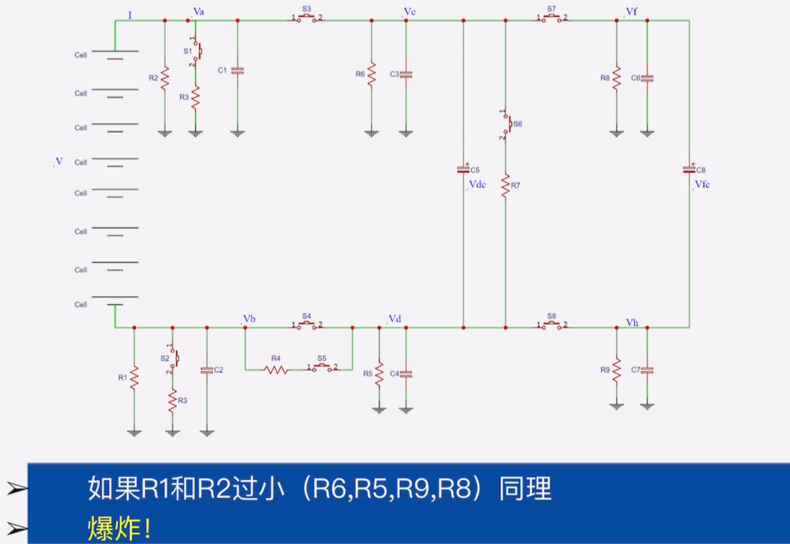

理论上的绝缘电阻是无穷大，但是只要电阻够大就好了

> IMD为绝缘检测装置
>
> 官方指定的零件型号
>
> double check   电池箱上的一些地方可能没有接地

会有一个相应阈值，选择一个型号（相应的）

但是，在绝缘故障消失之后，IMD的信号会自动复位

不过，不能使整个系统直接重新启动，而是应该必须重新手动启动

会使用到自锁的功能

> 驱动系统激活指示灯（TSAL）
>
> 指示驱动系统(TS)状态，告诉所有人，车上有没有高压
>
> 22年的规则是比较简单的
>
> - 激活条件
>
>     - AIR闭合（主正，主负）
>
>     - 预充继电器
>
>         上述的两种继电器使用辅助的触电就可以进行测量
>
>     - 但是，电机的控制器两边的电源不一定是电池箱，所以还要对两端的电压进行直接的测量（>60V时）

## 高压指示器，DC/DC，hvd和放电回路

高压和低压之间理论上存在电阻

通过车架来接地

## BSPD

### 低压系统

**继电器的控制：**

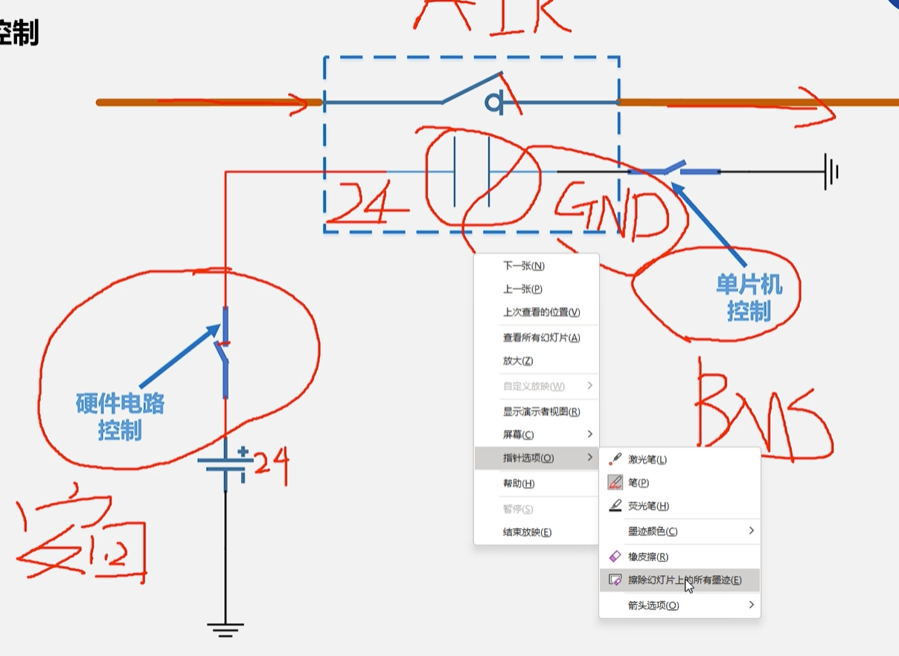

继电器：bspd，imd，ams

> 现在讲的是bspd
>
> 制动系统优先驱动

1. 加速踏板传感器：APPS，滑动变阻器

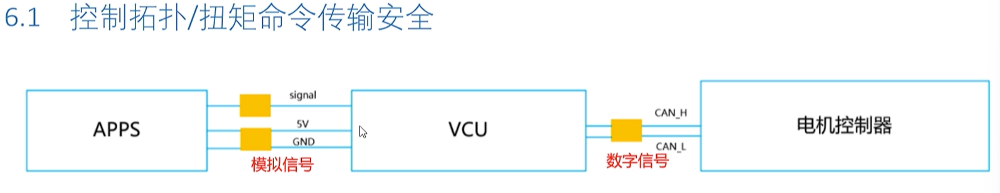

​	先通过滑动变阻器的模拟信号（连续的电路的信号）

2. 刹车：线位移传感器

> 为什么油门和刹车的传感器不一样
>
> 油门有着两路滑动变组器，是一个冗余的设计（为了防止一个出现问题），**油门是纯电子的控制**
>
> 但是**刹车是完全机械的控制**，没有刹车的传感器，依旧能够刹车
>
> 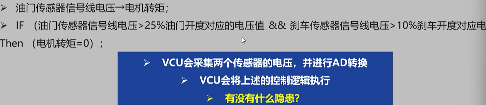

> 但是油门的深浅不能完全代替电机的工作状态
>
> 刹车上也是同样的问题
>
> 也有可能是电机卡住了这样的问题


> 将电机的功率直接使用**电流的大小**来代替
>
> 将刹车力度的大小直接使用**制动液的压力大**小来展现
>
> **这种形式比较直接**
>
> 所以，在电流大小很大；压力大小也很大的时候就要实现断开的效果

所以做的事是让电机不在转动，所以电机卡在全功率的状态，应该将电机的高压电断开。

BSPD

## BMS

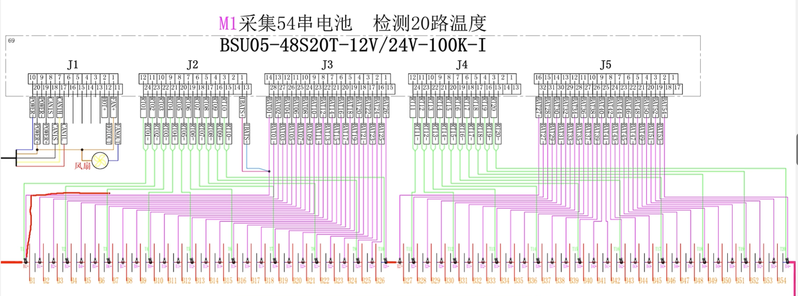

- 改进：
    - 引入pcb的单体电压采集板
    - 减少拆装的难度

但是还是有实体的线

3. 自制的BMS

    封装吗，尽量无线

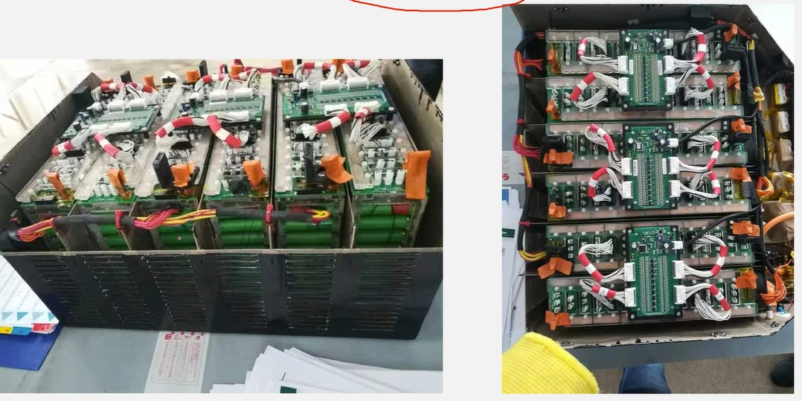

#### 控制功能

控制air，高压继电器线圈的GND信号，什么时候接到gnd上


#### 输出故障的信号

电路中的**AMS指示灯**

若电池管理系统断开了安全回路，那么需要点亮座舱中AMS的指示灯，且必须是**自锁的，直到错误状态被手动重置**

BMS的信号必须是系统的关键信号

> 如何控制信号灯呢——出现故障后，切断继电器，闭合K5输出低电平，对地导通。
>
> 没有故障的时候k5是悬空的

#### 系统关键信号

又叫scs

**对于k5信号的scs信号保护**


前者是没有故障的时候，signal为低电平，后者是有故障的时候，为高电平

开关下面的电阻为下拉电阻

二极管正极的电阻为下拉电阻，是线路断开的时候

#### 辅助触点信号的scs保护

任何的scs信号的单点故障

### 均衡的功能

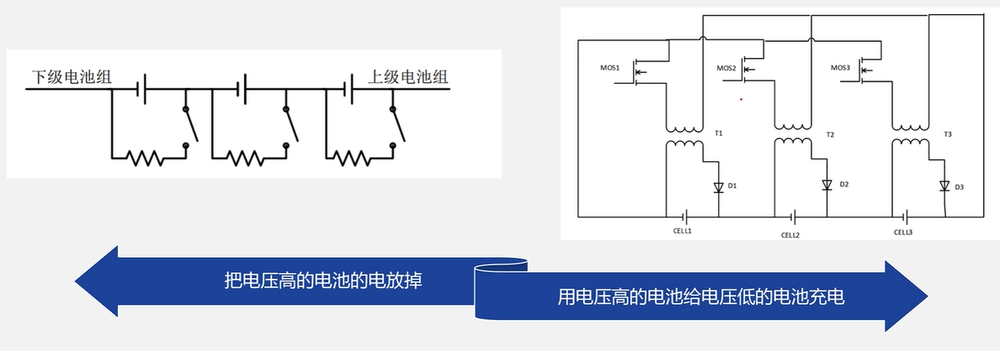

主要使用左边的被动均衡

### soc预测

电池还有多少的电

电动车上的电量显示

> 电池的开路电压
>
> 开路电压和soc之间的关系曲线
>
> 必须是开路电压的时候，电压才能真是反应剩余的电量，但是由于内阻的分压，会导致不准
>
> 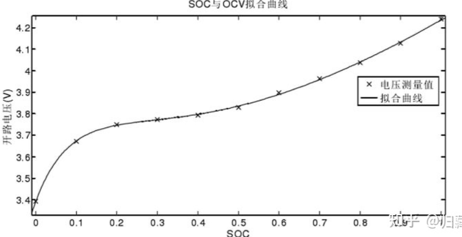
>
> **这个曲线实际上是电池的能斯特方程反应**
>
> 但是会存在以下的问题：
>
> 1. 首先适用于电路，电池在稳定的情况下
> 2. 还要确认材料体系，温度
>
> **所以实际使用电压计算soc时，soc会不断震荡，因为电流消失后，又变为开路的电压**

> [!note]
>
> 所以真正的准确计算方式
>
> 使用按时积分法，但是会产生电流积分不准的情况

所以会将两种东西配合起来使用，双管齐下

> 所以来说，没有仪器能准确估计剩余的电量大小

## 安全回路原理图中不需要逻辑的部分

### LVMS和TSMS

为低压系统的主开关和高压（驱动系统）系统的主开关

是一种旋转式的总开关，非常难以无出发

**位置：**


LVMS是最开始的开关，不开时，都不能通电

TSMS是上高压的最后的开关

### 惯性开关

惯性开关是用来解决装车之后来断电的

### 制动超行程开关

如果油管破损导致没有刹车油时，会使刹车的力很低

当刹车踩到了不该到达的问题，就会碰到急停的开关

### 安全回路的组成

- 有逻辑电路的
    - BMS
    - IMD
    - BPSD
- 没有逻辑电路的
    - 惯性开关
    - 所有所需的互锁电路
    - 两个主开关（LVMS,TSMS）
    - 三个急停开关
    - 制动超行程开关(BOTS)

## 整车控制器VCU

是车上最重要的软件控制

### VCU是做什么的

在加速踏板的时候提到过VCU，接收电压等模拟量，将转换为数字量，给到电机控制器。**起到模数转换的功能**

### io口

一个读，一个法，实现一个的点位控制另一个的电位。实现开关控制灯亮之类的。

### AD转换


将连续的模拟信号转换成为离散的数字信号

当滑动变阻器调节，实现电压超过某个值时，就灯亮

### 关于PWM

如何使**一辆车保持匀速行驶？**

就是高频切换的io，将电压用想要的输出

长长短短的开关开关，得到想要的亮度或者是电压

### CAN通信

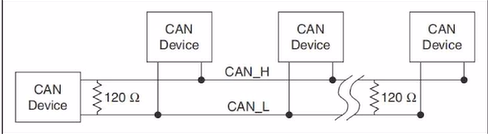

就是四个单位通信，这里的线是很少的

使用总线的原理？并联？（加一个通信单位的时候，只需要加上两根线）

> 串口一次会传输8个字节(一个字节8位二进制，2为16进制)的数据，一个字节最大的值为255
>
> 例如：FF FF FF FF FF FF FF FF
>
> 

### DBC矩阵的解析

通过一次8字节的数据，每个字节传输不同的电压值，最后需要进行解析，解析到对应的电压值等等

## 华海的VCU编程

写程序，总的整车控制器，但是是不需要一行行敲代码的，可以实现单片机的一些功能

### simulink

我们是在simulink中进行编写

打开matlab中的simulink进行建模

simulink可以进行电路仿真

> 1. 在上面的库浏览器中找到想要的电路元件
> 2. voltage——电源；resistor——电阻；
> 3. 必须是同一个库里面的device才能相互连接
> 4. 我们现在仿真所用的库是Simscape
>
> 
>
> 
>
> 5. 点击scope（示波器），进行测量


#### 实例：实现预充电电路的仿真

在上面的库中

## DBC

**学会DBC解析**，非常重要的

### 一帧can报文的组成

- 标准帧
- 扩展帧

一帧中会包含由8个字节，但是每个字节代表的含义是人为规定的

所以需要将数据解码为人能看懂的东西，或者将人看懂的东西转变为数据

### DBC的解析

byte（字节）

bit（二进制位数，是最小的单位）

一个字节由8位二进制组成

**一般使用矩阵的形式进行解析**

#### 练习

答题抢车号的方式进行**车号的抢夺**


ID和can报文数据

**ID的内容是0x277**，can报文的内容是5Y C4 60 86 AF 11 9X

先收到的数字是排在左边的，符合正常的认知的。

1. 先做表格：（下面的这张表格为对照的表格）图中的数字为对应的（相当于一个标识）

​	bit从右往左，byte从上往下

2. intel的格式是往下数的，信号的高位放在高字节的高位，信号的低位放在低字节的低位上（也就是从右上往左下越来越大，越是高位），就是按照表中的数就行

3. motorola模式

4. 从数据的高位连到数据的低位

    100 1ABC D000

    100 1111 1000

    可以看出，同一行是从左往右的，最开始的为低位，最后的为高位

> 名词的解释：
>
> 1. start bit:开始起始的位置，在上面黄色的表中
> 2. length bit：持续的长度
> 3. factor：相当于比例尺，将二进制得到的数字乘以factor
> 4. offset：将乘以后得数字加上这个数字，为实际的物理参数

5. 有些数据还是得自己算的，但是有的数据可以由软件来求解的，不过最后还是要自己来从中获取的（DBC）

## 电气组培训

参考资料：大学生方程式，当年赛季的规则，技术手册

现在要进行的就是我们现在的新的

### 规则

**电车规则**

我们现在

```c++
wwww
    sss
    
    
    
    ss
```

 !!! note

