doi：10.19562/j.chinasae.qcgc.2025.03.009 

# 基于混杂模型预测控制的分布式驱动电动汽车 AFS/DYC 集成控制

郑字琛1，2，王 姝1，赵 轩1，李兆柯1，3

（1. 长安大学汽车学院，西安 710064；2. University College Dublin School of Mechanical and Material Engineering，Dublin 999015；3. 内蒙一机西安应急装备研究中心，西安 710064）

［摘要］ 为提高分布式驱动电动汽车在不同附着路面高速行驶的操纵稳定性，提出一种基于混杂模型预测控制的 AFS/DYC 集成控制策略。首先基于系统辨识方法构建轮胎分段仿射模型，结合车辆动力学模型以及命题逻辑与线性不等式的转换关系 构建车辆系统混合逻辑动态模型，然后设计基于混杂模型预测控制的 AFS/DYC 集成控制策略，采用混合整数二次规划方法追踪目标参考值决策附加横摆力矩与附加转向角，并以轮胎负荷率最小为目标构建车轮驱动转矩优化分配控制策略，最后基于 CarSim-Simulink 联合仿真平台进行驾驶人在环操纵稳定性测试试验。测试结果表明：相较于传统模型预测控制，所设计的混杂模型预测控制策略在高速双移线工况下横摆角速度与质心侧偏角均方根误差分别下降了 31. 61% 与 19. 51%，四轮峰值平均转矩幅值降低 24. 27%。

关键词：分布式驱动电动汽车；操纵稳定性；集成控制；分段仿射模型；混杂系统

# Integrated Control of Distributed Drive Electric Vehicle AFS/DYC Based on Hybrid Model Predictive Control

Zheng Zichen1，2，Wang Shu1，Zhao Xuan1 & Li Zhaoke1，3 

1. School of Automotive， Chang’an University， Xi’an 710064； 2. University College Dublin School of Mechanical and Material Engineering， Dublin 999015； 3. Inner Mongolia First Machine Xi 'an Emergency Equipment Research Center， Xi 'an 710064 

［Abstract］ To improve the handling stability of distributed drive electric vehicles （EVs） at high speeds on different road surfaces， in this paper an integrated control strategy for AFS/DYC based on hybrid model predictive control is proposed. Firstly， a piece affine tire model is constructed based on system identification methods. In con⁃ junction with the vehicle dynamics model and the conversion relationship between propositional logic and linear in⁃ equalities， the vehicle system’s mixed logical dynamic model is constructed. Then， an integrated control strategy for AFS/DYC based on hybrid model predictive control is designed. The strategy uses mixed integer quadratic pro⁃ gramming to track target reference values for decision-making on additional yaw moment and additional steering an⁃ gle， and constructs an optimized wheel driving torque distribution control strategy with the goal of minimizing tire load rate. Finally， a driver-in-loop handling stability test experiment is conducted on the CarSim-Simulink co-simu⁃ lation platform. The test results show that compared to the traditional model predictive control . the designed hybrid model predictive control strategy reduces the root mean square error of yaw rate and side slip angle by 31.61% and 19.51% respectively under high-speed double lane change conditions and the peak average torque amplitude of the four wheels is reduced by 24.27%. 

Keywords：distributed drive electric vehicles； handling stability； integrated control； piecewise affine model；hybrid system 

前言

分布式驱动电动汽车（distributed drive electricvehicle， DDEV）由多个轮毂电机或轮边电机独立驱动 4 个车轮，结构紧凑，提高了响应速度与控制精度，吸引国内外研究人员以及汽车厂商越来越多的关注，成为纯电动汽车新型发展方向［1-2］。

目前提高分布式驱动电动汽车操纵稳定性的技术有：纵向动力学控制、横向动力学控制及纵 - 横向动力学集成控制技术［3-5］。主动转向控制技术包括主动前轮转向系统（active front wheel steering， AFS）和主动四轮转向系统，通常将前轮或四轮线控转向控制系统作为执行器，通过施加附加转向角改变侧向力来补偿附加横摆力矩［6］。Zhao 等［7］采用二次型线性调节器决策附加转向角并使用线控转向系统执行。周兵等［8］考虑转弯行驶时载荷转移及路面条件变化对车身稳定状态的影响，采用非线性滑模控制器决策附加转角。直接横摆力矩系统（direct yaw moment control， DYC）以驱动电机作为执行器，依据决策出的附加横摆力矩优化分配驱动力矩实现车辆的横摆控制。 Yue 等［9］提出了一种改进差分进化的 PID 控制器生成所需横摆力矩，下层使用顺序二次规划的方法优化分配转矩使车辆保持横向稳定。Nahidi 等［10］采用模型预测控制最小化车辆横向稳定性状态误差，优化求解车辆所需纵向力与横摆力矩，并通过差动驱动实现了横摆稳定性控制。Wang 等［11］采用聚类算法进行稳定性判断，根据车辆实时运行状态点与聚类中心点的欧氏距离确定 AFS 与 DYC 的控制权重。然而，以往的研究往往采用线性动力学模型描述被控对象，难以反映车辆的强非线性特点。虽然有学者利用非光滑控制和非线性模型预测控制等非线性求解器计算多个控制量，能够提高集成控制算法精度，但非线性求解计算量较大导致控制系统的响应速度较差。

系统辨识法在车辆动力学建模方面具有广阔前景，分段仿射具有强大的非线性逼近能力。Sun 等［12］ 利用分段仿射法拟合了发动机、自动变速器和轮胎的车辆主要部件的非线性特性，进一步将车辆纵向动力学转化为混合逻辑动力学模型。Steyaert 等［13］提出一种广义分段仿射磁态空间模型，将电流和通量空间划分为简单仿射子模型。Sun 等［14］建立了轮胎纵向动力学模型，基于此设计了车辆纵向动力的控制。本文为了精确描述车辆运动过程中轮胎侧向力的变化情况，引入了分段仿射建模法（piecewise affine， PWA）。

在分布式驱动电动汽车稳定性控制过程中，是通过轮胎分段仿射模型的仿射子模型的变化实现多种轮胎特性的自适应离散切换，而在每个子模型构成的子系统中，车辆状态更新过程为典型的连续动态过程。因此分布式驱动电动汽车稳定性控制可以看作是一个包含连续动态变化和离散模式切换的具有明显混杂动态特征的混杂系统，基于此特点本文采用混杂模型预测控制算法（hybrid model predictive control， HMPC）作为稳定性控制的上层控制策略［15］。

综上所述，本文以分布式驱动电动汽车为研究对象，分析非线性车辆系统混杂特性，旨在提高车辆在不同工况条件下的操纵稳定性。

## 1　轮胎分段仿射模型

## 1. 1　轮胎数据获取

本文采用魔术公式（magic formula， MF）模型对轮胎的力学特性进行描述，其一般表达式为

$$
\begin{array}{c} y \left(x _ {t}\right) = D \sin \left\{C \arctan \left[ B x _ {t} - \right. \right. \\ E \left(B x _ {t} - \arctan B x _ {t}\right) ] \} \end{array}\tag{1}
$$

式中： $: y \big ( x _ { t } \big )$ 作为输出变量； $\mathbf { ; } x _ { t }$ 作为模型的输入参数之一，表示车轮滑移率或轮胎侧偏角；B、C、D、E 分别表示刚度因子、形状因子、峰值因子和曲率因子，由轮胎的垂向载荷和外倾角确定。

选用典型低附着与高附着工况下轮胎侧偏力学特性数据，绘制轮胎侧偏力学特性数据在三维空间中的分布图，经插值后各自均以不规则曲面形式呈现，如图 1 和图 2 所示，轮胎参数设置如表 1 所示。

## 1. 2　分段仿射模型建立

轮胎 PWA 建模的基本原理是将轮胎侧偏力学数据分割为有限不重叠的子平面，每个平面对应一个工作区域，以超平面的方式表示工作区域的划分规 则［16］。 使 用 自 回 归 外 生（AutoRegressive systemswith eXogenous inputs，ARX）模型经过推广得到的形式作为轮胎 PWA 模型的具体建模结构［17］：

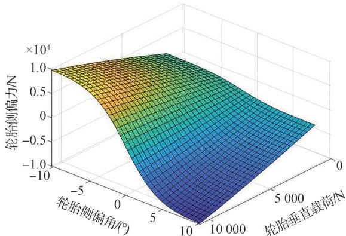

图 1　高附着下轮胎侧偏力学数据分布

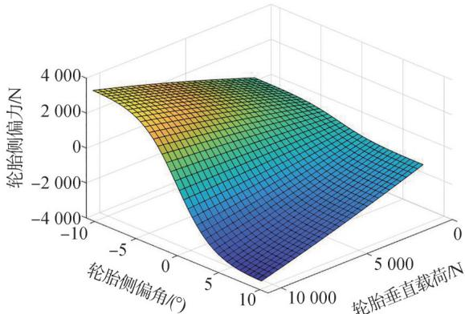

图 2　低附着下轮胎侧偏力学数据分布

表 1　轮胎侧偏力学特性数据采集相关参数设置

<table><tr><td>类别</td><td>数值</td></tr><tr><td>垂直载荷/N</td><td>1 348~10 787, samples = 30</td></tr><tr><td>轮胎侧偏角/(°)</td><td>-10.7~10.7, samples = 40</td></tr><tr><td>路面附着系数</td><td>0.3(低), 0.85(高)</td></tr><tr><td>最大允许力/N</td><td>100 000</td></tr></table>

$$
f (t) = \left\{ \begin{array}{c c} \boldsymbol {\theta} _ {1} ^ {\prime} \left[ \begin{array}{c} \varphi (t) \\ 1 \end{array} \right], & \varphi \in \Omega_ {1} \\ \vdots \\ \boldsymbol {\theta} _ {s} ^ {\prime} \left[ \begin{array}{c} \varphi (t) \\ 1 \end{array} \right], & \varphi \in \Omega_ {s} \end{array} \right.\tag{2}
$$

式中： $\Omega \in \mathbf { R } ^ { n }$ 是有界的输入状态集合 $\vdots \{ \Omega _ { i } \} _ { i } ^ { s } .$ 表示Ω内包含 s 个不重叠的输入状态子集； $\pmb { \theta } _ { i } \in \mathrm { R } ^ { m + 1 } ( i =$ $1 , 2 , \cdots , s )$ 为每个仿射子模型的参数矩阵 $\ ; \varphi ( t )$ 为系统回归向量，定义为

$$
\begin{array}{c} \boldsymbol {\varphi} (t) \triangleq [ y (t - 1), y (t - 2), \dots , y (t - n _ {\mathrm{a}}), \\ u ^ {\prime} (t - 1) u ^ {\prime} (t - 2) \dots u ^ {\prime} (t - n _ {\mathrm{b}}) ] ^ {\mathrm{T}} \end{array}\tag{3}
$$

式中 $n _ { \mathrm { a } }$ 和 $n _ { \mathrm { b } }$ 分别代表系统输出和输入的阶次。子

集的工作区域划分规则可以表示为

$$
\left\{ \begin{array}{l} \Omega_ {i} = \{\boldsymbol {P} _ {i} [ \boldsymbol {\varphi} (t) 1 ] ^ {\mathrm{T}} \leqslant 0 \} \\ \bigcup_ {i = 1} ^ {s} \Omega_ {i} = \Omega ; \Omega_ {i} \cap \Omega_ {j} = \varnothing ; \forall i \neq j, i, j \in [ 1, s ] \end{array} \right.\tag{4}
$$

式中 $P _ { i } ( i = 1 , 2 , \cdots , s )$ 为各个工作区域的超平面系数矩阵。

根据轮胎侧偏力学特性的输入及输出状态可以确定 $n _ { \mathrm { a } } = 0 , n _ { \mathrm { b } } = 1$ 及 $m _ { x } = 2$ ，则 $\varphi ( t ) = \bigl [ \begin{array} { l l } { F _ { z } } & { \alpha } \end{array}$ ]T 为系统的回归向量，其包含轮胎垂直载荷与轮胎侧偏角。同时考虑参数矩阵 $\pmb { \theta } _ { i } = \left[ \begin{array} { l l l } { \pmb { \theta } _ { i - 1 } } & { \pmb { \theta } _ { i - 2 } } & { \pmb { \theta } _ { i - 3 } } \end{array} \right]$ ，则第 i 个仿射子模型可以表示为

$$
F _ {y} = \theta_ {i - 1} F _ {z} + \theta_ {i - 2} \alpha + \theta_ {i - 3}\tag{5}
$$

式中： $F _ { _ { y } }$ 为轮胎侧偏力； $\mathbf { \delta } _ { i - 1 } \ 、 \theta _ { i - 2 }$ 和 $\theta _ { i - 3 }$ 分别为轮胎垂直载荷仿射系数、轮胎侧偏角仿射系数和仿射项系数。

## 1. 3　轮胎分段仿射子模型参数辨识

采用基于改进 Kmeans++ 的轮胎平面侧偏力学数据的聚类方法［18］，对轮胎侧偏力学数据中包含的 N 个点抽象为 $( \varPsi ( j ) , \gamma ( j ) ) , j = 1 , 2 , \cdots , N$ ，构建 N 个包含其自身在内并具有 $c _ { j }$ 个邻近数据点的轮胎局部数据集 $C _ { j } ^ { [ 1 9 ] }$ 。建立对轮胎侧偏力学数据集聚类所需的特征向量 $\xi _ { j }$ 及方差 $R _ { i }$ ：

$$
\left\{ \begin{array}{l} \boldsymbol {\xi} _ {j} = [ (\theta_ {j} ^ {\mathrm{L}}) ^ {\prime}, m _ {j} ^ {\prime} ] ^ {\prime}, \forall j = 1, 2, \dots , N \\ \boldsymbol {R} _ {j} = \left[ \begin{array}{c c} V _ {j} & 0 \\ 0 & Q _ {j} \end{array} \right] \end{array} \right.\tag{6}
$$

式中 $\xi _ { j }$ 是由第 j 个轮胎局部数据集的参数向量与散度向量构成。

由于轮胎侧偏力学数据的每个点与其对应的局部数据集构成双向映射，所以轮胎侧偏力数据设置为不相交的数据子集 $F _ { i } , \ i = 1 , 2 , \cdots , s$ ，以此作为原始数据的聚类结果。为此制定下列规则将原始数据进行分类：

$$
\text { If } \quad \boldsymbol {\xi} _ {j} \in D _ {i} \Leftrightarrow (\Psi (j), y (j)) \in F _ {i}\tag{7}
$$

设 $P _ { i } = \left[ \rho _ { i } \sigma _ { i } \right]$ 为划分数据子集的超平面系数，则子集 $\Omega _ { i }$ 工作区域判定的方法为

$$
\Omega_ {i} = \{\rho_ {i} \varphi (t) + \sigma_ {i} \leqslant 0 \}\tag{8}
$$

根据聚类中心的最近邻法则，确定相邻的轮胎数据子集，即

$$
\left\{Z _ {i}, Z _ {j} \right\} = \min _ {1 \leq i, j \leq s, i \neq j} \left\{\bar {Z} _ {i}, \bar {Z} _ {j} \right\}\tag{9}
$$

式中 $Z _ { i \setminus Z _ { j } }$ 为两个相邻的聚类中心参数。

相邻轮胎数据子集之间的超平面描述为 $P _ { i } [ \varphi ( t ) \ 1 ] ^ { \mathrm { r } } = 0$ ，令 $\Omega _ { i }$ 子集中样本的数据标签为 $v ( i ) = 1$ ；属于 $\Omega _ { j }$ 子集中样本的数据标签为 $v ( j ) =$ -1。采用线性支持向量机的方法，得到规划问题［20］：

$$
\left\{ \begin{array}{l} \max J (q) = \sum_ {i = 1} ^ {l} q _ {i} - \frac {1}{2} \sum_ {i, j = 1} ^ {l} q _ {i} q _ {j} v (i) v (j) K [ \varphi (i), \varphi (j) ] \\ \text {s.t.} \left\{ \begin{array}{l} \sum_ {i = 1} ^ {l} q _ {i} v (i) = 0 \\ 0 \leqslant q _ {i} ^ {\prime} \leqslant \lambda , i = 1, 2, \dots , l \end{array} \right. \end{array} \right.\tag{10}
$$

式中： $l = M _ { i } + M _ { j }$ ，为数据子集 $\Omega _ { i }$ 和数据子集 $\Omega _ { j }$ 包含的轮胎侧偏力学数据量的总和；K( ⋅ ) 为核函数；$q _ { i }$ 为 Lagranges 因子；λ为控制对错分样本的惩罚程度。对划分轮胎 PWA 模型工作区域的超平面系数求解如下：

$$
\left\{ \begin{array}{l} \rho_ {i} = \sum_ {i = 1} ^ {l} q _ {i} v (i) \Psi (i) \\ \sigma_ {i} = v (i) - \rho_ {i} \Psi (i) \end{array} \right.\tag{11}
$$

通过输入相同垂直载荷与轮胎侧偏角，辨识得到 PWA 模型与轮胎侧偏力学数据在每个采样点上的误差，如图 3 所示。

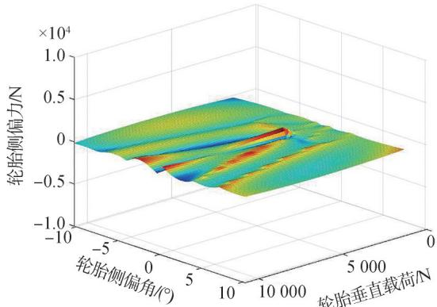

(a) 高附着下轮胎 PWA 模型仿真误差

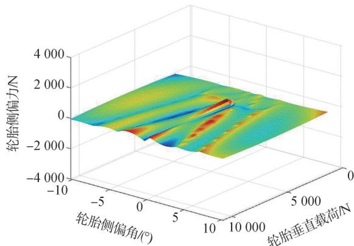

(b) 低附着下轮胎 PWA 模型仿真误差

图 3　轮胎模型误差分析

由图 3 可知，PWA 模型的误差分布集中在零附近，且两种路面附着下的轮胎 PWA 模型的误差分布较为平缓且平均值较小。其中，低附着下峰值误差被限制在 200 N 以内，且均方根误差为 47. 05；高附着工况下其峰值误差低于 500 N，均方根误差为 113. 84。

## 2　车辆混合逻辑动态模型建立

## 2. 1　车辆 PWA 动力学模型

结合轮胎 PWA 模型与 2-DoF 车辆动力学模型建立的车辆 PWA 动力学模型，通过建立状态方程描述仿射子模型的动态特性。考虑到轮胎所受垂直载荷及其侧偏角变化对侧偏力学特性的影响，因此 2 自由度车辆动力学模型采用其扩展形式［21］。选择前轮转角 $\delta _ { \mathrm { f } }$ 与附加横摆力矩 $\Delta M _ { z }$ 作为模型控制输入，则该模型如图 4 所示。

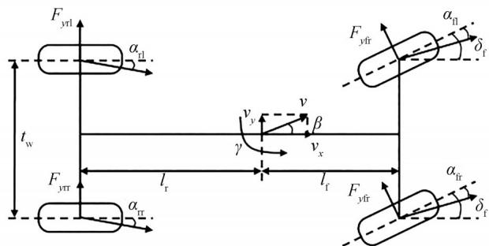

图 4　扩展车辆动力学模型

基于轮胎 模型构建误差状态空间方程，令 $\pmb { x } = [ \Delta \beta , \Delta \gamma$ T 为状态向量， $\boldsymbol { y } = [ \Delta \beta , \Delta \gamma ] ^ { \mathrm { T } }$ 为输出量，$\pmb { u } = [ \Delta \delta _ { \mathrm { f } } , \Delta M _ { \mathrm { \scriptscriptstyle 2 } }$ ]T 为输入量。其中， $\Delta \gamma = \gamma - \gamma _ { \mathrm { d } } , \Delta \beta =$ $\beta - \beta _ { \mathrm { d } } , \Delta \delta _ { \mathrm { f } }$ 为附加主动前轮转角。采用向前欧拉法离散后得到车辆分段仿射系统状态空间表达式，表示为

$$
\left\{ \begin{array}{l} m v _ {x} (\dot {\beta} + \gamma) = \left(F _ {y f l} + F _ {y f r}\right) \cos \delta_ {f} + \left(F _ {y r l} + F _ {y r r}\right) \\ I _ {z} \dot {\gamma} = l _ {f} \left(F _ {y f l} + F _ {y f r}\right) \cos \delta_ {f} - l _ {r} \left(F _ {y r l} + F _ {y r r}\right) + \Delta M _ {z} \end{array} \right.\tag{12}
$$

式中： $: m$ 为车辆质量； $\smash { : l _ { \mathrm { f } } \Omega _ { \mathrm { r } } }$ 分别为质心到车辆前轴、后轴的距离 $; t _ { \mathrm { w } }$ 为车辆前后轮距； $; v _ { x }$ 为车辆的质心纵向速度；I 为车辆绕 z 轴的转动惯量； $F _ { \mathrm { { y f 1 } } } \setminus F _ { \mathrm { { y f r } } } \setminus F _ { \mathrm { { y l } } } \setminus F _ { \mathrm { { y r } } }$ 分别为 4 个车轮所受轮胎侧偏力 $; \beta , \gamma$ 分别为车辆的质心侧偏角与绕 z 轴的横摆角速度； $\Delta M _ { z }$ 为车辆通过差动驱动或制动获得的附加横摆力矩。

车辆实际行驶过程中，前轴轮胎侧偏角变化相对较大，同时垂直载荷在轴间也会产生较明显的偏移［22］。同时为了减小计算复杂度，后轮的侧向力由线性模型进行表示：

$$
\left\{ \begin{array}{l} F _ {y \mathrm{fl}} = \theta_ {i - 1} F _ {z \mathrm{fl}} + \theta_ {i - 2} \alpha_ {\mathrm{fl}} + \theta_ {i - 3} \\ F _ {y \mathrm{fr}} = \theta_ {i - 1} F _ {z \mathrm{fr}} + \theta_ {i - 2} \alpha_ {\mathrm{fr}} + \theta_ {i - 3} \\ F _ {y \mathrm{rl}} = k _ {\mathrm{r}} \alpha_ {\mathrm{rl}} \\ F _ {y \mathrm{rr}} = k _ {\mathrm{r}} \alpha_ {\mathrm{rr}} \\ i = 1, 2, \dots , 1 0 \end{array} \right.\tag{13}
$$

式中： $: \alpha _ { \mathrm { f r } } \mathscr { \alpha } _ { \mathrm { f l } } \mathscr { \alpha } _ { \mathrm { f l } } \mathscr { \alpha } _ { \mathrm { r r } } \mathscr { \alpha } _ { \mathrm { r l } }$ 分别为右前轮、左前轮、右后轮和左后轮的轮胎侧偏角； $F _ { \mathrm { z f r } } \setminus F _ { \mathrm { z f l } } \setminus F _ { \mathrm { z r r } } \setminus F _ { \mathrm { z r l } }$ 分别为右前轮、左前轮、右后轮和左后轮的轮胎所受垂直载荷。

轮胎 PWA 模型的输入参数采用轮胎垂向载荷准静态方程式与轮胎侧偏角估计式，垂直载荷与轮胎侧偏角计算如下：

$$
\left\{ \begin{array}{l} F _ {z \mathrm{fl}} = m g \frac {l _ {\mathrm{r}}}{2 l} - m \dot {v} _ {\mathrm{y}} \frac {h _ {\mathrm{g}}}{t _ {\mathrm{w}}} \cdot \frac {l _ {\mathrm{r}}}{l} \\ F _ {z \mathrm{fr}} = m g \frac {l _ {\mathrm{r}}}{2 l} + m \dot {v} _ {\mathrm{y}} \frac {h _ {\mathrm{g}}}{t _ {\mathrm{w}}} \cdot \frac {l _ {\mathrm{r}}}{l} \\ \alpha_ {\mathrm{fl}} = \arctan \left(\frac {v _ {\mathrm{y}} + l _ {\mathrm{f}} r}{v _ {x} - \frac {t _ {\mathrm{w}}}{2} r}\right) - \delta_ {\mathrm{f}} \\ \alpha_ {\mathrm{fr}} = \arctan \left(\frac {v _ {\mathrm{y}} + l _ {\mathrm{f}} r}{v _ {x} + \frac {t _ {\mathrm{w}}}{2} r}\right) - \delta_ {\mathrm{f}} \\ \alpha_ {\mathrm{rl}} = \arctan \left(\frac {v _ {\mathrm{y}} - l _ {\mathrm{r}} r}{v _ {x} - \frac {t _ {\mathrm{w}}}{2} r}\right) \\ \alpha_ {\mathrm{rr}} = \arctan \left(\frac {v _ {\mathrm{y}} - l _ {\mathrm{r}} r}{v _ {x} + \frac {t _ {\mathrm{w}}}{2} r}\right) \end{array} \right.\tag{14}
$$

（15） 

采用向前欧拉法将模型离散化，从而得到车辆动力学模型的状态空间表达式［23］：

$$
\left\{ \begin{array}{l} \boldsymbol {x} (k + 1) = \boldsymbol {A} _ {i} \boldsymbol {x} (k) + \boldsymbol {B} _ {i} \boldsymbol {u} (k) + \boldsymbol {f} _ {i} \\ \boldsymbol {y} (k + 1) = \boldsymbol {C} _ {i} \boldsymbol {x} (k + 1) \\ i = 1, \dots , 1 0 0 \end{array} \right.\tag{16}
$$

式中： $\mathbf { \Omega } _ { : A _ { i } , B _ { i } , C _ { i } }$ 为系数矩阵；f 为仿射项。具体为

$$
\begin{array}{l} \boldsymbol {A} _ {i} = \left[ \begin{array}{c c} T a _ {1 1} + 1 & T a _ {1 2} \\ T a _ {2 1} & T a _ {2 2} + 1 \end{array} \right]; \boldsymbol {B} _ {i} = \left[ \begin{array}{c c} T b _ {1 1} & T b _ {1 2} \\ T b _ {2 1} & T b _ {2 2} \end{array} \right] \\ \boldsymbol {C} _ {i} = \left[ \begin{array}{c c} 0 & 1 \end{array} \right]; f _ {i} = \left[ \begin{array}{c} f _ {1} \\ f _ {2} \end{array} \right] \\ a _ {1 1} = \frac {2 (\theta_ {i - 2} ^ {\mathrm{r}} + \theta_ {i - 2} ^ {\mathrm{l}}) + 2 k _ {\mathrm{r}}}{m v _ {x} M} \\ a _ {1 2} = \frac {2 (\theta_ {i - 2} ^ {\mathrm{r}} + \theta_ {i - 2} ^ {\mathrm{l}}) l _ {\mathrm{f}} - 2 k _ {\mathrm{r}} l _ {\mathrm{r}}}{m v _ {x} ^ {2} M} - 1 \\ a _ {2 1} = \frac {2 (\theta_ {i - 2} ^ {\mathrm{r}} + \theta_ {i - 2} ^ {\mathrm{l}}) l _ {\mathrm{f}} - 2 k _ {\mathrm{r}} l _ {\mathrm{r}}}{I _ {z}} + \frac {2 P (\theta_ {i - 2} ^ {\mathrm{r}} + \theta_ {i - 2} ^ {\mathrm{l}}) + 2 P k _ {\mathrm{r}}}{m v _ {x} M} \end{array}
$$

$$
\begin{array}{l} a _ {2 2} = \frac {2 (\theta_ {i - 2} ^ {\mathrm{r}} + \theta_ {i - 2} ^ {\mathrm{l}}) l _ {\mathrm{f}} ^ {2} + 2 k _ {\mathrm{r}} l _ {\mathrm{r}} ^ {2}}{I _ {z} v _ {x}} + \frac {2 P (\theta_ {i - 2} ^ {\mathrm{r}} + \theta_ {i - 2} ^ {\mathrm{l}}) l _ {\mathrm{f}} - 2 P k _ {\mathrm{r}} l _ {\mathrm{r}}}{m v _ {x} ^ {2} M} \\ b _ {1 1} = - \frac {2 (\theta_ {i - 2} ^ {\mathrm{r}} + \theta_ {i - 2} ^ {\mathrm{l}})}{m v _ {x} M}; b _ {1 2} = 0 \\ b _ {2 1} = - \frac {2 (\theta_ {i - 2} ^ {\mathrm{r}} + \theta_ {i - 2} ^ {\mathrm{l}}) l _ {\mathrm{f}}}{I _ {z}} - \frac {2 P (\theta_ {i - 2} ^ {\mathrm{r}} + \theta_ {i - 2} ^ {\mathrm{l}})}{m v _ {x} M} \\ b _ {2 2} = \frac {1}{I _ {z}}; f _ {1} = \frac {N}{m v _ {x} M}; f _ {2} = \frac {l _ {\mathrm{f}} N}{I _ {z}} + \frac {P N}{m v _ {x} M} \\ M = \frac {t _ {\mathrm{w}} l - (\theta_ {1} ^ {\mathrm{r}} - \theta_ {1} ^ {\mathrm{l}}) h _ {\mathrm{g}} l _ {\mathrm{r}}}{t _ {\mathrm{w}} l} \\ N = \frac {m g (\theta_ {1} ^ {\mathrm{r}} + \theta_ {1} ^ {\mathrm{l}}) l _ {\mathrm{r}}}{2 l} + (\theta_ {3} ^ {\mathrm{r}} - \theta_ {3} ^ {\mathrm{l}}) \\ P = \frac {m v _ {x} (\theta_ {1} ^ {\mathrm{r}} - \theta_ {1} ^ {\mathrm{l}}) h _ {\mathrm{g}} l _ {\mathrm{r}} l _ {\mathrm{f}}}{I _ {z} t _ {\mathrm{w}} l} \end{array}
$$

## 2. 2　命题逻辑与线性不等式约束转换

引入命题逻辑表达式与线性不等式的约束关系，采用复合命题逻辑表示车辆 PWA 动力学模型中工作区域划分的约束。使用引入辅助变量，将复合命题逻辑表达式转化成为混合整数的线性不等式［24］。由于主要逻辑策略为系统根据输入参数进行工作区域切换与状态更新，同时每一采样时刻下车辆 动力学模型的状态更新方程有且仅有一个。因此针对每一个仿射子模型的工作区域引入一个对应的辅助离散变量δ $\left( i = 1 , 2 \cdots , m \right)$ ，根据前轴左右两个轮胎 PWA 模型的工作区域的组合判断，共有 100 种车辆仿射子模型，即 $m = 100$。车辆 PWA 动力学模型结合辅助离散变量后可以表述为以下形式：

$$
\left\{ \begin{array}{l} \boldsymbol {x} (k + 1) = \left\{ \begin{array}{c c} \boldsymbol {A} _ {1} \boldsymbol {x} (k) + \boldsymbol {B} _ {1} \boldsymbol {u} (k) + f _ {1}, & \delta_ {1} (k) = 1 \\ & \vdots \\ \boldsymbol {A} _ {1 0 0} \boldsymbol {x} (k) + \boldsymbol {B} _ {1 0 0} \boldsymbol {u} (k) + f _ {1 0 0}, & \delta_ {1 0 0} (k) = 1 \end{array} \right. \\ \sum_ {i = 1} ^ {1 0 0} \delta_ {i} (k) = 1, \delta_ {j} (k) \cap \delta_ {k} (k) = \varnothing , \forall j \neq k \end{array} \right.\tag{17}
$$

以式（17）中第 i 仿射子模型为例，当系统状态进入第 i 个工作区域时，当下对应的状态方程的成立等价于 $\delta _ { i } ( k ) = 1$ 。由此可得，上式可以表示为

$$
\boldsymbol {x} (k + 1) = \sum_ {i = 1} ^ {1 0 0} \left(\boldsymbol {A} _ {i} \boldsymbol {x} (k) + \boldsymbol {B} _ {i} \boldsymbol {u} (k) + \boldsymbol {f} _ {i}\right) \cdot \delta_ {i} (k)\tag{18}
$$

根据对离散变量与连续系统的关系，定义式的上下限为

$$
\left\{ \begin{array}{l} \boldsymbol {M} = \left[ M ^ {1}, M ^ {2} \right] ^ {\mathrm{T}}, \boldsymbol {m} = \left[ m ^ {1}, m ^ {2} \right] ^ {\mathrm{T}} \\ M ^ {j} = \max _ {i = 1, \dots , 1 0 0} \left\{\boldsymbol {A} _ {i} ^ {j} \boldsymbol {x} (k) + \boldsymbol {f} _ {i} ^ {j} \right\} \\ m ^ {j} = \min _ {i = 1, \dots , 1 0 0} \left\{\boldsymbol {A} _ {i} ^ {j} \boldsymbol {x} (k) + \boldsymbol {f} _ {i} ^ {j} \right\} \end{array} \right.\tag{19}
$$

式中 $M ^ { j } , m ^ { j } ( j = 1 , 2 )$ 分别为状态变量在可行域中的

最大值与最小值。

此外，根据上式中最后一项约束，所有辅助离散变量还须满足异或条件的命题逻辑表达式如下：

$$
\delta_ {1} (k) \oplus \delta_ {2} (k) \oplus \dots \oplus \delta_ {1 0 0} (k) = 1\tag{20}
$$

经上述推导，针对命题逻辑表达式中离散变量与连续状态相乘的问题，因此引入连续辅助变量：

$$
z _ {i} (k) = \left(\boldsymbol {A} _ {i} \boldsymbol {x} (k) + \boldsymbol {B} _ {i} \boldsymbol {u} (k) + \boldsymbol {f} _ {i} (k)\right) \cdot \delta_ {i} (k)\tag{21}
$$

根据逻辑变量和连续系统相乘的转换关系，由上式可得存在以下命题逻辑表达式为

$$
\left\{\begin{array}{l}{\left[ \delta_ {i} (k) = 0 \right]\rightarrow \left[ z _ {i} (k) = 0 \right]}\\{\left[ \delta_ {i} (k) = 1 \right]\rightarrow \left[ z _ {i} (k) = A _ {i} \boldsymbol {x} (k) + B _ {i} \boldsymbol {u} (k) + f _ {i} \right]}\end{array}\right.\tag{22}
$$

综合上式推导系统状态方程可以表示为

$$
\left\{ \begin{array}{l} \boldsymbol {x} (k + 1) = \sum_ {i = 1} ^ {1 0 0} z _ {i} (k) \\ z _ {i} (k) \leqslant \boldsymbol {M} \delta_ {i} (k) \\ z _ {i} (k) \geqslant \boldsymbol {m} \delta_ {i} (k) \\ z _ {i} (k) \leqslant \boldsymbol {A} _ {i} x (k) + \boldsymbol {B} _ {i} \boldsymbol {u} (k) + \boldsymbol {f} _ {i} - \boldsymbol {m} (1 - \delta_ {i} (k)) \\ z _ {i} (k) \geqslant \boldsymbol {A} _ {i} \boldsymbol {x} (k) + \boldsymbol {B} _ {i} \boldsymbol {u} (k) + \boldsymbol {f} _ {i} - \boldsymbol {M} (1 - \delta_ {i} (k)) \end{array} \right.\tag{23}
$$

综合混合整数的线性不等式及车辆 PWA 动力学模型表达式，得到车辆 MLD 预测模型：

$$
\left\{ \begin{array}{l} \boldsymbol {x} (k + 1) = \boldsymbol {A} _ {1} \boldsymbol {x} (k) + \boldsymbol {B} _ {1} \boldsymbol {u} (k) + \boldsymbol {B} _ {2} \boldsymbol {\delta} (k) + \boldsymbol {B} _ {3} z (k) \\ \boldsymbol {y} (k) = \boldsymbol {C} _ {1} \boldsymbol {x} (k) + \boldsymbol {D} _ {1} \boldsymbol {u} (k) + \boldsymbol {D} _ {2} \boldsymbol {\delta} (k) + \boldsymbol {D} _ {3} z (k) \\ \boldsymbol {E} _ {1} \boldsymbol {\delta} (k) + \boldsymbol {E} _ {2} z (k) \leqslant \boldsymbol {E} _ {3} \boldsymbol {x} (k) + \boldsymbol {E} _ {4} \boldsymbol {u} (k) + \boldsymbol {E} _ {5} \end{array} \right.\tag{24}
$$

式中： ${ \pmb x } \in \mathrm { R } ^ { 2 } , { \pmb u } \in \mathrm { R } ^ { 2 } , { \pmb y } \in \mathrm { R } ^ { 2 } , \pmb \delta = [ \delta _ { 1 } , \delta _ { 2 } , \cdots , \delta _ { 1 0 0 } ] ^ { \mathrm { T } } \in$ [ 0，1]， $\begin{array} { r } { z = [ \mathbf { \nabla } z _ { 1 } , \mathbf { \boldsymbol { z } } _ { 2 } , \cdots , \mathbf { \boldsymbol { z } } _ { 1 0 0 } ] ^ { \mathrm { T } } \in \mathrm { R } ^ { 2 } ; A _ { 1 \setminus } B _ { 1 - 3 \setminus } C _ { 1 \setminus } D _ { 1 - 3 \setminus } } \end{array}$ $\pmb { { \cal E } } _ { 1 }$ 为参数矩阵，可根据式（16）、式（17）及式（23）所示状态方程与混合整数线性不等式，采用 HYSDEL 混杂系统建模工具进行辅助求解［25］。

## 3　基于混杂模型预测控制的集成控制器设计

基于 HMPC 的分布式驱动电动汽车 AFS/DYC 集成控制策略设计的集成控制器如图 5 所示，该控制器分为两层。上层根据控制目标及要求设计了理想参考模型、控制目标函数以及系统约束，并基于质心侧偏角变化动态权重调节模块实时调整控制目标函数中输出变量的权重［26］。以车辆 MLD 模型作为预测模型，建立基于 HMPC 的操纵稳定性控制策略，应用混合整数二次规划滚动优化求解附加横摆力矩和附加前轮转角。下层中基于最优轮胎负荷率建立转矩优化分配问题的目标函数，结合考虑纵向需求力、附加横摆力矩以及物理条件限制等约束，通过二次规划求解得到附加前轮转角和四轮转矩。

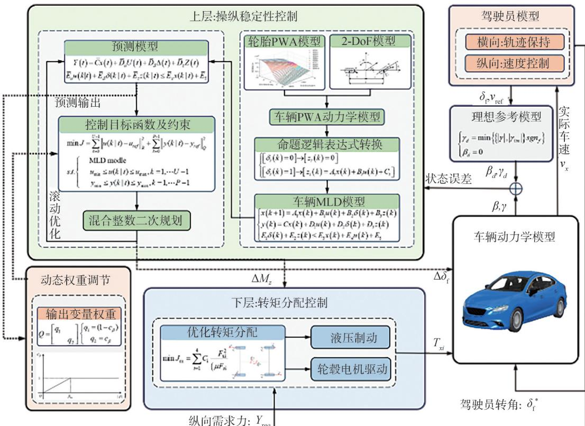

图 5　车辆操纵稳定性集成控制框架

## 3. 1　控制目标函数

以 t 时刻的预测输入和下一时刻的输出为自变量，将各自的目标函数线性加权，得到预测时域内的控制目标函数，则满足 MLD 模型约束的优化控制目标函数可以表示为

$$
\left\{ \begin{array}{l} J = \sum_ {k = 1} ^ {t + N _ {\mathrm{p}} - 1} \left(\boldsymbol {y} (k + 1 | t) - \boldsymbol {y} _ {\text {ref}}\right) ^ {\mathrm{T}} \boldsymbol {Q} \left(\boldsymbol {y} (k + 1 | t) - \boldsymbol {y} _ {\text {ref}}\right) + \\ \sum_ {k = 1} ^ {t + N _ {\mathrm{c}} - 1} \left(\boldsymbol {u} (k | t) - \boldsymbol {u} _ {\text {ref}}\right) ^ {\mathrm{T}} \boldsymbol {R} \left(\boldsymbol {u} (k | t) - \boldsymbol {u} _ {\text {ref}}\right) \\ \text {s.t.} \left\{ \begin{array}{l} x _ {0} = x (t) \\ \text {MLD model} \\ x _ {\min} \leqslant \boldsymbol {x} (k | t) \leqslant x _ {\max} \\ u _ {\min} \leqslant \boldsymbol {u} (k | t) \leqslant u _ {\max} \\ y _ {\min} \leqslant \boldsymbol {y} (k | t) \leqslant y _ {\max} \end{array} \right. \end{array} \right.\tag{25}
$$

式中： $k = t , t + 1 , \cdots , t + N _ { \mathrm { p } } - 1 ; N _ { \mathrm { p } }$ 为预测时域步长 ； $N _ { \mathrm { c } }$ 为 控 制 时 域 步 长 ； $y _ { \mathrm { r e f } } = 0 , u _ { \mathrm { r e f } } = 0 ; Q =$ $\mathrm { d i a g } ( q _ { 1 } , q _ { 2 } ) _ { \setminus } R = \mathrm { d i a g } ( r _ { 1 } , r _ { 2 } )$ 分别是输出变量、控制变量的权重矩阵，其中， $\mathbf { \nabla } \cdot \mathbf { \nabla } q _ { 1 }$ 与 $q _ { 2 }$ 是车横摆角速度与质心侧偏角的权重系数， $, r _ { 1 }$ 与 $r _ { 2 }$ 分别是附加前轮转角与附加横摆力矩的权重系数。

## 3. 2　动态权重矩阵

引入可变权重系数 $c _ { \beta }$ 对质心侧偏角权重系数 $q _ { 2 }$ 进行动态调节，则 $q _ { 1 } \hat { \bigtriangledown } q _ { 2 }$ 的值可以由下式得到：

$$
\left\{ \begin{array}{l} q _ {1} = (1 - c _ {\beta}) \\ q _ {2} = c _ {\beta} \end{array} \right.\tag{26}
$$

$c _ { \beta }$ 可以根据下式做出动态变化：

$$
c _ {\beta} = \left\{ \begin{array}{l l} \frac {| \beta |}{\mu \beta_ {\lim}}, & | \beta | <   \mu \beta_ {\lim} \\ 1, & \text {其他} \end{array} \right.\tag{27}
$$

式中，可以得到 $c _ { \beta }$ 的变化范围与质心侧偏角 $\beta$ 、最大稳定质心侧偏角 $\beta _ { \mathrm { l i m } }$ 以及地面附着系数 $\dot { } \mu$ 相关，其变化关系如图 6 所示。

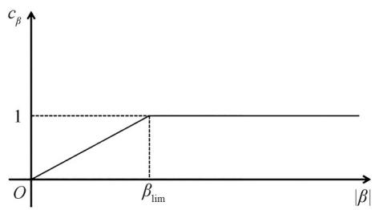

图 6　动态权重矩阵调节参数

## 3. 3　基于混合整数二次规划的滚动时域求解

为了便于优化求解，定义该有限预测时域内的输出 $\boldsymbol { Y } ( t )$ 、控制输入 $U ( t )$ 、辅助离散变量 $\pmb { \Delta } ( t )$ 、辅助连续变量 $\mathbf { } Z ( t )$ ，以及其时域内的系数加权矩阵 Qˉ、Rˉ：

$$
\boldsymbol {Y} (t) = \left[ \begin{array}{c} \boldsymbol {y} (t | t) \\ \boldsymbol {y} (t + 1 | t) \\ \vdots \\ \boldsymbol {y} (t + P - 1 | t) \end{array} \right]; \boldsymbol {U} (t) = \left[ \begin{array}{c} \boldsymbol {u} (t | t) \\ \boldsymbol {u} (t + 1 | t) \\ \vdots \\ \boldsymbol {u} (t + N - 1 | t) \end{array} \right]
$$

$$
\boldsymbol {\Delta} (t) = \left[ \begin{array}{c} \boldsymbol {\delta} (t | t) \\ \boldsymbol {\delta} (t + 1 | t) \\ \vdots \\ \boldsymbol {\delta} (t + N - 1 | t) \end{array} \right];   \boldsymbol {Z} (t) = \left[ \begin{array}{c} z (t | t) \\ z (t + 1 | t) \\ \vdots \\ z (t + N - 1) \end{array} \right]
$$

$$
\bar {Q} = \left[ \begin{array}{c c c c} Q & & & \\ & Q & & \\ & & \ddots & \\ & & & Q \end{array} \right];   \bar {R} = \left[ \begin{array}{c c c c} R & & & \\ & R & & \\ & & \ddots & \\ & & & R \end{array} \right]
$$

则式（25）的目标函数可以重写为

$$
J (\boldsymbol {\zeta}, \boldsymbol {x} (t)) = \boldsymbol {Y} ^ {\mathrm{T}} (t) \bar {\boldsymbol {Q}} \boldsymbol {Y} (t) + \boldsymbol {U} ^ {\mathrm{T}} (t) \bar {\boldsymbol {R}} \boldsymbol {U} (t)\tag{28}
$$

同时预测时域内的输出方程也可递推为

$$
\left\{ \begin{array}{l} \boldsymbol {Y} (t) = \bar {\boldsymbol {C}} \boldsymbol {x} (t) + \bar {\boldsymbol {D}} _ {u} \boldsymbol {U} (t) + \bar {\boldsymbol {D}} _ {\delta} \boldsymbol {\Delta} (t) + \bar {\boldsymbol {D}} _ {z} \boldsymbol {Z} (t) \\ \bar {\boldsymbol {E}} _ {\delta} \boldsymbol {\Delta} (t) + \bar {\boldsymbol {E}} _ {z} \boldsymbol {Z} (t) \leqslant \bar {\boldsymbol {E}} _ {u} \boldsymbol {U} (t) + \bar {\boldsymbol {E}} _ {4} \boldsymbol {x} (t) + \bar {\boldsymbol {E}} _ {5} \end{array} \right.\tag{29}
$$

式中 $\bar { C } , \bar { D } _ { u } , \bar { D } _ { \delta } , \bar { D } _ { z } , \bar { E } _ { \delta } , \bar { E } _ { z } , \bar { E } _ { u } , \bar { E } _ { 4 } , \bar { E } _ { 5 }$ 分别为原线性不等式递推后得到的适合维度的矩阵。

将式（29）代入式（28），化简可得：

$$
J (\boldsymbol {\xi}, \boldsymbol {x} (t)) = \frac {1}{2} \boldsymbol {\xi} ^ {\mathrm{T}} \boldsymbol {H} \boldsymbol {\xi} + \boldsymbol {f} ^ {\mathrm{T}} \boldsymbol {\xi} + \boldsymbol {x} (t) ^ {\mathrm{T}} \boldsymbol {G} \boldsymbol {x} (t)\tag{30}
$$

其中：

$$
\begin{array}{l} \mathbf {I}: \boldsymbol {\xi} (t) = \left[ \begin{array}{c} \boldsymbol {U} (t) \\ \boldsymbol {\Delta} (t) \\ \boldsymbol {Z} (t) \end{array} \right]; \boldsymbol {G} = \left[ \begin{array}{c} \bar {\boldsymbol {C}} ^ {\mathrm{T}} \bar {\boldsymbol {Q}} \bar {\boldsymbol {C}} \end{array} \right] \\ \boldsymbol {H} = 2 \left[ \begin{array}{c c c} \bar {\boldsymbol {D}} _ {u} ^ {\mathrm{T}} \bar {\boldsymbol {Q}} \bar {\boldsymbol {D}} _ {u} + \bar {\boldsymbol {R}} & \bar {\boldsymbol {D}} _ {\delta} ^ {\mathrm{T}} \bar {\boldsymbol {Q}} \bar {\boldsymbol {D}} _ {u} & \bar {\boldsymbol {D}} _ {z} ^ {\mathrm{T}} \bar {\boldsymbol {Q}} \bar {\boldsymbol {D}} _ {u} \\ \bar {\boldsymbol {D}} _ {u} ^ {\mathrm{T}} \bar {\boldsymbol {Q}} \bar {\boldsymbol {D}} _ {\delta} & \bar {\boldsymbol {D}} _ {\delta} ^ {\mathrm{T}} \bar {\boldsymbol {Q}} \bar {\boldsymbol {D}} _ {\delta} & \bar {\boldsymbol {D}} _ {z} ^ {\mathrm{T}} \bar {\boldsymbol {Q}} \bar {\boldsymbol {D}} _ {\delta} \\ \bar {\boldsymbol {D}} _ {u} ^ {\mathrm{T}} \bar {\boldsymbol {Q}} \bar {\boldsymbol {D}} _ {z} & \bar {\boldsymbol {D}} _ {\delta} ^ {\mathrm{T}} \bar {\boldsymbol {Q}} \bar {\boldsymbol {D}} _ {z} & \bar {\boldsymbol {D}} _ {z} ^ {\mathrm{T}} \bar {\boldsymbol {Q}} \bar {\boldsymbol {D}} _ {z} \end{array} \right] \\ f ^ {\mathrm{T}} = 2 x (t) ^ {\mathrm{T}} \left[ \begin{array}{c c c} \bar {\boldsymbol {C}} ^ {\mathrm{T}} \bar {\boldsymbol {Q}} \bar {\boldsymbol {D}} _ {u} & \bar {\boldsymbol {C}} ^ {\mathrm{T}} \bar {\boldsymbol {Q}} \bar {\boldsymbol {D}} _ {\delta} & \bar {\boldsymbol {C}} ^ {\mathrm{T}} \bar {\boldsymbol {Q}} \bar {\boldsymbol {D}} _ {z} \end{array} \right] \\ S \xi (t) \leqslant \bar {\boldsymbol {E}} _ {5} + \bar {\boldsymbol {E}} _ {4} x (t) \end{array}
$$

其中： $S = \left[ \begin{array} { l l l } { \bar { E } _ { u } } & { \bar { E } _ { \delta } } & { \bar { E } _ { z } } \end{array} \right]$ 

（31） 

进一步转化为标准的混合整数二次规划问题：

$$
\left\{ \begin{array}{l} J \triangleq \min _ {\xi} \left(\frac {1}{2} \boldsymbol {\xi} ^ {\mathrm{T}} \boldsymbol {H} \boldsymbol {\xi} + \boldsymbol {f} ^ {\mathrm{T}} \boldsymbol {\xi}\right) \\ \text { s.   t. } \quad S \boldsymbol {\xi} (t) \leqslant \bar {\boldsymbol {E}} _ {5} + \bar {\boldsymbol {E}} _ {4} \boldsymbol {x} (t) \end{array} \right.\tag{32}
$$

采用分支定界算法对上式混合整数二次规划问题进行求解得到一组最优控制序列，即 $\xi ( t ) =$ $[ u _ { 0 } , \cdots , u _ { \scriptscriptstyle U - 1 } , \delta _ { 0 } , \cdots , \delta _ { \scriptscriptstyle U - 1 } , z _ { 0 } , \cdots , z _ { \scriptscriptstyle U }$ ]T，并将第 1 个元素 $u _ { 0 }$ 作为最优控制输入［27］。

## 3. 4　下层四轮转矩优化分配控制

由于附加横摆力矩 ΔMz 属于广义量，须按照一定的分配方式换算为 4 个车轮的驱动力或制动力。本文选择轮胎工作负荷率最小为目标的驱动力分配方法，以 4 个轮胎路面附着负荷率公式为基础［23］：

$$
\min J _ {\mathrm{m}} = \sum_ {i = 1} ^ {4} \eta_ {i} \frac {F _ {x i} ^ {2} + F _ {y i} ^ {2}}{\left(\mu_ {i} F _ {z i}\right) ^ {2}}\tag{33}
$$

式中： $\cdot \eta _ { i }$ 为各车轮利用率权重系数，本文中为 $1 { ; } \mu _ { i }$ i 是纵向滚动摩擦因数； $F _ { z i }$ 是各轮当前垂直载荷； $F _ { x i } \setminus F _ { y i }$ 分别为各轮的纵向力和侧向力； $i = 1 , 2 , 3 , 4$ 分别表示车辆的左前轮、右前轮、左后轮、右后轮。

约束条件：

$$
\left\{ \begin{array}{l} \left(F _ {x 1} + F _ {x 2}\right) \cos \delta_ {\mathrm{f}} + F _ {x 3} + F _ {x 4} = F _ {x} \\ \frac {t _ {\mathrm{w}}}{2} \left(F _ {2} - F _ {1}\right) \cos \delta_ {\mathrm{f}} + \left(F _ {2} - F _ {1}\right) a \sin \delta_ {\mathrm{f}} + \\ \frac {t _ {\mathrm{w}}}{2} \left(F _ {4} - F _ {3}\right) = \Delta M _ {z} \\ - \mu_ {i} F _ {z i} \leqslant F _ {x i} \leqslant \mu_ {i} F _ {z i} \\ - F _ {x \max} \leqslant F _ {x i} <   F _ {x \max} \end{array} \right.\tag{34}
$$

式中： $F _ { x }$ 为纵向总需求力，本文根据车辆实际速度和期望速度的偏差采用 PID 控制器计算，即 $F _ { x } =$ $K _ { \mathrm { p } } e _ { \mathrm { v } } ( t ) + K _ { \mathrm { i } } \int e _ { \mathrm { v } } ( t ) \mathrm { d } t + K _ { \mathrm { d } } \frac { \mathrm { d } e _ { \mathrm { v } } ( t ) } { \mathrm { d } t } ; F _ { \mathrm { { x m a x } } }$ 为电机峰值转矩对应的纵向力的大小。

对该目标函数及其约束条件进行整理，将其化成二次规划标准型，得：

$$
\left\{ \begin{array}{l} \min _ {\boldsymbol {u} _ {\mathrm{c}}} J = \frac {1}{2} \boldsymbol {u} _ {\mathrm{c}} ^ {\mathrm{T}} \boldsymbol {W} _ {\mathrm{u}} \boldsymbol {u} _ {\mathrm{c}} \\ \text { s   .   t   . } A _ {\mathrm{eq}} \boldsymbol {u} _ {\mathrm{c}} = \boldsymbol {b} _ {\mathrm{eq}}; l b \leqslant \boldsymbol {u} _ {\mathrm{c}} \leqslant u b \end{array} \right.\tag{35}
$$

其中：

$$
\begin{array}{l} \boldsymbol {W} _ {\mathrm{u}} = \operatorname{diag} \left(\frac {\eta_ {i}}{\left(\mu_ {i} F _ {z i}\right) ^ {2}}\right); \boldsymbol {u} _ {\mathrm{c}} = \left[ \begin{array}{l l l l} F _ {x 1} & F _ {x 2} & F _ {x 3} & F _ {x 4} \end{array} \right] ^ {\mathrm{T}} \\ \boldsymbol {A} _ {\mathrm{eq}} = \left[ \begin{array}{c c c c} \cos \delta_ {\mathrm{f}} & \cos \delta_ {\mathrm{f}} & 1 & 1 \\ - \frac {d}{2} + a \sin \delta_ {\mathrm{f}} & \frac {d}{2} + a \sin \delta_ {\mathrm{f}} & \frac {d}{2} & - \frac {d}{2} \end{array} \right] \\ \boldsymbol {b} _ {\mathrm{eq}} = \left[ \begin{array}{l l} F _ {x} & M _ {z} \end{array} \right] ^ {\mathrm{T}}; l b = \max (- \mu F _ {z i}, - F _ {\max}) \\ u b = \min (\mu F _ {z i}, F _ {\max}) \end{array}
$$

采用有效集法对上述二次规划问题进行求解，从而得到 4 个车轮的纵向力进而求解出对应电机的相应转矩［28］。

## 4　操纵稳定性测试试验

## 4. 1　试验平台搭建

驾驶人在环试验平台结构分为软件层与交互层，整体结构如图 7 所示。集成控制策略与车辆模型在 Matlab/Simulink 环境中运行，Simulink 通过 Joystick 模块接收来自模拟器外设的转向盘、加速踏板、制动踏板等信号。CarSim 通过其 Live Video 功能将虚拟场景输出给显示器，驾驶人根据显示器提供的虚拟驾驶环境实时操纵转向盘和踏板，与控制策略形成闭环。

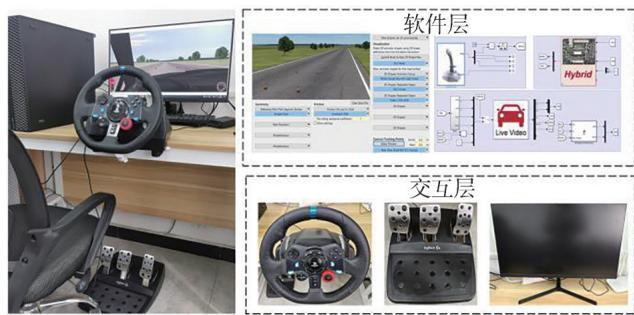

图 7　驾驶人在环试验平台

## 4. 2　试验结果分析

选择高、低路面附着下的双移线工况作为试验验证工况。图 8 所示为双移线道路，设定在车速为 85 km/h，路面附着系数为 0. 5 下开展试验，其仿真结果如图 9 所示。

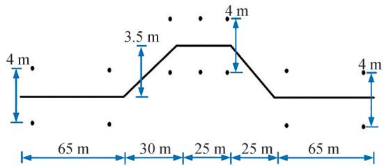

图 8　双移线工况道路设置

HMPC 和 MPC 的详细参数和执行时间见表 2。在双移线工况下，MPC 和 HMPC 的平均单步计算时间分别为 0. 029 和 0. 025 s。与 MPC 相比，HMPC 的平均计算时间降低了 17%。表 3 与表 4 分别为车辆状态响应的最大值与均方根误差。

## （1）高附着路面

图 9（a）与表 3 表明，无控制下车辆趋近失稳，HMPC 控制下的车辆最大横向位移仅为 3. 69 m，在车辆稳定的情况下具有更好的轨迹保持能力。由图 9（b）可知在无控制下的车辆前轮转角超过 $5 ^ { \circ }$ ，而基于 HMPC 与 MPC 控制的车辆前轮转角较为平稳，其中 HMPC 控制下的转角峰值为 2. 91°，比 MPC 控制下的前轮转角峰值降低 1. 12°。图 9（c）和图 9（d）中

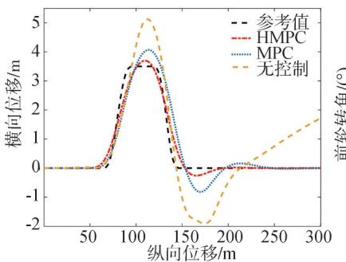

(a) 行驶轨迹

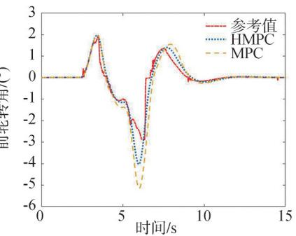

(b) 前轮转角

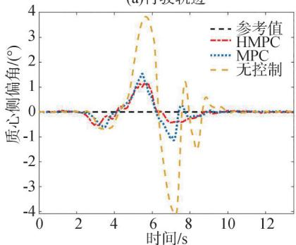

(c) 横摆角速度

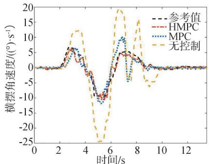

(d) 质心侧偏角

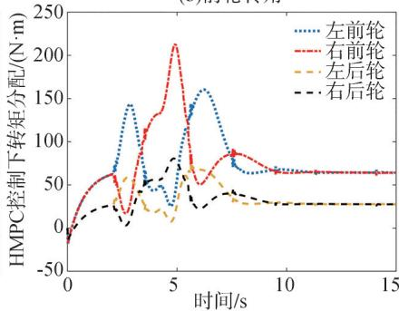

(e)HMPC 下车轮转矩分配

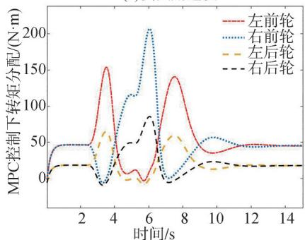

(f)MPC 下车轮转矩分配

图 9　高附着路面试验结果

表 2　控制器参数及计算性能

<table><tr><td>参数</td><td>MPC</td><td>HMPC</td></tr><tr><td>预测时域 <eq>P</eq></td><td>10</td><td>10</td></tr><tr><td>控制时域 <eq>U</eq></td><td>3</td><td>3</td></tr><tr><td>控制器步长 /s</td><td>0.001</td><td>0.001</td></tr><tr><td>权重系数 <eq>Q</eq></td><td>diag(100,45)</td><td>diag(100,45)</td></tr><tr><td>权重系数 <eq>R</eq></td><td>diag(15,0.38)</td><td>diag(15,0.38)</td></tr><tr><td>采样时间 /s</td><td>0.002</td><td>0.002</td></tr><tr><td>控制周期 /s</td><td>0.022</td><td>0.020</td></tr></table>

表 3　车辆状态响应最大值

<table><tr><td>控制策略</td><td>横摆角速度/<eq>\left( (^{\circ}) \cdot s^{-1} \right)</eq></td><td>质心侧偏角/<eq>(^{\circ})</eq></td><td>横向位移/m</td></tr><tr><td>无控制</td><td>24.37</td><td>4.08</td><td>5.12</td></tr><tr><td>MPC</td><td>11.82</td><td>1.53</td><td>4.06</td></tr><tr><td>HMPC</td><td>9.24</td><td>1.15</td><td>3.69</td></tr></table>

表 4　车辆状态响应均方根误差

<table><tr><td>控制策略</td><td>横摆角速度/<eq>\left( \left( ^{\circ} \right) \cdot s^{-1} \right)</eq></td><td>质心侧偏角/<eq>\left( ^{\circ} \right)</eq></td></tr><tr><td>无控制</td><td>8.44</td><td>1.37</td></tr><tr><td>MPC</td><td>1.36</td><td>0.41</td></tr><tr><td>HMPC</td><td>0.93</td><td>0.33</td></tr></table>

表明无控制车辆横摆角速度与质心侧偏角最大值分别达到 $9 . 5 4 ( ^ { \circ } ) / \mathrm { s }$ 与 $3 . 1 8 ^ { \circ }$ 。在 MPC 或 HMPC 控制的辅助下，驾驶人能够操纵转向盘在车辆没有发生失稳的情况下完成试验，且车辆状态响应曲线与离线仿真时趋势大体相同。如表 3 与表 4 所示，在两种控制方法作用下的车辆最大横摆角速度与质心侧偏角均被控制在 $1 2 ( ^ { \circ } ) / \mathrm { s }$ 与 $1 . 6 ^ { \circ }$ 以内，并且 HMPC 控制下的车辆横摆角速度与质心侧偏角的均方根误差分别为 $0 . 9 3 ( ^ { \circ } ) / \mathrm { s }$ 与 $0 . 3 3 ^ { \circ }$ ，相比于 MPC 控制，分别下降了 31. 61% 与 19. 51%，表明车辆具有更好的操纵稳定性。图 9（e）、图 9（f）分别为 HMPC 控制与 MPC 控制下四轮驱动转矩分配情况，可以看出两种控制策略在下层控制分配系统的作用下转矩变化趋势相同，并且由于所选车型载荷分布，所以两种控制方法的前轮转矩明显高于后轮，有效优化了轮胎负荷率。同时，基于 HMPC 控制的四轮驱动转矩峰值相比于 MPC 控制平均降低 24. 27%，结合图 9（b）中 HMPC 下前轮转角控制量可以看出，HMPC 控制策略在保证车辆稳定性控制精度的同时进一步优化电机转矩与转角的集成控制效果。

## （2）低附着路面

图 8 所示为双移线道路，设定在车速为 70 km/h，路面附着系数为 0. 3 下开展试验，其仿真结果如图 10 所示，表 5 与表 6 分别为车辆状态响应的最大值与均方根误差。

图 10（a）与表 5 表明，在低附着工况下，无控制下车辆远离参考行驶路径，而另外两种施加控制的

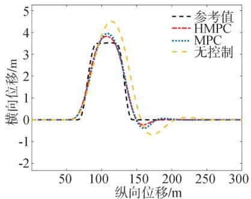

(a) 行驶轨迹

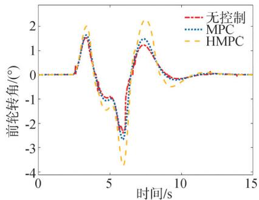

(b) 前轮转角

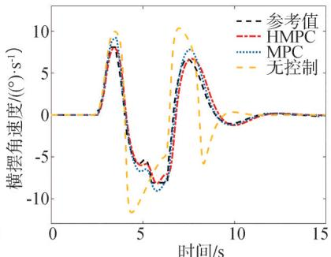

(c) 横摆角速度

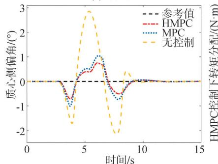

(d) 质心侧偏角

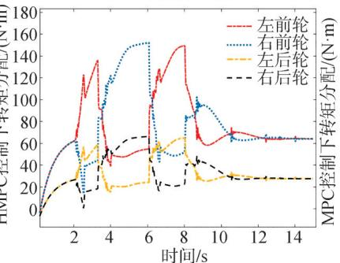

(e)HMPC 下车轮转矩分配

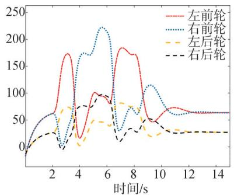

(f)MPC 下车轮转矩分配

图 10　低附着路面试验结果

方法最大横向误差均能控制在 0. 4 m 以内。相比于 MPC，HMPC 作用下的车辆最大横向位移降低 2. 31%。从图 10（b）可以得到无控制下的车辆前轮转角超过 5°，而基于 HMPC 与 MPC 控制的车辆前轮转角较为平稳，其中 HMPC 控制下的转角峰值为 2. 28°，比 MPC 控制下的前轮转角峰值降低 14. 29%。由图 10（c）、图 10（d）与表 6 可知，HMPC 控制下的横摆角速度与质心侧偏角均方根误差更小，相比于 MPC 分别下降 26. 09% 与 29. 73%。由图 10（e）、图 10（f）可知由于车辆载荷分布特点，前轮的转矩明显大于后轮，保证了车轮侧向附着能力。结合图 10（b）中前轮转角的优化效果，可以得到 HMPC 控制对于 AFS/DYC 的集成控制效果较好，可实现子控制系统间的功能互补，车辆操纵稳定性在较低的控制成本下得到有效改善。

表 5　车辆状态响应最大值

<table><tr><td>控制策略</td><td>横摆角速度/<eq>\left( \left( ^{\circ} \right) \cdot s^{-1} \right)</eq></td><td>质心侧偏角/<eq>\left( ^{\circ} \right)</eq></td><td>横向位移/m</td></tr><tr><td>无控制</td><td>11.61</td><td>2.84</td><td>4.51</td></tr><tr><td>MPC</td><td>8.74</td><td>1.05</td><td>3.95</td></tr><tr><td>HMPC</td><td>7.91</td><td>0.75</td><td>3.82</td></tr></table>

表 6　车辆状态响应均方根误差

<table><tr><td>控制策略</td><td>横摆角速度/<eq>\left( (^{\circ}) \cdot s^{-1} \right)</eq></td><td>质心侧偏角/<eq>(^{\circ})</eq></td></tr><tr><td>无控制</td><td>3.76</td><td>1.02</td></tr><tr><td>MPC</td><td>0.69</td><td>0.37</td></tr><tr><td>HMPC</td><td>0.51</td><td>0.28</td></tr></table>

## 5　结论

本文提出了基于混杂模型预测控制的分布式驱动电动汽车 AFS/DYC 集成控制策略，得到了以下结论。

（1）基于轮胎侧偏力学数据采用改进 K-Means++ 聚类、加权最小二乘参数估计以及支持向量机联合参数辨识方法，得到轮胎 PWA 模型的具体参数及用于工作区域划分的超平面系数矩阵。

（2）设计了基于混杂模型预测控制的分布式驱动电动汽车 AFS/DYC 分层集成控制策略。上层为基于 HMPC 采用混合整数二次规划优化求解车辆所需附加横摆力矩与附加转角，下层根据轮胎最优负荷率将附加横摆力矩分配至 4 个车轮，从而实现 AFS/DYC 的集成控制。

（3）基于 CarSim-Simulink 联合仿真平台通过不同路面附着工况试验验证了基于 HMPC 的分布式驱动电动汽车 AFS/DYC 集成控制策略的有效性与优越性。

## 参考文献

［1］ 苏亮，张锋，肖红超，等. 分布式驱动电动汽车动力学集成控制研究进展及趋势［J］.汽车工程学报，2022，12（6）：715-733.SU Liang， ZHANG Feng， XIAO Hongchao， et al. Research prog⁃ress and trend of integrated dynamics control of distributed driven electric vehicles［J］. Chinese Journal of Automotive Engineering，2022，12（6）：715-733.

［2］ ZHENG Z， WANG S， ZHAO X， et al. Adaptive model predictive control of four-wheel drive intelligent electric vehicles based on stability probability under extreme braking conditions［J］. IEEE Transactions on Intelligent Vehicles，2024. 

［3］ 李刚，宗长富，陈国迎，等.线控四轮独立驱动轮毂电机电动车集成控制［J］.吉林大学学报（工学版），2012，42（4）：796-802.LI Gang， ZONG Changfu， CHEN Guoying， et al. Integrated con⁃trol for X-by-wire electric vehicle with 4 independently drivenin-wheel motors［J］. Journal of Jilin University （Engineering andTechnology Edition），2012，42（4）：796-802.

［4］ 赵轩，王姝，马建，等. 分布式驱动电动汽车底盘集成控制技术综述［J］. 中国公路学报，2023，36（4）：221-248.ZHAO Xuan， WANG Shu， MA Jian， et al. Review of chassis in⁃tegrated control technology for distributed drive electric vehicles[J]. China Journal of Highway and Transport, 2023, 36 (4) :221-248.

［5］ 杜荣华，米思雨，胡林，等. 分布式驱动电动汽车复合制动系统转矩分配控制策略仿真［J］. 汽车工程，2019，41（3）：327-333.DU Ronghua， MI Siyu， HU Lin， et al. Simulation on control strat⁃egy for torque distribution of compound brake system in a distrib⁃uted drive electric vehicle［J］. Automotive Engineering，2019，41(3): 327-333.

［6］ ZHENG Z， ZHAO X， WANG S， et al. Extension coordinated control of distributed-driven electric vehicles based on evolution⁃ ary game theory［J］. Control Engineering Practice，2023，137： 105583. 

[7] ZHAO B, XU N, CHEN H, et al. Stability control of electric vehicles with in-wheel motors by considering tire slip energy［J］.Me⁃ chanical Systems and Signal Processing，2019，118：340-359. 

［8］ 周兵，邱香，吴晓建，等. 基于 UKF 车辆状态及路面附着系数估计的 AFS 控制［J］. 湖南大学学报（自然科学版），2019，46（8）：1-8.ZHOU Bing， QIU Xiang， WU Xiaojian， et al. AFS control basedon estimation of vehicle state and road coefficient using UKFmethod［J］. Journal of Hunan University （Natural Sciences），2019，46（8）：1-8.

[9] YUE S, FAN Y. Hierarchical direct yaw-moment control system design for in-wheel motor driven electric vehicle[J]. International Journal of Automotive Technology，2018，19（4）：695-703. 

［10］ NAHIDI A， KASAIEZADEH A， KHOSRAVANI S，et al. Modu⁃ lar integrated longitudinal and lateral vehicle stability control for electric vehicles[J]. Mechatronics, 2017, 44: 60-70. 

[11] WANG H, ZHOU J, HU C, et al. Vehicle lateral stability control 

based on stability category recognition with improved brain emo⁃ tional learning network［J］. IEEE Transactions on Vehicular Tech⁃ nology，2022，71.6：5930-5943. 

［12］ SUN X， WU P， CAI Y， et al. Piecewise affine modeling and hy⁃ brid optimal control of intelligent vehicle longitudinal dynamics for velocity regulation［J］. Mechanical Systems and Signal Pro⁃ cessing，2022，162：108089. 

[13] STEYAERT B W, SWINT E, PENNINGTON W W, et al. Piecewise affine modeling of wound-rotor synchronous machines for re⁃ al-time motor control［J］. IEEE Transactions on Industrial Elec tronics, 2022, 70(6) : 5571–5580. 

［14］ SUN X， ZHANG H， CAI Y， et al. Hybrid modeling and predic tive control of intelligent vehicle longitudinal velocity considering nonlinear tire dynamics［J］. Nonlinear Dynamics，2019，97： 1051-1066. 

［15］ CHENG S， LI L， MEI M， et al. Multiple-objective adaptive cruise control system integrated with DYC［J］. IEEE Transactions on Vehicular Technology，2019，68（5）：4550-4559. 

[16] FERRARI-TRECATE G, MUSELLI M, LIBERATI D, et al. A clustering technique for the identification of piecewise affine sys⁃ tems［J］. Automatica，2003，39（2）：205-217. 

［17］ PHAM H T， YANG B S. A hybrid of nonlinear autoregressive model with exogenous input and autoregressive moving average model for long-term machine state forecasting［J］. Expert Systems with Applications，2010，37（4）：3310-3317. 

［18］ 黄耀波，刘佳新，徐祖华，等. 基于 PWA 融合模型的注塑过程保压段建模及控制策略［J］.化工学报，2020，71（3）：1103-1110.HUANG Yaobo， LIU Jiaxin， XU Zuhua， et al. Modeling and control strategy for packing-stage of injection molding process basedon PWA fusion model[J]. CIESC Journal, 2020, 71 (3) : 1103–1110.

［19］ SUN X， CAI Y， WANG S， et al. Optimal control of intelligent ve⁃ hicle longitudinal dynamics via hybrid model predictive control ［J］. Robotics and Autonomous Systems，2019，112：190-200. 

［20］ 胡启国，陆伟. 基于分段仿射模型的非线性悬架预测控制［J］. 汽车安全与节能学报，2019，10（3）：285-292.HU Qiguo， LU Wei. Nonlinear suspension predictive controlbased on piecewise affine model［J］. Journal of Automotive Safetyand Energy，2019，10（3）：285-292.

［21］ 柳江，陈朋，李道飞. 基于相平面方法的车辆稳定性控制［J］. 工程设计学报，2016，23（5）：409-416.LIU Jiang， CHEN Peng， LI Daofei.Vehicle stability control basedon phase-plane method［J］. Chinese Journal of Engineering De⁃sign，2016，23（5）：409-416.

［22］ 孙晓强，胡伟伟，吴鹏程，等. 轮胎非线性纵滑力学特性的分段仿射辨识建模方法［J］. 西安交通大学学报，2021，55（7）：52-60.SUN Xiaoqiang， HU Weiwei， WU Pengcheng， et al. Modeling oftire longitudinal-slip mechanical characteristics based on piece⁃wise affine identification method［J］. Journal of Xi’an JiaotongUniversity，2021，55（7）：52-60.

（下转第 469 页）