# 微正压氮气抑制大容量磷酸铁锂电池包热失控实验研究

李 师1，2，贾壮壮1，沈光杰2，王青松1，孙金华1

（1. 中国科学技术大学，火灾科学国家重点实验室，合肥 230026；2. 郑州深澜动力科技有限公司，郑州 450000）

［摘要］ 磷酸铁锂电池具有循环寿命长、安全性能高等优势，在商用电动汽车上得到广泛应用，但是，磷酸铁锂电池在使用过程中仍有可能发生热失控事故。为抑制磷酸铁锂电池包内火灾事故扩大，提出一种高效、易操作且成本低的磷酸铁锂电池包内热失控抑制技术，即在磷酸铁锂电池包内注入微正压氮气抑制电池热失控。通过开展有无微正压氮气抑制电池包内电池模组热失控实验和电池包内凝露实验，系统地分析了微正压氮气抑制电池包热失控的效果和可行性。实验结果表明：（1）无抑制措施工况下，电池模组在 140 s 内全部热失控，电池持续燃烧 413 s，电池表面最高温度为 627.6 ℃，电池包的绝缘阻值为 43.7 MΩ，降低了 95%，电池包内相对湿度增加约 200%。（2）在微正压氮气抑制工况下，电池模组仅有一个电池防爆阀打开，且开阀时间比无抑制措施迟 526 s，电池表面最高温度为 148 ℃，综合判断电池模组没有发生热失控；微正压氮气条件下，电池包内无凝露，并有效抑制了电池包的呼吸效应，降低了电池包内发生绝缘短路等次生灾害的风险。本研究为大容量磷酸铁锂电池包的设计与安全防控技术提供了新的研究思路。

关键词：磷酸铁锂电池包；微正压；氮气；热失控

# An Experimental Study on Suppressing Thermal Runaway of Large-Capacity Lithium Iron Phosphate Battery Pack by Micro-Positive Pressure Nitrogen

Li Shi1，2，Jia Zhuangzhuang1，Shen Guangjie2，Wang Qingsong1 & Sun Jinhua 

1. University of Science and Technology of China， State Key Laboratory of Fire Science， Hefei 230026； 2. Zhengzhou Shenlan Power Technology Co. ， Ltd. ， Zhengzhou 450000 

［Abstract］ Lithium iron phosphate （LFP） battery features a long lifetime and high safety， which is widely used in electric commercial vehicles. However， thermal runaway accidents may still occur during its use. To inhibit the expansion of fire in LFP battery packs， an efficient， easy-to-operate and low-cost internal thermal runaway sup⁃ pression technology is proposed， that is， injecting micro-positive pressure nitrogen into battery packs. The effect and feasibility of this technology are systematically analyzed by module thermal runaway tests of packs with/without micro-positive pressure nitrogen and the condensation test in the pack. The test results show that: (1) Under the condition of no suppression measures， the thermal runaway of all modules occurs within 140 s， and the battery burns continuously for 413 s， with a maximum surface temperature of $6 2 7 . 6 \ ^ { \circ } \mathrm { C } .$ . The insulation resistance of the bat⁃ tery pack is 43.7 MΩ， reduced by 95%， and the internal relative humidity increasing by about 200%.（2） Under the condition of micro-positive pressure nitrogen suppression， only one battery explosion-proof valve of the battery module is opened， with the opening time 526 s later than that without nitrogen， and the maximum temperature on the battery surface is $1 4 8 \ \mathrm { ~ \textbar { ~ } C }$ ， so it is comprehensively judged that there is no thermal runaway in the battery module. Under the condition of micro-positive pressure nitrogen， there is no condensation in the pack， which effectively in⁃ hibits the respiration effect and reduces the risk of secondary disasters such as an insulation short circuit in the pack. This study provides new research ideas for the design and safety prevention and control technology of high-ca⁃ pacity lithium iron phosphate battery packs. 

Keywords：lithium iron phosphate battery pack；micropositive atmospheric；nitrogen environment； thermal runaway 

## 前言

汽车工业革命给人类的出行带来了较大便利，同时让人类必须面对不可再生资源枯竭和环境污染的问题［1-2］。面对经济与环境协同发展的需求，全球的能源结构逐步发生改变，电动汽车的革新技术越来越受到各国的重视。据我国汽车工业协会统计，2024 年 1-11 月我国新能源汽车持续高速增长，产销分别完成 1 134. 5 和 1 126. 2 万辆，同比分别增长 34. 6％和 35. 6％，其中很大部分都是以锂离子电池为车载能源的纯电驱动汽车［3］。然而，因锂离子电池系统热失控造成的安全事故时有发生，严重地威胁着乘客的生命财产安全，因此如何保障电动汽车电池的安全仍是当今锂离子电池研究的重要课题［4］。

近年来，国内外学者针对锂离子电池火灾开展了大量的实验研究。Kang 等［5］开展了电动汽车火灾实验研究，在测试过程中，新能源电动汽车火灾的燃烧持续了 70 min，燃烧峰值热释放率和总放热量分别为 6.51~7.25 MW 和 8.45~9.03 GJ。Li 等［6］对电动汽车锂离子电池组进行了全面的热失控测试，实验发现从电池组触发热失控到火焰蔓延至整个车身仅需要 22 s，水无法直接作用于电池，极大限制了灭火效果。Sun 等［7］研究了两个磷酸铁锂电池包在过充条件下的热失控火灾行为。实验结果表明，在过充电条件下电池包热积累更易使其发生热失控，电池模组失控后会产生强烈的火焰和大量高温烟雾；并且提出了“及时捕捉电池防爆阀打开时机，停止热量积聚可有效避免热失控发生”的解决方案。同样，前人在如何有效抑制锂离子电池火灾方面开展了大量研究。黄沛丰［8］指出锂离子电池热失控起火燃爆是在电池系统外部环境存在与内部反应产生的电池燃爆助燃氧化物、充足的易燃易爆性物质以及高温的点火热源这 3 个条件一起满足的状况下触发的。Wang 等［9］开展了磷酸铁锂电池和三元电池的热失控气体成分和爆炸极限比较研究，通过实验结果和理论计算可得大容量磷酸铁锂的燃爆指数是三元电池的两倍，大容量磷酸铁锂电池在充放电过程中内部温度更高，失控风险更大。Qin 等［10］通过实验开展了 100% 荷电状态（SOC）锂离子电池包热失控和临界通风面积的研究，并且在 2021 年北京大红门事故报告中明确指出，发生电池爆炸的主要原因是易燃气体在与氧气混合条件下，电池的拉弧触发的电池热失控和爆炸事故［11］。

因此，基于火灾事故三角形理论可知在抑制电池包热失控过程中，隔绝氧气与消除点火条件是最主要的抑制措施。Maloney［12］在充满惰性气体的密闭环境中进行锂离子电池热失控燃爆实验，发现当空间环境内的氧气浓度大幅减小后，热扩散反应发生速度降低，起火燃烧范围缩小。Said 等［13］全面分析了电池模组在氮气环境和空气中的燃爆行为，发现惰性气体环境对电池火灾燃烧有较好的抑制作用。Liu 等［14-15］研究了在氮气和空气环境下电池模组燃爆行为，发现与在空气中相比，喷射物在氮气中的燃烧强度降低。王颖等［16］进行了 CO2 气体环境对锂离子电池热失控行为影响及作用规律的实验研究。在充入 CO2 气体后，温升速率出现了快速下降的趋势。虽前人在密闭环境中通入氮气能够抑制电池热失控，但均未使用主动隔离氧气方式在实际电池包进行验证以及推广应用，同时无法兼顾解决湿热空气进入电池包内引起的次生灾害问题。Ping 等［17］研究发现，磷酸铁锂电池正极材料磷酸铁锂因其晶体中稳固的 P-O 键和较弱的铁离子氧化能力，只有在高于 500 ℃才会发生结构崩塌和形成强氧化性物质，且在此过程不会释放出氧气。因此，可通过主动式的防护技术手段阻隔易燃易爆性物质与助燃氧化物的接触反应，从而降低大容量磷酸铁锂电池包热灾害危险。

综上分析，本研究提出了一种低成本、易操作且安全高效的电池包内抑制热失控技术，通过使用自然界中大量存在且能够低成本获取的氮气作为主动隔离电池包内氧气的媒介，开展大容量 302 A·h 磷酸铁锂电池包内微正压氮气抑制热失控火灾实验和微正压氮气抑制凝露实验。通过工程应用风险分析，微正压氮气抑制技术能够有效地抑制电池热失控和降低电池包内发生绝缘短路等次生灾害事故的可能性。

## 1　样品电池与实验方法

## 1. 1　大容量 302 A·h 磷酸铁锂电池包

本研究采用深澜动力科技有限公司生产制造的大容量 302 A·h 磷酸铁锂电池包。电池包实物和主要零部件如图 1（a）和图 1（b）所示。车载动力电池包由箱体壳、防爆阀、电池模组以及相应高低压接插件等器件组成，电池包尺寸为 1060 mm × 630 mm ×244 mm。电池包的上箱盖有具备防水、防尘、平衡压差及透气等功能的防爆阀，透气开启压力值为 0.2 kPa，各外露零部件通过密封垫和螺栓使电池包构建具有一定的防护功能封闭空间。电池包内由 36 个 302 A·h 磷酸铁锂电池串并联组成，电池的参数如表 1 所示。

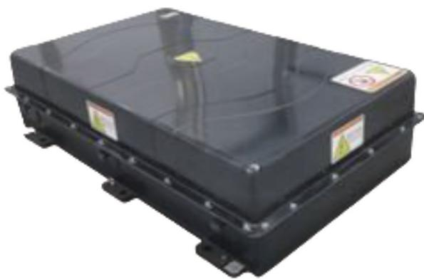

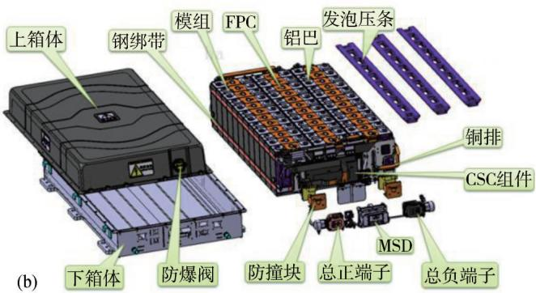

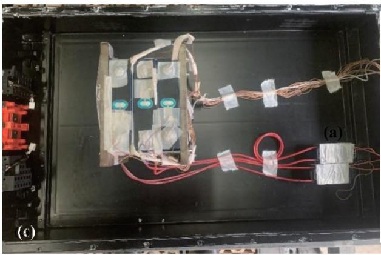

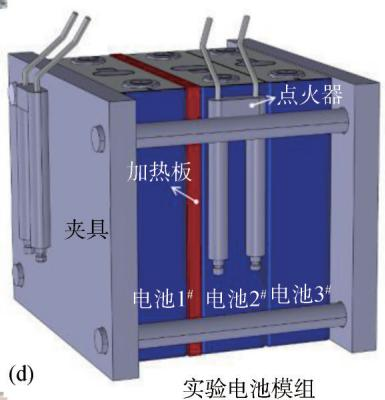

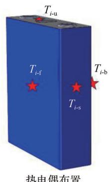

图 1　实验过程中电池包内布置情况：（a）302 A·h 电池包照片；（b）电池包主要零部件；（c）电池包内实验布置照片；（d）实验电池模组和热电偶布置图

表 1 302 A·h 磷酸铁锂电池基本参数

<table><tr><td>名称</td><td>数值</td></tr><tr><td>正极材料</td><td><eq>LiFePO_{4}</eq></td></tr><tr><td>负极材料</td><td>天然石墨</td></tr><tr><td>额定电压/V</td><td>3.22</td></tr><tr><td>额定容量/(A·h)</td><td>302</td></tr><tr><td>充电截止电压/V</td><td>3.65</td></tr><tr><td>放电截止电压/V</td><td>2.50</td></tr><tr><td>充放电工作温度范围/°C</td><td>-30~65</td></tr><tr><td>最大允许充放电电流/A</td><td>302</td></tr><tr><td>尺寸(长×宽×高)/mm</td><td>205×72×174</td></tr><tr><td>质量/kg</td><td>5.46</td></tr></table>

## 1. 2　实验方案设计

## 1. 2. 1　磷酸铁锂电池包热失控实验

为保证实验的安全性和经济性，本研究在电池包内开展 1×3 电池模组（电池模组为满电状态，即 100%SOC）热失控比较实验，电池包内布置俯视图如图 1（c）所示。

为保证电池加热速率不小于 6 ℃/min，将 800 W 加热板放在电池模组电池 1#和 2#之间，热电偶布置方式参考 $\mathrm { X u }$ 等［18］和 Li 等［19］的研究，在每个电池的大面、侧面和顶部各布置一个热电偶监测电池的表面温度变化，如图 1（d）所示，从左向右分别是电池 1#、电池 2#和电池 3#。 $T _ { i - \mathrm { f } }$ 表示每颗电池左侧大面中心热电偶的温度， $T _ { i - \mathrm { b } }$ 表示电池右侧大面中心热电偶的温度， $T _ { i - \mathrm { s } }$ 表示电池侧面中心热电偶的温度， $T _ { \mathrm { { _ { i - u } } } }$ 表示电池二维码热电偶的温度，其中 i 为电池序号 1、2、3。并在电池 1#和 2#防爆阀上方布置 1 500 V 持续拉弧的点火器，模拟电池包内电池热失控过程中出现拉弧现象［20］。根据电池包平衡阀压力在 0. 1~0. 2 kPa 范围内，当电池包内气体压力 ${ < } 0 . 1 \ \mathrm { k P a }$ 时，以 5 L/min 的速率向电池包内充气，当压力达到 0. 2 kPa 时停止充气。通过开展微正压氮气抑制工况和无抑制措施工况进行电池热失控火灾危险比较分析，根据国标 GB 38031—2020《电动汽车用动力蓄电池安全要求》判断电池热失控，当电池表面温度达到的最高工作温度且温升速率 ${ \bf \geqslant } 1 \ { } ^ { \circ } \mathrm { C / s }$ ，且持续时间达到 3 s 以上时，电池发生热失控，停止加热。

## 1. 2. 2　磷酸铁锂电池包内凝露实验

为研究电池包内的环境对电池热失控火灾的影响，本研究开展了有无微正压氮气抑制措施工况下液冷电池包内凝露对比实验。首先，将绝缘电阻和气密性均合格的电池包置于温度为 $( 4 5 { \pm } 2 ) ^ { \circ } \mathrm { C }$ ，相对湿度为（95±2）%RH 的测试环境中，静置至电池温度与环境温度差值不超过 2 ℃，实验中各仪器参数设置如表 2 所示。

表 2　凝露实验中仪器系统参数设置

<table><tr><td>仪器设置</td><td>项目</td><td>充电过程</td><td>放电过程</td></tr><tr><td rowspan="3">充放电循环仪</td><td>恒流电流</td><td>250 A</td><td>250 A</td></tr><tr><td>SOC范围</td><td>20%~100%</td><td>20%~100%</td></tr><tr><td>结束后静置时间</td><td>1 h</td><td>1 h</td></tr><tr><td rowspan="2">液冷机组</td><td>温度设置</td><td>15 °C</td><td>20 °C</td></tr><tr><td>液体流速</td><td>10 L/min</td><td>20 L/min</td></tr><tr><td rowspan="2">环境系统</td><td>温度</td><td>20~45 °C</td><td>20~45 °C</td></tr><tr><td>相对湿度</td><td>(95±2)%</td><td>(95±2)%</td></tr></table>

实验过程中，电池包进行充放电交变循环 168 h。实验结束后，调整环境舱湿度至 80% 以下后 30 min 内进行绝缘电阻检测，然后再进行开箱检查电池包内是否产生凝露。

电池包气密性检测：使用气密测试仪向电池包通气进行气密性检测，先将充气压力调整至 3.2~3.8 kPa，充气时间 300 s，平衡时间 54 s，检测时间 60 s，在检测 60 s 后泄漏值在 $- 5 0 \sim + 5 0 \mathrm { P a }$ 期间即为合格。

电池包绝缘阻值检测：将绝缘测试仪正极接电池包总正，负极接电池包接线柱位置，测试时交流电压设定为 1 000 V，测试时间持续 30 s 以上，绝缘阻

值大于 20 MΩ即为合格。

## 2　实验结果与讨论

## 2. 1　磷酸铁锂电池包热失控实验结果与讨论

## 2. 1. 1　磷酸铁锂电池包热失控行为

在无抑制措施的磷酸铁锂电池包内电池模组的热失控演化行为如图 2 所示。以开始加热时间记为 $\scriptstyle t = 0 \ s$ ，电池 2#的防爆阀在 t=1008 s 时打开，喷出的电解液和气体成分遇到拉弧后在电池包内出现燃爆现象，然后电池火焰逐渐减弱，随着电池内部产气的进行，电池包外侧的火焰逐渐变大。如 图 2（e）所示，在电池包内没有火焰存在，因为电池包内主要以电池产生的可燃气体和 $\mathrm { C O } _ { 2 }$ 为主，燃烧所需要的氧气不足，所以导致电池包内不会发生燃烧［10］。当 $t { = } 1 0 8 1$ s 时，电 池 1#防爆阀打开，电 池 1#发生热失控并且释放大量的可燃气体，导致电池包燃烧加剧。当 t=1148 s 时，电池 3#安全阀打开，并且瞬间出现燃爆现象，但是电池 3#并没有喷射出大量的可燃气体，这导致电池包燃烧渐渐变弱，如图 2（h）所示。当 t=1243 s 时，电池 3#产气速率逐渐变大，并且电池包燃烧逐渐加剧，在 1 251 s 时电池 3#大量产气并且瞬间发生燃爆现象，电池包燃烧更加剧烈。在 t=1421 s 时电池热失控结束，电池包内没有气体喷射，电池包的火焰主要以包内固体物质的燃烧为主，电池模组热失控过程持续烧热时间为 413 s。

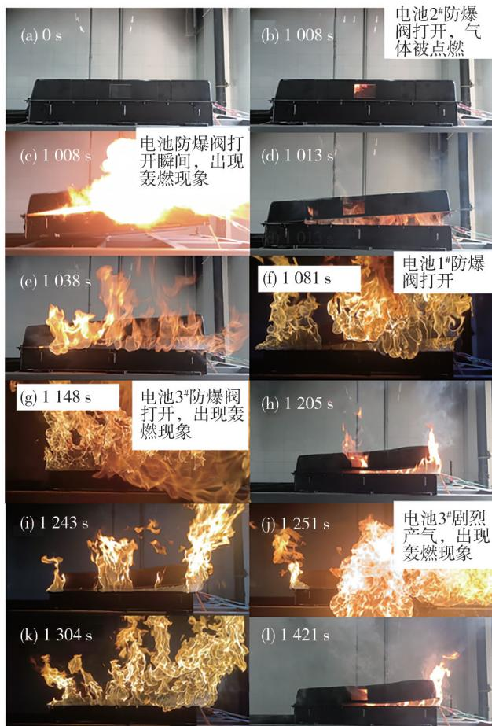

图 2　无抑制措施工况下电池包内电池模组热失控行为

在微正压氮气抑制工况下，电池包的 3 块磷酸铁锂电池都没有发生热失控，实验过程如图 3 所示。当 t=1534 s 时，电池 1#防爆阀打开，电池内部释放少量的气体，并且电池释放的气体逐渐从电池包右侧和观察窗逸出，随着包内气体的逐渐增多，电池包的观察窗 在 1 599 s 被冲破，电池包的少量白色烟雾从观察窗口逸出，由于气体量较少，在 1 655 s，几乎看不到白色烟雾，直到 1 693 s 时电池停止释放白色烟雾；电池包静置 4 h 后，电池没有温度升高也没有任何产气行为。实验过程中，电池模组没有发生热失控，仅有电池 1#防爆阀打开，从电池包内逸出少量白色烟雾。以上实验表明，微正压氮气抑制技术有效抑制了电池包内电池的热失控和着火行为。

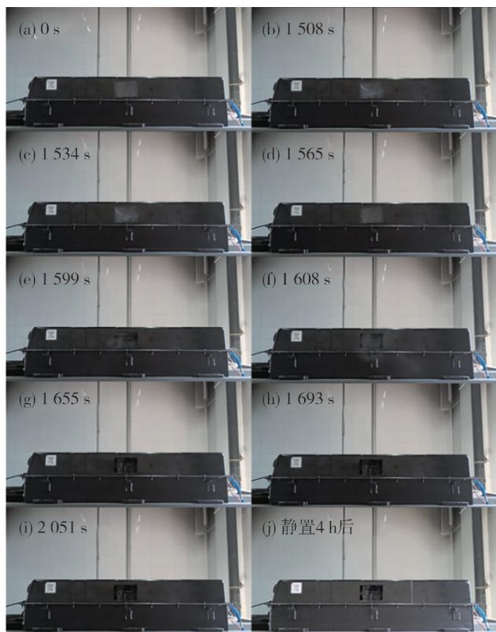

图 3　持续微正压氮气环境中电池包过热触发电池热失控过程

## 2. 1. 2　磷酸铁锂电池包内热失控电池温度和电压分析

锂离子电池热失控过程可概括为以下几个阶段：（Ⅰ）加热阶段；（Ⅱ）安全阀打开及燃烧阶段；（Ⅲ）熄灭阶段。图 4 和图 5 分别为无微正压氮气抑制工况和有微正压氮气抑制工况下热失控过程中电池模组的温度及电压变化。图 6 显示了在两种工况下电池模组实验前后的比较照片。

如图 4 所示，在无抑制措施工况中，加热板加热

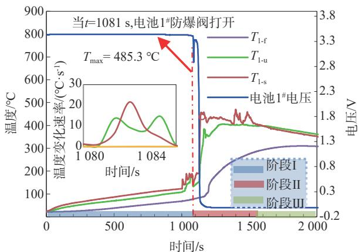

(a) 电池 1#

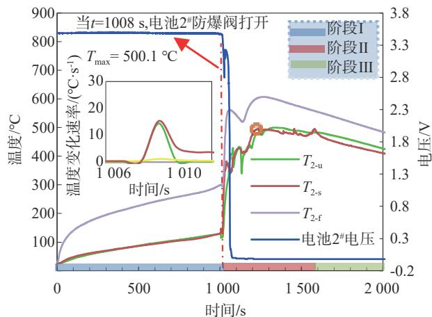

(b) 电池 2#

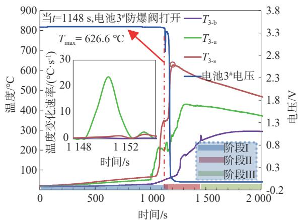

(c) 电池 3#

图 4　在无微正压氮气抑制工况下电池模组热失控过程中表面温度和电压变化

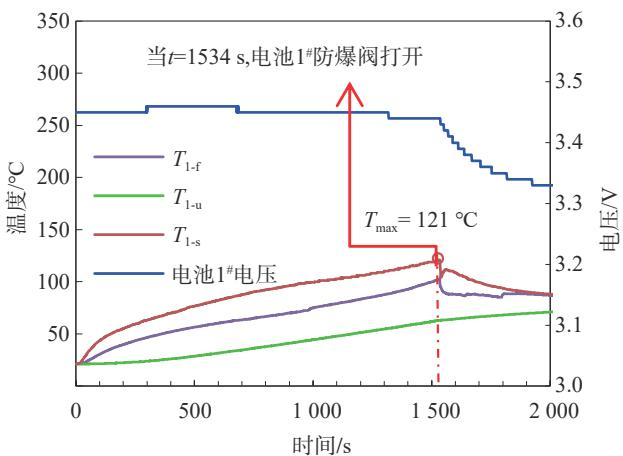

(a) 电池 1#

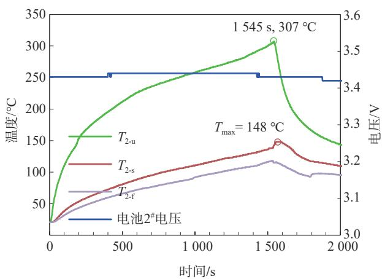

(b) 电池 2#

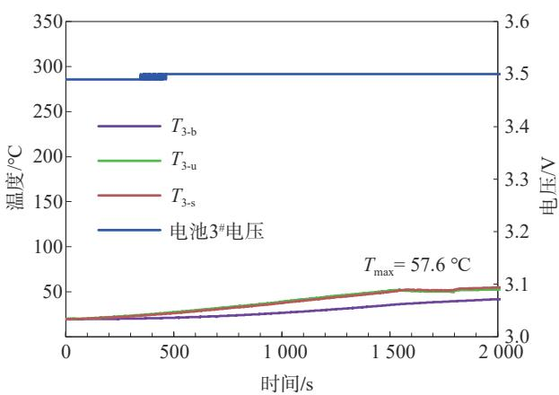

(c) 电池 3#

图 5　在微正压氮气抑制工况下电池模组热失控过程中表面温度和电压变化

过程中电池表面温度逐渐升高，在 1 008 s 时，电池 2#防爆阀打开，电池发生热失控，并且电池的最高温度为 500.1 ℃，最高温度值选取方式如式（1）所示。由于 $T _ { \mathrm { 2 - f } }$ 布置在加热板和电池 2#大面中间，受加热板影响较大，统计温度过程中不统计该温度数据。电池模组热失控时间为 140 s，电池模组中的电池表面最高温度为 626.6 ℃，并且电池侧面监测点和顶部监测点的电池表面最高温度均超过 400 ℃。最大温度变化速率可达 24.6 ℃/s（其中温度变化速率=ΔT/Δt，ΔT 是温度变化量，Δt 是时间变化量）。 $T _ { \mathrm { 1 - f } }$ 和 $T _ { \mathrm { 3 - b } }$ 监测点布置在钢制夹具和电池大面之间，监测温度数据受钢制夹具影响较大，温度值较低。从图 6（b）可以看到电池模组热失控后的照片，可以看到电池模组已经全部燃烧；在没有抑制措施工况下，电池包热失控危害较大，因此，车载动力电池包中必须设置热失控抑制措施。

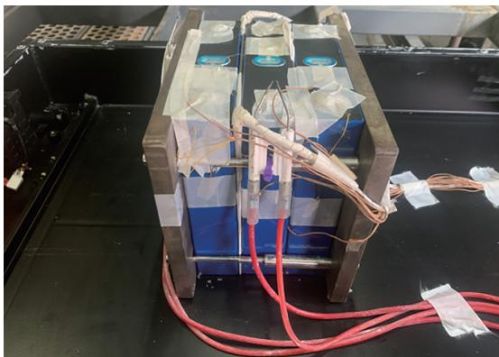

(a) 实验前电池包内模组照片

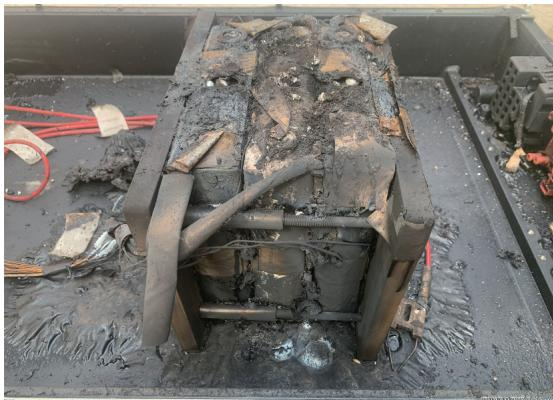

(b) 无抑制措施工况下电池模组实验后照片

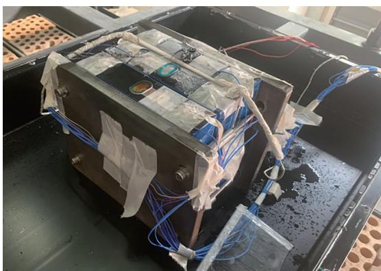

(c) 微正压氮气抑制工况下电池模组实验后照片

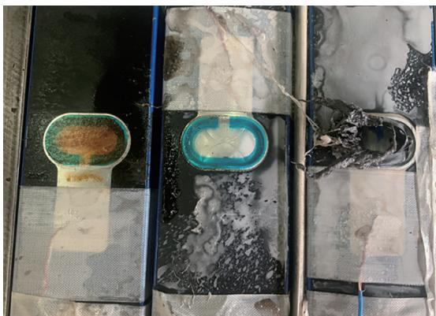

(d) 微正压氮气抑制工况下电池模组实验后俯视照片

图 6　电池包内模组实验前后比较照片

$$
T _ {i - \max} = \operatorname{Max} \left\{T _ {i - \mathrm{u}}, T _ {i - \mathrm{s}}, T _ {i - \mathrm{f}}, T _ {i - \mathrm{b}} \right\}, \text {不包含} T _ {2 - \mathrm{f}}\tag{1}
$$

如图 5 所示，在微正压氮气抑制工况下，电池 1#防爆阀开阀时间为 1 534 s，比无抑制措施工况延长了 526 s，电池模组中表面最高温度为 148 ℃，比无抑制措施工况中电池热失控最高温度低 478.6 ℃，开阀过程中没有出现明火。从图 6（d）中可以看到电池 1#安全阀打开，电池包内存在大量电解液；电池 $2 ^ { \# }$ 发生了膨胀，但是安全阀没有打开，整个加热过程中电池没有明显的温度升高速率，安全阀打开后关闭加热板，电池表面温度开始下降，电池没有发生热失控。

## 2. 2　微正压氮气抑制电池包内凝露实验结果与讨论

为进一步验证，在微正压氮气抑制电池包内热失控实验基础上，开展了电池包内凝露实验。在电池包工作过程中，为保证电池包内外气压平衡和电池包安全，电池包均设计有防水透气功能的防爆透气阀，防爆透气阀能够防液态水，但无法阻止湿热空气随电池包内外气压平衡时的“呼吸”进入包内，湿热空气进入电池包后遇到低温固体表面，会形成凝露。本文中的微正压氮气抑制方式既能确保电池包内外气压平衡，又能从根本上杜绝湿热空气进入包的方法，避免凝露引起次生灾害。

从图 7（a）可以看出，电池包内持续保持微正压氮气时相对湿度保持在 27%RH~35%RH 之间，而无任何措施条件下电池包内相对湿度随着循环逐渐升高，在实验进行 80 h 后最大相对湿度可以达到 80%RH，其中位线也已经超过了 60%RH。电池包内的压力与温度如图 7（b）和图 7（c）所示。可以看出微正压氮气抑制措施可以降低电池包内的温度，并且结合湿空气焓湿关系，相对湿度为 80%RH 的湿空气遇到 15~20 ℃ 的液冷板进、出水口处会析出凝露形成水珠。如图 8 所示，通过对比包内相对湿度变化可得出，无抑制工况下电池包内进出水口处有水珠聚集，电池包的绝缘阻值为 43.7 MΩ，持续保持微正压氮气电池包内进出水口无凝露，绝缘阻值为 847 MΩ。所以，电池包内持续保持微正压氮气能够有效地抑制带水蒸气的空气进入，从根本上解决水汽随空气进入电池包内部的问题，避免由凝露引发的绝缘失效和内部短路等次生灾害引起的热失控。

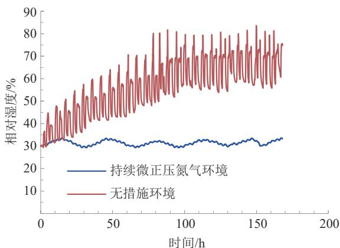

(a) 相对湿度对比

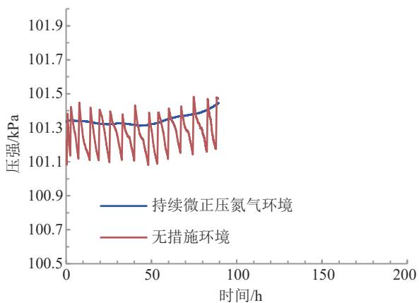

(b) 压强对比

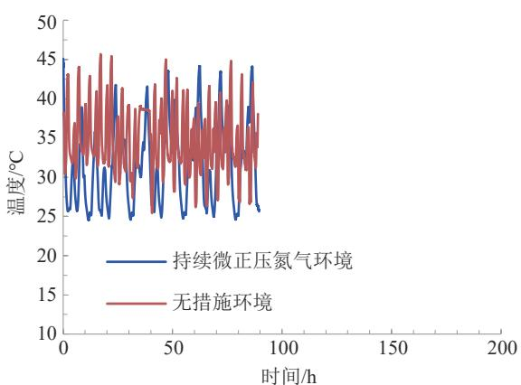

(c) 温度对比

图 7　有无微正压氮气抑制工况下电池包内相对湿度、压强与温度比较分析

无抑制措施 微正压氮气抑制

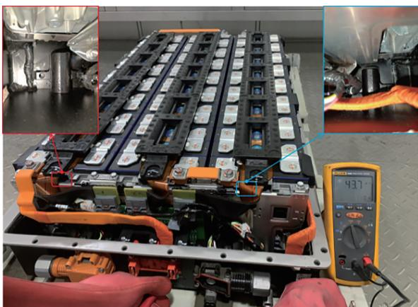

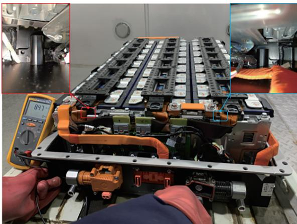

(a) 无微正压氮气抑制工况

(b) 有微正压氮气抑制工况

图 8　有无微正压氮气抑制工况下磷酸铁锂电池包内凝露现象

为了说明实验的可靠性，在相同的实验条件下采用 3 个相同的电池作为实验样本，统计热失控风险关键参数的数据，如图 9 所示。这些实测参数的误差均小于 5%，具有较高的数据可靠性。如图 10 所示，可以看出在微正压氮气抑制工况下电池热失控的风险明显降低，比较分析的基础数据中的各个指标均显示在微正压氮气抑制工况下电池包热失控风险更小。所以本研究提出的微正压氮气抑制技术

风险是指生产安全事故或健康损害事件发生的可能性和后果的组合。风险有两个主要特性，即可能性和严重性［21］。针对在有无微正压氮气抑制工况下磷酸铁锂电池热失控风险比较分析，将热失控实验过程中获得的电池热失控最高电池表面温度、热失控时间、电池热失控数量、最低触发温度、最大火焰温度和凝露实验过程中的电池包内的湿度和绝缘阻值作为基础数据比较分析了电池包内的热失控风险。

对于电池包的热失控风险降低具有重要意义。

## 2. 3　电池热失控风险比较分析

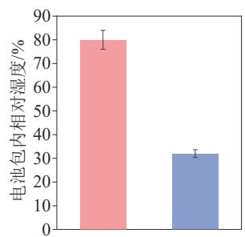

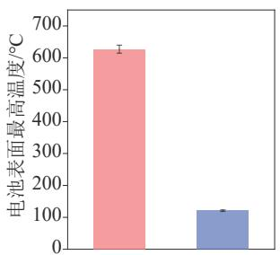

无抑制措施 微正压氮气抑制

无抑制措施 微正压氮气抑制

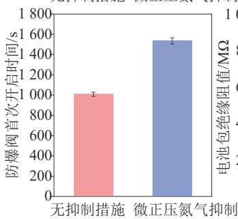

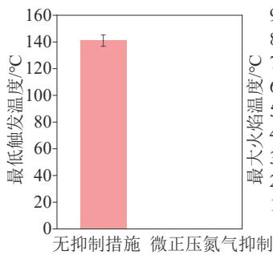

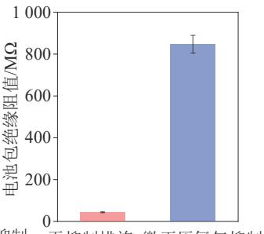

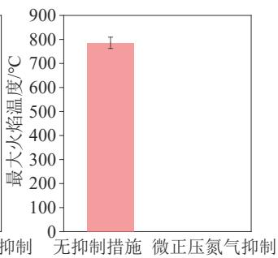

图 9　有无微正压氮气抑制工况下磷酸铁锂电池热失控风险的误差分析图

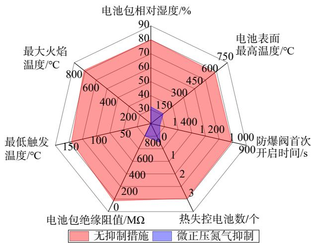

注：微正压氮气抑制工况下未发生热失控，不涉及最大火焰温度和最低触发温度。

图 10　有无微正压氮气抑制工况下磷酸铁锂电池热失控风险比较分析

## 3　结论

以大容量 302 A·h 磷酸铁锂电池包为研究对象，提出了一种低成本、易操作和安全高效的微正压氮气抑制技术，并且开展了电池包内电池模组热失控对比实验和电池包内凝露实验研究，从热失控严重性和热失控可能性两方面抑制了电池包热失控危害，主要结论如下。

（1）在微正压氮气抑制工况下，电池模组防爆阀开阀时间比无抑制措施迟 526 s，电池表面最高温度为 148 ℃，比无抑制措施降低了 76.4%，电池模组没有发生热失控。

（2）在微正压氮气抑制工况下，电池包内进出水口无凝露，绝缘阻值为 847 MΩ，比无抑制措施的绝缘阻值提高了约 19 倍，显著降低了电池包内发生绝缘短路、凝露等引发的安全风险。

综上，通过电池热失控风险定性比较分析，在热失控严重性和可能性等比较参数中，微正压氮气抑制技术的数据更优，可以明显降低电池热失控的风险和热失控危害。

## 参考文献

［1］ WANG Q S， MAO B B， STOLIAROY S I， et al. A review of lithi⁃ um ion battery failure mechanisms and fire prevention strategies ［J］. Progress in Energy and Combustion Science，2019，73： 95-131. 

[2] ZHAO J Y, FENG X, TRAN M K, et al. Battery safety: fault diagnosis from laboratory to real world ［J］. Journal of Power Source⁃ es, 2024,598:234111. 

［3］ YU Q Q， WANG C， LI J M， et al. Challenges and outlook for lithium-ion battery fault diagnosis methods from the laboratory to real world applications ［J］. eTransportation，2023，17：100254. 

［4］ FENG X N， ZHANG F S， HUANG W S， et al. Mechanism of in⁃ ternal thermal runaway propagation in blade batteries ［J］. Journal of Energy Chemistry，2024，89：184-194. 

［5］ KANG S， KWON M， YOON C J， et al. Full-scale fire testing of battery electric vehicles ［J］. Applied Energy，2023，332：120497. 

［6］ LI H， PENG W， YANG X L， et al. Full-scale experimental study on the combustion behavior of lithium-ion battery pack used for electric vehicle [J]. Fire Technology, 2020, 56 (6) : 2545-2564. 

［7］ SUN L， WEI C， GUO D L， et al. Comparative study on thermal runaway characteristics of lithium-iron phosphate battery mod⁃ ules under different overcharge conditions ［J］. Fire Technology， 2020,56(4):1555-1574. 

［8］ 黄沛丰. 锂离子电池火灾危险性及热失控临界条件研究［D］. 合肥：中国科学技术大学，2018.

HUANG P F. Research on fire risk and critical conditions of ther⁃ mal runaway of lithium-ion batteries ［D］. Hefei： University of Science and Technology of China，2018. 

［9］ WANG H B， XU H， ZHANG Z L， et al. Fire and explosion char⁃ acteristics of vent gas from lithium-ion batteries after thermal run⁃ away： a comparative study ［J］. eTransportation， 2022，13： 100190. 

［10］ QIN P， JIA Z Z， WU J Y， et al. The thermal runaway analysis on LiFePO4 electrical energy storage packs with different venting ar⁃ eas and void volumes ［J］. Applied Energy，2022，313：118767. 

［11］ ZHOU L， LAI X， LI B， et al. State estimation models of lithiumion batteries for battery management system： status， challenges， and future trends ［J］. Batteries，2023，9（2）：131. 

［12］ MALONEY T. Propagation of lithium battery fire in an inert envi⁃ ronment ［R］. Atlantic City： Federal Aviation Administration， 2016. 

［13］ SAID A O， LEE C， STOLIAROY S I， et al. Comprehensive anal⁃ ysis of dynamics and hazards associated with cascading failure in 18650 lithium ion cell arrays ［J］. Applied Energy，2019，248： 415-428. 

［14］ LIU X， STOLIAROY S I， DENLINGER M， et al. Comprehensive calorimetry of the thermally-induced failure of a lithium ion bat tery ［J］. Journal of Power Sources，2015，280：516-525. 

［15］ LIU X， WU Z B， STOLIAROY S I， et al. Heat release during thermally-induced failure of a lithium-ion battery： impact of cathode composition ［J］. Fire Safety Journal，2016，85：10-22. 

［16］ 王颖，任常兴. 热安全测试装置在灭火气体作用特征研究中的应用［J］. 消防科学与技术，2017，36（6）：847-850.WANG Y， REN C X. Application of thermal safety testing devicein research on fire-extinguishing gas characteristics [J]. Fire Sci-ence and Technology，2017，36（6）：847-850.

［17］ PING P， WANG Q S， SUN J H， et al. Thermal stabilities of some lithium salts and their electrolyte solutions with and without con⁃ tact to a LiFePO4 electrode ［J］. Journal of the Electrochemical Society，2010，157（11）：A1170-A1176. 

［18］ XU C， FAN Z， ZHANG M， et al. A comparative study of the venting gas of lithium-ion batteries during thermal runaway trig⁃ gered by various methods［J］. Cell Reports Physical Science， 2023 4(12): 101705 

［19］ LI H， DUAN Q， ZHAO C， et al. Experimental investigation on the thermal runaway and its propagation in the large format bat⁃ tery module with Li（Ni Co Mn ）O as cathode［J］. Journal of Hazardous Materials, 2019, 375: 241–254 

［20］ ZHANG Y， PING P， DAI X， et al. Failure mechanism and ther⁃ mal runaway behavior of lithium-ion battery induced by arc faults [J]. Renewable and Sustainable Energy Reviews, 2025, 207: 114914. 

［21］ 孙金华，王青松，段强领，等. 火灾风险评估与控制方法学［M］. 北京：机械工业出版社，2020.SUN J H， WANG Q S， DUAN Q L，et al. Fire risk assessmentand control methodology ［M］. Beijing： Machinery IndustryPress, 2020.

