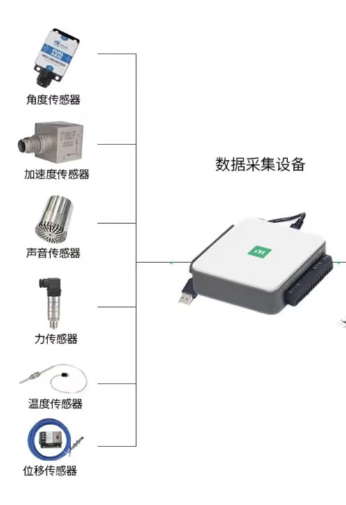

## 流速传感器
### 皮托管 + 差压传感器
**原理：**

皮托管测量动压 + 静压：

$$  
\Delta P = P_{\text{动}} - P_{\text{静}}  
$$

根据空气动力学：

$$  
v = \sqrt{\frac{2 \Delta P}{\rho}}  
$$

其中：

* $v$：流速（m/s）
* $Delta P$：压差
* $\rho$：空气密度（≈1.1~1.2 kg/m³）

---

### 插件 + 传感器选择

| 部件    | 建议型号 / 类型                 | 输出   |
| ----- | ------------------------- | ---- |
| 皮托管   | 小气管皮托管（汽车进气管适配）           | 动/静压 |
| 差压传感器 | 0~2500 Pa（流速范围为 0~65 m/s） | 0~5V |

推荐常用压差模块（输出电压）：

- SDP600 / SDP610 差压传感器  
- MPX5500 / MPXV7002DP（汽车流速常用）  
	这些输出都是模拟电压  
	本系统采用 ` NI USB-6002 ` 数据采集卡作为模拟信号采集设备，在 NI MAX 中将设备配置为 ` Dev 1`，并在 LabVIEW 中通过 DAQmx 实现温度信号的连续采集、换算、显示与记录。（通道为 `ai 1`）  
	
---

### LabVIEW 里的计算流程

#### DAQmx 采集 ΔP 信号

```text
DAQmx Read → 波形 → Y 数组 (压差电压)
```

#### 把电压转成压差值

传感器输出范围 0~5V 对应 ΔP 0~2500 Pa：

$$  
\Delta P = V / 5.0 × 2500Pa  
$$

换算公式根据传感器说明书来。

---

### 压差转换成流速

$$  
v = \sqrt{\frac{2 \Delta P}{\rho}}  
$$

> 空气密度取 $1.2kg/m^3$

### LabVIEW 示例框图

```python
DAQmx Read (差压电压) ——→ Y数组 ——→ 平均/滤波
                                    ↓
                          电压 -> 压差 (Pa) (线性换算)
                                    ↓
                         差压 -> 速度 (sqrt 公式)
                                    ↓
                          流速显示 / 波形图表
```

## 温度采集
本系统采用 ` NI USB-6002 ` 数据采集卡作为模拟信号采集设备，在 NI MAX 中将设备配置为 ` Dev 1`，并在 LabVIEW 中通过 DAQmx 实现温度信号的连续采集、换算、显示与记录。(通道为 `ai0` )

采样任务为：

```text
采集类型：模拟输入 AI 电压
物理通道：Dev1/ai0
最小电压：0 V
最大电压：5 V
采样率：1000 Hz
采样点数：1000
采样模式：连续采样
采样时钟：OnboardClock
```

电压与温度呈线性关系：

$$
T=20U
$$

所以输出的温度范围为：$0-100℃$

由于温度信号和流速信号均属于模拟电压输入信号，为避免多个 DAQmx 任务同时占用同一采集卡的模拟输入资源，本系统将温度与流速通道配置在**同一个模拟输入采集任务**中进行同步采集。  
因此，DAQmx Read 输出的数据类型为 **1D 波形数组**，其中包含两个通道的波形数据。程序中通过 索引数组 对波形进行分离：当索引值为 0 时，提取温度通道波形；当索引值为 1 时，提取流速通道波形。随后分别对两个波形数据进行相应的物理量换算与显示。

## 转速的采集
转速采集模块采用 ` NI USB-6002 ` 的计数器输入通道完成脉冲信号采集。发动机转速传感器或虚拟脉冲信号源在转轴每转一圈或每经过一个齿时输出一个脉冲信号，DAQ 通过计数器对脉冲边沿进行计数，然后根据单位时间内的脉冲数计算转速。

采用的是边沿计数：DAQ 输出的是累计脉冲数

### 采集流程：

```text
转速传感器 / 脉冲信号源
↓
输出方波脉冲信号
↓
接入 /Dev1/PFI0
↓
Dev1/ctr0 对有效边沿计数
↓
DAQmx Read 读取当前累计计数值
↓
与上一时刻计数值相减，得到 ΔN
↓
根据循环时间 Δt 计算频率 f
↓
根据每转脉冲数 PPR 计算转速 RPM
↓
显示转速曲线和数值
```

### 计算公式：
假设读取计数器的间隔为 $\Delta t$ （循环时间），当前的为 $N_k$，上一次的计数值为 $N_{k-1}$，该时间窗口的脉冲为：

$$
\Delta N=N_k-N_{k-1}
$$

则换算得到的转速为：

$$
n=\frac{60\Delta N}{PPR\cdot\Delta t}
$$

> $PPR$：传感器每转输出的脉冲数，假设为 1

### 程序框架
需要计算两个时刻的计数值的差值，用到移位寄存器

```text
While 循环
{
    DAQmx Read 读取当前累计计数 N_now

    ΔN = N_now - N_last

    Δt = 循环时间(ms) / 1000

    f = ΔN / Δt

    RPM = 60 × f / PPR

    显示 RPM

    N_last = N_now
}
```

## 前面板介绍


转速的采集前面板

---


- 温度和流速数据采集的前面板，同时右下角部分有转速表和温度计
- 停止按键负责停止整个采集流程（点亮的话为停止状态）

