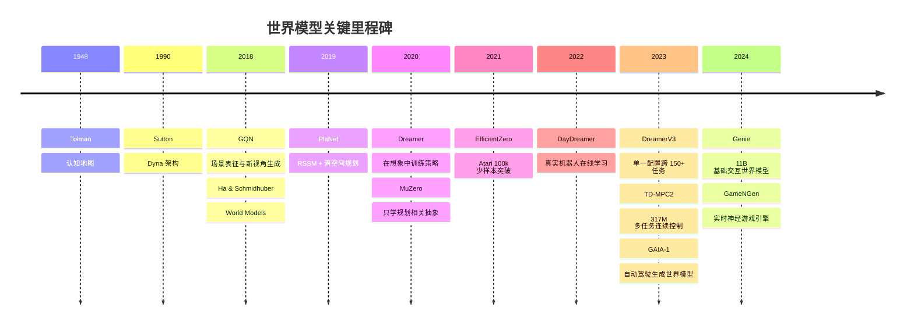

## 执行摘要
“世界模型”并不是一个单一算法名词，而是一类**用内部表征近似外部世界及其随动作演化规律**的方法集合。若用一个统一表述来概括，它通常学习某种形式的状态表示，以及从当前状态与动作到未来状态、观测、奖励或其他后果的映射。在近年的综述中，世界模型常被概括为两大功能：一类偏向“理解当前世界”的内部表征构建，另一类偏向“预测未来世界”的状态转移与模拟；在具身智能语境下，它又被具体化为“构造世界状态表征并建模状态转移”的系统。

不同学科对“世界模型”的强调点并不相同。强化学习更强调**动作条件下的动力学与规划**；生成模型更强调**可控、长时程且一致的未来观测生成**；认知科学强调**心智中的内部模型、认知地图与预测加工**；机器人学则更关注**具身约束、传感器 - 动作闭环、仿真与控制**。因此，“世界模型是什么”最严谨的回答不是某个具体网络，而是一个跨学科概念：它是系统为了预测、想象、规划和决策而构建的内部世界表征。

从技术演化看，现代机器学习中的世界模型大致经历了这样一条路线：从 Sutton 的 Dyna 思想把“学模型、用模型规划、再回到学习”统一起来，到 GQN 用多视角感知学习场景表征，再到 Ha 与 Schmidhuber 用 VAE+RNN 明确提出现代深度学习语境下的 “World Models”，随后 PlaNet 用 RSSM 把规划搬到潜变量空间，Dreamer 用“在想象中训练策略”替代在线 MPC，MuZero 则进一步表明**规划不一定需要重建像素，只要学习对规划有用的抽象量即可**。此后，EfficientZero、DayDreamer、DreamerV3、TD-MPC2 把世界模型推向更高样本效率、更强泛化与更真实的机器人闭环；Genie、GAIA-1 与 GameNGen 则把世界模型扩展到交互式视频、自动驾驶与神经游戏引擎。

对研究者和工程师而言，最重要的结论是：**如果目标是控制与规划，通常应优先考虑潜变量世界模型；如果目标是高保真可交互生成或数据合成，则更偏向像素/视频/token 级生成世界模型；如果目标是离散决策搜索，则更接近 MuZero 式的“规划相关抽象模型”。**  
世界模型最核心的收益是样本效率、反事实推演和模块化决策；最核心的风险则是模型偏差、长程 rollout 漂移、评估错配与高昂计算成本。相应地，工程上最有效的一组策略往往是：显式不确定性建模、短分支 rollout、在线数据回灌、对模型误差敏感的规划 horizon 控制，以及把“模型好不好”同时用预测指标和下游决策指标来衡量。

## 概念与定义

从机器学习的角度，一个世界模型通常可写成某种序列概率模型或状态空间模型：给定历史观测与动作，学习一个内部状态，使系统能够预测未来观测、奖励、终止信号，或更抽象的价值与策略相关量。PlaNet 用 POMDP 语境写成转移模型、观测模型与奖励模型；Dreamer 则把世界模型看作“从经验中总结出来、可用于想象未来的参数化知识”；更广义的综述则把世界模型分为“理解当下”与“预测未来”两类。

认知科学中，“世界模型”并不首先指神经网络，而是指生物体对外部环境形成的**内部心智模型**。Tolman 的“认知地图”工作指出，动物并非只做刺激—反应联结，而会形成环境结构表征；Friston 的预测加工与自由能框架进一步把大脑描述为持续产生感觉输入预测、并用误差修正内部生成模型的系统。这个定义强调的是**解释行为与感知的内部表征机制**，而不是特定工程实现。

在机器人学与具身智能中，世界模型的含义通常比纯生成模型更“闭环”：它不只需要生成未来画面，还要支持动作选择、仿真替身、数据合成和真实环境中的适应。具身世界模型综述明确将其界定为对世界状态及其转移的建模，并指出其在机器人中常扮演三类角色：云端数据合成引擎、环境代理、以及设备上的行动“大脑”。

下面这张表把几个常见语境中的“世界模型”差异放在一起看，会比单一定义更准确。

| 领域   | “世界模型”核心对象            | 状态表示偏好            | 动作是否显式进入模型        | 主要目标                   | 常见评价方式               |
| ---- | --------------------- | ----------------- | ----------------- | ---------------------- | -------------------- |
| 强化学习 | 环境如何在动作下演化；常同时预测奖励与终止 | 潜变量、抽象状态、规划相关表征   | 通常显式              | 提升样本效率、支持规划与策略学习       | 回报、样本效率、规划质量         |
| 生成模型 | 未来观测、场景或交互式视频世界       | 像素、token、离散/连续潜变量 | 常显式，也可能通过潜在动作隐式控制 | 高保真、可控、一致的未来生成         | 视频质量、可控性、时序一致性、交互性   |
| 认知科学 | 生物体对环境结构与因果变化的内部心智模型  | 认知地图、层级生成表征       | 与行动/主动推断密切耦合      | 解释感知、推理、规划、行为          | 行为拟合、神经合理性、预测误差最小化   |
| 机器人学 | 具身条件下的动作条件动力学与交互后果    | 潜变量 + 几何/视频/多模态表征 | 几乎总是显式            | 控制、仿真、数据合成、sim-to-real | 任务成功率、样本效率、稳健性、迁移表现  |

一个重要的辨析是：**并非所有能“预测未来”的模型都足以称作世界模型。** 在更严格的工程语义里，世界模型通常还应服务于决策，至少要对动作条件变化敏感，并能支持规划、控制或反事实想象。也正因为如此，MuZero 这类不重建像素、只预测奖励/价值/策略的抽象模型，仍被广泛视为世界模型；反过来，单纯做下一帧视频预测却与动作无关的模型，在控制问题里通常只能算“未来预测器”，而不是完整的可用世界模型。

## 历史谱系与代表性工作

如果把现代世界模型研究放在更长的知识史中看，它的思想源头并不晚近。Tolman 在 1948 年用“认知地图”挑战纯行为主义式的刺激—反应解释；Sutton 在 1990 年把显式世界模型引入 Dyna 架构，强调“学模型—规划—反应”一体化；2018 年前后，GQN 与 Ha-Schmidhuber 两条路线分别从**场景生成表征**和**强化学习中的潜变量内部模拟**两端重新点燃该方向；2019 年后 PlaNet、Dreamer、MuZero 把世界模型推进到现代主流；2021 年后 EfficientZero、DayDreamer、DreamerV3、TD-MPC2、Genie 与 GameNGen 又分别在少样本 Atari、真实机器人、跨域泛化、大模型扩展和交互式生成上把边界继续推远。

上面的时间线反映出一个很清晰的趋势：世界模型研究从“是否能学到一个内部模型”转向“内部模型以何种抽象层次、何种损失目标、何种计算预算，最能服务下游决策或交互式生成”。尤其在 PlaNet、Dreamer 与 MuZero 之后，学界逐渐形成一个共识：**好的世界模型不一定是重建最逼真的模型，而是对目标决策最有用的模型。**

### 代表性论文比较

| 论文                                                  | 作者              |   年份 | 方法要点                                        | 数据/环境                           | 主要结论                                                      | 论文链接                                  |
| --------------------------------------------------- | --------------- | ---: | ------------------------------------------- | ------------------------------- | --------------------------------------------------------- | ------------------------------------- |
| *Neural Scene Representation and Rendering*         | Eslami 等        | 2018 | GQN；从多视角观测学习场景内部表示并生成新视角                    | 程序生成场景、多视角图像                    | 证明机器可仅凭自身观测学习场景内部表示，世界模型开始与“场景理解/生成”合流                    | 原文 citeturn9search6turn9search13  |
| *World Models*                                      | Ha, Schmidhuber | 2018 | VAE 压缩视觉 + RNN 记忆/动力学 + 小控制器                | CarRacing、VizDoom               | 展示了“先学世界，再在世界里训练控制器”，且可以在“梦境环境”中训练后迁回真实环境                 | 原文 citeturn22view0turn24view0     |
| *Learning Latent Dynamics for Planning from Pixels* | Hafner 等        | 2019 | PlaNet；RSSM + 潜空间 MPC + latent overshooting | DeepMind Control Suite 像素任务     | 在视觉控制上达到接近强 model-free 方法的表现，平均用约 200× 更少交互               | 原文 citeturn0search14turn29view3   |
| *Dream to Control*                                  | Hafner 等        | 2020 | Dreamer；在潜空间想象轨迹上训练 actor-critic            | 20 个视觉连续控制任务                    | 用“想象中的 rollout”学习长时程行为，在数据效率、计算时间和最终性能上超过既有方法             | 原文 citeturn11view1turn17view3     |
| *MuZero*                                            | Schrittwieser 等 | 2020 | 学习对规划直接有用的抽象模型，只预测 policy/value/reward      | Go、Chess、Shogi、57 个 Atari       | 不知道真实规则也能达到与 AlphaZero 匹配的棋类水平，并在 Atari 上达成 SOTA          | 原文 citeturn18view0                 |
| *EfficientZero*                                     | Ye 等            | 2021 | 在 MuZero 基础上提升少样本效率                         | Atari 100k、DMControl 100k       | 仅用 2 小时游戏经验就在 Atari 100k 上取得 194.3% 平均人类水平、109.0% 中位数人类水平 | 原文 citeturn18view1                 |
| *DayDreamer*                                        | Wu 等            | 2022 | 将 Dreamer 直接用于真实机器人在线学习                     | 四足机器人、机械臂、轮式机器人                 | 四足机器人 1 小时从零学会翻身站立行走，并能在 10 分钟内适应外部推扰；机械臂抓放接近人工表现         | 原文 citeturn11view2turn10search0   |
| *Mastering Diverse Domains through World Models*    | Hafner 等        | 2023 | DreamerV3；稳健化训练技巧 + 固定超参数跨域泛化               | 150+ 任务，含 Atari、DMC、Minecraft 等 | 单一配置跨多域优于专用方法，并首次在无人工数据/课程下从零在 Minecraft 采到钻石             | 原文 citeturn13search0turn13search2 |
| *Genie*                                             | Bruce 等         | 2024 | 视频 tokenizer + 自回归动力学 + latent action       | 未标注互联网视频                        | 11B 参数、无动作标签训练出的可交互环境，标志着基础世界模型进入大规模视频时代                  | 原文 citeturn20view0                 |

这组论文的一个鲜明对比是：GQN 和 Genie 更接近“生成式世界理解/交互环境建模”，PlaNet 与 Dreamer 更接近“潜空间控制”，MuZero 则代表“只学决策需要的抽象”，而 DayDreamer、DreamerV3 与 TD-MPC2 表明世界模型已经不再局限于小规模演示，而是在真实机器人与大规模多任务连续控制中成为可部署方法。

## 技术架构与训练目标

世界模型的技术路线很多，但若按“**它到底预测什么、在什么空间里预测、如何把预测结果用于决策**”来划分，可以比较稳定地分成几类。

### 基于观测预测的模型

最直接的一类世界模型直接在观测空间做预测，例如下一帧图像、下一段视频、未来视角或多模态场景序列。GQN 的输入是多视角图像与查询视角，输出是查询视角下的图像；GAIA-1 将视频、文本与动作编码成离散 token 后做下一 token 预测；GameNGen 则直接把过去帧和动作映射到下一帧，从而形成可实时交互的“神经游戏引擎”。这种路线的优点是可视化直观、适合数据合成和仿真，缺点是计算昂贵、对长时程稳定性要求极高，而且高像素保真并不自动等价于高决策价值。

### 基于潜变量压缩的世界模型

Ha 与 Schmidhuber 的 World Models 代表了一种早期而清晰的范式：先用 VAE 把高维视觉帧压缩成低维潜变量，再让一个时间模型在潜变量空间中学习动力学，最后把一个小控制器接到该内部世界上。其工程直觉非常朴素：**把难的视觉建模与策略信用分配分离**。该项目页明确把系统拆成“视觉压缩”“记忆/动力学”“决策模块”三部分，并指出可以把策略放进模型生成的梦境中训练。

这一类方法的训练核心通常是 VAE 的证据下界。经典形式可写为：

$$
\mathcal{L}_{\mathrm{ELBO}}
=
\mathbb{E}_{q_\phi(z|x)}[\log p_\theta(x|z)]  
\beta\,\mathrm{KL}\!\left(q_\phi(z|x)\,\|\,p(z)\right).  
$$

其中第一项鼓励重建，第二项约束潜变量分布；AEVB 论文奠定了这一类方法在连续潜变量下可用重参数化稳定训练的基础。

### RSSM 与潜空间规划

PlaNet 的关键贡献不是“用 latent state”本身，而是把 latent state、部分可观测性、随机性与规划效率结合成一个可工作系统。它把世界模型写成 POMDP 风格的状态转移、观测生成和奖励预测，并进一步提出 RSSM，把状态拆成**确定性记忆路径**与**随机性未来分支**两部分：  

$$  
h_t = f(h_{t-1}, z_{t-1}, a_{t-1}), \qquad  
z_t \sim p(z_t \mid h_t),  
$$  
$$  
o_t \sim p(o_t \mid h_t, z_t), \qquad  
r_t \sim p(r_t \mid h_t, z_t).  
$$

PlaNet 明确指出，纯随机状态空间模型不擅长长期记忆，纯 deterministic RNN 又不利于表达多个可能未来，而 RSSM 同时保留两者的优点；论文还把 RSSM 形容为一种“非线性 Kalman filter 或 sequential VAE”。

PlaNet 的另一个重要技术点是 **latent overshooting**。其动机是：只用标准逐步 ELBO 会让模型更擅长一步预测，却未必擅长多步 rollout；而世界模型真正用于规划时，需要多步一致性。于是 PlaNet 不在像素空间对每一步都做昂贵解码，而是在潜空间里把多步先验拉向对应的后验，以此作为低成本的长时程正则。论文直接指出，这一机制的作用是鼓励一跳与多跳预测在期望上保持一致，从而改进规划需要的长时程预测。

### 在想象中学习行为

Dreamer 继承了 RSSM，但把“如何用模型做决策”推进了一步。PlaNet 主要依赖在线 MPC/CEM 规划；Dreamer 则在模型的潜空间里生成 imagined trajectories，再用 actor-critic 直接在这些想象轨迹上训练策略与价值函数。Dreamer 论文明确强调：它通过把学习到的 value 的解析梯度反向传播穿过潜空间动力学，从而学到长时程行为，而不是仅仅在有限 planning horizon 内做短视搜索。

Dreamer 的世界模型训练目标由观测重建、奖励预测和 KL 正则组成；其文中给出的重建目标包含 observation term、reward term 和 KL 项：

$$
\mathcal{J}_{\mathrm{model}}
=
\sum_t  
\big(  
\log q(o_t|s_t) +  
\log q(r_t|s_t)  
\beta\;\mathrm{KL}(q(s_t|\cdot)\,\|\,p(s_t|\cdot))  
\big).  
$$

在行为学习阶段，Dreamer 使用有限想象 horizon 内的 imagined trajectory，再通过值函数估计 horizon 之外回报，文中指出它采用 $V_\lambda$ 目标以平衡偏差和方差，并展示了价值模型让算法对 imagination horizon 更鲁棒。

### 只学习规划相关抽象的模型

MuZero 代表了与重建式世界模型不同的第二条主线：**不必还原“世界长什么样”，只需学习“为了规划，世界有哪些量必须被预测”**。MuZero 的抽象模型只学习三个与搜索直接相关的量：动作选择策略、价值、奖励；它并不要求像 PlaNet 或 Dreamer 那样重建观测。论文摘要明言，这个可迭代模型只输出对规划直接有用的 quantities，并在未知环境动力学的情况下取得了棋类超人类表现和 Atari state of the art。

这条路线的重要意义在于：世界模型不再与“高保真生成器”绑定。对于许多决策问题，**规划充分统计量**比“像素级正确”更重要。EfficientZero 则说明，一旦把这种规划相关抽象建模做好，少样本效率可以达到极高水平。

### Transformer 与 foundation world models

当世界模型转向大规模视频和多模态时，tokenization + sequence modeling 逐渐成为主流。IRIS 把观测离散化为 image tokens，再用自回归 Transformer 建模时间上的 token 序列；其论文明确将动态学习表述为序列建模问题，并在 Atari 100k 仅两小时数据下达到 1.046 的平均 human normalized score。Genie、GAIA-1 与 iVideoGPT 进一步把这种思路扩展到互联网视频、自动驾驶日志和大规模机器人轨迹。它们共同的结构特征是：**先把高维视觉压成 token 或紧凑潜表征，再用强序列模型学习长时程、多模态、带控制信号的 next-token dynamics。**

从模型容量上看，世界模型已经横跨极大尺度区间。控制导向模型可以相对紧凑，而大规模生成世界模型则迅速向 foundation model 靠拢。TD-MPC2 报告了一个能跨 80 个任务、4 个任务域和多种 embodiment 的 317M 参数多任务 agent；Genie 则是 11B 参数的基础世界模型。这说明“世界模型”今天既可以是一个高效潜变量控制器，也可以是一个十亿级以上的交互式视频生成系统。

下面这张简化示意图概括了 RSSM/Dreamer 类世界模型的典型数据流。图本身是概念化重绘，但它对应的结构关系直接来自 PlaNet 的 RSSM 与 Dreamer 的 latent imagination 训练范式。

### 常见架构比较

| 架构类型                   | 典型输入/输出                                    | 常见训练目标                           | 典型推理方式                            | 优点                                 | 常见问题                                 | 代表工作                                                     |
| -------------------------- | ------------------------------------------------ | -------------------------------------- | --------------------------------------- | ------------------------------------ | ---------------------------------------- | ------------------------------------------------------------ |
| 观测空间预测               | 输入过去观测与动作；输出未来图像/视频/视角       | 像素 NLL、重建损失、token CE           | 直接 rollout、可视化仿真                | 直观、适合数据合成与可解释展示       | 昂贵、长程漂移、视觉好不等于决策好       | GQN、GAIA-1、GameNGen citeturn9search6turn19view0turn20view1 |
| VAE+RNN 世界模型           | 输入图像；输出潜变量及其序列动力学               | ELBO + 序列预测                        | 在潜空间 rollout 或“梦境环境”训练控制器 | 压缩视觉复杂度、控制模块可很小       | 潜空间未必足够规划友好，模型可被 exploit | World Models citeturn24view0turn22view0                  |
| RSSM 潜变量状态空间        | 输入观测/动作，输出 latent state、reward、obs    | 重建 + reward + KL + 多步一致性        | MPC 或 imagined rollouts                | 兼顾记忆与多未来、样本效率高         | 长 horizon 仍会累积误差                  | PlaNet、Dreamer citeturn16view1turn16view0turn17view1   |
| 规划相关抽象模型           | 输入历史或隐状态与动作；输出 reward/value/policy | 搜索目标监督、reward/value/policy loss | MCTS / lookahead search                 | 不必重建像素，直接优化规划量         | 适用于决策，但不一定适合高保真生成       | MuZero、EfficientZero citeturn18view0turn18view1         |
| Token/Transformer 世界模型 | 输入图像/video/action/text token；输出下一 token | 自回归 CE、离散 latent 建模            | next-token rollout、长上下文条件生成    | 可扩展、多模态、适合 foundation 训练 | 训练成本很高，闭环稳定性难               | IRIS、Genie、iVideoGPT citeturn11view3turn20view0turn5search2 |

## 应用场景与效果评估

对于“世界模型有何用”的最好回答，不是抽象定义，而是看它在哪些任务上真正带来了可测量收益。

### 强化学习中的样本效率与规划

世界模型在强化学习里最经典的价值是**用更少真实环境交互，换取更多内部想象与规划**。PlaNet 在多个视觉连续控制任务上达到接近强 model-free baseline 的性能，且文中报告平均只需约 200× 更少的环境交互。Dreamer 进一步表明，用 latent imagination 训练 actor-critic 可以在 20 个视觉控制任务上超越当时既有方法。MuZero 则把规划推进到“无规则、只靠学得模型”的范式，在 57 个 Atari 游戏上达到 SOTA，并在 Go、Chess、Shogi 上匹配 AlphaZero 的超人类水平。EfficientZero 说明这条路线不只高性能，而且能极度省数据：Atari 100k 上仅两小时真实游戏经验即可超过人类平均水平。

DreamerV3 与 TD-MPC2 又把这个结论推进到更广任务分布。DreamerV3 以固定配置跨 150 多个多样任务工作，并在 Minecraft 中从零开始挖到钻石；TD-MPC2 则在 104 个在线连续控制任务上用一套超参数取得稳定强表现，还展示了多任务大模型世界模型的扩展性。对工程上真正关心“能不能统一方法栈”的团队来说，这两项结果的意义并不亚于单点最高分。

### 机器人控制与真实世界闭环

在机器人里，世界模型的核心收益不只是样本效率，更是**减少真实世界试错代价**。DayDreamer 直接把 Dreamer 用到真实机器人，不依赖模拟器：四足机器人 1 小时从零学会翻身、站起和行走，并能在 10 分钟内适应外部推扰；两个机械臂可从相机图像和稀疏奖励中学会多物体抓放，表现接近人工；轮式机器人则能仅凭视觉导航到目标位置。这个工作很关键，因为它证明了世界模型并非只能在 Atari 或 DMC 这类“干净环境”里有效。

更广的具身综述也指出，世界模型在机器人中的作用正在扩张：既可作为云端合成器生成训练数据，也可作为环境代理支持仿真评估，还可作为设备端“agent brain”参与在线行动。这意味着机器人世界模型的评价，不应只看重建误差，还要看 OOD 泛化、长时程规划、动作可控性与 sim-to-real 差距。

### 生成内容、交互视频与神经仿真

在生成内容领域，世界模型最吸引人的能力是“**既能生成，又能交互**”。Genie 是一个标志性节点：它从未标注的互联网视频中无监督学习，参数规模达到 11B，由时空视频 tokenizer、自回归动力学模型和 latent action model 组成，能基于文本、图片、照片乃至草图生成可交互虚拟世界。这个结果说明，世界模型已经从“小数据控制器辅助模块”演变成可以独立构造环境的基础模型。

GameNGen 则把这件事推向了“神经游戏引擎”的极端：它在 DOOM 上训练扩散模型，能以 20 fps 的速度进行多分钟稳定自回归交互，next-frame PSNR 达到 29.4，且人类评审在短片段中仅略高于随机猜测地区分真实游戏与神经仿真。与 Genie 相比，GameNGen 更像是“高闭环稳定”的专域神经引擎，而非通用基础世界模型。两者合起来说明：一个面向**广域可交互生成**，另一个面向**特定环境的实时高保真闭环模拟**。

### 自动驾驶、模拟与场景合成

自动驾驶中的世界模型往往同时关心真实性、可控性和安全相关事件覆盖。GAIA-1 用视频、文本和动作作为输入，生成现实驾驶场景，同时对 ego 车行为和场景属性提供细粒度控制，并把世界建模表述为离散 token 序列预测问题。对自动驾驶来说，这类模型的主要价值不在“代替真实路测”，而在于更快生成多样罕见场景，为训练与评测带来覆盖率增益。

### 认知建模中的解释价值

在认知科学中，世界模型的价值不主要体现为 benchmark 分数，而是对行为与神经机制的解释力。Tolman 的认知地图为“内部世界表征支持导航与灵活推理”奠定了经典起点；Friston 的自由能/预测加工框架则把感知、行动和学习统一到“生成模型预测并纠正误差”的视角中。与工程世界模型相比，这一传统更关心“世界模型是否解释了人类或动物为何能做出那类选择”，而不是是否把 Atari 分数再提高 5%。
### 应用横向比较

| 场景      | 代表系统                   | 世界模型实际带来的收益                | 典型效果                                                                             |
| ------- | ---------------------- | -------------------------- | -------------------------------------------------------------------------------- |
| 视觉连续控制  | PlaNet                 | 少量真实交互 + 潜空间规划             | 平均约 200× 更少环境交互，性能接近强 model-free 方法                                              |
| 想象中强化学习 | Dreamer / DreamerV3    | 把策略训练搬到 latent imagination | Dreamer 在 20 个视觉任务上优于既有方法；DreamerV3 以固定配置跨 150+ 任务并在 Minecraft 从零采钻石             |
| 搜索式离散决策 | MuZero / EfficientZero | 学抽象规划模型，不必重建像素             | MuZero 在 Atari 达 SOTA 并匹配 AlphaZero 棋类表现；EfficientZero 在 Atari 100k 仅两小时数据就超人类平均 |
| 真实机器人   | DayDreamer             | 减少真实试错、在线适应                | 四足 1 小时学会起身行走，10 分钟适应扰动；机械臂抓放接近人工                                                |
| 自动驾驶模拟  | GAIA-1                 | 生成可控驾驶场景，提高场景覆盖和训练效率       | 视频 + 文本 + 动作联合控制现实驾驶视频生成                                                         |
| 交互式内容生成 | Genie / GameNGen       | 构造可玩的神经世界                  | Genie 为 11B 基础交互世界模型；GameNGen 可 20 fps 多分钟运行 DOOM 仿真                             |
| 认知建模    | Tolman / Friston       | 解释导航、预测与主动推断               | 强调内部认知地图与预测误差修正，而非下游控制指标                                                         |

## 优势、局限与工程实践

世界模型之所以重要，本质上是因为它把“试一次再学一次”的被动模式，变成了“先在内部推演很多次，再挑值得执行的动作”的主动模式。PlaNet、Dreamer、MuZero、EfficientZero、DayDreamer 和 DreamerV3 的结果共同说明，这种内部推演通常会带来三类收益：更高样本效率、更强反事实规划能力，以及把表征学习与行为学习在一定程度上模块化的潜力。具身世界模型综述还特别强调了长时程规划与 OOD 泛化作为 embodied agent 的两项关键优势。

但世界模型的最大问题也非常集中：**模型偏差会被规划或策略放大**。World Models 项目页就专门讨论过控制器利用生成环境缺陷的问题，并通过提高生成温度来抑制 exploit；PlaNet 指出纯 deterministic 模型容易被 planner 利用不准确之处；关于模型偏差与累积误差的后续工作则更系统地说明，长 horizon rollout 会导致 compounding error，从而让策略在模型里看上去正确、在真实环境里却失败。
对应的应对策略已经逐渐稳定。PETS 用概率模型集成和 trajectory sampling 显式建模 epistemic 与 aleatoric uncertainty，在多个连续控制任务上兼顾样本效率与最终性能；MBPO 则用**从真实数据分支出的短模型 rollout** 来降低模型偏差，同时保持 model-based 的数据优势；Plan2Explore 与基于 disagreement 的探索方法进一步把“模型不确定哪里”直接转成内在奖励，从而让 agent 去补足世界模型最薄弱的区域。

从工程角度看，最实用的一条经验是：**不要单独优化世界模型的像素指标，而要把“预测质量”和“决策有用性”分开评估**。一方面，模型内部要看 one-step 与 multi-step 预测误差、reward/value/termination 预测误差、KL 或 NLL、rollout 漂移、校准与不确定性；另一方面，下游必须看真实环境回报、任务成功率、鲁棒性、OOD 泛化和 sim-to-real。GameNGen 可用 PSNR 评价短期画质，但这类指标对控制是否足够并不充分；具身综述也明确把 evaluation 单独作为世界模型研究的一条主线。

### 面向研究者与工程师的实用选择建议

| 需求场景           | 更合适的世界模型路线                        | 选择理由                             | 实践提醒                                   |
| -------------- | --------------------------------- | -------------------------------- | -------------------------------------- |
| 在线控制，真实交互昂贵    | RSSM / Dreamer / DayDreamer       | 潜空间想象在视觉控制与机器人上已显示高样本效率          | 首先监控 reward/value 的多步误差，而不是只盯重建图像      |
| 离散决策、需要搜索      | MuZero / EfficientZero            | 学习规划相关抽象量比重建像素更高效                | 搜索预算与模型误差会耦合，需同时评估真实环境成绩               |
| 需要高保真交互仿真或数据合成 | Genie / GameNGen / GAIA-1         | token/video 世界模型更适合大规模交互生成       | 训练代价高，且高保真并不保证高控制价值                    |
| 多任务连续控制        | DreamerV3 / TD-MPC2               | 这两类方法已证明单一配置或单一大模型可覆盖广任务集        | 注意多任务共享表示是否真的提升 OOD，而不是只提升平均分          |
| 不确定性大或安全敏感     | PETS + ensemble / MBPO 式短 rollout | 明确处理模型不确定性与 rollout 长度是降低模型偏差的关键 | 可把 planning horizon 设计成依赖误差或校准信号的自适应量  |

实际训练时，数据需求与模型类别强相关。World Models 项目页在较简单环境中用随机策略收集 10,000 次 rollout 训练 VAE，但也明确指出复杂环境需要迭代式数据收集与模型更新；DayDreamer 通过并行 actor-learner 结构在真实机器人上持续回灌新数据；Plan2Explore 则说明若未来任务未知，先构建“任务无关但动力学丰富”的世界模型往往比立刻为单一 reward 过拟合更有价值。对工程项目而言，这意味着数据设计首先要回答“你是在学一个特定任务的工具模型，还是一个可迁移的环境先验”。

调试时，一个经常被忽略的问题是**模型到底错在哪里**。如果 one-step 误差很低但 long rollout 很差，问题往往在 compounding error 或表征不稳定；如果图像重建不错但策略很差，问题往往在 reward/value 头或规划相关信息没有真正被编码；如果模型内成绩很好而真实环境崩溃，则高度怀疑 planner/actor 在 exploit 模型漏洞。World Models 用升温的 dream environment 缓解 exploit；MBPO 用短 rollout 避免错误累积；PETS 用 ensemble 把“我不确定”显式化。这三者恰好对应了世界模型调试中最常见的三种修补思路：**加噪、缩短、校准**。
## 未来方向与开放问题

世界模型已经从“可行性展示”进入“如何规模化、可控化、可评测化”的阶段。下面列出我认为当前最有前景、同时也最难的几条方向。

| 方向                | 为什么重要                                                                                                              | 可能路径                                                                     |
| ----------------- | ------------------------------------------------------------------------------------------------------------------ | ------------------------------------------------------------------------ |
| 更长时程记忆与层级抽象       | 现有世界模型仍容易在长 horizon 上短视或漂移；Dreamer 就专门用 value 估计来弥补有限 imagination horizon，而 compounding error 研究说明 horizon 管理是根本问题 | 层级 latent state、状态空间模型、记忆增强架构、自适应 horizon 与时间抽象                          |
| 不确定性、校准与安全规划      | 安全关键系统不能接受“看起来会预测、实际上不可靠”的模型；自动驾驶与机器人尤其如此                                                                          | 概率集成、贝叶斯近似、分布外检测、风险敏感规划、可校准 value/reward heads                           |
| 多模态与统一动作空间        | 具身综述明确指出，不同世界模型使用的动作控制格式高度异构，从文本到轨迹到离散关节状态都不一致，这妨碍通用 world model 出现                                                | 统一 action tokenization、latent action spaces、视频 - 动作联合预训练、多 embodiment 对齐 |
| 从“预测相关性”到“支持因果干预” | 很多世界模型会预测，却未必真正理解哪一变量在控制未来；但规划与机器人操作天然需要可干预的因果结构                                                                   | 对象中心表示、可组合动力学、显式物理约束、反事实训练目标、结构化 latent variables                        |
| 统一评测标准            | 当前世界模型横跨控制、视频生成、自动驾驶和机器人，评价口径高度碎片化，导致论文之间难以直接比较                                                                    | 同时报告预测指标、交互指标、决策指标、长时程一致性与可控性；建立闭环 benchmark 而非只比画质                      |
| 更大规模的基础世界模型与下游微调  | Genie 已显示 11B 规模下的交互世界生成潜力，TD-MPC2 显示多任务连续控制中的参数扩展性，说明世界模型正在走向 foundation paradigm                                 | 大规模无标注视频/轨迹预训练、任务条件化微调、离线到在线迁移、共享世界先验与轻量行为头分离                            |

综合来看，未来世界模型研究最重要的一条主线，可能不是把视频做得更像，而是把“**可预测、可控、可规划、可迁移、可评测**”这五件事同时做成立。今天的结果已经表明，世界模型可以是强化学习的样本效率工具、机器人系统的内部仿真器、自动驾驶的数据合成引擎，也可以是交互式内容生成的基础模型；真正的开放问题在于，我们能否把这些原本分裂的目标统一到同一种可扩展表征与训练框架中。