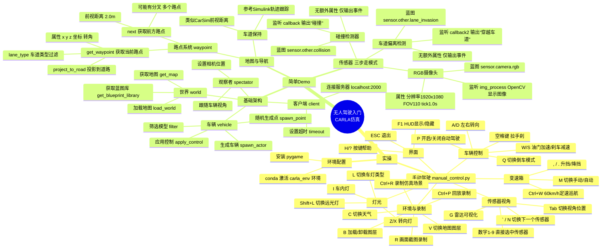

## 思维导图



---

## 实操


### 简单的案例
`D:\17871\CARLA_0.9.15\WindowsNoEditor\PythonAPI\examples` 这里有官方的例子

1. 打开 conda，激活我们之前创建的环境：`(base) C:\Windows\System32>conda activate carla_env (carla_env) C:\Windows\System32>`
2. 运行 `cd /d D:\17871\CARLA_0.9.15\WindowsNoEditor\PythonAPI\examples` 切换到所在的目录下
3. 之后安装 `pip install pygame` （旧版本的）
4. 然后运行 `python .\manual_control.py`  
	然后就打开人工操作的页面了（按键如下）

| 按键      | 功能说明                      |     |
| ------- | ------------------------- | --- |
| W       | 油门加速                      |     |
| S       | 刹车减速                      |     |
| A / D   | 左右转向                      |     |
| Q       | 切换倒车模式                    |     |
| 空格键     | 拉手刹                       |     |
| P       | 开启/关闭自动驾驶                 |     |
| M       | 切换手动/自动变速箱                |     |
| , / .   | 升挡 / 降挡                   |     |
| Ctrl+W  | 开启 60km/h 定速行驶            |     |
| L       | 切换车灯类型                    |     |
| Shift+L | 切换远光灯                     |     |
| Z / X   | 右转向灯 / 左转向灯               |     |
| I       | 开启/关闭车内灯                  |     |
| Tab     | 切换传感器视角位置                 |     |
| ` 或 N   | 切换下一个传感器                  |     |
| 数字 1-9  | 直接选中对应编号传感器               |     |
| G       | 开启/关闭雷达可视化                |     |
| C       | 切换天气（Shift+C 反向切换）        |     |
| 退格键     | 更换车辆                      |     |
| O       | 一键开关车辆所有车门                |     |
| T       | 开启/关闭车辆行驶数据面板             |     |
| V       | 切换下一个地图图层（Shift+V 反向）     |     |
| B       | 加载选中地图图层（Shift+B 卸载）      |     |
| R       | 开启/关闭画面截图录制               |     |
| Ctrl+R  | 录制仿真场景（覆盖旧录制文件）           |     |
| Ctrl+P  | 回放最近录制的仿真文件               |     |
| Ctrl++  | 回放起始时间 +1 秒（加 Shift+10 秒） |     |
| Ctrl+-  | 回放起始时间 -1 秒（加 Shift-10 秒） |     |
| F1      | 显示/隐藏界面 HUD               |     |
| H / ?   | 调出/收起按键帮助界面               |     |
| ESC     | 退出程序                      |     |

## 简单的 demo
### 官方教程
`https://carla.readthedocs.io/en/latest/tuto_first_steps/` 为入门的官方教程

- 世界
- 地图
- 驾驶员、车辆
- 传感器  
等等几个部分

```python
import random
import time

import carla

actor_list = []
try:
    client = carla.Client('localhost', 2000) # 连接服务器
    client.set_timeout(30.0) # 连接服务器,设置超时时间
    # Wait for simulator readiness and map load.
    max_attempts = 20
    for attempt in range(max_attempts):
        try:
            client.load_world('Town05') # 加载世界05（这里的地图加载一次就可以）
            world = client.get_world() # 获取当前世界
            if 'Town05' in world.get_map().name:
                break
        except RuntimeError:
            if attempt == max_attempts - 1:
                raise
            time.sleep(1.0)
    else:
        raise RuntimeError('Failed to load Town05 after retries')


    blueprint_library = world.get_blueprint_library() # 获取蓝图库
    v_bp = blueprint_library.filter('model3')[0] # 从蓝图库中筛选出特定的车辆模型,这里是特斯拉Model3

    spawn_point = random.choice(world.get_map().get_spawn_points()) # 从地图中随机选择一个生成点
    vehicle = world.spawn_actor(v_bp, spawn_point) # 在选定的生成点生成车辆
    actor_list.append(vehicle) # 将生成的车辆添加到actor_list中,以便后续管理
    # Move the spectator camera to follow the spawned vehicle.
    spectator = world.get_spectator()
    v_transform = vehicle.get_transform()
    camera_transform = carla.Transform(
        v_transform.location + carla.Location(z=30.0),
        carla.Rotation(pitch=-60.0, yaw=v_transform.rotation.yaw)
    )
    spectator.set_transform(camera_transform)
    vehicle.apply_control(carla.VehicleControl(throttle=1.0, steer=0.0)) # 对生成的车辆应用控制命令这里是设置油门为1,方向盘不转动
    time.sleep(10) # 让车辆保持行驶状态10秒钟
finally:
    for actor in actor_list:
        actor.destroy()
    print('结束')
```

### 传感器的使用
#### 高清行车记录仪

```python
# Find the blueprint of the sensor.
blueprint = world.get_blueprint_library().find('sensor.camera.rgb')
# Modify the attributes of the blueprint to set image resolution and field of view.
blueprint.set_attribute('image_size_x', '1920')
blueprint.set_attribute('image_size_y', '1080')
blueprint.set_attribute('fov', '110')
# Set the time in seconds between sensor captures
blueprint.set_attribute('sensor_tick', '1.0')
```

对其位置进行设置：

```python
my_vehicle = world.spawn_actor(vehicle_blueprint, spawn_point)
transform = carla.Transform(carla.Location(x=0.8, z=1.7))
sensor = world.spawn_actor(sensor_blueprint, transform, attach_to=vehicle) # 换到自己的车上，传感器的一个定位
actor_list.append(sensor)
```

数据监听：

```python
# 保存数据
sensor.listen(lambda data: img_process(data))
```

图像处理：

```python
def img_process(data):
	img = np.array(data.raw_data)
	img = img.reshape((1080,1920,4))
	cv2.imshow('', img)
	cv2,waitKey(1)
	pass
```

#### 碰撞检测器
同样，先建立一个检测器：

```python
blueprint_collision = world.get_blueprint_library().find('sensor.other.collision')
# 但是没有其余可以配置的属性（只有输出的属性）
```

位置：

```python
transform = carla.Transform(carla.Location(x=0.8, z=1.7))
sensor_collision = world.spawn_actor(sensor_blueprint_collision, transform, attach_to=vehicle) # 换到自己的车上，传感器的一个定位，名称也变化了
actor_list.append(sensor_collision)
```

监听

```python
sensor_collision.listen(callback)
```

对碰撞的处理：

```python
def callback(event):
	print("碰撞")（因为输出是一个事件）
```

#### 设置穿越车道
同样三步走：

```python
    '''3. 设置车道偏离检测：'''
    blueprint_lane = world.get_blueprint_library().find('sensor.other.lane_invasion') # 从蓝图库中找到车道偏离传感器的蓝图
    transform = carla.Transform(carla.Location(x=0.8, z=1.7))
    sensor_lane = world.spawn_actor(blueprint_lane, transform, attach_to=vehicle) # 在生成的车辆上安装一个车道偏离传感器，并设置其位置和旋转
    actor_list.append(sensor_lane)
    sensor_lane.listen(callback2) # 设置车道偏离检测的回调函数，当发生车道偏离事件时，调用callback2函数输出"穿越车道"
```

三步走：获取这个传感器的蓝图（调整输出的特性，事件类的不需要）——定位置——设置监听的函数：`def callback2(event): print("穿越车道") `

---

最终的代码为：

```python
import random
import time

import carla
import cv2 # 导入OpenCV库，用于图像处理和显示
import numpy as np

actor_list = []

def img_process(data): # 处理传感器数据的回调函数，这里是将传感器捕获到的图像数据转换为numpy数组，并显示出来
    img = np.array(data.raw_data)
    img = img.reshape((1080, 1920, 4))
    cv2.imshow('', img) # 使用OpenCV的imshow函数显示图像，第一个参数是窗口名称，这里设置为空字符串，第二个参数是要显示的图像数据
    cv2.waitKey(1) # 使用OpenCV的waitKey函数等待键盘事件，这里设置为1毫秒，表示每隔1毫秒检查一次键盘事件，以便能够及时更新显示的图像

def callback(event): # 碰撞检测的回调函数，这里是当发生碰撞事件时，输出"碰撞"（因为输出是一个事件）
    print("碰撞") # （因为输出是一个事件）

def callback2(event): # 碰撞检测的回调函数，这里是当发生碰撞事件时，输出"穿越车道"（因为输出是一个事件）
    print("穿越车道") 

try:
    client = carla.Client('localhost', 2000) # 连接服务器
    client.set_timeout(30.0) # 连接服务器,设置超时时间
    # Wait for simulator readiness and map load.
    max_attempts = 20
    for attempt in range(max_attempts):
        try:
            client.load_world('Town05') # 加载世界05（这里的地图加载一次就可以）
            world = client.get_world() # 获取当前世界
            if 'Town05' in world.get_map().name:
                break
        except RuntimeError:
            if attempt == max_attempts - 1:
                raise
            time.sleep(1.0)
    else:
        raise RuntimeError('Failed to load Town05 after retries')


    blueprint_library = world.get_blueprint_library() # 获取蓝图库
    v_bp = blueprint_library.filter('model3')[0] # 从蓝图库中筛选出特定的车辆模型,这里是特斯拉Model3

    spawn_point = random.choice(world.get_map().get_spawn_points()) # 从地图中随机选择一个生成点
    vehicle = world.spawn_actor(v_bp, spawn_point) # 在选定的生成点生成车辆
    actor_list.append(vehicle) # 将生成的车辆添加到actor_list中,以便后续管理

    '''1. 设置传感器：记录仪'''    
    blueprint = world.get_blueprint_library().find('sensor.camera.rgb') # 从蓝图库中找到RGB摄像头传感器的蓝图
    # Modify the attributes of the blueprint to set image resolution and field of view.
    blueprint.set_attribute('image_size_x', '1920')
    blueprint.set_attribute('image_size_y', '1080')
    blueprint.set_attribute('fov', '110')
    # Set the time in seconds between sensor captures
    blueprint.set_attribute('sensor_tick', '1.0') # 设置传感器捕获之间的时间间隔为1秒钟
    sensor_blueprint = blueprint # 将修改后的蓝图赋值给sensor_blueprint变量，以便后续使用
    transform = carla.Transform(carla.Location(x=0.8, z=1.7))
    sensor = world.spawn_actor(sensor_blueprint, transform, attach_to=vehicle) # 在生成的车辆上安装一个RGB摄像头传感器，并设置其位置和旋转
    actor_list.append(sensor)
    # 保存数据
    sensor.listen(lambda data: img_process(data))   

    '''2. 设置碰撞检测：'''
    blueprint_collision = world.get_blueprint_library().find('sensor.other.collision') # 从蓝图库中找到碰撞传感器的蓝图
    # 但是没有其余可以配置的属性（只有输出的属性）
    transform = carla.Transform(carla.Location(x=0.8, z=1.7))
    sensor_collision = world.spawn_actor(blueprint_collision, transform, attach_to=vehicle) # 换到自己的车上，传感器的一个定位，名称也变化了
    actor_list.append(sensor_collision)
    sensor_collision.listen(callback) # 设置碰撞检测的回调函数，当发生碰撞事件时，调用callback函数输出"碰撞"

    '''3. 设置车道偏离检测：'''
    blueprint_lane = world.get_blueprint_library().find('sensor.other.lane_invasion') # 从蓝图库中找到车道偏离传感器的蓝图
    transform = carla.Transform(carla.Location(x=0.8, z=1.7))
    sensor_lane = world.spawn_actor(blueprint_lane, transform, attach_to=vehicle) # 在生成的车辆上安装一个车道偏离传感器，并设置其位置和旋转
    actor_list.append(sensor_lane)
    sensor_lane.listen(callback2) # 设置车道偏离检测的回调函数，当发生车道偏离事件时，调用callback2函数输出"穿越车道"

    spectator = world.get_spectator() # 获取观察者（摄像机）对象
    v_transform = vehicle.get_transform() # 获取生成车辆的变换信息（位置和旋转）
    camera_transform = carla.Transform(
        v_transform.location + carla.Location(z=30.0),
        carla.Rotation(pitch=-60.0, yaw=v_transform.rotation.yaw)
    )
    spectator.set_transform(camera_transform)

    vehicle.apply_control(carla.VehicleControl(throttle=1.0, steer=0.0)) # 对生成的车辆应用控制命令这里是设置油门为1,方向盘不转动
    time.sleep(10) # 让车辆保持行驶状态10秒钟
finally:
    for actor in actor_list:
        actor.destroy()
    print('结束')


```

### 地图与导航
让自动按照导航行驶  
地图：`map = world.get_map() # 获取当前世界的地图对象`

```python
# Nearest waypoint in the center of a Driving or Sidewalk lane.
waypoint01 = map.get_waypoint(vehicle.get_location(),project_to_road=True, lane_type=(carla.LaneType.Driving | carla.LaneType.Sidewalk))

```

` print("waypoint01:", waypoint01) # 获取车辆所在位置的车道信息，project_to_road=True表示将车辆位置投影到道路上，lane_type参数指定要获取的车道类型，这里是驾驶车道和人行道` : 路点包含的属性有 x,y,z 和转角

```python
    while True:
        # 持续获取车辆所在的车道信息
        waypoint01 = map.get_waypoint(vehicle.get_location(),project_to_road=True, lane_type=(carla.LaneType.Driving | carla.LaneType.Sidewalk))
        print("waypoint01:", waypoint01) # 获取车辆所在位置的车道信息，project_to_road=True表示将车辆位置投影到道路上，lane_type参数指定要获取的车道类型，这里是驾驶车道和人行道
        waypoints = waypoint01.next(2.0) # 获取距离当前车道位置2米的下一个车道信息
        waypoint02 = waypoints[0] # 获取下一个车道信息
        print("waypoint02:", waypoint02) # 输出下一个车道信息
        print("waypoints:", waypoints) # 输出距离当前车道位置2米的下一个车道信息列表（可能有多个，因为可能有分叉的道路）
```

这里就相当于 carsim 中的前视距离（用于轨迹的跟踪，车道的保持）

然后就按照 simulink 中跟踪的写法做一下车道保持即可

## 参考
最适合作为你大作业参考的，不是单独一个文件，而是这几个按模块参考：

**首选主参考：** [automatic_control.py](<D:\17871\CARLA_0.9.15\WindowsNoEditor\PythonAPI\examples\automatic_control.py:1>)  
最适合参考“自动驾驶主循环 + Agent 路线跟踪 + pygame 显示 + 碰撞/车道传感器”。你后面要做环形路线一圈行驶，可以重点看它里面的：

- `BasicAgent`
- `BehaviorAgent`
- `World`
- `CameraManager`
- `CollisionSensor`
- `LaneInvasionSensor`
- 同步模式设置
- pygame 主循环

**交通流参考：** [generate_traffic.py](<D:\17871\CARLA_0.9.15\WindowsNoEditor\PythonAPI\examples\generate_traffic.py:1>)  
最适合参考“城市交通流生成”。你的新选题里有城市交通流，所以背景车辆、Traffic Manager、批量生成车辆这些都应该主要参考它。

重点看：

- `TrafficManager`
- `client.apply_batch_sync`
- 批量生成车辆
- 设置 autopilot
- 同步模式下交通流运行
- 车辆灯光 `VehicleLightState`

**pygame 和传感器显示参考：** [manual_control.py](<D:\17871\CARLA_0.9.15\WindowsNoEditor\PythonAPI\examples\manual_control.py:1>)  
这个文件最大，但很有用。不要整体照搬，重点抽取：

- `CameraManager`
- `HUD`
- `CollisionSensor`
- `LaneInvasionSensor`
- pygame 窗口刷新
- 键盘退出逻辑
- 车辆灯光控制，尤其是 `VehicleLightState.Brake`

你要做“紧急制动灯”，这个文件里最值得看。

**同步仿真参考：** [synchronous_mode.py](<D:\17871\CARLA_0.9.15\WindowsNoEditor\PythonAPI\examples\synchronous_mode.py:1>)  
适合参考“每一帧 world.tick + 传感器图像同步显示”。你的避障控制最好保持同步仿真，否则传感器、车辆控制、pygame 显示容易不同步。

**多传感器同步参考：** [sensor_synchronization.py](<D:\17871\CARLA_0.9.15\WindowsNoEditor\PythonAPI\examples\sensor_synchronization.py:1>)  
如果后续你要从虚拟传感器升级到真实 Radar/Lidar/Camera，可以参考它。现在阶段不是最优先。

我的建议优先级是：

1. [automatic_control.py](<D:\17871\CARLA_0.9.15\WindowsNoEditor\PythonAPI\examples\automatic_control.py:1>)：路线跟踪、自车控制、pygame 框架
2. [generate_traffic.py](<D:\17871\CARLA_0.9.15\WindowsNoEditor\PythonAPI\examples\generate_traffic.py:1>)：城市交通流
3. [manual_control.py](<D:\17871\CARLA_0.9.15\WindowsNoEditor\PythonAPI\examples\manual_control.py:1>)：HUD、摄像头、传感器、制动灯
4. [synchronous_mode.py](<D:\17871\CARLA_0.9.15\WindowsNoEditor\PythonAPI\examples\synchronous_mode.py:1>)：同步仿真结构
5. [sensor_synchronization.py](<D:\17871\CARLA_0.9.15\WindowsNoEditor\PythonAPI\examples\sensor_synchronization.py:1>)：后续真实传感器扩展

一句话：你的大作业主线应该参考 `automatic_control.py`，交通流参考 `generate_traffic.py`，pygame 和灯光参考 `manual_control.py`。不要直接把某个官方例子整体改成大作业，最好继续在 `guiji.py` 上按模块吸收这些案例。

### 文档
#### 入门部分
https://carla.readthedocs.io/en/docs-preview/tuto_first_steps/#animate-vehicles-with-traffic-manager  
（入门，建立一个简单的场景）

#### 蓝图库
https://carla.readthedocs.io/en/latest/bp_library/  
（很多车辆和传感器）

#### python API
https://carla.readthedocs.io/en/latest/python_api/  
python 调用的类、对象、函数等等

#### 对象控制
https://carla.readthedocs.io/en/docs-preview/core_actors/#vehicles  
（这里，实现对车辆和行人的控制）  
一些其余的部件（传感器，交通灯）也可以在这里设置

#### 交通流
https://carla.readthedocs.io/en/latest/adv_traffic_manager/  
（上述为交通流、自动驾驶）

实际上在 **carla topics** 这里就已经有很完整的流程了

## 分工
3 个人版本：

1. **场景与交通流负责人**
   - 负责地图、路线、起点、背景车辆、非机动车生成。
   - 主要改：
     - 路线构建 `LoopRoute`
     - `spawn_*`
     - 背景车、自行车参数
   - 不改避障决策和控制器。

2. **感知与风险判断负责人**
   - 负责虚拟传感器、TTC、距离、冲突窗口判断。
   - 主要改：
     - `VirtualGroundTruthSensor`
     - `FrontVehicleReading`
     - `RightSideObjectReading`
     - 右侧非机动车冲突判断逻辑
   - 不改车辆生成和 MPC 控制。

3. **决策与控制负责人**
   - 负责状态机、紧急避障、右转让行、MPC/轨迹跟踪。
   - 主要改：
     - `FOLLOW / AVOID / RIGHT_OBJECT_YIELD / ROUTE_HOLD`
     - `QuinticLaneChangeTrajectory`
     - `SamplingMPCTracker`
     - `speed_control`、转向控制
   - 不改地图路线和交通流生成。

4 个人版本可以再加一个：

4. **可视化、验证与文档负责人**
   - 负责 pygame 显示、日志、碰撞统计、运行问题记录、维护文档。
   - 主要改：
     - `PygameDemoDisplay`
     - `CollisionMonitor`
     - 日志输出
     - `PROGRAM_FRAMEWORK.md`
   - 负责每次合并前跑验证。

**最推荐的协作方式**

现在 `guiji.py` 还是一个大文件，短期可以继续用，但协作时建议先拆成几个文件，能大幅减少冲突：

```text
config.py              # 参数
route_planner.py       # LoopRoute
actors.py              # 车辆/自行车生成
sensors.py             # 虚拟感知和 reading
decision.py            # 状态机和风险决策
control.py             # MPC、轨迹、速度/转向控制
display.py             # pygame 和日志显示
guiji.py               # 只保留 main 主流程
```

拆完以后，大家基本就不会同时改同一个区域。

**协作规则建议**

- 每个人一个功能分支，例如：
  - `feature/traffic-flow`
  - `feature/right-object-risk`
  - `feature/mpc-control`
  - `feature/display-log`
- 每次只做一个小目标，不要一次改一大片。
- 改代码前先写任务契约，明确“不改哪些东西”。
- 合并前至少跑：

  ```powershell
  E:/Anaconda_envs/envs/carla_env/python.exe -m py_compile guiji.py
  E:/Anaconda_envs/envs/carla_env/python.exe guiji.py
  ```

- 谁改了主流程、状态机、路线、actor 生成，谁就必须更新 `PROGRAM_FRAMEWORK.md`。
- PR/提交描述按你之前定的格式写：目标、改动、原因、验证、风险、重点文件。

**最佳分工原则**

最稳的是：

```text
一个人负责“场景里有什么”
一个人负责“怎么看见危险”
一个人负责“怎么决策和控制”
一个人负责“怎么展示、验证、记录”
```

这样边界最清楚，互相干扰最小。当前阶段最应该先做的是把 `guiji.py` 拆模块（这个还没有拆），不然 3、4 个人长期一起改一个大文件，冲突会越来越多。

## 我的部分

- `control.py`
	- 五次多项式换道轨迹
	- `SamplingMPCTracker`
	- MPC 预测、代价函数、控制输出

- `guiji.py`
	- `FOLLOW`
	- `AVOID`
	- `EMERGENCY_BRAKE`
	- `RIGHT_OBJECT_YIELD`
	- `LANE_KEEP`
	- 状态切换条件和目标速度选择

- `config.py`
	- TTC 阈值
	- 安全距离
	- 换道长度
	- MPC 参数
	- 让行速度等控制参数

- `utils.py`
	- `speed_control`
	- 基础转向控制函数  
	仅在确实需要改通用控制器时修改。

尽量不要修改：

```text
actors.py       场景与交通参与者
route.py        固定路线
perception.py   感知与风险读取
display.py      pygame 显示
```

开发完成后推送你的分支：

```powershell
git push -u origin feature/decision-control
```

然后通过 PR 合并到 `main`。

### guiji.py
 
- **总体目的**: 加载地图、生成场景（自车 ego、前车 lead、背景车辆/自行车等）、启动感知与控制组件，在仿真循环中根据传感器信息决定车辆动作（加速、转向、换道或紧急刹车），并可视化与记录碰撞/路程完成情况。  
- **主流程**: 初始化 client/world → spawn 场景与背景 actor → 创建传感器 (MD)/MPC 控制器/显示 → 主循环 tick：更新前车与背景、读取感知（前方车辆、右侧物体）、计算触发条件、基于状态机决定控制量、apply_control、渲染与检查终止条件。  
- **关键模块职责**:  
  - **`actors`**: 负责生成场景中的车辆与自行车等实体；  
  - **`perception`**: `VirtualGroundTruthSensor` 提供前车、右侧物体的距离/ttc 等信息；  
  - **`control`**: 提供换道轨迹（`QuinticLaneChangeTrajectory`）和基于采样的 MPC 跟踪器（`SamplingMPCTracker`）；  
  - **`route`**: `LoopRoute` 用作路线追踪与转弯/路线完成检测；  
  - **`display`/`utils`**: 可视化与速度/转向辅助工具。  
- **状态机（state）**: 初始 `FOLLOW`，可能状态包括 `FOLLOW`, `AVOID`, `LANE_KEEP`, `EMERGENCY_BRAKE`, `RIGHT_OBJECT_YIELD`, `ROUTE_HOLD`。状态间转换由感知条件触发，例如：  
  - 前车过近且 TTC 很小 → 选择可换道则进入 `AVOID`，否则进入 `EMERGENCY_BRAKE`；  
  - 右侧物体有冲突风险 → 进入 `RIGHT_OBJECT_YIELD`（减速等待）；  
  - 换道轨迹完成 → 进入 `LANE_KEEP`；  
  - 路线完成后保持并最后进入 `ROUTE_HOLD`。  
- **结束条件**: 达到最大仿真时间、发生碰撞、或路线完成并等待指定时间后结束并清理资源。

需要我进一步做哪项？
- 把状态机的状态转换画成图（mermaid）；
- 在代码里加注释并标出关键行号（或生成带注释的片段）；
- 解释某个具体状态或判断条件的实现细节（例如 TTC、避让侧选择、MPC 使用）。

#### 问题
多个状态的兼容问题：特别是执行避障与右侧物体避让的兼容问题  
在 `guiji.py` 230 行左右的位置

三种状态下的避障动作（触发条件、退出条件、执行的动作）

- AVOID：会退出，退出到 LANE_KEEP
- EMERGENCY_BRAKE：不会自动退出，通常会一直停留

#### 整个的作用：
- 地图的加载
- 观察者视角的定位
- 判断临道是否满足换道的需求

#### 状态的切换
当前状态切换条件如下：

| 状态                 | 进入条件                                                     | 退出条件                                                     |
| -------------------- | ------------------------------------------------------------ | ------------------------------------------------------------ |
| `ROUTE_FOLLOW`       | 初始状态；`AVOID` 完成后回到该状态；`RIGHT_OBJECT_YIELD` 风险解除后也回到该状态。 | 若 $\mathrm{emergency\_needed}$ 且 $\mathrm{avoidance\_side}\ne\mathrm{None}$，进入 `AVOID`；若 $\mathrm{emergency\_needed}$ 且 $\mathrm{avoidance\_side}=\mathrm{None}$，进入 `EMERGENCY_BRAKE`；若 $\mathrm{right\_object\_risk}$ 且 $\neg\mathrm{right\_object\_yield\_done}$，进入 `RIGHT_OBJECT_YIELD`；若已完成路线并记录 `route_completion_time`，进入 `ROUTE_HOLD`。 |
| `AVOID`              | 当前状态为 `ROUTE_FOLLOW`，且 $\mathrm{emergency\_needed}$ 成立，并且相邻车道存在可用避障方向。进入时基于当前自车位姿重新生成 `QuinticLaneChangeTrajectory`。 | 若换道进度满足 $s_{\mathrm{traj}} > L_{\mathrm{lanechange}} + 8.0$ 且 $|d_{\mathrm{traj}} - D| < 0.65$，回到 `ROUTE_FOLLOW`；若 `route_completion_time` 已记录，进入 `ROUTE_HOLD`。 |
| `EMERGENCY_BRAKE`    | 当前状态为 `ROUTE_FOLLOW`，且 $\mathrm{emergency\_needed}$ 成立，但左右邻道均不可用。 | 若 $\mathrm{emergency\_recovered}$ 成立，回到 `ROUTE_FOLLOW`；若 $\mathrm{emergency\_needed}$ 仍成立但 $\mathrm{avoidance\_side}\ne\mathrm{None}$，重新生成避障轨迹并进入 `AVOID`；否则继续保持全制动。路线完成、碰撞、窗口关闭或仿真时间结束仍会提前终止主循环。 |
| `RIGHT_OBJECT_YIELD` | 当前状态为 `ROUTE_FOLLOW`，且 $\mathrm{right\_object\_risk}$ 成立，并且 `right_object_yield_done == False`。 | 若 $\neg\mathrm{right\_object\_risk}$，回到 `ROUTE_FOLLOW`，并设置 `right_object_yield_done = True`；若 `route_completion_time` 已记录，进入 `ROUTE_HOLD`。 |
| `ROUTE_HOLD`         | `loop_route.update(ego_vehicle)` 判断完成一圈后，主循环记录 `route_completion_time`；下一轮控制计算中进入 `ROUTE_HOLD`。 | 保持停车控制，直到 $t_{\mathrm{sim}} - t_{\mathrm{route\_completion}} \ge \mathrm{ROUTE\_COMPLETION\_HOLD\_SECONDS}$ 后跳出主循环并清理。 |

#### 一些问题
- 所以我知道了我们明明选择的是右向车道，实际上还是走的左侧的对向车道，因为触发避障的时候自车在一个大的右转弯上，规划的路线却是基于触发时候朝向的直角坐标系的，所以虽然相对于初始朝向是朝右的，但是相对于实际的道路，却偏左了  
	所以我们生成好的轨迹能不能在实际的道路轨迹上叠加，就不会出现这种问题了
- 还有就是现在的车辆会追尾

### control.py
#### 路径生成

基于五次多项式：

$$
y\left(x\right)=a_{0}+a_{1}x+a_{2}x^{2}+a_{3}x^{3}+a_{4}x^{4}+a_{5}x^{5}
$$

> 这里的 y 为横向的偏移量  
> x 为纵向的偏移量（沿着初始行驶方向的）  
> 

对于这个五次的多项式，可以根据路径的边界条件：

$$
\begin{cases}y(0)=\dot y(0)=\ddot y(0)=0\\y(x_{\epsilon})=y_{\epsilon}\\\dot{y}(x_{\epsilon})=\ddot{y}(x_{\epsilon})=0&\end{cases}
$$

> 1. 初始位置的横向偏移、偏移速度（纵向速度为常量时，对 x 求导可以看做对 t 求导，反正就是没有侧向速度分量）、加速度都是 0
> 2. 终点为 $(x_e,y_e)$
> 3. 终点处的横向速度和加速度为 0

由这些约束条件解得的五次方程（对 x 归一化）为：

$$
y(x)=y_e\left[10\left(\frac{x}{x_e}\right)^3-15\left(\frac{x}{x_e}\right)^4+6\left(\frac{x}{x_e}\right)^5\right]
$$

这个就是得到的轨迹方程

同样的，在时间初始化下：（横向偏移看做时间的函数）

$$
\begin{aligned}&y(0)=0,y(t_{e})=y_{e}\\&v_{y}(0)=v_{y}(t_{e})=0\\&a_y(0)=a_y(t_e)=0\end{aligned}
$$

得到的**五次多项式轨迹**）（归一化 t）为：

$$
\begin{gathered}y=\frac{y_{e}}{t_{e}^{5}}(6t^{5}-15t_{e}t^{4}+10t_{e}^{2}t^{3})\\v_{y}=\frac{30y_{e}}{{t_{e}}^{5}}(t^{4}-2t_{e}t^{3}+t_{e}^{2}t^{2})\\a_{y}=\frac{60y_{e}}{t_{e}^{5}}(2t^{3}-3t_{e}t^{2}+t_{e}^{2}t).\end{gathered}
$$

后面两个是针对 y 求导得到的

> $t_e$ 为转向时间（到终点的时间）

#### 路径限制
现在有了这条路径的方程式子，要对其进行限值

- 侧向加速度限值：
	
	$$
	a_{\mathrm{ymax}}=\frac{10\sqrt{3}y_{e}}{3t_{e}^{2}}
	$$
	
	将最大的加速度表示为终点和时间的函数，然后需要对这个值进行限值（最大的横向加速度）
	
- 道路边界限值

$$
y_{e}+\frac{W}{2}\leq y_{edge}
$$

> 终点横向位移（也就是最大的横向位移）加车道宽的一半小于车道边缘的 y 坐标

我们可以用这个式子选定合适的 y 向的偏置：

$$
\Delta y_{e}=\frac{y_{edge}}{n}-\frac{W}{2n}
$$


#### 最优路径的选择：
带权重因子的代价函数：

$$
J=w_{_1}C_{_s}[i]+w_{_2}C_{_c}[i]+w_{_3}C_{_c}[i]
$$

1. 安全性指标

$$
\begin{cases}R_{car}+R_{ob}+D_{safe}\leq\sqrt{\left[X_{fl}(t)-X_{obrl}(t)\right]^{2}+\left[Y_{fl}(t)-Y_{obrl}(t)\right]^{2}}\\R_{car}+R_{ob}+D_{safe}\leq\sqrt{\left[X_{fl}(t)-X_{obrr}(t)\right]^{2}+\left[Y_{fl}(t)-Y_{obrr}(t)\right]^{2}}\\R_{car}+R_{ob}+D_{safe}\leq\sqrt{\left[X_{fr}(t)-X_{obrl}(t)\right]^{2}+\left[Y_{fr}(t)-Y_{obrl}(t)\right]^{2}}\\R_{car}+R_{ob}+D_{safe}\leq\sqrt{\left[X_{fr}(t)-X_{obrr}(t)\right]^{2}+\left[Y_{fr}(t)-Y_{obrr}(t)\right]^{2}}&\end{cases}
$$

> 对：  
> 自车前角点 ↔ 障碍物前角点  
> 自车前角点 ↔ 障碍物后角点  
> 自车后角点 ↔ 障碍物前角点  
> 自车后角点 ↔ 障碍物后角点

对四个交点进行碰撞的判断：  


2. 效率指标：  
	$C_e[i]=\frac{y_e}{y_{e\max}}$
3. 舒适性指标：  
	$C_{c}[i]=\int K_{i}^{2}(s)ds=\int_{0}^{t_{e}}K_{i}^{2}(t)dt$

#### 分层决策逻辑
现在道路的生成的选择都有了，那么怎么决定是否要进行避障呢


- 先判断前方是否有车  
	有车：（判断有车的过程？）
	- 进行路径规划，利用规划好的路径（最优的）计算出车辆沿着该路径行驶的最短安全距离，然后利用这个距离计算出最短的安全时间  
		$TTC=\frac{S_{e}}{V_{rel}}=\frac{1}{V_{rel}}\left(\frac{x_{e}-L}{2}+\sqrt{\left(\frac{B}{2}\right)^{2}+\left(\frac{L}{2}\right)^{2}}\cos\left(\arctan\frac{B}{L}-\arctan\frac{15y_{e}}{8x_{e}}\right)\right)$  
		$FCR=TTC^{-1}=\frac{V_{rel}}{S_{e}}$  
		这个 FCR>0.5 时，到安全时距模型，判断转向还是刹车
		- 沿路径转向，不刹车，最短距离为：$D_{steer}=(v_f-v_r)t_{e_{min}}+D_{safe}$
		- 只刹车，不改变行驶的方向的最短距离为：$D_{brake}=\begin{pmatrix}v_f-v_r\end{pmatrix}T_{delay}+\frac{v_f^2-v_r^2}{2a_{y\max}}+D_{safe}$  
			比较两者谁短，用谁

> $v_f$ 为自车的速度  
> $v_r$ 为前车的速度

```text
1. 检测前方车辆

2. 计算 TTC 和 FCR

3. 判断 FCR 是否超过阈值

   如果 FCR ≤ 0.5：
       保持当前正常驾驶状态
       继续跟驰 / 巡航 / 车道保持

   如果 FCR > 0.5：
       进入紧急避障模式
       生成候选避障路径
       计算每条路径代价函数 J
       选择 J 最小的安全路径
       再判断 D_steer 和 D_brake
       决定转向避障或制动避障
```


#### MPC 轨迹跟踪
规划好路线之后就要进行轨迹跟踪

| 符号       | 含义    |
| -------- | ----- |
| (x,y)    | 车辆位置  |
| $\psi$   | 车辆航向角 |
| (v)      | 车辆速度  |
| (L)      | 轴距    |
| $\delta$ | 前轮转角  |
| $a$      | 加速度   |

利用自行车模型：（表格中后两个位控制的量）

$$
\dot{\mathbf{x}}=f\left(\mathbf{x},\mathbf{u}\right)=\begin{bmatrix}\dot{X}\\\dot{Y}\\\dot{\varphi}\\\dot{\beta}\\\dot{\nu}_{y}\\\dot{\omega}\\\dot{\delta}\\\dot{M}_{e}\end{bmatrix}=\begin{bmatrix}\nu_{X}\cos\varphi-\nu_{y}\sin\varphi\\\nu_{X}\sin\varphi+\nu_{y}\cos\varphi\\\omega\\\frac{1}{m\nu_{X}}(-m\nu_{X}\omega+F_{fy}+F_{ry})\\\frac{1}{m}(-m\nu_{X}\omega+F_{fy}+F_{ry})\\\frac{1}{I_{z}}(aF_{fy}-bF_{ry}+M_{e})\\\vdots\\\dot{M}_{e}\end{bmatrix}
$$

然后一步一步进行滚动预测状态（输入转角和加速度），与参考的进行对比（选择的轨迹）

还有轮胎模型：

$$
\begin{aligned}&F_{y}=-2D\mathrm{sin}(C\mathrm{arctan}(B\alpha))\quad B=\frac{a_{3}\mathrm{sin}(a_{4}\mathrm{arctan}(a_{5}F_{z}))}{CD}\\&C=1.3\quad D=a_{1}F_{z}^{2}+a_{2}F_{z}\end{aligned}
$$

$$
J=\sum_{i=0}^{N-1}\left[\left(X_{k+i}-X_{ref,k+i}\right)^TQ(X_{k+i}-X_{ref,k+i})+U_{k+i}^TRU_{k+i}+\Delta U_{k+i}^TR_d\Delta U_{k+i}\right]+(X_{k+N}-X_{ref,k+N})^TQ_f(X_{k+N}-X_{ref,k+N})
$$

要最小化这个误差项（贴近参考）  
同时还要有约束

---
求解约束下的损失函数最小化  
就能得到一组控制序列：

$$
U^*=\{U_k^*,U_{k+1}^*,\cdots,U_{k+N-1}^*\}
$$

但是只执行第一个：

$$
U_k^*=\begin{bmatrix}a_k^*\\\delta_k^*\end{bmatrix}
$$

然后在新的状态下进行新一轮计算

```text
检测前车风险
      ↓
FCR 超过阈值
      ↓
进入紧急避障
      ↓
选择转向避障
      ↓
生成五次多项式避障路径
      ↓
MPC 跟踪该路径
      ↓
输出 steer、throttle、brake
```

#### 实际参考路径：
##### 一、两种轨迹的坐标系区别
1. QuinticLaneChangeTrajectory — 基于换道起点车辆坐标系  
control.py:11-52

self.origin = start_transform.location # 起点全局坐标  
self.forward = start_transform.get_forward_vector() # 车辆前进方向  
self.right = start_transform.get_right_vector() # 车辆右向  
原点：换道起始时刻车辆的全局位置  
s 轴：车辆前进方向（forward），即纵向  
d 轴：车辆右侧方向（right），即横向  
这是一个局部 Frenet 坐标系，随车辆初始位姿确定后固定不变  
2. RouteOffsetLaneChangeTrajectory — 基于全局路径坐标系  
control.py:56-154

原点：全局路线上的点（loop_route.points[start_index]）  
s 轴：沿全局路径前进方向  
d 轴：全局路径各点处的右向（会随路径弯曲而变化！）  
这是基于全局路径的 Frenet 坐标系  
实际使用的是哪一个？  

从 guiji.py:293 可以看到，实际避障换道使用的是 RouteOffsetLaneChangeTrajectory（基于全局路径的版本），而不是 QuinticLaneChangeTrajectory。

##### 二、核心五次多项式：数学公式推导  
两者使用了完全相同的五次多项式，只是**应用的坐标系不**同。

定义  
设换道纵向总长度为 $L$（length），目标横向偏移为 $D$（lateral_offset），归一化纵向进度为：

$$\tau = \frac{s}{L}, \quad \tau \in [0, 1]$$

横向偏移函数 $d(s)$  
五次多项式的基本形式：

$$d(s) = D \cdot (10\tau^3 - 15\tau^4 + 6\tau^5)$$

即：

$$\boxed{d(s) = D \cdot \left[10\left(\frac{s}{L}\right)^3 - 15\left(\frac{s}{L}\right)^4 + 6\left(\frac{s}{L}\right)^5\right]}$$

代码对应 control.py:35-43：

- $tau = s / self.length$  
- $blend = 10.0 * tau**3 - 15.0 * tau**4 + 6.0 * tau**5$  
return self.lateral_offset * blend  
边界条件验证  
条件	$\tau=0$（起点）	$\tau=1$（终点）  
横向偏移 $d$	$D \cdot 0 = 0$ ✅	$D \cdot (10-15+6) = D$ ✅  
一阶导 $d'$	$D \cdot 0 / L = 0$ ✅	$D \cdot 0 / L = 0$ ✅  
二阶导 $d''$	$D \cdot 0 / L^2 = 0$ ✅	$D \cdot 0 / L^2 = 0$ ✅  
起点和终点的位移、速度（一阶导）、加速度（二阶导）均为零，保证轨迹光滑连接。

横向斜率函数（一阶导数）  
对 $d(s)$ 求导：

$$\frac{dd}{ds} = \frac{D}{L} \cdot (30\tau^2 - 60\tau^3 + 30\tau^4)$$

即：

$$\boxed{d'(s) = \frac{D}{L} \cdot \left[30\left(\frac{s}{L}\right)^2 - 60\left(\frac{s}{L}\right)^3 + 30\left(\frac{s}{L}\right)^4\right]}$$

代码对应 control.py:45-51：

$blend_dot = 30.0 * tau**2 - 60.0 * tau**3 + 30.0 * tau**4$  
return self.lateral_offset * blend_dot / self.length  
这个斜率用于计算**参考航向角**：

$$\theta_{ref} = \arctan\left(d'(s)\right)$$

代码对应 control.py:206：

ref_yaw = math.atan(trajectory.lateral_slope_at(s))  
二阶导数（横向加速度）  
对 $d'(s)$ 再求导：

$$d''(s) = \frac{D}{L^2} \cdot (60\tau - 180\tau^2 + 120\tau^3)$$

$$= \frac{60D}{L^2} \cdot \tau(1 - 3\tau + 2\tau^2) = \frac{60D}{L^2} \cdot \tau(1-\tau)(1-2\tau)$$

在 $\tau = 0.5$（中点）处二阶导为零，这是拐点。

##### 三、RouteOffsetLaneChangeTrajectory 的全局坐标计算  
这是实际使用的版本，其全局坐标计算分两步：

第 1 步：在全局路径上插值得到**路径点坐标**  
control.py:77-100

$$index = start_index + \frac{s}{step_distance}$$

$$\mathbf{P}{route}(s) = \text{lerp}(\mathbf{P}{lower}, \mathbf{P}_{upper}, blend)$$

$$\mathbf{R}{route}(s) = \text{lerp}(\mathbf{R}{lower}, \mathbf{R}_{upper}, blend)$$

其中 $blend = index - \lfloor index \rfloor$，**$\mathbf{P}$ 是全局位置，$\mathbf{R}$ 是路径右向单位向量。**

第 2 步：在路径点基础上叠加横向偏移  
control.py:124-132

$$\boxed{\mathbf{P}{traj}(s) = \mathbf{P}{route}(s) + d(s) \cdot \mathbf{R}_{route}(s)}$$

其中 $d(s)$ 就是上面五次多项式计算的横向偏移量。

展开为分量形式：

$$x_{traj}(s) = x_{route}(s) + d(s) \cdot R_x(s)$$  
$$y_{traj}(s) = y_{route}(s) + d(s) \cdot R_y(s)$$

##### 四、参考航向角计算  
control.py:134-139

通过轨迹上前后两点的位置差计算切线方向：

$$\boxed{\theta_{ref}(s) = \text{atan2}\left(y_{traj}(s+ds) - y_{traj}(s-ds),; x_{traj}(s+ds) - x_{traj}(s-ds)\right)}$$

其中 $ds = \max(0.5,; step_distance \times 0.25)$。

##### 五、轨迹函数图像直观理解

```text
                    全局路径 (route)
                    ════════════════════════→
                              ↑
                     𝐏_route(s) ●━━━━━━━━━━━━━→ 𝐑̂(s)（单位右向量）
                                \
                                 \  × d(s)（五次多项式偏移量）
                                  \
                                   ● 𝐏_traj(s)（换道轨迹点）
                    
                    换道轨迹上的点 = 路径点 + 右向量 × 偏移量

```

  五次多项式特点：
- s=0: d=0, d'=0, d''=0 （平滑起始）
- s=L/2: d=D/2, d' 最大, d''=0 （拐点，变化最快）
- s=L: d=D, d'=0, d''=0 （平滑终止）

$$
\boxed{\mathbf{P}{traj}(s) = \mathbf{P}{route}(s) + d(s) \cdot \mathbf{\hat{R}}(s)}
$$  
总结  

| 特性   | 当前实际使用                                                                    |
| ---- | ------------------------------------------------------------------------- |
| 坐标系  | 基于全局路径的 Frenet 坐标系（非车辆局部坐标）                                               |
| 纵向 s | 沿全局路径的弧长，从路径上 start_index 处开始计算                                           |
| 横向 d | 垂直于路径右向的偏移                                                                |
| 核心函数 | $d(s) = D \cdot cdot (10 \cdot tau^3 - 15 \cdot tau^4 + 6 \cdot tau^5)$   |
| 全局位置 | $\mathbf{P}(s) = \mathbf{P}_{\text{route}}(s) + d(s) \cdot \mathbf{R}(s)$ |
| 参考航向 | 轨迹切线的 atan2                                                               |

| 坐标系            | 表示方式                  | 原点        |
| -------------- | --------------------- | --------- |
| 全局坐标（世界坐标）     | $x, y, z$ 直角坐标        | 地图上的某个固定点 |
| 全局路径坐标（Frenet） | $s, d$ —— 纵向路程 + 横向偏移 | 路径起点      |

转换关系：

- to_local(location) → 笛卡尔 → Frenet：给定全局坐标，搜最近路径点，反算 $(s, d)$
- location_at(s) → Frenet → 笛卡尔：给定 $s$，算路径点 + 偏移，得到 $(x, y)$

### preception
观测是怎么做到的

现在这些判断都在 [perception.py](D:/17871/CARLA_0.9.15/WindowsNoEditor/PythonAPI/examples/dazuoye/perception.py) 里的 `VirtualGroundTruthSensor`，用的是 CARLA 真值位置，不是摄像头/雷达检测。

**1. 怎么判断前车**

函数是：

```python
front = sensor.front_vehicle()
```

核心逻辑是：

```python
relative = vehicle.get_location() - ego_loc
longitudinal = dot_2d(relative, forward)
lateral = dot_2d(relative, right)
```

含义：

```text
longitudinal > 0        说明目标在自车前方
abs(lateral) < 0.65 * lane_width
                        说明目标横向上还在本车道范围内
```

所以现在判断“前车”的条件是：

```text
目标在自车前方
目标横向偏移小于 0.65 倍车道宽
在所有满足条件的目标中，选纵向距离最近的
```

距离用的是纵向距离：

```python
distance = longitudinal
```

也就是目标沿自车车头方向的投影距离，不是两车欧氏距离。

**2. TTC 怎么算**

前车 TTC：

```python
ego_speed_along = dot_2d(ego_velocity, forward)
target_speed_along = dot_2d(target_velocity, forward)
closing_speed = ego_speed_along - target_speed_along
```

如果自车比前车更快：

```python
ttc = longitudinal / closing_speed
```

如果接近速度很小：

```python
ttc = inf
```

也就是：

```text
TTC = 前向距离 / 接近速度
```

**3. 怎么判断左右车道能不能变道**

函数是：

```python
sensor.lane_clear("left")
sensor.lane_clear("right")
```

逻辑是：

1. 先取自车当前 waypoint：

```python
ego_wp = carla_map.get_waypoint(
    ego_location,
    project_to_road=True,
    lane_type=carla.LaneType.Driving
)
```

2. 根据方向找左/右邻道：

```python
target_wp = ego_wp.get_left_lane()
target_wp = ego_wp.get_right_lane()
```

3. 判断这个邻道是不是可行驶、同方向：

```python
same_direction_lane(ego_wp, target_wp)
```

里面主要看：

```text
target_wp 不是 None
target_wp.lane_type 是 Driving
两条车道航向角差小于 30 度
```

4. 遍历世界里所有 `vehicle.*`：

```python
for actor in world.get_actors().filter("vehicle.*"):
```

5. 判断这些车是不是在目标邻道：

```python
actor_wp.road_id == target_wp.road_id
actor_wp.lane_id == target_wp.lane_id
```

6. 如果目标邻道前后安全范围内有车，就不能变道：

```python
relative = actor.get_location() - ego_loc
longitudinal = dot_2d(relative, forward)

if -LANE_CLEAR_REAR <= longitudinal <= LANE_CLEAR_FRONT:
    return False
```

现在参数是：

```text
LANE_CLEAR_REAR = 18 m
LANE_CLEAR_FRONT = 45 m
```

所以判断逻辑是：

```text
目标邻道存在
目标邻道同方向
目标邻道前方 45m、后方 18m 内没有车辆
=> 可以变道
```

**4. 怎么判断右侧行人/非机动车**

函数是：

```python
right_object = sensor.right_side_object(loop_route.last_index)
```

它会遍历：

```python
right_object_scenarios
```

里面包括：

```text
关键右侧自行车
背景自行车
右侧行人
```

每个目标计算：

```python
relative = actor_loc - ego_loc
longitudinal = dot_2d(relative, forward)
lateral = dot_2d(relative, right)
distance = vector_length(relative)
```

这里 `distance` 是欧氏距离，不是前向投影距离。

右侧目标是否算冲突对象，需要满足：

```text
scenario.is_active
scenario.is_conflict_window(route_index)
-8 <= longitudinal <= 34
-14 <= lateral <= 18
```

也就是说：

```text
目标已经启动
当前自车路线索引处于这个目标的冲突窗口
目标在自车前后/左右的几何门限内
```

右侧目标 TTC 用的是欧氏距离方向上的接近速度：

```python
to_object = relative / distance
relative_speed = ego_velocity - object_velocity
closing_speed = dot_2d(relative_speed, to_object)

ttc = distance / closing_speed
```

**5. 现在的不足**

现在变道安全判断只看“目标邻道有没有车”，不看：

```text
是否在弯道
是否靠近路缘
是否会撞静态物
是否已经偏离路线
目标轨迹是不是直线换道不合适
```

所以它可能判断“右/左邻道没车，可以变道”，但实际上弯道或路边有杆子，五次直线换道轨迹会把车带过去。这就是我们刚才撞 `static.pole` 的根本风险之一。

### 不足：

- 换道轨迹：因为现在候选维度比较少，也没有完整的 Frenet s-d-t 采样、动态障碍物碰撞预测和曲率/jerk 约束。


- MPC 跟踪时的速度问题没有解决
- 还有就是速度和转角的协调问题

- 不做完整时空 Lattice Planner（时空碰撞检测这一部分很快可以开始做了）。  
- 不做车辆四角 bounding box 投影，第一版仍用车辆中心点投影。  
- 不重写 MPC。  
- 不改变右侧非机动车 RIGHT_OBJECT_YIELD 的主体逻辑。  
- 不引入真实雷达/相机识别，只基于当前虚拟感知/真值感知接口。

- 在 frenet 上叠加长度简单（一个一个点叠加法向量就可以）  
	路径生成
- 全局坐标转为 frenet 坐标比较难（或者说知道某点的位置转为 frenet）  
	判断冲突
- frenet 坐标转全局的坐标也是简单的  
	指导行驶
	
	$$
	x=x_{\mathrm{ref}}(s)-d(s)\sin\theta(s)y=y_{\mathrm{ref}}(s)+d(s)\cos\theta(s)
	$$

```text
错误做法：
找最近 waypoint → 直接当作投影点

较好做法：
找最近线段 → 在线段上做正交投影

更好做法：
waypoint 拟合成光滑曲线 C(s) → 求曲线上距离最小的 s*
```

到达检测的状态（哪些可能发生碰撞），达到避障的状态（多久发生碰撞）

```text
对每条候选轨迹采样
  对前车位置/包围盒投影到同一参考线
  得到前车 s 范围和 d 范围
  如果候选轨迹在同一 s 区间内 d 也重叠
      reject
```

轨迹选择

- 切换状态
- 联合多个轨迹感知（现在这个轨迹区分的太多了，反正轨迹就是跟踪轨迹或者避障加跟踪轨迹）
- 轨迹的碰撞检测（检测不能碰撞）
- 生成轨迹的依据（全一点，不要根据车道上有无车了）

首先不要区分什么固定路线和临时路线了

再者选路径的时候要看是否冲突（对于所有的车，不仅是被选中的车）

还有就是避障过程中触发再次规划的条件和跟踪过程没有区别，不要加额外的什么限制和区别了（触发避障——路径改变——原来的车不再符合避障的条件；之后再看同车道（在路劲坐标中）最近的车（无论哪辆）再次符合触发条件就触发，重新规划）

对，还有 MPC 跟踪的区域是哪些

## 1. 避障过程中突然出现新的车在避障轨迹上

这种情况仍然可能发生，所以必须在 `ROUTE_FOLLOW` 下持续检测。

你的新逻辑应该是：

```text
车辆始终处于 ROUTE_FOLLOW
        ↓
跟踪当前合成路线
        ↓
每一帧都重新检测当前路线前方车辆
        ↓
如果当前路线前方又出现风险
        ↓
再次规划，替换后续路线段
        ↓
如果无安全候选路径且 TTC 很小
        ↓
EMERGENCY_BRAKE
```

也就是说，避障不是规划一次就结束，而是**边走边检查**。

所以如果避障过程中有新车进入避障轨迹，只要感知和 TTC 是基于当前合成路线，就会再次触发规划。

这时可能出现三种结果：

```text
有新的安全候选路径 → 再次局部替换路线
没有安全路径，但还有距离 → 下一帧继续尝试 / 减速
没有安全路径，且 TTC 很小 → EMERGENCY_BRAKE
```

所以不会因为“正在避障”就忽略新车，这是你把 `AVOID` 合并进 `ROUTE_FOLLOW` 的最大好处。

---

## 2. 避障刚结束，切回原始路线时撞上原始路线上的车

你现在的设计可以避免“突然切回”这个问题，但前提是：

> 候选路径冲突检测不能只检查避障偏移段，而要检查“避障段 + 回归原路线后的衔接段”。

也就是说，候选路线不是只看：

```text
避障偏移段
```

而应该看：

```text
避障偏移段 + 回归段 + 回归后前方一段原始路线
```

否则会出现你说的问题：

```text
绕过前车
    ↓
回到原路线
    ↓
原路线刚好有另一辆慢车
    ↓
刚回去又触发危险，甚至来不及避让
```

所以规划时建议检测范围至少包括：

[
s_{\text{check,end}}
====================

s_{\text{replace,end}} + S_{\text{lookahead}}  
]

比如：

```text
替换段结束点之后，再额外检查 20~50 m
```

如果回归原路线后马上有车，而且 TTC / 距离不安全，这条候选路径就不应该被选中。

---

因此你的候选路径检测对象应该是：

```text
完整候选当前路线 =
当前路线前段
+ 新规划替换段
+ 替换段后的原始路线
```

而不是：

```text
新规划出来的那一小段避障轨迹
```

这是最关键的区别。

---

## 现在还没有完全覆盖的场景

你的方案已经覆盖了普通的“前车避障、避障过程中再次触发、避障后回归原路线”的主流程，但下面这些场景还需要注意。

### 1. 移动车辆的时空冲突还不够完整

如果你只是用当前时刻的 (s,d) 判断候选路径是否碰撞，仍然可能误判。

例如旁边车现在不在避障轨迹上，但 2 秒后刚好进入你的避障路径。

更合理的是检测：

[  
s_{\text{ego}}(t), d_{\text{ego}}(t)  
]

和：

[  
s_{\text{obj}}(t), d_{\text{obj}}(t)  
]

也就是简化版时空检测。

你可以先不用完整 ST 图，但至少要做：

```text
预测未来 3~5 s
每 0.2 s 采样一次
检查自车候选轨迹和所有车辆预测位置是否重叠
```

否则动态车道切入、旁车加速、慢车变道这些情况仍然可能漏掉。

---

### 2. 避障段之间的重叠与覆盖

如果第一次避障已经插入一段 replacement segment，第二次避障又在它前方或内部触发，就可能出现：

```text
旧替换段：s = 30~70
新替换段：s = 50~100
```

这时候不能简单追加，否则同一个 (s) 区间有两套路线。

需要规则：

```text
新规划段优先级更高
重叠旧段被裁剪或删除
当前车身后方的替换段可以清理
```

否则当前路线会变得不连续。

---

### 3. 回归原路线的曲率/横向加速度约束

即使候选路径不碰撞，也可能因为横向偏移太急导致车辆跟不上。

所以候选路径还要检查：

[  
|\kappa| < \kappa_{\max}  
]

[  
a_y = v^2 \kappa < a_{y,\max}  
]

如果不检查，可能出现：

```text
路径理论上安全
但车辆实际跟踪时转不过去
导致偏离轨迹或碰撞
```

---

### 4. 当前路线和原路线的 Frenet 坐标跳变

你现在说“前车感知始终投影到当前路线”，这是对的。

但如果当前路线经过局部替换后弯曲较大，某些车辆在原路线附近，可能会因为参考线变了导致：

```text
同一辆车的 d 值突然变大
```

于是它“不再是同路径车”。

这本来是合理的，因为你绕开它了。

但需要注意：如果替换段结束处路线衔接不够平滑，投影可能跳变，导致前车识别不稳定。

所以合成路线必须保持：

```text
位置连续
航向连续
最好曲率也尽量连续
```

也就是至少 (C^1)，最好接近 (C^2)。

---

### 5. 目标车突然减速或停车

如果前车本来在移动，你规划时认为能绕过去，但它突然急刹，未来占据区域会变大。

第一版可以靠持续重规划补救，但仍要保留：

```text
风险极近 → EMERGENCY_BRAKE
```

不能只靠继续规划。

---

### 6. 多车同时形成封堵

比如左偏、右偏、保持路径都被不同车辆占用。

这时候候选路径都不可用，应该明确进入：

```text
EMERGENCY_BRAKE
```

或者先减速等待。

你的契约里已经有这个兜底，但实现时要注意不是“规划失败就直接刹车”，而是最好区分：

```text
距离还远 → 保持/减速并下一帧重试
距离很近 → emergency_brake
```

---

### 7. 被绕开的车辆再次进入当前路线

你说“原来的车不再符合避障条件”是对的，但如果它也变道、横移，重新进入你当前合成路线，那它应该再次被检测到。

所以感知不能排除“已处理障碍物 ID”。

不要写成：

```python
if vehicle.id == avoided_vehicle_id:
    ignore
```

而应该每一帧重新按当前路线投影判断。

---

### 8. 避障结束点太短

如果替换段长度只刚好绕过当前障碍物，回归原路线时可能太急，也可能来不及处理后车/前车。

建议替换段包括三部分：

```text
横向偏移进入段
稳定绕行段
回归原路线段
```

而不是只生成“偏出去”那一段。

候选路径检测也要覆盖：

```text
进入段 + 绕行段 + 回归段 + 回归后安全检查段
```

---

## 最关键的实现原则

你现在这个方案要想避免你担心的两个问题，核心是这句话：

> 每次规划和每次风险检测，都必须基于“车辆接下来真正要走的完整当前路线”，而不是只基于原始路线，也不是只基于避障段。

也就是：

```text
当前合成路线 = 原始基础路线 + 当前有效替换段
```

然后所有判断都用它：

```text
前车检测 → 当前合成路线
TTC 计算 → 当前合成路线
候选路径冲突检测 → 候选合成路线
轨迹跟踪 → 当前合成路线
再次触发避障 → 当前合成路线
```

---

所以结论是：

> 这样改完后，可以解决“避障时新车出现在避障轨迹上”和“刚回原路线就撞车”的大部分问题，但前提是候选检测覆盖完整路线和回归后前方一段，并且 `ROUTE_FOLLOW` 下持续重规划。  
> 目前还需要特别补充的是：动态障碍物预测、替换段重叠处理、回归段安全检查、路径曲率约束，以及 `EMERGENCY_BRAKE` 的合理进入/退出条件。

## 目前
### 状态
brake_needed：距离和 TTC 同时（这个是减速的，不是紧急制动状态）  
emergency_recovered：  
planning_needed：判断是否需要规划新的路线  
front_emergency_brake_needed(front)：这个是紧急制动状态的，比 planning 的要求严苛

现在判断避障危险和

极限转向距离：

$$
D_{steer}=\begin{pmatrix}v_{f}-v_{r}\end{pmatrix}t_{e\min}+D_{\mathrm{safe}}
$$

碰撞检测还是简化矩形包络，不是车辆四角多边形精确检测。

## MPC 优化

| 项目   | 你现在的做法             | 完整时空 Lattice Planner    |
| ---- | ------------------ | ----------------------- |
| 横向规划 | 多个 `target_offset` | 多个横向目标、回归目标、避让目标        |
| 纵向规划 | 基本按当前速度/目标速度估计     | 同时生成减速、停车、加速、跟车等纵向轨迹    |
| 碰撞检测 | 对候选轨迹采样检查          | 对 (s(t), d(t)) 时空轨迹完整检查 |
| 决策能力 | 主要解决转向避障           | 可以同时选择“刹车、绕行、等待、加速通过”   |
| 复杂度  | 较低                 | 更高                      |  

上面为轨迹规划的进一步

$$
{i_d^∗=\frac{ψ_f}{2\mathrm{Δ}L}−\sqrt{{{\left ({\frac{ψ_f}{2\mathrm{Δ}L}}\right )}^2}+{i_q^{∗2}}}}
$$

## 路线函数
- `select_best_route_offset_trajectory()`  
	这是“普通避障规划入口”。`guiji.py` 发现前方有风险时调用它。它负责准备一次规划需要的上下文：当前路线位置、起始横向偏移、候选长度集合、候选目标偏移集合、`transition_ratio` 集合、障碍车投影缓存，然后组织粗筛/加密/兜底搜索，最后从有效候选里选一个最优轨迹返回。

- `_append_scored_candidates()`  
	这是“批量枚举器”。它不自己判断哪条最好，只是把一组 `length_values × target_values × transition_values` 展开成很多候选组合，并逐条调用真正的单条候选评估函数。它还用 `seen` 去重，避免粗筛、加密、兜底阶段重复评估同一个 `(length, target_offset, transition_ratio)`。

- `_build_and_evaluate_route_offset_candidate()`  
	这是“单条候选生成 + 硬约束 + 代价计算”的核心。给它一个确定的 `length / target_offset / transition_ratio`，它会：
	1. 算横向加速度，超限就拒绝；
	2. 对很慢前车做便宜预筛；
	3. 构造 `RouteOffsetLaneChangeTrajectory`；
	4. 对所有车辆做采样碰撞硬筛；
	5. 计算安全、舒适、跟踪、偏移代价；
	6. 返回一个 `AvoidancePathCandidate`，里面包含是否有效、拒绝原因、总代价和轨迹对象。

所以你可以理解成：

```text
select_best_route_offset_trajectory()
    一次避障规划的总入口：准备上下文 + 分阶段搜索 + 选最优

_append_scored_candidates()
    批量把参数组合展开，多次调用单条评估

_build_and_evaluate_route_offset_candidate()
    真正生成并评估一条候选轨迹
```

“最后一个”不是再筛选一次，而是每一条候选自己的完整评估流程。真正的“再筛选”在 `select_best_route_offset_trajectory()` 里，就是：

```python
valid_candidates = [candidate for candidate in candidates if candidate.is_valid]
return _select_preferred_avoidance_candidate(valid_candidates)
```

偏移对象  
道路对象有了  
然后这个道路对象怎么到轨迹呢（怎么实现的）

## 道路对象
1. 生成 replacement 段：  
   使用基础路线坐标 s_base / d_base

2. 写入 replacement segment：  
   使用基础路线区间 [start_s, end_s]

3. 感知前车：  
   使用当前合成路线 _tracking_route 的 s_track / d_track

4. MPC 跟踪：  
   使用当前合成路线 _tracking_route 的 s_track / d_track

5. 回归段生成：  
   起点用车辆投影到基础路线的真实 s_base / d_base

```text
在 replacement 段内：
    用规划出来的避障轨迹点

在 replacement 段之后、回归段写入之前：
    用 C_base(s) + current_offset * n_base(s)

其中 current_offset = 上一个 replacement segment 的 end_offset
```

current offset：最后一个 replacement 时的偏移量，这也是  
从最后一个 replacement 的 end_s 到基础路线终点 max_s 都用 current_offset 偏移

### **1. `loop_route` 怎么来的**
它是基于 LoopRoute 对象的：

```python
class LoopRoute:
    def __init__(self, start_waypoint):
        self.waypoints = []
        self.points = []
        self.step_distance = TOWN10_ROUTE_STEP
        self.last_index = 0
        self.length = 0.0

        # 从 start_waypoint 开始，不断 waypoint.next(step)
        # 生成固定短环路
        self._build_route(start_waypoint)

        # 分析右转、路线完成、右侧车道准备等
        self._analyze_turn_events()
```

carla 的原生路点为：`carla.Waypoint`

```text
transform.location    路点位置
transform.rotation    路点方向
road_id               道路编号
lane_id               车道编号
lane_width            车道宽度
next(distance)         沿车道向前取下一个路点
get_left_lane()        获取左侧车道
get_right_lane()       获取右侧车道
```

---

`loop_route` 是 `route.py` 生成的 Town10 一圈固定路线对象，属于最原始的数据源。  
定义为 `loop_route = LoopRoute(ego_start_wp)`  
这个对象可以看做：`LoopRoute = [Waypoint0, Waypoint1, Waypoint2, ..., Waypoint130]` 也就是使用 CARLA waypoint 生成一条固定的路线

```python
loop_route.last_index       # 当前车辆在路线上的最近/当前索引
loop_route.step_distance    # 路线点之间的采样间距
loop_route.waypoints(i)        # CARLA waypoint 列表
loop_route.points(i)           # waypoint 对应的 Location 坐标列表
```

可以理解成：

```text
loop_route = 原始一圈路线管理器
```

它不是避障后的路线，也不是临时轨迹。它表示最开始那条固定一圈路线。

公式上它提供：

```text
C_base(s)
```

也就是基础路线中心线。

---

### **2. `_base_tracking_route` 怎么来的**

在 `perception.py` 初始化时，会把 `loop_route` 包装成一个可投影、可查询的 `TrackingRoute`：  
因为 `loop_route` 是一个一个的道路点，离散点，设路线的步长为 $\Delta s$，则 第 i 个点对应的路线弧长近似写成：$s_i=i\Delta s$  
平滑就是构造一个连续的函数：（使用三次样条曲线，实际上是三维的）（不用样条的话，就两点差分）

$$
C(s)=\begin{bmatrix}x(s)\\y(s)\end{bmatrix}
$$

使得这个函数大致经过这些离散的点：

$$
C(s_i)\approx P_i
$$

这个曲线函数就是平滑后的路，可以通过 s 得到 s 位置时的坐标 $C(s)$：

```python
route_reference.location_at_route_s(s)
```

为了计算偏移，我们需要这个点的切向量：

$$
T(s)=\frac{C^{\prime}(s)}{\|C^{\prime}(s)\|}=\frac{(x^{\prime}(s),y^{\prime}(s))}{\sqrt{x^{\prime}(s)^2+y^{\prime}(s)^2}}
$$

所以路线的航向角为：

$$
\psi_\mathrm{route}(s)=\mathrm{atan}2(y^{\prime}(s),x^{\prime}(s))
$$

右向量就是切向量顺时针旋转 90°：（下面的就是右向量）

$$
R(s)=\begin{bmatrix}-T_y(s)\\T_x(s)\end{bmatrix}
$$

```python
right = self.route_reference.right_at_route_s(route_s)
```

---

然后需要知道车辆点在这条曲线上的（s,d）位置  
首先是 s：（距离最近的点，先粗搜索，之后再细搜索）

$$
s^*\approx\arg\min_s\|P-C(s)\|
$$

之后是横向偏移 d：

$$
d=(P-C(s^*))\cdot R(s^*)
$$

这样就得到了基础的路线和相对的坐标

```python
self._base_tracking_route = TrackingRoute.from_loop_route(loop_route)
```

所以：

```text
_base_tracking_route = 用 loop_route.points 构造出来的基础跟踪路线
```

它和 `loop_route` 代表的是同一条基础路线，只是接口更适合感知/MPC：

```python
location_at(s)
reference_yaw_at(s)
to_local(location)
```

可以理解成：

```text
loop_route 是路线管理器
_base_tracking_route 是基础路线的几何查询对象
```

```python
projection = self.reference.project(
    location,
    self.center_s,
    search_back=self.ego_search_back,
    search_ahead=self.ego_search_ahead,
)
return projection["route_s"], projection["lateral"]
```

---

### **3. `RouteOffsetLaneChangeTrajectory` 怎么来的**

规划器在 `control.py` 里生成候选轨迹：

```python
RouteOffsetLaneChangeTrajectory(...)
```

它不是完整路线，而是一段局部 replacement。

它的形式是：

```text
T(s) = C_base(s_start + s) + d_avoid(s) * n_base(s_start + s)
基于 loop_route 的平滑参考线，从 start_route_s 开始，生成一段局部横向偏移轨迹
```

也就是：

```text
基础路线 + 五次多项式横向偏移
```

普通避障：

```text
current_offset -> target_offset -> 保持 target_offset
```

回归：

```text
current_offset -> 0
```

内部轨迹点计算的数学公式为

$$
Q(s)=C(s_0+s)+R(s_0+s)d(s)
$$

用全局弧长的话就是

d(s) 的公式为：

$$
d(s)=\begin{cases}d_0,&s\leq0\\c_0+c_1\tau+c_2\tau^2+c_3\tau^3+c_4\tau^4+c_5\tau^5,&0<s<L_t\\d_1,&s\geq L_t&\end{cases}
$$

其中：$\tau=\frac{s}{L_t}$

边界条件为：

$$
\left\{\begin{array}{ccc}d(0)=d_0,&d^{\prime}(0)=k_0,&d^{\prime\prime}(0)=0\\d(L_t)=d_e,&d^{\prime}(L_t)=0,&d^{\prime\prime}(L_t)=0\end{array}\right.
$$

```python
route_location, route_right = self._route_pose_at(s)
lateral = self.avoidance_delta_at(s)

return route_location + carla.Location(
    x=route_right.x * lateral,
    y=route_right.y * lateral,
    z=0.0,
)
```

---

### **4. `_replacement_segments` 怎么来的**

当 `guiji.py` 选中了某条候选后：

```python
apply_route_replacement(sensor, best_candidate)
```

里面会调用：

```python
trajectory.replacement_points(...)
```

把 `RouteOffsetLaneChangeTrajectory` 采样成一串世界坐标点，然后写入：

```python
sensor.apply_replacement_segment(
    start_s,
    end_s,
    points,
    end_offset
)
```

于是得到：

```text
ReplacementSegment(start_s, end_s, points, end_offset)
```

这些 segment 存在：

```python
sensor._replacement_segments
```

每一个替换段都记录：

```python
start_s
end_s
points
end_offset
```

---

### **5. `_tracking_route` 怎么来的**

每次写入 replacement 后，`perception.py` 会重新合成：

```python
self._tracking_route = TrackingRoute.from_base_with_replacements(
    self._base_tracking_route,
    self._replacement_segments
)
```

所以：

```python
current_offset = segment.end_offset # 也就是替换段最后的偏移
_append_points(points, segment.points)
cursor = end_s
current_offset = segment.end_offset

_append_base_samples(points, base_route, cursor, max_s, step, current_offset)
```

从段的结尾到整条路线末尾都会使用这个偏移去采样

```text
_tracking_route = _base_tracking_route + replacement_segments + current_offset
```

这是当前车辆真正跟踪、感知前车也使用的路线。  
新的 `_tracking_route.reference 是基于合成后的 points 重新平滑出来的参考线`

$$
C_t(S)=\begin{cases}C_b(S),&S<s_0\\Q(S),&s_0\leq S\leq s_1\\C_b(S)+R_b(S)d_1,&S>s_1&\end{cases}
$$

$$
Q(S)=C_b(S)+R_b(S)d(S-s_0)
$$

关于这条新的路线同样会进行（s,d）的取值，计算方法一样，但是相对路线不一样（前车感知使用的也是这条路线）

$$
(s_t,d_t)
$$

```text
loop_route:
    原始一圈路线管理器，提供基础路线索引和普通跟踪

_base_tracking_route:
    由 loop_route 包装出来的基础几何路线

RouteOffsetLaneChangeTrajectory:
    基于基础路线生成的一段候选偏移轨迹

_replacement_segments:
    已采用的局部替换段，区间坐标必须是基础路线 s

_tracking_route:
    base route + replacement segments 合成后的当前真实跟踪路线

MPC:
    跟踪 _tracking_route

之前转角突变:
    回归段写入后 _tracking_route 在车辆附近不连续，根因是回归段起点 s/d 没有用真实 base projection
```

## MPC 的主要思想
### 状态空间：

$$
\mathbf{x}=\begin{bmatrix}X\\Y\\\psi\\v_x\\v_y\\r\\\delta\\s_p\end{bmatrix}
$$

```text
X, Y：车辆质心在世界坐标系下的位置
ψ：车辆航向角 yaw
vx：车体坐标系纵向速度
vy：车体坐标系横向速度
r：横摆角速度 yaw_rate
δ：实际前轮转角
sp：车辆沿参考轨迹的进度 progress
```

首先需要将在世界坐标下的速度转换到车体坐标下的速度：

$$
v_{x}=v_{x}^{w}\cos\psi+v_{y}^{w}\sin\psi \quad v_{y}=-v_{x}^{w}\sin\psi+v_{y}^{w}\cos\psi
$$

横摆角速度为 carla 中的加速度转换为 rad/s

$$
r=\mathrm{radians}(\omega_z)
$$

控制的变量为：$\delta_{\mathrm{cmd},k},a_k$

转向器执行模型为：

$$
\dot{\delta}=\mathrm{sat}\left(\frac{\delta_\mathrm{cmd}-\delta}{\tau_\delta},-\dot{\delta}_\mathrm{max},\dot{\delta}_\mathrm{max}\right)
$$

考虑了方向盘不是瞬间打到目标角的物理过程

### 动力学模型
#### 受力分析
前后轮的侧偏角：

$$
\begin{gathered}\alpha_{f}=\delta-\tan^{-1}\left(\frac{v_{y}+l_{f}r}{v_{x}}\right)\\\alpha_{r}=-\tan^{-1}\left(\frac{v_{y}-l_{r}r}{v_{x}}\right)\end{gathered}
$$

基于此侧偏角得到的受力（使用线性轮胎模型）

$$
F_{yf}=C_{f}\alpha_{f}F_{yr}=C_r\alpha_r
$$

#### 动力学

$$
\begin{gathered}\dot{v}_{y}=\frac{F_{yf}+F_{yr}}{m}-v_{x}r\\\dot{r}=\frac{l_{f}F_{yf}-l_{r}F_{yr}}{I_{z}}\end{gathered}
$$

#### 纵向运动学

$$
\dot{X}=v_{x}\cos\psi-v_{y}\sin\psi\dot{Y}=v_x\sin\psi+v_y\cos\psi
$$

航向角变化：$\dot \psi =w_r$

