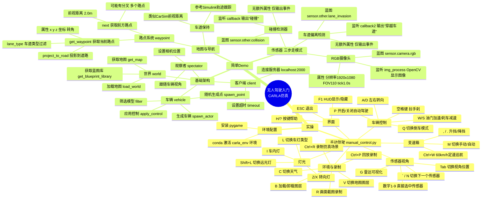

## 思维导图



---

## 实操


### 简单的案例
`D:\17871\CARLA_0.9.15\WindowsNoEditor\PythonAPI\examples` 这里有官方的例子

1. 打开 conda，激活我们之前创建的环境：`(base) C:\Windows\System32>conda activate carla_env (carla_env) C:\Windows\System32>`
2. 运行 `cd /d D:\17871\CARLA_0.9.15\WindowsNoEditor\PythonAPI\examples` 切换到所在的目录下
3. 之后安装 `pip install pygame` （旧版本的）
4. 然后运行 `python .\manual_control.py`  
	然后就打开人工操作的页面了（按键如下）

| 按键      | 功能说明                      |     |
| ------- | ------------------------- | --- |
| W       | 油门加速                      |     |
| S       | 刹车减速                      |     |
| A / D   | 左右转向                      |     |
| Q       | 切换倒车模式                    |     |
| 空格键     | 拉手刹                       |     |
| P       | 开启/关闭自动驾驶                 |     |
| M       | 切换手动/自动变速箱                |     |
| , / .   | 升挡 / 降挡                   |     |
| Ctrl+W  | 开启 60km/h 定速行驶            |     |
| L       | 切换车灯类型                    |     |
| Shift+L | 切换远光灯                     |     |
| Z / X   | 右转向灯 / 左转向灯               |     |
| I       | 开启/关闭车内灯                  |     |
| Tab     | 切换传感器视角位置                 |     |
| ` 或 N   | 切换下一个传感器                  |     |
| 数字 1-9  | 直接选中对应编号传感器               |     |
| G       | 开启/关闭雷达可视化                |     |
| C       | 切换天气（Shift+C 反向切换）        |     |
| 退格键     | 更换车辆                      |     |
| O       | 一键开关车辆所有车门                |     |
| T       | 开启/关闭车辆行驶数据面板             |     |
| V       | 切换下一个地图图层（Shift+V 反向）     |     |
| B       | 加载选中地图图层（Shift+B 卸载）      |     |
| R       | 开启/关闭画面截图录制               |     |
| Ctrl+R  | 录制仿真场景（覆盖旧录制文件）           |     |
| Ctrl+P  | 回放最近录制的仿真文件               |     |
| Ctrl++  | 回放起始时间 +1 秒（加 Shift+10 秒） |     |
| Ctrl+-  | 回放起始时间 -1 秒（加 Shift-10 秒） |     |
| F1      | 显示/隐藏界面 HUD               |     |
| H / ?   | 调出/收起按键帮助界面               |     |
| ESC     | 退出程序                      |     |

## 简单的 demo
### 官方教程
`https://carla.readthedocs.io/en/latest/tuto_first_steps/` 为入门的官方教程

- 世界
- 地图
- 驾驶员、车辆
- 传感器  
等等几个部分

```python
import random
import time

import carla

actor_list = []
try:
    client = carla.Client('localhost', 2000) # 连接服务器
    client.set_timeout(30.0) # 连接服务器,设置超时时间
    # Wait for simulator readiness and map load.
    max_attempts = 20
    for attempt in range(max_attempts):
        try:
            client.load_world('Town05') # 加载世界05（这里的地图加载一次就可以）
            world = client.get_world() # 获取当前世界
            if 'Town05' in world.get_map().name:
                break
        except RuntimeError:
            if attempt == max_attempts - 1:
                raise
            time.sleep(1.0)
    else:
        raise RuntimeError('Failed to load Town05 after retries')


    blueprint_library = world.get_blueprint_library() # 获取蓝图库
    v_bp = blueprint_library.filter('model3')[0] # 从蓝图库中筛选出特定的车辆模型,这里是特斯拉Model3

    spawn_point = random.choice(world.get_map().get_spawn_points()) # 从地图中随机选择一个生成点
    vehicle = world.spawn_actor(v_bp, spawn_point) # 在选定的生成点生成车辆
    actor_list.append(vehicle) # 将生成的车辆添加到actor_list中,以便后续管理
    # Move the spectator camera to follow the spawned vehicle.
    spectator = world.get_spectator()
    v_transform = vehicle.get_transform()
    camera_transform = carla.Transform(
        v_transform.location + carla.Location(z=30.0),
        carla.Rotation(pitch=-60.0, yaw=v_transform.rotation.yaw)
    )
    spectator.set_transform(camera_transform)
    vehicle.apply_control(carla.VehicleControl(throttle=1.0, steer=0.0)) # 对生成的车辆应用控制命令这里是设置油门为1,方向盘不转动
    time.sleep(10) # 让车辆保持行驶状态10秒钟
finally:
    for actor in actor_list:
        actor.destroy()
    print('结束')
```

### 传感器的使用
#### 高清行车记录仪

```python
# Find the blueprint of the sensor.
blueprint = world.get_blueprint_library().find('sensor.camera.rgb')
# Modify the attributes of the blueprint to set image resolution and field of view.
blueprint.set_attribute('image_size_x', '1920')
blueprint.set_attribute('image_size_y', '1080')
blueprint.set_attribute('fov', '110')
# Set the time in seconds between sensor captures
blueprint.set_attribute('sensor_tick', '1.0')
```

对其位置进行设置：

```python
my_vehicle = world.spawn_actor(vehicle_blueprint, spawn_point)
transform = carla.Transform(carla.Location(x=0.8, z=1.7))
sensor = world.spawn_actor(sensor_blueprint, transform, attach_to=vehicle) # 换到自己的车上，传感器的一个定位
actor_list.append(sensor)
```

数据监听：

```python
# 保存数据
sensor.listen(lambda data: img_process(data))
```

图像处理：

```python
def img_process(data):
	img = np.array(data.raw_data)
	img = img.reshape((1080,1920,4))
	cv2.imshow('', img)
	cv2,waitKey(1)
	pass
```

#### 碰撞检测器
同样，先建立一个检测器：

```python
blueprint_collision = world.get_blueprint_library().find('sensor.other.collision')
# 但是没有其余可以配置的属性（只有输出的属性）
```

位置：

```python
transform = carla.Transform(carla.Location(x=0.8, z=1.7))
sensor_collision = world.spawn_actor(sensor_blueprint_collision, transform, attach_to=vehicle) # 换到自己的车上，传感器的一个定位，名称也变化了
actor_list.append(sensor_collision)
```

监听

```python
sensor_collision.listen(callback)
```

对碰撞的处理：

```python
def callback(event):
	print("碰撞")（因为输出是一个事件）
```

#### 设置穿越车道
同样三步走：

```python
    '''3. 设置车道偏离检测：'''
    blueprint_lane = world.get_blueprint_library().find('sensor.other.lane_invasion') # 从蓝图库中找到车道偏离传感器的蓝图
    transform = carla.Transform(carla.Location(x=0.8, z=1.7))
    sensor_lane = world.spawn_actor(blueprint_lane, transform, attach_to=vehicle) # 在生成的车辆上安装一个车道偏离传感器，并设置其位置和旋转
    actor_list.append(sensor_lane)
    sensor_lane.listen(callback2) # 设置车道偏离检测的回调函数，当发生车道偏离事件时，调用callback2函数输出"穿越车道"
```

三步走：获取这个传感器的蓝图（调整输出的特性，事件类的不需要）——定位置——设置监听的函数：`def callback2(event): print("穿越车道") `

---

最终的代码为：

```python
import random
import time

import carla
import cv2 # 导入OpenCV库，用于图像处理和显示
import numpy as np

actor_list = []

def img_process(data): # 处理传感器数据的回调函数，这里是将传感器捕获到的图像数据转换为numpy数组，并显示出来
    img = np.array(data.raw_data)
    img = img.reshape((1080, 1920, 4))
    cv2.imshow('', img) # 使用OpenCV的imshow函数显示图像，第一个参数是窗口名称，这里设置为空字符串，第二个参数是要显示的图像数据
    cv2.waitKey(1) # 使用OpenCV的waitKey函数等待键盘事件，这里设置为1毫秒，表示每隔1毫秒检查一次键盘事件，以便能够及时更新显示的图像

def callback(event): # 碰撞检测的回调函数，这里是当发生碰撞事件时，输出"碰撞"（因为输出是一个事件）
    print("碰撞") # （因为输出是一个事件）

def callback2(event): # 碰撞检测的回调函数，这里是当发生碰撞事件时，输出"穿越车道"（因为输出是一个事件）
    print("穿越车道") 

try:
    client = carla.Client('localhost', 2000) # 连接服务器
    client.set_timeout(30.0) # 连接服务器,设置超时时间
    # Wait for simulator readiness and map load.
    max_attempts = 20
    for attempt in range(max_attempts):
        try:
            client.load_world('Town05') # 加载世界05（这里的地图加载一次就可以）
            world = client.get_world() # 获取当前世界
            if 'Town05' in world.get_map().name:
                break
        except RuntimeError:
            if attempt == max_attempts - 1:
                raise
            time.sleep(1.0)
    else:
        raise RuntimeError('Failed to load Town05 after retries')


    blueprint_library = world.get_blueprint_library() # 获取蓝图库
    v_bp = blueprint_library.filter('model3')[0] # 从蓝图库中筛选出特定的车辆模型,这里是特斯拉Model3

    spawn_point = random.choice(world.get_map().get_spawn_points()) # 从地图中随机选择一个生成点
    vehicle = world.spawn_actor(v_bp, spawn_point) # 在选定的生成点生成车辆
    actor_list.append(vehicle) # 将生成的车辆添加到actor_list中,以便后续管理

    '''1. 设置传感器：记录仪'''    
    blueprint = world.get_blueprint_library().find('sensor.camera.rgb') # 从蓝图库中找到RGB摄像头传感器的蓝图
    # Modify the attributes of the blueprint to set image resolution and field of view.
    blueprint.set_attribute('image_size_x', '1920')
    blueprint.set_attribute('image_size_y', '1080')
    blueprint.set_attribute('fov', '110')
    # Set the time in seconds between sensor captures
    blueprint.set_attribute('sensor_tick', '1.0') # 设置传感器捕获之间的时间间隔为1秒钟
    sensor_blueprint = blueprint # 将修改后的蓝图赋值给sensor_blueprint变量，以便后续使用
    transform = carla.Transform(carla.Location(x=0.8, z=1.7))
    sensor = world.spawn_actor(sensor_blueprint, transform, attach_to=vehicle) # 在生成的车辆上安装一个RGB摄像头传感器，并设置其位置和旋转
    actor_list.append(sensor)
    # 保存数据
    sensor.listen(lambda data: img_process(data))   

    '''2. 设置碰撞检测：'''
    blueprint_collision = world.get_blueprint_library().find('sensor.other.collision') # 从蓝图库中找到碰撞传感器的蓝图
    # 但是没有其余可以配置的属性（只有输出的属性）
    transform = carla.Transform(carla.Location(x=0.8, z=1.7))
    sensor_collision = world.spawn_actor(blueprint_collision, transform, attach_to=vehicle) # 换到自己的车上，传感器的一个定位，名称也变化了
    actor_list.append(sensor_collision)
    sensor_collision.listen(callback) # 设置碰撞检测的回调函数，当发生碰撞事件时，调用callback函数输出"碰撞"

    '''3. 设置车道偏离检测：'''
    blueprint_lane = world.get_blueprint_library().find('sensor.other.lane_invasion') # 从蓝图库中找到车道偏离传感器的蓝图
    transform = carla.Transform(carla.Location(x=0.8, z=1.7))
    sensor_lane = world.spawn_actor(blueprint_lane, transform, attach_to=vehicle) # 在生成的车辆上安装一个车道偏离传感器，并设置其位置和旋转
    actor_list.append(sensor_lane)
    sensor_lane.listen(callback2) # 设置车道偏离检测的回调函数，当发生车道偏离事件时，调用callback2函数输出"穿越车道"

    spectator = world.get_spectator() # 获取观察者（摄像机）对象
    v_transform = vehicle.get_transform() # 获取生成车辆的变换信息（位置和旋转）
    camera_transform = carla.Transform(
        v_transform.location + carla.Location(z=30.0),
        carla.Rotation(pitch=-60.0, yaw=v_transform.rotation.yaw)
    )
    spectator.set_transform(camera_transform)

    vehicle.apply_control(carla.VehicleControl(throttle=1.0, steer=0.0)) # 对生成的车辆应用控制命令这里是设置油门为1,方向盘不转动
    time.sleep(10) # 让车辆保持行驶状态10秒钟
finally:
    for actor in actor_list:
        actor.destroy()
    print('结束')


```

### 地图与导航
让自动按照导航行驶  
地图：`map = world.get_map() # 获取当前世界的地图对象`

```python
# Nearest waypoint in the center of a Driving or Sidewalk lane.
waypoint01 = map.get_waypoint(vehicle.get_location(),project_to_road=True, lane_type=(carla.LaneType.Driving | carla.LaneType.Sidewalk))

```

` print("waypoint01:", waypoint01) # 获取车辆所在位置的车道信息，project_to_road=True表示将车辆位置投影到道路上，lane_type参数指定要获取的车道类型，这里是驾驶车道和人行道` : 路点包含的属性有 x,y,z 和转角

```python
    while True:
        # 持续获取车辆所在的车道信息
        waypoint01 = map.get_waypoint(vehicle.get_location(),project_to_road=True, lane_type=(carla.LaneType.Driving | carla.LaneType.Sidewalk))
        print("waypoint01:", waypoint01) # 获取车辆所在位置的车道信息，project_to_road=True表示将车辆位置投影到道路上，lane_type参数指定要获取的车道类型，这里是驾驶车道和人行道
        waypoints = waypoint01.next(2.0) # 获取距离当前车道位置2米的下一个车道信息
        waypoint02 = waypoints[0] # 获取下一个车道信息
        print("waypoint02:", waypoint02) # 输出下一个车道信息
        print("waypoints:", waypoints) # 输出距离当前车道位置2米的下一个车道信息列表（可能有多个，因为可能有分叉的道路）
```

这里就相当于 carsim 中的前视距离（用于轨迹的跟踪，车道的保持）

然后就按照 simulink 中跟踪的写法做一下车道保持即可

## 参考
最适合作为你大作业参考的，不是单独一个文件，而是这几个按模块参考：

**首选主参考：** [automatic_control.py](<D:\17871\CARLA_0.9.15\WindowsNoEditor\PythonAPI\examples\automatic_control.py:1>)  
最适合参考“自动驾驶主循环 + Agent 路线跟踪 + pygame 显示 + 碰撞/车道传感器”。你后面要做环形路线一圈行驶，可以重点看它里面的：

- `BasicAgent`
- `BehaviorAgent`
- `World`
- `CameraManager`
- `CollisionSensor`
- `LaneInvasionSensor`
- 同步模式设置
- pygame 主循环

**交通流参考：** [generate_traffic.py](<D:\17871\CARLA_0.9.15\WindowsNoEditor\PythonAPI\examples\generate_traffic.py:1>)  
最适合参考“城市交通流生成”。你的新选题里有城市交通流，所以背景车辆、Traffic Manager、批量生成车辆这些都应该主要参考它。

重点看：

- `TrafficManager`
- `client.apply_batch_sync`
- 批量生成车辆
- 设置 autopilot
- 同步模式下交通流运行
- 车辆灯光 `VehicleLightState`

**pygame 和传感器显示参考：** [manual_control.py](<D:\17871\CARLA_0.9.15\WindowsNoEditor\PythonAPI\examples\manual_control.py:1>)  
这个文件最大，但很有用。不要整体照搬，重点抽取：

- `CameraManager`
- `HUD`
- `CollisionSensor`
- `LaneInvasionSensor`
- pygame 窗口刷新
- 键盘退出逻辑
- 车辆灯光控制，尤其是 `VehicleLightState.Brake`

你要做“紧急制动灯”，这个文件里最值得看。

**同步仿真参考：** [synchronous_mode.py](<D:\17871\CARLA_0.9.15\WindowsNoEditor\PythonAPI\examples\synchronous_mode.py:1>)  
适合参考“每一帧 world.tick + 传感器图像同步显示”。你的避障控制最好保持同步仿真，否则传感器、车辆控制、pygame 显示容易不同步。

**多传感器同步参考：** [sensor_synchronization.py](<D:\17871\CARLA_0.9.15\WindowsNoEditor\PythonAPI\examples\sensor_synchronization.py:1>)  
如果后续你要从虚拟传感器升级到真实 Radar/Lidar/Camera，可以参考它。现在阶段不是最优先。

我的建议优先级是：

1. [automatic_control.py](<D:\17871\CARLA_0.9.15\WindowsNoEditor\PythonAPI\examples\automatic_control.py:1>)：路线跟踪、自车控制、pygame 框架
2. [generate_traffic.py](<D:\17871\CARLA_0.9.15\WindowsNoEditor\PythonAPI\examples\generate_traffic.py:1>)：城市交通流
3. [manual_control.py](<D:\17871\CARLA_0.9.15\WindowsNoEditor\PythonAPI\examples\manual_control.py:1>)：HUD、摄像头、传感器、制动灯
4. [synchronous_mode.py](<D:\17871\CARLA_0.9.15\WindowsNoEditor\PythonAPI\examples\synchronous_mode.py:1>)：同步仿真结构
5. [sensor_synchronization.py](<D:\17871\CARLA_0.9.15\WindowsNoEditor\PythonAPI\examples\sensor_synchronization.py:1>)：后续真实传感器扩展

一句话：你的大作业主线应该参考 `automatic_control.py`，交通流参考 `generate_traffic.py`，pygame 和灯光参考 `manual_control.py`。不要直接把某个官方例子整体改成大作业，最好继续在 `guiji.py` 上按模块吸收这些案例。

### 文档
#### 入门部分
https://carla.readthedocs.io/en/docs-preview/tuto_first_steps/#animate-vehicles-with-traffic-manager  
（入门，建立一个简单的场景）

#### 蓝图库
https://carla.readthedocs.io/en/latest/bp_library/  
（很多车辆和传感器）

#### python API
https://carla.readthedocs.io/en/latest/python_api/  
python 调用的类、对象、函数等等

#### 对象控制
https://carla.readthedocs.io/en/docs-preview/core_actors/#vehicles  
（这里，实现对车辆和行人的控制）  
一些其余的部件（传感器，交通灯）也可以在这里设置

#### 交通流
https://carla.readthedocs.io/en/latest/adv_traffic_manager/  
（上述为交通流、自动驾驶）


实际上在 **carla topics** 这里就已经有很完整的流程了

