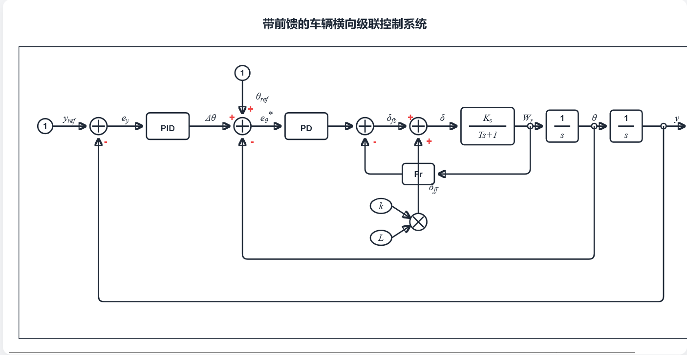

## 数学建模

## 控制模型的建立
这里的控制模型分为内环（航向角）和外环（横向偏差）两个部分

### 外环
  
外环使用的偏差是**横向偏差**：

$$
e_y=y_{ref}-y
$$

- $y_{ref}$ : 参考轨迹的横向位置
- $y{: }$ 车辆当前横向位置
- $e_y:$ 横向偏差

就是现在的车的位置离目标位置多远

---
这一部分的偏差使用 PID 控制，得到了第一个航向修正量 $\Delta \theta$：

$$
\Delta\theta=k_{py}e_y+k_{iy}\int e_ydt+k_{dy}\frac{de_y}{dt}
$$

> [!tip]+ 含义  
> 根据横向偏差，生成一个应该额外补偿的航向角修正量 $\Delta \theta$。

### 内环
  
航向角的偏差：

$$
e_\theta=\theta_{ref}-\theta
$$

- $θ_{ref}$: 参考航向角  
- $θ$: 车辆当前实际航向角  
- $e_θ$: 航向角误差

### 总的航向角修正
就是结合上面的两个偏差：

$$
e_\theta^*=e_\theta+\Delta\theta
$$

### 前轮转角部分
前轮转角由前馈和后馈两个部分组成：$\delta=\delta_{ff}+\delta_{fb}$

#### 前馈
  
就是由参考的轨迹曲率提前给的应该有的转角：

$$
\delta_{ff}\approx L\cdot\kappa
$$

> 就是轴距乘以参考的轨迹曲率，在汽车理论中

#### 反馈
  
使用的是上述的 [总的航向角修正](#总的航向角修正)

$$
\delta_{fb}=k_{p\theta}e_\theta^*+k_{d\theta}\frac{de_\theta^*}{dt}-k_rw_r
$$

一个 **PD + 横摆角速度反馈**

- 第一项：航向角误差比例控制
- 第二项：“D 微分抑制”，意思是抑制快速变化，减少振荡
- 如果车辆当前横摆角速度太大，就反向抑制一下，避免转向过猛、摆振太强。

---
以上就是控制模型的建立

## 被控对象的建立
这一部分可以使用 carsim 代替  
实际上就是几个物理量之间的关系：

$$
\delta\to w_r\to\theta\to y
$$

对应的传递函数关系就是图中的：

$$
\begin{gathered}\frac{w_r(s)}{\delta(s)}=\frac{K_\delta}{Ts+1}\\\frac{\theta(s)}{\delta(s)}=\frac{K_{\delta}}{s(Ts+1)}\\\frac{y(s)}{\delta(s)}=\frac{VK_\delta}{s^2(Ts+1)}\end{gathered}
$$

## 总的来说：

$$
\begin{gathered}e_{y}=y_{ref}-y\\\Delta\theta=k_{py}e_{y}+k_{iy}\int e_{y}dt+k_{dy}\dot{e}_{y}\\e_\theta^*=\theta_{ref}-\theta+\Delta\theta\\\delta_{fb}=k_{p\theta}e_\theta^*+k_{d\theta}\dot{e}_\theta^*-k_rr\\\delta_{ff}=L\kappa\\\delta=\delta_{ff}+\delta_{fb}\\\frac{r(s)}{\delta(s)}=\frac{K_{\delta}}{Ts+1}\\\theta(s)=\frac{1}{s}r(s)\\y(s)=\frac{V}{s}\theta(s)\end{gathered}
$$

