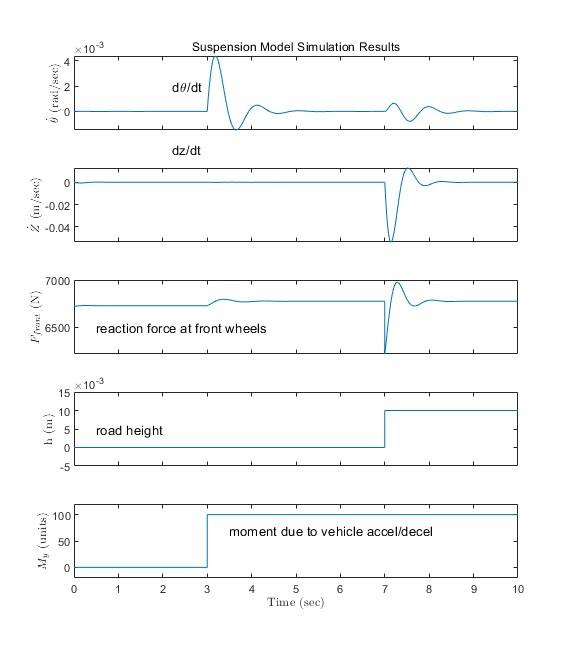
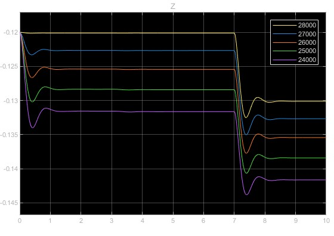
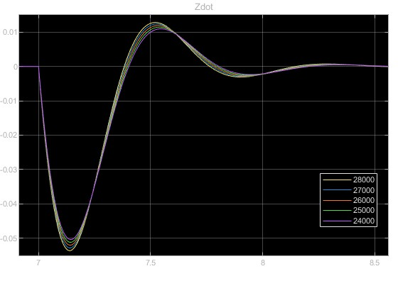
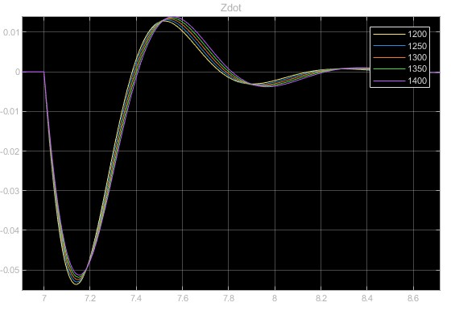
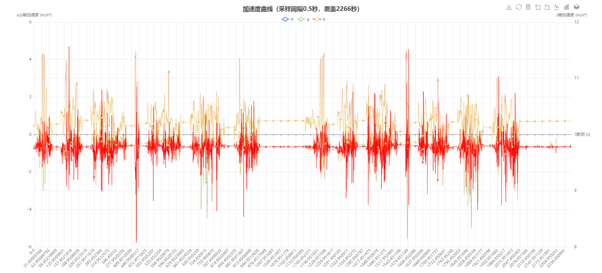

## 汽车二自由度模型的建立
  
???+ tip "参数的说明"  
    - 车辆自身运动的相关参数  
        - m：汽车的质量。  
        - $I_z$：汽车绕垂直于地面的 z 轴（横摆轴）的转动惯量。  
        - u：汽车的纵向速度（通常视为恒定，作为已知量）。  
        - $\dot{v}$：汽车的侧向加速度（侧向速度 v 对时间的一阶导数），反映侧向运动的动态变化。  
        - $\dot{\omega}_r$：汽车的横摆角加速度（横摆角速度 $\omega_r$ 对时间的一阶导数），反映横摆运动的动态变化。  
        - $\beta$：质心侧偏角，即汽车质心速度方向与汽车纵轴方向的夹角，是描述汽车侧向运动姿态的重要参数。  
        - $\omega_r$：横摆角速度，即汽车绕 z 轴的转动角速度，描述汽车横摆运动的快慢。  
        - $\delta$：前轮转角，是驾驶员输入的控制量，用于改变汽车的行驶方向。  
    - 轮胎及悬架的相关刚度参数  
        -  $k_1$：前轮的侧偏刚度，反映前轮受到侧向力时产生侧偏的难易程度，侧偏刚度越大，相同侧向力下前轮侧偏角越小。  
        - $k_2$：后轮的侧偏刚度，含义与前轮侧偏刚度 $k_1$ 类似，针对后轮。  
        - a：汽车质心到前轴的距离。  
        - b：汽车质心到后轴的距离。  

???+ info "目标"  
    并计算 ux=15 m/s 车速下，time=0.5 s 开始前轮角阶跃 6°，车辆横摆角速度、质心侧偏角的瞬态响应

???+ tip "建立"  
    - 首先是常数的设立（两个刚度和 a, b 两个距离，还有转动惯量）  
        - 现在已知的纵向的速度：u=15 m/s  
        - 前轮角阶跃输入为 $\delta$ 转为弧度制（$\frac{\pi}{30}$）  
    - 求解的是  
        - 横摆角速度 $\omega_r$ 随时间 t 的变化（瞬态响应曲线）；  
        - 质心侧偏角 $\beta$ 随时间 t 的变化（瞬态响应曲线）。  
    - 侧向速度可以使用质心侧偏角和纵向速度表示  
    - 转换之后的公式：  

    $$  
    u\dot{\beta}=\frac{k_1+k_2}{m}\beta+\left(\frac{ak_1-bk_2}{mu}-u\right)\omega_r-\frac{k_1}{m}\delta  
    $$

    $$  
    \dot{\omega}_r=\frac{ak_1-bk_2}{I_z}\beta+\frac{a^2k_1+b^2k_2}{uI_z}\omega_r-\frac{ak_1}{I_z}\delta  
    $$
  
    - 最终的图：  
    - 相应的曲线：  
    - 

???+ tip "分析"  
    - 假设输入是 “$t=0.5\ \text{s}$ 开始，前轮阶跃 $6^\circ$”，且车辆为**不足转向特性**（多数乘用车的设计目标），理论上：  
        - **横摆角速度 $\omega_r$**：应呈现 “快速上升→超调→收敛到稳态” 的过程（不足转向车辆的横摆响应是稳定的，最终会收敛到与前轮转角匹配的稳态值）。  
        - **质心侧偏角 $\beta$**：不足转向车辆的质心侧偏角最终应**趋近于 0**（或极小值），因为不足转向特性下，车辆转向时质心侧偏角的 “稳态误差” 很小。  
    - **横摆角速度（蓝色线 $w\_r）$**：快速上升后收敛到稳态（约 $0.38\ \text{rad/s}$ 左右），符合 “不足转向车辆横摆响应稳定、收敛” 的特性。  
    - **质心侧偏角（黄色线 $\beta$）**：短暂波动后迅速趋近于 0，也符合 “不足转向车辆质心侧偏角稳态趋近于 0” 的理论。

## 四个计算  
- **稳定性因数 $K$ 和特征车速 $u_{ch}$**：

$$
K=\frac{m}{L^2}\left(\frac{a}{k_2}-\frac{b}{k_1}\right)
$$

$$
u_{ch}=\sqrt{\frac{1}{K}}
$$

- **稳态横摆角速度增益曲线 $\frac{\omega_r}{\delta}|_s - u_a$ 和转向灵敏度 $\frac{\omega_r}{\delta_{sw}}$**：

$$
\left(\frac{\omega_r}{\delta}\right)_s=\frac{u}{L+Ku^2}
$$

$$
\frac{\omega_{r}}{\delta_{sw}}=\frac{\omega_{r}}{i\delta}
$$

- **静态储备系数 $S.M.$，侧偏角差值与转弯半径比值**：

$$
S.M.=\frac{a-\frac{k_2}{k_1+k_2}L}{L}
$$

  

## 之前的轮胎模型  
### 纵向  
  

### 侧向  
  

### 力矩  
  

## 技术调研报告的写法  
1. 首先是前人的总结：**佐思汽研、高工智能汽车（GGAI）、盖世汽车研究院、艾瑞咨询、IHS Markit（现属 S&P Global）**（这些专业的咨询报告）  
    但是这个我已经看过佐思汽研的了，没有详细的，需要付费购买
2. 各大券商（如中信建投、中金公司、华泰证券、天风证券）的汽车或汽车电子行业研究团队。
    1. 使用 **慧博投研资讯、Wind、Choice 金融终端** 或同花顺/东财的 PC 端“研报中心”。搜索关键词组合，如：“数字底盘深度报告”、“线控底盘行业前瞻”、“底盘域控制器国产化”。
    2. 就是我现在使用的同花顺
3. 同花顺中：
    1. 在同花顺 PC 端，找到“产业链”或“主题投资”模块。搜索“**线控底盘**”、“**智能汽车**”、“**汽车电子**”等，系统会自动生成产业链图谱，列出上游（芯片、传感器）、中游（执行器、域控制器）、下游（整车厂）的相关上市公司。这是**将技术概念转化为股票池的最佳工具**。
    2. 直接搜索“**华为汽车**”、“**比亚迪概念**”、“**蔚来概念**”等，成分股中很多就是数字底盘的供应商。
     - **公告**：搜索您已锁定的公司（如伯特利、拓普），查看其“**非公开发行股票预案**”、“**投资者关系活动记录表**”、“**年报/半年报**”，里面会详细披露技术研发进展、项目定点情况、客户合作等信息。
    - **互动易/上证 e 互动**：这是宝藏！您可以主动提问，也可以查看其他投资者的提问。例如，搜索“线控制动”、“底盘域控”，能看到上市公司董秘的官方回复，了解最新业务进展和订单情况。
4. 垂直行业的媒体：
- **汽车之心**、**42 号车库**、**汽车之家·行业频道**、**盖世汽车每日速递**：关注整车厂的新技术发布（如小米 SU 7、问界 M 9 的底盘解析）。
    - **电子工程世界**、**半导体行业观察**：从芯片、传感器、软件角度解读底盘技术。
    - **佐思汽车网**、**高工智能汽车**：大量免费行业快讯和技术文章。  
    盖世汽车：https://auto.gasgoo.com/news/202511/20I70437368C106.shtml  
    汽车之家·行业频道  
    中国汽车报网：http://www.cnautonews.com/lingbujian/2025/07/25/detail_20250725379135.html  
    汽车之家研究院：https://www.autohome.com.cn/news/202411/1301897.html

> 现在主要是把这个报告找一下  

1. 在同花顺的咨询中可以直接进行搜索
2. 搜索出公司之后，深度资料——>新闻公告与媒体——>公司公告，之后搜索年报之类的关键词
    1. **《年度报告》（尤其是最新的 2023 年报）**：这是法律文件，信息最全。
    2. **《募集说明书》或《向特定对象发行股票预案》**：这是公司融资时写的“商业计划书”，会用大量篇幅论证行业前景和自身技术优势，数据极其详尽。  
    之后打开 pdf 进行搜索！  
    只是非常好的一个方式

**第三步：查看“互动平台”的一手问答（另一个宝藏）**

1. 在上交所官网或同花顺 F 10 里，找到 **“上证 e 互动”** 入口。
2. 在搜索框输入 **“伯特利”**，然后搜索关键词如 **“线控”、“EMB”、“底盘”、“研发”**。
3. 您会看到大量投资者和公司的问答，董秘的回答会透露最新订单、技术验证进展等鲜活信息。

### 悬架的仿真  
默认的初始条件：  

> 分别代表的是：  
> 前后力矩臂  
> 车身质量  
> 车身绕着 y 轴俯仰的转动惯量  
> 前后悬架的弹簧刚度  
> 前后悬架的阻尼器阻尼系数  

  
得到的结果：  
  
上述的输出为：  

1. 车身俯仰角的变化率
2. 车身质心的垂向速度
3. 前轮悬架的反作用力
4. 路面不平度的输入 (激励信号)
5. 车辆加减速的俯仰力矩 $M_y$

- 单质量系统的自由振动的分析：

$$
m_2\ddot{z}+C\left(\dot{z}-\dot{q}\right)+K\left(z-q\right)=0
$$

得到的传递函数为：  

$$
H(\mathrm{j}\omega)_{z\sim q}=\frac{z}{q}=\frac{K+\mathrm{j}C\omega}{\left(-m_2\omega^2+K\right)+\mathrm{j}C\omega}
$$

此传递函数的**阻尼比**为：  

$$
\zeta=C/\left(2\sqrt{Km_2}\right)
$$

角频率为：  

$$
\omega_0=\sqrt{K/m_2}
$$

**阶跃的路面输入**下的车身位移的表达式：  

$$
z(t)=z_0+q_0\left[1-\frac{e^{-\zeta\omega_nt}}{\sqrt{1-\zeta^2}}\sin\left(\omega_dt+\arctan\frac{\sqrt{1-\zeta^2}}{\zeta}\right)\right]
$$

使用 to-workspace 的功能进行多个图像画到一个图像上  
  
这是对前轮的阻尼系数进行修改之后的结果  
  

---
  
对刚度修改之后的结果  
  
  

---
质量的影响：  
  
  

## 实验数据的分析
### 总的分析：


上图为总的三维轨迹图



上图为总的加速度曲线

### 加速度特性的分析

#### 第一个片段
  

这是从 422 s 到 448 s 左右的一段急加速、急减速的 y 轴方向的曲线（汽车行驶的方向）  
  

这是相同的时间内的加速度与车辆的速度随时间的变化曲线  

---
在这段时间内
1. 最大的正向加速度为 $4.45m/s^2$  
    1. 加速阶段的最大速度为 $15.21m/s$
    2. 加速到最大速度的时间近似为 $5s$，则这一小段的平均加速度为 $3.04m/s^2$
    3. 加速的距离为 $50.98m$
2. 最大的减速度为 $-5.59m/s^2$
    1. 减速阶段的速度变化量同样是 $15.21m/s$
    2. 所用的时间近似为 4 s，则急减速的平均减速度为：$3.80m/s^2$
    3. 减速的距离为：$12.72m$

由这个片段对动力性，制动性进行评价，有：  

- 动力性：最大的正向加速度为 $4.45m/s^2$，在普通家用车中处于较好的水平，接近性能车的门槛
    - 小于 $5 s$ 的时间加速到了 $54.8km/h$，加速性能较好
    - 1. 平均加速度 $3.04m/s²$，高于普通家用车 “$0-100km/h$” 的平均加速度（$2.0~2.8m/s²$），这段加速的提速效率不错；
- 制动性：
    - 最大减速度 $5.59m/s²$，略低于国标合格线（$5.8m/s²$），说明制动的 “峰值制动力” 稍弱；
    - 减速距离 $12.72m$（以 $54.8km/h$ 减速到停），处于 “$50km/h$ 制动到停$≤20m$” 的合格范围内，制动距离表现正常；

#### 第二个片段  
  

这是第二个片段的加速度曲线（1190 s~1230 s）  
  
这是第二个片段的速度与加速度随着时间变化的曲线  

在这一个片段中，加减速交替了 3 次  

- 加速阶段：
    - 三次加速阶段中的最大加速度为 $4.37m/s^2$
    - 第一次加速阶段的最大加速度为 $4.05m/s^2$，速度变化为 $1.88-11.92(m/s)$，用时 $4s$，则这一小段的平均加速度为 $2.51m/s^2$，加速的距离为 $39.044m$
    - 第二次加速阶段的最大加速度为 $4.19m/s^2$，速度变化为 $4.84-10.83(m/s)$，用时 $2s$，则这一小段的平均加速度为 $3m/s^2$，加速的距离为 $12.4m$
    - 最后一次加速的最大加速度为 $4.37m/s^2$，速度变化为 $4.86-12.19(m/s)$，用时 $3s$，则这一小段的平均加速度为 $2.44m/s^2$ 加速的距离为 $22.931m$
- 减速阶段：
    - 三次减速阶段中的最大加速度为 $-2.39m/s^2$
    - 第一次减速阶段的最大加速度为 $-2.31m/s^2$，速度变化为 $11.92-4.84(m/s)$，用时 $4s$，则这一小段的平均加速度为 $-1.77m/s^2$，减速的距离为 $25.01m$
    - 第二次减速阶段的最大加速度为 $-1.88m/s^2$，速度变化为 $10.83-4.85(m/s)$，用时 $4s$，则这一小段的平均加速度为 $-1.5m/s^2$，减速的距离为 $24.687m$
    - 最后一次减速的最大加速度为 $-2.39m/s^2$，速度变化为 $12.19-4.43(m/s)$，用时 $4s$，则这一小段的平均加速度为 $-1.94m/s^2$，减速的距离为 $27.063m$

对上面的这一段的动力性和制动性进行分析，有：  

- 动力性：
    - 三次加速的最大加速度 $4.05-4.37 m/s²$ 处于家用车最大加速度的中高区间，接近新能车的门槛
    - 平均加速度两次处于家用车标准区间，第二次（$3.0 m/s²$）略高，说明**短时间提速的爆发力不错**（2s 内完成 $5.99m/s$ 的速度提升）；
- 制动性（但是这里的减速并没有减速到停下，而是较为平缓的减速）
    - 制动性符合日常驾驶中的平缓操作

#### 第三段的分析  
  

上面是第三段的加速度曲线，是频繁的加减速的阶段

  

上面是这个阶段的速度、加速度随时间变化的曲线  

这个阶段的特征：  

- 最大的加速度为 $2.83m/s^2$
- 最大的减速度为 $-0.88m/s^2$
- 最大速度为 $10.23m/s$，最小速度为 $1.79m/s$

---
分析：这段频繁的加减速的曲线，体现的是中低速、拥堵/负责路况下的动力响应性和制动的线性度  

- 动力响应性不错：  
    每次加速度（蓝色曲线）上升时，速度（橙色曲线）能**快速跟随上升**（速度曲线的斜率与加速度正相关），说明动力系统对 “小幅度油门变化” 的响应比较及时，**没有明显的动力迟滞**（不会出现 “踩油门后 1~2 秒才提速” 的情况），符合日常拥堵路况的驾驶需求。
- 动力输出平顺性好：  
    加速度曲线（蓝色）没有出现 “突然跳升 / 骤降” 的波动，而是**相对平缓**的变化；对应的速度曲线（橙色）也是连续、无顿挫的升降，说明**动力输出比较线性**（比如变速箱换挡平顺、油门踏板响应线性），频繁加减速时不会有 “窜车” 或 “动力中断” 的不适感。
- 制动 / 收油的线性度良好：  
    减速时加速度（蓝色曲线的负值部分）变化平缓，没有出现 “突然变负（急刹）” 的情况；对应的速度曲线（橙色）也是匀速下降，说明无论是 “松油门滑行” 还是 “轻踩刹车”，**制动系统 / 动力回收的控制都比较线性**，频繁减速时不会有顿挫感，日常驾驶的舒适性不错。
- 制动系统的**轻负荷状态**下的状态稳定：  
    多次重复轻减速过程中，加速度和速度的变化规律一致，说明制动系统在轻负荷下的状态稳定（比如刹车片与刹车盘的贴合度、制动液压力控制都比较均匀），没有出现 “时灵时不灵” 的波动。

总的来说，这辆车在日常驾驶的操控体验和舒适性还是不错的  

### 平顺性分析  
  
以上就是两者的关系图像  
由上面的曲线，分析其中的三个高度变化较大的区域：

#### 第一段的分析  
$500-550s$（一段比较颠簸的路段）  
  

- 该段的最大高度落差为 $1.85m$  
- 最大的垂向加速度为 $10.27m/s^2$（含 $g$）
- 最小的垂向加速度为 $8.82m/s^2$

对这一段的加权加速度均方根值（先对加速度进行傅里叶变换到频域上，乘以频率加权函数之后反变换到时域上，对得到的加速度求出均方根值）进行计算，得到的结果为：  

$$
a_\mathrm{w}=\left[\frac{1}{T}\int_0^Ta_\mathrm{w}^2(t)\mathrm{d}t\right]^{\frac{1}{2}}
$$

```Python
x轴：0.170 m/s²
y轴：0.131 m/s²
z轴：0.109 m/s²

三方向总加权加速度均方根：0.320 m/s²
总加权振级：110.1 dB
```

得到的实际采样频率为 $400.6 hz$  
可以得出，这一段的加权加速度均方根值为 $a_w=0.320m/s^2$，加权振级为 $L_{aw}=110/dB$  
查表，得出这一段的人的主观感觉应该是有一些不舒适  

此处为无明显坡道的路段，振动的加速度较低，平顺性较为良好  

#### 第二段的分析  
$1300-1350s$  
  
如图所示，可见，这是一段上坡的路段  

- 该段的最大高度上升为 $8.05m$  
- 最大的垂向加速度为 $10.76m/s^2$（含 $g$）
- 最小的垂向加速度为 $8.87m/s^2$

同理，对这一段的加权加速度均方根值进行计算，得到：  
这一段的加权加速度均方根值为 $a_w=0.408m/s^2$，加权振级为 $L_{aw}=112.2/dB$  
查表，得出这一段的人的主观感觉应该是有一些不舒适  

这一段为典型的上坡路段，有明显的颠簸，乘坐的舒适性较差

#### 第三段的分析  
$1470-1510s$：是一段颠簸下坡的路段  
  

- 该段的最大高度落差为 $5.82m$  
- 最大的垂向加速度为 $10.43m/s^2$（含 $g$）
- 最小的垂向加速度为 $9.03m/s^2$

同理，对这一段的加权加速度均方根值进行计算，得到：  
这一段的加权加速度均方根值为 $a_w=0.412m/s^2$，加权振级为 $L_{aw}=112.3/dB$  
查表，得出这一段的人的主观感觉应该是有一些不舒适  

颠簸下坡的路段，平顺性同样较差

### 操纵稳定性  
上图为：  
  
上图是侧向加速度与车辆行驶方向朝向的关系  

  

上图是对航向关于时间微分之后，得到的横摆角速度的曲线  

$$
\mathbf{corr}(\mathbf{X},\mathbf{Y})=\frac{Cov(X,Y)}{\sqrt{Var(X)Var(Y)}}=\frac{Cov(X,Y)}{\sigma_x\sigma_y}
$$

  
上图是横摆角速度与侧向加速度随着时间的变化曲线图  
计算得到的两者的相关系数为：$0.5108$，为**中等的正相关度**  
由上述的相关度和曲线可以认为这辆车的操纵稳定性属于**普通家用车的日常水平**  
但是由于缺少其他的数据，不能分析操纵稳定性这一比较综合的指标  