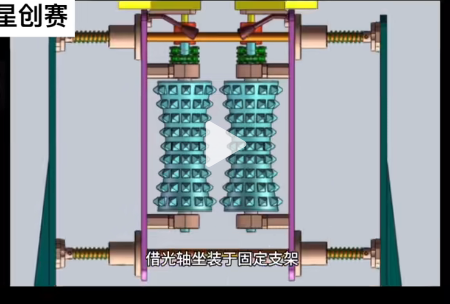
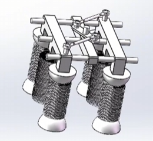

## A 3 图纸模版的设置  
### 首先进行图层的设置  
在图层的选项卡中进行设置，选择特性管理器，增加图层：  
  

之后修改字体的样式以及标注的样式  

### A 3 图纸的绘制  
- rec（矩形命令），之后指定两个点
- 使用直线命令绘制标题栏
- 标题栏的填写

### 螺套的绘制  
输入LTSCALE，重新设置线型比例因子为 15，即可看见好的线型    
在左下角将线宽的显示点出来  
点击空格选择之前的一个命令  

- cha：添加倒角
    - 再输入 d，添加倒角的距离为 2,2
    - 选择两条直线添加
    - 空格重复
    - 输入 t 显示修剪方式，可以更改为不修剪
- O：偏移
    - 距离为 15
- tab：输入角度六十°（在直线命令的时候）
- tr：进行修剪
- 刨面线
    - bh
    - 选择图案
    - 进行填充
- c：圆命令
- le：箭头命令
- mt：多行文字命令
- break：打断命令
- 按 f 命令
- 样条曲线（在绘图栏下面）
- ex 进行延伸

---
尺寸的标注  

- 直径的标注，输入 M
- 输入\%%C，即为 $\theta$

???+ tip "我现在要的尺寸"  
    - 起升的高度为 120 mm，则螺杆的长度为 150  
    - 手柄的长度为 612 mm，取 650 mm 的  
    - 底部的截面的直径取 100 mm  
    - 螺纹的大径为 40. 螺距为 5，中径为 35

???+ tip "组合"  
    - wb 命令  
    - 拾取基点  
    - 选择对象  
    - 命名  
    - 将单位为 mm

???+ tip "打印"  
    - 选择上面的打印的图标  
    - 名称设置为 DWG to PDF. pc 3  
    - PDF 选项：  
    - 将 PDF 的质量调节到最高的级别  
    - 选择 A 3 的纸  
    - 打印范围为窗口，将所画的画框选  
    - 居中打印  
    - 打印样式表选择 mon 那个  
    - 质量调节为自定义 600  
    - 之后导出的就是 pdf

## 带式运输机  
**题目**：  

---

**图像**：  
  
  
  

???+ tip "运行机制"
1. 蓝色的发动机带动 V 型的带轮转动  
    
2. 大带轮通过轴连接  
    
3. 下面就是我们的轴  
    
4. 轴再通过小齿轮带动大齿轮，再带通滚筒和皮带运输

  
这个东西，每一段轴的**长度以及直径**  

1. 齿轮段：24 mm,28 mm（小齿轮的宽度是 26 mm）
2. 垫肩段：30 mm, 33 mm
3. 再一段：20 mm, 40 mm
4. 中间跨度是：63 mm
5. 带轮段：38 mm, 28 mm（带轮的宽度是 40 mm）
6. 小齿轮的分度圆直径是 40 mm，模  数为 2
7. 带轮的直径是 200 mm

### 设计的去鳞机  
- 设计的草图：  
    
- 一些重要的部件：
    1. 对侧的滚筒：  
        
    2. 同侧的滚筒：  
        
    3. 整体滚筒的样子：  
        
    4. 可以伸缩的杆：  
        
- 传动的顺序：  
    电机——链传动——锥齿轮（带动一侧不懂的滚筒）——可动的锥齿轮（带动另一侧可动的滚筒反转）（同侧滚动之间链传动）  
    电机——链传动——齿轮传动——轴旋转——链传动（一起旋转）

#### 参数的确定  
可以处理的鱼的厚度——4~8 cm 的鱼  

- 电机系统——$0.75kW$ 变频减速电机（IP65），4 级三相异步电机转速为 $1400r/min$
    - 主动轴的直径为 $φ25mm$
- **滚筒**的系统：
    - 电机的减速比：$1:20$（输出转速≈70r/min）(也就是通过链轮输出轴的转速)
    - 链轮的齿数（差速）：前后滚筒链轮 $Z=25$，中间滚筒链轮 $Z=17$（差速比 $1:1.5$）
    - 滚筒的直径：60mm（最窄处的直径为 40 mm），长度为 200 mm
    - **滚筒轴**之间间距的调整范围80~140mm（则两个滚筒之间相对两点之间的距离变化范围为 20~100 mm）
    - 相邻滚筒轴之间的间距为 80 mm，轴的直径为$φ20mm$
- **细轴**的系统：
    - 参数：直径 15mm，长度 200mm，与滚筒间隙 2~3mm
    - 细轴的转速：$140r/min$（滚筒转速的 2 倍）
- 可伸缩锥齿轮：
    - 轴向伸缩行程：60mm
    - 分锥角 $45°$，齿宽 $20mm$
- 传动比：
    - 电机的减速比：$1:20$（使用减速箱）
    - 电机上的链轮选取的参数为 $Z1=25$，分度圆直径 $≈101.4mm$，与主动轴上的链轮参数相同，传动比为 1
    - 主动轴锥齿轮：模数 $m=2$，齿数 $Z=20$
    - 主动轴驱动齿轮：模数 $m=1.75，Z1=15$，齿宽 15mm；细轴齿轮：模数 $m=1.75，Z2=30$，齿宽 15mm，则为 2 的传动比
    - 细轴之间为 $Z3=12$，分度圆直径$≈19.8mm$的链轮
- 材料：
    - 链轮的**材料**为：304 不锈钢
    - 链条的**型号**：08A 不锈钢滚子链（节距 12.7mm）
    - 轴选用的材料为45 钢
    - 锥齿轮材料：304 不锈钢
    - 细轴之间链传动的材料为：06B 不锈钢滚子链（节距 9.525mm）
- 轴承：
    - 锥齿轮轴（主动轴）：使用角接触球轴承（能同时承受较大的径向、轴向联合载荷），采用的型号 S7205AC (不锈钢)，采用浮动配合）（允许轴向伸缩）
    - 滚筒轴的轴承：深沟球轴承S6204
    - 细轴轴承：深沟球轴承S6202

|    连接部件（轴→轮毂）     | 轴径（mm） | 键型号（b×h×L，mm） | 键槽配合公差（轴槽 / 轮毂槽） |    键材质与热处理    |
| :---------------: | :----: | :-----------: | :--------------: | :-----------: |
| 主动轴→锥齿轮（可动 / 固定侧） |   25   |    8×7×25     |   N9/H7（过渡配合）    | 45 钢，42~45HRC |
|  主动轴→驱动齿轮（细轴传动）   |   25   |    8×7×20     |   N9/H7（过渡配合）    | 45 钢，42~45HRC |
|   主动轴→链轮（电机链传动）   |   25   |    8×7×22     |   N9/H7（过渡配合）    | 45 钢，42~45HRC |
|     滚筒轴→滚筒锥齿轮     |   20   |    6×6×20     |   N9/H8（过渡配合）    | 45 钢，42~45HRC |
|     滚筒轴→滚筒本体      |   20   |    6×6×30     |   N9/H8（过渡配合）    | 45 钢，42~45HRC |
|      细轴→细轴齿轮      |   15   |    5×5×18     |   N9/H9（间隙配合）    | 45 钢，40~43HRC |
|  细轴→细轴链轮（细轴间传动）   |   15   |    5×5×15     |   N9/H9（间隙配合）    | 45 钢，40~43HRC |
|     链轮轴→独立链轮      |   20   |    6×6×20     |   N9/H8（过渡配合）    | 45 钢，42~45HRC |
|     张紧轮轴→张紧轮      |   10   |    4×4×12     |   N9/H9（间隙配合）    |   45 钢，不热处理   |