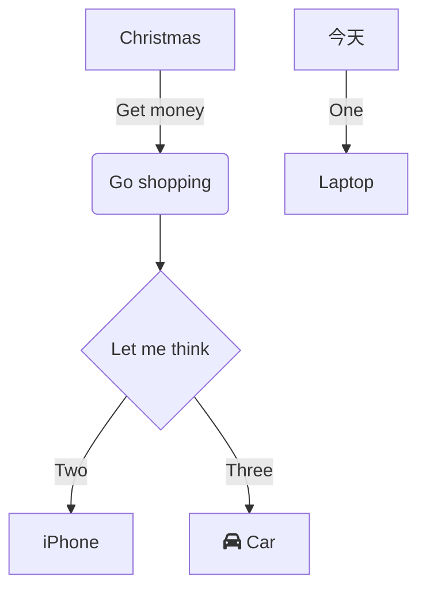

## 参数化仿真的全流程  
### 参数化
> [!info] 笔记

!!! note "笔记"  
    1. 作为  
    2. 大人  
    3. 要懂事  
    - 简直  
    - 就是  
        - 我们  
!!! note "笔记"  
 1.  在 work 平台下进行模型的修改（也就是第一个的集合结构）  
    1. 管子半径和长度的初始化  （草图的绘制，拉伸），如下图所示进行重命名 ![[png/Pasted image 20250703001756.png]]
        1. 其中的半径就是拉动，点击旁边的 p，长度选中拉动之后要选择左下的小图标标尺，量出长度进行点击 p
    2. 进口和出口的设置：
        1. 点击圆面，ctrl+G 创建组，创建好如下图
    3. 点击结构，将名字改为液体
2. 回到主页面，在 mesh （网格）中进行网格划分，现在会有如图的参数集
    1. 网格划分，先等到模型的加载，加载后之前建模的命名都过来了
    2. 点击 mesh
        1. 右键点击边界层，添加面网格划分，点击黄的区域，点击圆面
        2. 再添加膨胀（inflalin），先点整个面，再点黄色的增加整个固体区域（边界）
        3. 施加一个固体的边界，将其作用于流体区域
        4. 
    3. 最大层数和生长
3. 参数化设置
4. 

