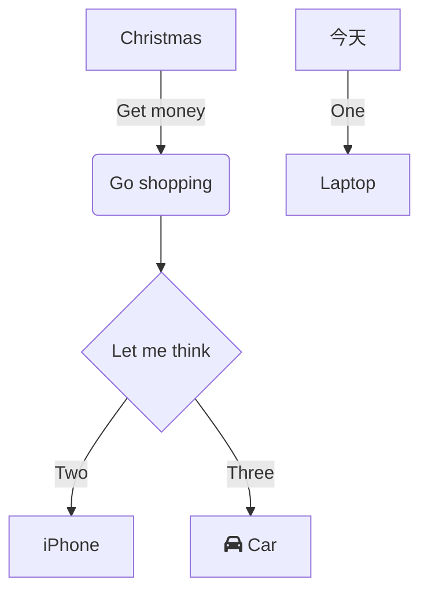
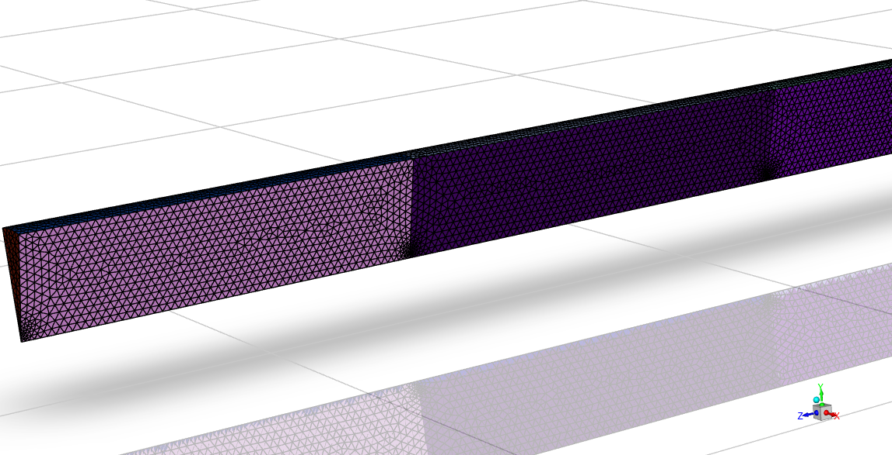
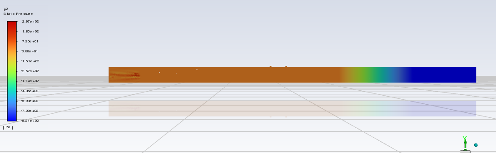

## 参数化仿真的全流程  
### 参数化

> [!tip] 笔记  
> 首先非常重要的一点是要记得在 workbench 中有很多种的流体流动的仿真，我现在学习的是流体流动 (fluent)

 1.  在 work 平台下进行模型的修改（也就是第一个的集合结构）  
    1. 管子半径和长度的初始化  （草图的绘制，拉伸），如下图所示进行重命名 ![[png/Pasted image 20250703001756.png]]
        1. 其中的半径就是拉动，点击旁边的 p，长度选中拉动之后要选择左下的小图标标尺，量出长度进行点击 p  
    2. 进口和出口的设置：
        1. 点击圆面，ctrl+G 创建组，创建好如下图  
    3. 点击结构，将名字改为液体
2. 回到主页面，在 mesh （网格）中进行网格划分，现在会有如图的参数集
    1. 网格划分，先等到模型的加载，加载后之前建模的命名都过来了
    2. 点击 mesh
        1. 右键点击边界层，添加面网格划分，点击黄的区域，点击圆面
        2. 再添加膨胀（inflalin），先点整个面，再点黄色的增加整个固体区域（边界）
        3. 施加一个固体的边界，将其作用于流体区域
        4. 膨胀选项为第一层厚度，为 1 mm
    3. 右击 mesh，进行网格的更新
        1. 点击网格，在下方的详细信息中点击质量，切换到偏度的网格质量标准，点击最大的各自，生成 P，参数化
        2. 点击网格，修改网格最小单元的尺寸，参数化
        3. 点击膨胀，将第一层高度参数化。生成如图所示的网格
3. 进入下一个设置 (setup)，现在的界面是这个样子
    1. 三个参量进行初始化的设计
        1. 在入入口处双击入口，设置速度的大小（new input ）的大小，从而设置为函数
        2. 在下方的湍流出进行同样的设置，变为 f（函数的形式）
        3. 同时，在湍流的设置中选择水力直径（最后一行会变为水力直径，进行同样的参数化设置）
    2. 之后进行求解的初始化
        1. 点击求解下的初始化
        2. 选择初始化的方式为标准初始化
        3. 计算的参考位置为 inlet（进口）
        4. 然后点击初始化
    3. 进行计算的设置
        1. 运行计算，主要设置迭代的此时
        2. 等待计算结果的出现
    4. 计算结束之后进行测量
        1. 点击云图，着色变量选择速度，确定
        2. 在右上的表面中选择等值面，选择 mesh 进行生成
        3. 再次点击云图，生成刚才 2 中的速度的图像
        4. 
4. 之后保存关闭掉，现在先不进行后处理了
    1. 点击下方的参数化设计，显示如图所示的界面
    2. 在右侧填入自己想要的参数，一一对应，填好之后右键序号，选择更新选中的设计点
    3. 这样全流程的参数化就好了，最后还有在对应的文件夹中会有 DP 1，DP 2 这些输出的文件
    4. 同时，参数化还可以使用左上角的文件-脚本-录制脚本或者是在命令窗口中自己进行 python 的书写，脚本的命令
    5. 如图所示的脚本窗口
    6. 点击上方栏中的帮助栏，可以获得有关于脚本的帮助
5. 这就是生成的文件，其中的 dat 为数据，其中的 wbdp 为脚本的文件

## 学长的 case  
**工作流**：

### 建模  

> [!tip] 笔记  
> 首先是为什么  
> 好像建模的时候使用的是另一个工具，所以不太一样  
> 还是固体和液体的确定是怎么样的  

!!! tip "笔记"  
    所以这里的作用是  
    1. 建模  
    2. 命名各个区域的名字和大小（可以参数化）  
    3. 区分每一片区域的性质（是固体还是液体之类的），仅仅名字区分的阶段

  
所以在这个软件中，这个东西是怎么确定的  

!!! note "建模的大致过程"  
  
上述的图像是建模之后的模型  

---
???+ tip "过程"  
    1. 绘制截出来的扇形面的草图为草图 1：  
        草图中将扇形面对应的角度参数化  
    2. 将草图使用其中的挤出的功能得到四个部件，分别命名为 ciga、fluidin、porous、fluiout  
        1. 对于挤出的 fluidout，参数化其长度  
        2.  挤出的 porous，同样参数化长度  
    3. 绘制两个小孔的草图，为草图 5：  
        将草图中的小孔的直径和间距参数化  
    4. 最后得到下面的参数边界器：  
    5. 将建模得到的物体的各个面进行命名

### 网格  

> [!tip] 笔记  
> 就是局部尺寸是什么  
> 描述几何结构  （确定是固体还是液体吗）  
> 边界的作用是什么  
> 边界层和体网格  
> 这里真正确定了，那部分是什么，液体还是固体

???+ tip "步骤"  
    1. 在 CFD Base 中进行**网格划分**，首先导入几何模型  
    2. 之后添加局部的尺寸，给几何的特定区域指定网格的大小（inlet 1 和 inlet 2）  
    3. 之后调节参数，形成面网格  
        形成的面网格：  
          
    4. 描述几何结构，定义几何的**流体 / 固体区域、空隙等属性**  
          
        1. 使用共享拓扑同时更新进出的边界：  
        效果：  
          
          
    5. 设置周期边界  
          
    6. 添加边界层：在**壁面附近生成极细的多层网格**，用于捕捉近壁区的速度 / 压力梯度  
          
    7. 最后的步骤：生成体网格  
          
        将面网格填充为三维的单元  
        1. 最后的结果：

### 设置  

> [!tip] 笔记  
> 这个的设置号线就是切换到求解的模式  
> 这里好像就是设置各种实际流动的参数  
> 使用的什么材料  
> 设置区域的条件（是什么样子的区域，多孔）  
> 设置各种的边界条件：进出口的属性，湍流这些  
> 这里的内部是做什么我就不知道了  
> 还有就是设置参考系    
> 怎么从设置中返回去呀

???+ tip "步骤"
1. 选用模型的定义：
2. 对流体等等组分的物性进行定义：
3. 定义流体的区域条件，特别是多孔介质的粘度阻力系数等等数值
4. 设置出入口的温度、压力等等边界条件
5. 进行报告的定义
    1. 选择 porous-fluidout 面上的参数，选择面积加权平均
    2. 选择种类、温度、压力等因素作为因变量
6. 初始化：  
    初始化温度为25℃，空气的含量占比为1  
    之后局部初始化ciga部分的温度为160℃，烟气的含量占比为1
7. 加入 Y-Z 向的剖面，添加这个面上的温度、速度、烟气含量云图：  
    
8. 进行求解的初始化，设置求解的方法类型、步数、步长等等参数，进行仿真  
    

### 会议记录  

!!! tip "前面的处理"    
    - 计算新的参数点  
        - 更新所需的参数之后进行  
        - 右键设置为当前  
        - 回到项目中进行更新，几何结构的更新  
        - 网格也进行更新

!!! tip "问题的解答"  
    - 区别：最后多一个网格划分的功能  
    - SC，DM 点击左下角的方格中  
    - 网格中的局部尺寸，网格要参考库朗数的东西，CFL，所以要计算的精细，网格就要小，要使得算的快和时间步长大，网格尺寸要基于库朗数（时间步长越大，网格的尺寸也要越大）  
    - 标准的 k-epsilon 和标准的壁面  
    - 边界条件的设置：网格划分的周期性边界，因为是切了一小块出来  
        - 壁面的  
        - 最后的出口的边界条件是 boundary 的设置  
    - 最后使用 fluent 来求解  
        - 先进行初始化  
            - 要进行局部的初始化，开始全是烟气  
            - 云图，温度的变化，组分的变化  
        - 保存之后开始进行计算即可  
    - 最后的：使得温度和浓度，压差之间达到平衡，合适的范围？  
    - 对每个参数进行一个优化，换热好、压力小和烟气浓度  
        - 最后的输出结果，在报告的生成中  
        - 空腔段的长度，P 3 这个，调整的范围是 2,3 mm 这样要争  

### 自己进行初步的仿真  
#### 仿真的步骤
!!! tip "后面的处理（在设置中的处理）"    
    - 初始化：  
        - 全部的初始化，初始化温度为 25，air 的含量为 1  
        - 局部的初始化，对前段的 ciga 进行初始化，全为烟气，温度为 160，每初始化一次都得点一下  
        - 之后查看云图，显示应该是这样的，初始时全部是烟气，为红色，后面一段是空气（初始的形态）  
        -   
        - 温度开始是 160，后面一段的初始温度为 25  
    - 报告的自定义：  
        - 定义最终烟气的含量：  
        -   
        - 如图选择类型是整个面上的加权平均  
        - 变量选择种类 species，烟气的含量  
        - 面选择为 po 这个出口的面  
        - 最后点击左下角的创建输出参数，就可以在最后的参数表中看见了  
    - 通过这样实现压力的创建  
    - 开始仿真之后就会渐渐有如图的渲染  
    - 最后可以得到新的渲染之后的结果  

#### 参数的含义  
  
!!! Note "结构的分析"  
    - 这四段部分：  
        - 首先是 fluiout（最左边），是气体流出的区域  
        - 其次是 porous，是多孔的介质区域，也是我们项目要**集中改善的区域**（与 out 的交界就是分析的面）  
        - 第三是 fluidin（最长的部分），是流体的入口的区域  
        - 最后最短的部分是 ciga，是与入口相关的区域，也就是燃烧的部分  
    - 所有相关的参数：  
        - Lfluent 为中间的最长部分的长度  
        - LP 为所求部分的长度  
        - 角度为图中的 A 6 角度  
        - Rin 为图中的小圆柱的直径  
        - Deltal 为两个小圆柱的间距

> [!tip] 笔记  
> 数据  

  
数据  
!!! tip "笔记"  
    由数据得出的量之间的关系：  
    
    - 2：角度的降低使得——温度下降，压降减少，烟气的含量升高
    - 3：长度的增加——温度下降，压降增加，烟气的含量降低  

### 后处理  

> [!tip] 看所受的压力  
> 在工作台中进入最后的结果一栏中  
> 在结果界面最上面一栏中的 insert  
> 选择 contour (轮廓、外形、等高线的意思)  
> 选择自己想要观察的面（可以先精确到哪一部分，再精确到这一部分的哪个面）  
> 选择 **local**（） 就能看见分布了  

???+ tip "上面的具体说明"  
    1. Domains（区域）  
        - 显示为 “All Domains”，表示**选择当前计算的所有计算域**（如果是单域模型，就是整个计算区域；多域模型则包含所有子域）。  
    2. Locations（位置）  
        - 这里显示 “ciga. fluidin. ciga”，是**你当前选择的 “显示位置”**（通常是 Fluent 中定义的边界 / 区域名称，比如流体域、某个壁面等，“fluidin” 一般对应流体入口区域）。  
    3. Variable（变量）  
        - 选择的是 “Pressure”，表示**要显示的物理量是 “压力”**（也可以选速度、温度等其他计算结果变量）。  
    4. Range（范围）  
        这是**物理量的显示范围设置**，下拉选项的含义：  
        - **Global**：使用**整个计算域内该变量的全局最大 / 最小值**作为显示范围（比如压力的全局最大值和最小值）；  
        - **Local**：使用**当前选中 “Locations” 区域内该变量的最大 / 最小值**作为显示范围；  
        - **User Specified**：手动输入 “Min（最小值）” 和 “Max（最大值）”，自定义显示范围；  
        - **Value List**：通过输入一系列数值，自定义显示的 “等值线 / 云图层级”（比如指定压力按 0、500、1000 Pa 等层级显示）。  
        

> [!tip] 某一面上的变化  
> 同样的位置  
> 选择平面 plate，选择截面，这里是 YZ 平面，截取  
> 之后再选择区域，选择截取的面（就是前一步的平面）  
> 选择自己想要查看的东西就是我们现在的了  
> 选择 Vertex 的参数可以看出速度矢量的图像  
> ES 为流线图

### 提出的问题  
### 卷烟的结构  
  

- 对于图 3 来说
    - **`ciga`段** → **Tobacco Plug（烟草段）**
        
        对应图中 “Tobacco Plug” 区域，是装载烟草的发烟核心段。
    - **`fluidin`段** → **Hollow Acetate Tube（中空醋酸管）**
        
        对应图中 “Tobacco Plug” 后方的中空管，是气流进入烟草段的引导段。
    - **`porous`段** → **Polymer-Film Filter（聚合物膜过滤段）**
        
        对应图中 “Polymer-Film Filter”，属于多孔介质类的降温 / 过滤结构。
    - **`fluidout`段** → **Mouth Piece Filter（烟嘴滤嘴）**
        
        对应图中最末端的 “Mouth Piece Filter”，是烟气最终流出的出口段。
- 图四：
    - **`ciga`段** → **Tobacco mixture（烟草混合物）**
        
        对应图中被加热器包裹的 “Tobacco mixture”，是发烟核心区。
    - **`fluidin`段** → **Hollow Cellulose Acetate tube（中空醋酸管）**
        
        对应烟草段后方的中空管，负责引导气流进入。
    - **`porous`段** → **Aerosol cooling element（气溶胶冷却元件）**
        
        对应图中 “Aerosol cooling element”，是多孔介质类的降温结构。
    - **`fluidout`段** → **Mouth Piece（烟嘴）**
        
        对应图中最末端的 “Mouth Piece”，是烟气出口段。

---

### 最后达成的目的：  
1. 温度
    - 目标：把烟气温度从 300-400℃（加热后）降到**50-60℃左右**（接近人体口腔舒适温度）。
    - 过低的问题：温度太低会让烟气中的气溶胶冷凝过度，导致 “口感发涩” 或 “烟气量减少”。
 2. 浓度：不是越大越好
    - 目标：让烟气浓度接近传统卷烟（但略低），保证口感的同时避免 “呛喉”。
    - 过高的问题：浓度太大易导致 “刺激性强”，且可能增加某些成分的释放量。
3. 其他核心要求
    - **透气性匹配**：多孔介质的孔隙率要和烟草段、滤嘴段适配，避免 “抽吸阻力过大 / 过小”（阻力太大吸不动，太小没满足感）；（实际上就是**压强的要求**）
    - **安全性**：材料要耐高温、无毒（比如用食品级聚乳酸），加热后不会释放有害物；
    - **稳定性**：多次加热后，多孔介质的结构 / 性能不能明显变化（比如不融化、不破碎）。
4. 压强：  
    在加热不燃烧（HNB）烟支的流场中，**多孔介质与滤嘴接触面的压力（相对压强）以 - 0.5Pa~-3Pa 为佳**，这个范围对应 “舒适抽吸体验”+“合理烟气传输”：  
    为什么是这个范围？
    1. **抽吸体验**：这个压力区间对应 “轻度到中度抽吸力度”，符合用户日常使用的习惯（不会太费力吸，也不会太松散）；
    2. **烟气传输**：压力过低（比如＜-5Pa）会导致抽吸阻力太大，烟气量不足；压力过高（接近 0Pa）则抽吸太 “空”，口感单薄。

### 结果汇总  
