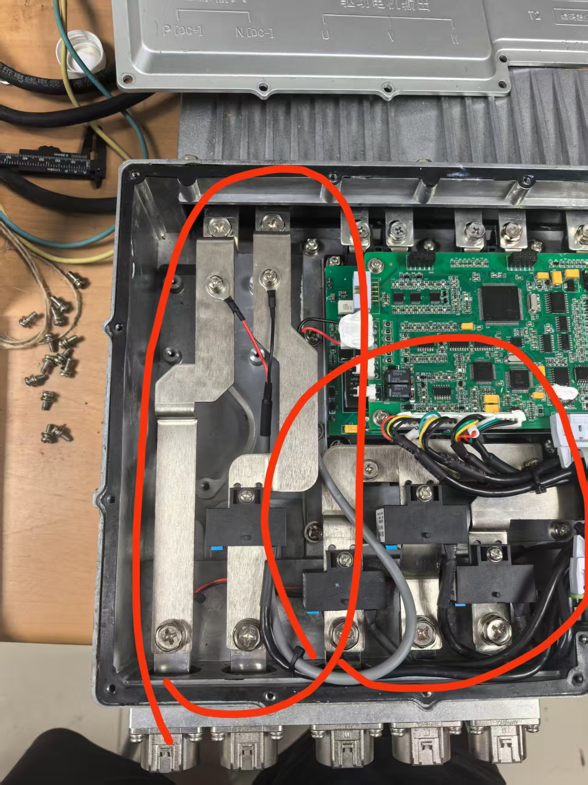

> [!tip] 要点  
> 首先是草绘的时候如果要实现拉升为实体，草绘必须是封闭的  
> 其次可以通过右击草绘，进行编辑定义来重新绘制  
> 选择平面，点击上面的栏中的平面，可以创建基准面，可以在基准面上进行新的草图的绘制以及新的 3 D 实体  
> 按住 shift＋鼠标的中间可以实现拖动  
> 按住 ctrl＋中间进行上下滑动（必须是直上直下的），可以实现放大和缩小  

## 装配  
### 约束进行装配  
使用**约束条件**组合的零件和其他子装配的零件  
!!! tip "做法"
1. 新建装配，选择设计    
2. 选择元件中的组装，选择元件
    1. 第一个元件选择默认的约束（开始是自动）
    2. 之后再选择其他的元件，使用三维的元件进行旋转和拖动（扇面可以进行面上的移动，球状可以任意移动）
3. 这个时候，有了两个零件，可以使用选择两个面，建立配合。还可以建立多个的配合

### 测量的数据  
- 左：
    - 首先是三个的厚度：2.94 mm
    - 三个的宽度：19.94 mm
    - 第一个弯折处到底端的距离为 64.27 mm
    - 弯折处到顶端的距离为 37.79 mm
    - 最高处和最低处的高度差为 8.51 mm
    - 大圆的底端到底端的距离为 3 mm
    - 全部的长为104.26 mm
- 中间：
    - 底端到第一个转折的距离为 33.98 mm
    - 第一个转折的上端到顶端的距离为 49.34 mm
    - 全长为103.88 mm
    - 最左端到下坠地方的宽度为31.75 mm
    - 下坠到最右端的距离为 49.44 mm
    - 第一个转折的最上端和最下端的差16.58 mm
    - 第二个是 22.48 mm
- 最后
    - 第一个弯折处到底端是 55.87 mm
    - 第一段的全长为 82.12 mm
    - 最左到弯折处60.46 mm
    - 最右到弯折处26.81
    - 上面一端的长度为 44.95 mm
    - 落差为9.99 mm
    - 第二个的落差为 14.76 mm

### 加工图的绘制  
常用的修改是那个编辑定义  

- 之前的是平整-折弯角 45°  
      
    如图所示
-   
    扭转的设置

> [!tip] 注意  
> 好像直接点上面的展平就是可以的  

### 铜排的绘制  
Mcu 中的铜排的建模以及画加工图  
!!! tip "绘制的步骤"  
    1. 首先新建的时候应该选择零件中的钣金件  
    2. 首先使用拉伸的步骤（先点击拉伸，之后选择平面，在平面上进行草绘）  
        1. 之后点击上面的确认，给个 30 的深度和 3 的厚度  
              
    3. 之后进行两边的安装孔的绘制  
        1. 之后选择拉伸切口的选项，选择要求的平面，进入草绘  
        2. 确定之后，选择对称拉伸，将两边都拉透  
        3. 这样的铜排就有了，之后我们画他的绝缘层  
    4. 绝缘层  
        1. 首先全选，ctrl 复制粘贴一个面（在想要复制得到面组的话应该先将各个坐标进行隐藏）  
        2. 使用柔性建模中的偏移，使得所有的孔都能露出来（此时右下角应该选择只有面组，确保操作的是面组）  
        3. 再次选择面组的选项，选择柔性建模。将面组向外偏移一毫米  
        4. 之后还是选择面组，之后选择视图，修改面组的颜色，将绝缘层的区分画出来  
            变成了这样的铜排  

#### 新的  

> [!tip] 要做的事情  
> MCU 中的铜排的建模和画加工图  
> 新的 MCU 的接头，所以需要画一个新的  
> 铜排是连接 MCU 中的插头和电容的  

  
看这个图  
前面的尖尖的部分就是电容，后面带着圆孔的地方就是安装接头的地方  
  
下面的这个是实物图，要使用铜排将前面的电容和后面的接头相连

### MCU 的测量  
最近的面之间的距离：215.900  
上下面之间的距离14.9735  

#### 在 MCU 的基础上进行铜排的绘制  
!!! tip "步骤"    
    - 首先要进行大致尺寸的测量，一般进行高度落差的测量（这是精确的），还有就是两者之间距离的测量  
    - 之后新建钣金件文件，在文件中利用上述的进行绘制  
        - 落差处可以直接使用拉伸进行绘制，还可以使用折弯进行绘制（折弯需要选择参考，也就是将哪条线或者是面作为参考的坐标系进行绘制）  
        - 转折处可以拼接一下，也可以使用延伸、之后再裁剪的方式进行  
    - 之后将大致绘制的铜排文件导入，进行位置的确定，看还差多少，在单独的文件中进行调整

