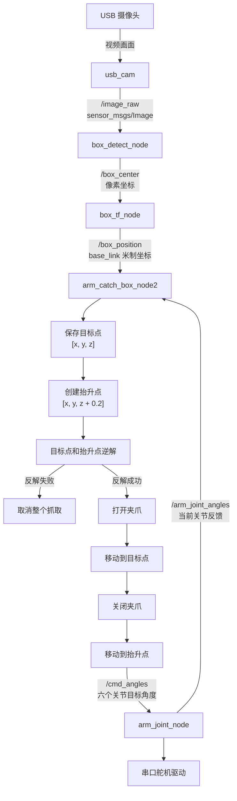

## 环境搭建
### 虚拟机
- 文件——新建新的虚拟机
- 自定义——下一步

> 地址为 `D:\17871\UbuntuISO\ubuntu-24.04.4-desktop-amd64.iso`

然后一直下一步就行，创建新的磁盘，大小选择 wield 40 G，然后一直到完成：  
  
这样就进入我们的系统了

### 修改源
我们选择软件和更新，选择其他中的阿里云服务器，然后重新载入

### 安装必备的软件
有着如下的命令行：  
  
点击我们的终端：`sudo apt update`：进行软件的更新，然后 `reboot` 以下进行更新

安装 Openssh  
之后验证状态：`sudo service ssh status`  


按 q 可以继续  
之后服务就开启了，但是需要做开机启动的服务 `sudo systemctl enable ssh`

### ROS 2 的环境搭建


之后安装必备仓库：  


### ROS 必备环境


之后进行安装的验证：  
`ros2 run turtlesim turtlesim_node`  
  
这个界面，安装成功

## 开发入门
### 基础概念


开发流程：

1. 创建工作空间
2. 在工作空间中创建包
3. 在包中创建节点
4. 为节点提供通讯能力
5. 为节点提供业务能力  
	

### 创建空间

在虚拟机中文件夹中新建文件  
使用 tree 显示整个树状结构：  


我们重点关心的是 src 目录（这就是我们的工作空间了）

### 包的创建
这个工具都是 ROS 提供的  


`cd src`：进入工作空间  
  
输入 ROS 2(tap tap) 显示工具链

`ros2 pkg create --build-type ament_python --node-name my_node my_package`  
通过上述的命名创建 `my_package` 的包和 `my_node` 的节点


我们可以看见节点在 my_package 中的 my_node.py 的节点：  
外部还有 setup.py 的文件

```python
from setuptools import find_packages, setup

package_name = 'my_package'

setup(
    name=package_name,
    version='0.0.0',
    packages=find_packages(exclude=['test']),
    data_files=[
        ('share/ament_index/resource_index/packages',
            ['resource/' + package_name]),
        ('share/' + package_name, ['package.xml']),
    ],
    install_requires=['setuptools'],
    zip_safe=True,
    maintainer='chenbo',
    maintainer_email='chenbo@todo.todo',
    description='TODO: Package description',
    license='TODO: License declaration',
    extras_require={
        'test': [
            'pytest',
        ],
    },
    entry_points={
        'console_scripts': [
            'my_node = my_package.my_node:main'
        ],
    },
)
```

重点关注：

```python
    entry_points={
        'console_scripts': [
            'my_node = my_package.my_node:main'
        ],
```

说明了节点存在的位置为 my_package.my_node，找的时候找:main，启动这个节点

### 编译流程
- 在 ws 工作目录下 `colcon build` 进行**编译**
- 然后使用 source，最后运行这个节点
- 修改之后需要重复上面的操作  
	  
	使用上下键可以直接到之前的语句

这里怎么使用 AI 呢

### AI 使用加入
我的虚拟系统的名称为 chenbo  
虚拟机的 ip 地址：`192.168.163.128`  
`ssh CHENBO@192.168.163.128`，再回车即可  
等待打开主机以及配置完成

然后就打开远程了  
（并且现在我们的两者就完全同步了）

## 通讯部分
### 直觉与工具
机器人是一个团队，不是一个人——由武术独立的“小人”(node) 组成团队


这些小人之间是如何进行交流的：发布/订阅的模式  
为什么使用这种方式：  


异步和解耦

- node（节点）：工人
- topic（话题）：传送带
- message(消息)：传送带的包裹

### 实操
小乌龟：(这是一个乌龟的节点)：不断广播自己的位置，同时接收外界的速度的消息（`ros2 run turtlesim turtlesim_node`）


- ros 2 topic list：查出有哪些广播（topics）
- ros 2 topic echo：听诊器（数据流），海龟在实时上传它的坐标

首先我们需要启动新的窗口，然后输入我们的查询广播话题的命令：

```cmd
/parameter_events
/rosout
/turtle1/cmd_vel
/turtle1/color_sensor
/turtle1/pose
```

### 我们主动发出一些数据

```cmd
ros2 topic pub /turtle1/cmd_vel geometry_msgs/msg/Twist 'linear:r:
  x: 1.0
  y: 0.0
  z: 0.0
angular:
  x: 0.0
  y: 0.0
  z: 3.1415926
' 

```

通过这种方式给小乌龟输入速度和角度的输入量，控制运行  

---

目前有的**节点**为：

```cmd
chenbo@chenbo-VMware-Virtual-Platform:~$ ros2 node list
/rqt_gui_py_node_12740
/teleop_turtle
/turtlesim
```

现在有的 topic(这个就是通信的通道，也就是传送带，在节点之间传送信息) 为：

```cmd
chenbo@chenbo-VMware-Virtual-Platform:~$ ros2 topic list
/parameter_events
/rosout
/turtle1/cmd_vel
/turtle1/color_sensor
/turtle1/pose
```

  
这个就是两个节点之间的通讯（椭圆形的表示的是节点）（左边给到右边的是控制的数据），右边通过通道给到左边的是此时位置的数据

---
我们还可以通过 `ros2 run rqt_publisher rqt_publisher` 帮助我们发送消息

在这里选择我们的 `/turtle1/cmd_vel` 的 topic 传递信息如下：  


### 标准开发实践


我们创建一下我们的包以及节点：

```cmd
chenbo@chenbo-VMware-Virtual-Platform:~/dev_ws/src$ ros2 pkg create --build-type ament_python --node-name turtle_ctrl_node turtle_pkg
```

我们现在内部有着一个空的节点，现在编写这个节点：  


好像是注册一个专栏，准备广播（或者说是工人和运输带）

初始的为：

```python
def main():
    print('Hi from turtle_pkg.')


if __name__ == '__main__':
    main()

```

> 帮我为 src/turtle\_pkg/turtle\_pkg/turtle\_ctrl\_node.py 创建节点，并且实现为节点提供 publisher 的功能——给小乌龟发送速度控制指令

改变之后的代码为：

```python
import rclpy
from geometry_msgs.msg import Twist
from rclpy.node import Node


class TurtleCtrlNode(Node):
    """定时向 turtlesim 发布速度控制指令的节点。"""

    def __init__(self):
        super().__init__('turtle_ctrl_node')

        # 创建速度指令发布者，话题名称与 turtlesim 默认订阅话题一致。
        self.publisher = self.create_publisher(
            Twist,
            '/turtle1/cmd_vel',
            10,
        )

        # 每隔 0.5 秒调用一次 publish_velocity 方法。
        self.timer = self.create_timer(0.5, self.publish_velocity)
        self.get_logger().info(
            'Publishing velocity commands to /turtle1/cmd_vel'
        )

    def publish_velocity(self):
        """创建并发布一条速度控制指令。"""
        message = Twist()

        # 设置前进线速度，单位为米每秒。
        message.linear.x = 2.0

        # 设置绕 Z 轴旋转的角速度，单位为弧度每秒。
        # 同时设置线速度和角速度，可以让小乌龟沿圆形轨迹运动。
        message.angular.z = 1.0

        # 将速度指令发送到 /turtle1/cmd_vel 话题。
        self.publisher.publish(message)
        self.get_logger().info(
            f'linear.x={message.linear.x:.1f}, '
            f'angular.z={message.angular.z:.1f}'
        )


def main(args=None):
    # 初始化 ROS 2 Python 客户端。
    rclpy.init(args=args)
    node = TurtleCtrlNode()

    try:
        # 持续处理定时器等 ROS 2 回调，直到节点被终止。
        rclpy.spin(node)
    except KeyboardInterrupt:
        pass
    finally:
        # 退出前销毁节点并安全关闭 ROS 2。
        node.destroy_node()
        if rclpy.ok():
            rclpy.shutdown()


if __name__ == '__main__':
    main()

```

  
使用这种方式进行执行

使用定时器的概念：  


create timer

---

#### 整体的流程：


写完新的代码之后要先编译和构建（编译操作），之后在运行之前，要先刷新环境，才能运行我们新的节点

### 架构进阶

> 帮我实现一个小乌龟控制节点：turtle\_gui\_ctrl\_node，参考 src/turtle\_pkg/turtle\_pkg/turtle\_ctrl\_node.py,结合图形化进行实现（图像如图，要求采用 pyqt 进行实现

新创建的是：

```python
import sys

import rclpy
from geometry_msgs.msg import Twist
from PyQt5.QtCore import QTimer
from PyQt5.QtGui import QDoubleValidator
from PyQt5.QtWidgets import (
    QApplication,
    QFormLayout,
    QLineEdit,
    QMessageBox,
    QPushButton,
    QVBoxLayout,
    QWidget,
)
from rclpy.node import Node


class TurtleGuiCtrlNode(Node):
    """接收图形界面中的速度值，并发布给 turtlesim。"""

    def __init__(self):
        super().__init__('turtle_gui_ctrl_node')

        # 创建速度指令发布者，控制 turtlesim 中默认的 turtle1。
        self.publisher = self.create_publisher(
            Twist,
            '/turtle1/cmd_vel',
            10,
        )
        self.get_logger().info('小乌龟图形化控制节点已启动')

    def publish_velocity(self, linear_velocity, angular_velocity):
        """发布由图形界面输入的线速度和角速度。"""
        message = Twist()
        message.linear.x = linear_velocity
        message.angular.z = angular_velocity
        self.publisher.publish(message)

        self.get_logger().info(
            f'发送速度：线速度={linear_velocity:.2f} m/s，'
            f'角速度={angular_velocity:.2f} rad/s'
        )

    def stop_turtle(self):
        """发布零速度，使小乌龟停止运动。"""
        self.publish_velocity(0.0, 0.0)


class TurtleControlWindow(QWidget):
    """小乌龟速度控制窗口。"""

    def __init__(self, node):
        super().__init__()
        self.node = node
        self.setWindowTitle('小乌龟控制器')
        self.setMinimumWidth(400)

        # 限制输入内容为 -1000.0 到 1000.0 之间的小数。
        validator = QDoubleValidator(-1000.0, 1000.0, 3, self)

        self.linear_input = QLineEdit('0.0')
        self.linear_input.setValidator(validator)
        self.linear_input.setPlaceholderText('请输入线速度')

        self.angular_input = QLineEdit('0.0')
        self.angular_input.setValidator(validator)
        self.angular_input.setPlaceholderText('请输入角速度')

        # 使用表单布局排列速度标签和输入框。
        form_layout = QFormLayout()
        form_layout.addRow('线速度', self.linear_input)
        form_layout.addRow('角速度', self.angular_input)

        self.send_button = QPushButton('发送')
        self.send_button.clicked.connect(self.send_velocity)

        main_layout = QVBoxLayout()
        main_layout.addLayout(form_layout)
        main_layout.addWidget(self.send_button)
        self.setLayout(main_layout)

    def send_velocity(self):
        """读取输入框并调用 ROS 2 节点发布速度指令。"""
        try:
            linear_velocity = float(self.linear_input.text())
            angular_velocity = float(self.angular_input.text())
        except ValueError:
            QMessageBox.warning(self, '输入错误', '请输入有效的速度数值。')
            return

        self.node.publish_velocity(linear_velocity, angular_velocity)

    def closeEvent(self, event):
        """关闭窗口前发送零速度，避免小乌龟继续运动。"""
        self.node.stop_turtle()
        event.accept()


def main(args=None):
    # 分别初始化 ROS 2 和 PyQt5。
    rclpy.init(args=args)
    app = QApplication(sys.argv)
    node = TurtleGuiCtrlNode()
    window = TurtleControlWindow(node)

    # 通过 Qt 定时器处理 ROS 2 回调，避免阻塞图形界面。
    ros_timer = QTimer()
    ros_timer.timeout.connect(lambda: rclpy.spin_once(node, timeout_sec=0.0))
    ros_timer.start(10)

    window.show()

    try:
        exit_code = app.exec_()
    finally:
        ros_timer.stop()
        node.destroy_node()
        if rclpy.ok():
            rclpy.shutdown()

    sys.exit(exit_code)


if __name__ == '__main__':
    main()

```

```cmd
cd /home/chenbo/dev_ws
source /opt/ros/jazzy/setup.bash
source install/setup.bash
ros2 run turtle_pkg turtle_gui_ctrl_node
```

最后的运行成果：  


### 小乌龟发布位置信息

```cmd
chenbo@chenbo-VMware-Virtual-Platform:~/dev_ws$ ros2 topic list 
/parameter_events
/rosout
/turtle1/cmd_vel
/turtle1/color_sensor
/turtle1/pose
chenbo@chenbo-VMware-Virtual-Platform:~/dev_ws$ ros2 topic info /turtle1/pose
Type: turtlesim/msg/Pose
Publisher count: 1
Subscription count: 0
chenbo@chenbo-VMware-Virtual-Platform:~/dev_ws$ ros2 node list
/turtlesim

```

可见，/turtle 1/pose 这个 topic（专栏或者说通道）只有一个发布者（就是我们小乌龟这个节点），但是没有订阅者/节点

我们可以手动观测一折发布的这个专栏里面的消息：`ros2 topic echo /turtle1/pose`

```text
ros2 topic echo /turtle1/pose
x: 5.211894989013672
y: 9.775237083435059
theta: 2.8510582447052
linear_velocity: 0.0
angular_velocity: 0.0
---
x: 5.211894989013672
y: 9.775237083435059
theta: 2.8510582447052
linear_velocity: 0.0
angular_velocity: 0.0

```

这个就是数据的流向

#### 我们让实现坐标显示

> 帮我创建一个节点，取名为 turtle\_advce\_ctrl\_node 节点，同样参考上一个节点，并且额外增加小乌龟的 pose 的订阅，要求实现的 GUI 为图片

```python
import sys

import rclpy
from geometry_msgs.msg import Twist
from PyQt5.QtCore import QTimer
from PyQt5.QtGui import QDoubleValidator
from PyQt5.QtWidgets import (
    QApplication,
    QFormLayout,
    QLabel,
    QLineEdit,
    QMessageBox,
    QPushButton,
    QVBoxLayout,
    QWidget,
)
from rclpy.node import Node
from turtlesim.msg import Pose


class TurtleAdvceCtrlNode(Node):
    """发布速度指令并订阅小乌龟位姿的 ROS 2 节点。"""

    def __init__(self):
        super().__init__('turtle_advce_ctrl_node')

        # 向 turtlesim 发布速度控制指令。
        self.velocity_publisher = self.create_publisher(
            Twist,
            '/turtle1/cmd_vel',
            10,
        )

        # 订阅 turtle1 的实时位置、角度和速度信息。
        self.pose_subscription = self.create_subscription(
            Pose,
            '/turtle1/pose',
            self.pose_callback,
            10,
        )

        # GUI 创建后会把界面更新函数保存到这里。
        self.pose_update_handler = None
        self.get_logger().info('小乌龟高级图形化控制节点已启动')

    def publish_velocity(self, linear_velocity, angular_velocity):
        """发布图形界面中设置的线速度和角速度。"""
        message = Twist()
        message.linear.x = linear_velocity
        message.angular.z = angular_velocity
        self.velocity_publisher.publish(message)

        self.get_logger().info(
            f'发送速度：线速度={linear_velocity:.2f} m/s，'
            f'角速度={angular_velocity:.2f} rad/s'
        )

    def pose_callback(self, message):
        """收到 Pose 消息后通知 GUI 更新显示内容。"""
        if self.pose_update_handler is not None:
            self.pose_update_handler(message)

    def stop_turtle(self):
        """发布零速度，使小乌龟停止运动。"""
        self.publish_velocity(0.0, 0.0)


class TurtleAdvceControlWindow(QWidget):
    """可以控制速度并实时显示小乌龟位姿的窗口。"""

    def __init__(self, node):
        super().__init__()
        self.node = node
        self.node.pose_update_handler = self.update_pose

        self.setWindowTitle('小乌龟控制器')
        self.setMinimumWidth(420)

        # 限制输入框只能输入有效的小数。
        validator = QDoubleValidator(-1000.0, 1000.0, 3, self)

        self.linear_input = QLineEdit('0.0')
        self.linear_input.setValidator(validator)
        self.linear_input.setPlaceholderText('请输入线速度')

        self.angular_input = QLineEdit('0.0')
        self.angular_input.setValidator(validator)
        self.angular_input.setPlaceholderText('请输入角速度')

        # 创建用于显示 Pose 消息各字段的标签。
        self.x_value = QLabel('0.000000')
        self.y_value = QLabel('0.000000')
        self.linear_velocity_value = QLabel('0.000000')
        self.angular_velocity_value = QLabel('0.000000')
        self.theta_value = QLabel('0.000000')

        form_layout = QFormLayout()
        form_layout.addRow('线速度', self.linear_input)
        form_layout.addRow('角速度', self.angular_input)
        form_layout.addRow('当前X坐标', self.x_value)
        form_layout.addRow('当前Y坐标', self.y_value)
        form_layout.addRow('当前线速度', self.linear_velocity_value)
        form_layout.addRow('当前角速度', self.angular_velocity_value)
        form_layout.addRow('当前角度', self.theta_value)

        self.send_button = QPushButton('发送')
        self.send_button.clicked.connect(self.send_velocity)

        main_layout = QVBoxLayout()
        main_layout.addLayout(form_layout)
        main_layout.addWidget(self.send_button)
        self.setLayout(main_layout)

    def send_velocity(self):
        """读取用户输入，并通过 ROS 2 节点发送速度指令。"""
        try:
            linear_velocity = float(self.linear_input.text())
            angular_velocity = float(self.angular_input.text())
        except ValueError:
            QMessageBox.warning(self, '输入错误', '请输入有效的速度数值。')
            return

        self.node.publish_velocity(linear_velocity, angular_velocity)

    def update_pose(self, message):
        """把最新的 Pose 消息显示到界面标签中。"""
        self.x_value.setText(f'{message.x:.6f}')
        self.y_value.setText(f'{message.y:.6f}')
        self.linear_velocity_value.setText(f'{message.linear_velocity:.6f}')
        self.angular_velocity_value.setText(f'{message.angular_velocity:.6f}')
        self.theta_value.setText(f'{message.theta:.6f}')

    def closeEvent(self, event):
        """关闭窗口前停止小乌龟。"""
        self.node.stop_turtle()
        self.node.pose_update_handler = None
        event.accept()


def main(args=None):
    # 初始化 ROS 2 和 PyQt5。
    rclpy.init(args=args)
    app = QApplication(sys.argv)
    node = TurtleAdvceCtrlNode()
    window = TurtleAdvceControlWindow(node)

    # 定时处理发布和订阅回调，同时保持 GUI 响应。
    ros_timer = QTimer()
    ros_timer.timeout.connect(lambda: rclpy.spin_once(node, timeout_sec=0.0))
    ros_timer.start(10)

    window.show()

    try:
        exit_code = app.exec_()
    finally:
        ros_timer.stop()
        node.destroy_node()
        if rclpy.ok():
            rclpy.shutdown()

    sys.exit(exit_code)


if __name__ == '__main__':
    main()

```

终端运行为：

```python
cd /home/chenbo/dev_ws
source /opt/ros/jazzy/setup.bash
source install/setup.bash
ros2 run turtle_pkg turtle_advce_ctrl_node
```

可见，运行节点的时候，节点前面要加上包的名字（实际上就是定位）

  
现在就可以了

## ROS 2 视觉与控制
### OPENCV 的写法
首先安装 OpenCV：`pip install opencv-python`

#### 数字图像的本质
  
对于我们的图像的坐标系,原点在左上角的位置（使用的是行列——img[y,x]），首先是第几行之后才是第几列

对于彩色分为了红蓝绿（RGB 三原色）  
但是 OPenCV 中 使用的顺序是 BGR 的形式  


> 帮我创建一个文件名为 01_create_image 的图片，要求使用 opencv 创建一张 300×300 的图片，背景为黑色，将第三行和第十行的内容修改为红色，输出效果

> 要求将第 100 行 100 列到 200 行 200 列的内容修改为蓝色


> 帮我创建一个文件 02_read_camera，要求读取摄像头数据，并且进行显示

> 将摄像头数据中的 50 行 50 列到第 100 行 100 列的内容设置为红色


### 颜色几何学
  
但是 OpenCV 的色相是压缩过的

S: 饱和度（在颜料中加入了多少白漆）  
V：亮度


所以我们的目的是只锁 H（）  
我们定一个颜色,然后将得到的图像进行 HSV 分离，去追踪这个 H（所需的 H），其余的数据宽松一点  


> 创建一个文件，取名为 03_hsv_test，要求读取摄像头的数据，将摄像头数据有 BGR 转化为 HSV，对 HSV 进行分离显示


就分离出了这些东西

### 掩膜与形态学


将之前的图像，想要的部分定为 1，其余部分定为 0（直接提取出来）

但是现实中是会有噪声的：**形态学**

1. 腐蚀  


就是九宫格，九宫格全为白色的时候，中心才是白色，否则中心变为黑色（这样那些小点就没有了，但是原本的物体也会少一层）

2. 膨胀：  


正好相反，区域中有白色，中心点就变白

---
结合两者：  


腐蚀那些小物体，再膨胀大物体

总结整个操作：  


#### 实际操作
MASK 提取器

> 帮我创建一个文件，取名 04\_HSV\_MASK，要求读取摄像头数据，提供 HSV 调节方式，实时显示原图，结果图，MASK 图，要求提供腐蚀、膨胀操作

  
调节一下这些参数（H 范围小一点，其余的范围可以大一点）

### 物体实时坐标的获取

> 帮我创建一个文件，取名 05_hsv_mask_location，要求通过制定的 hsv 阈值范围，制定腐蚀、膨胀阈值范围，来框选出感兴趣的物体边框，边框采用红色进行框选，并且实时标注出物体的中心点坐标


## ROS 视觉操作
  
image topic 发送，然后视觉相关的节点进行处理  
  
虚拟机——可移动设备中——我的摄像头——连接

以下就是最后接收到的数据内容（接收到的摄像头节点的图像）  


还可以多开几个图像进行对比（多个程序）  


### 图像转换
  
ROS 的图像和 OpenCV 的图像矩阵

现在新的需求：  


完成原生图像节点的部分——将摄像头驱动节点的广播的图像数据订阅，然后处理转换之后发布给 OpenCV

> 帮我在 src 下面创建视觉包：vision_pkg，要求采用 python 语言进行开发，同时帮我创建一个节点：camera_native_node

> 这个节点需要订阅摄像头数据，获取数据之后通过 OpenCV 进行显示

后续可以通过创建 launch 文件一次性启动多个节点

### HSV 显示

> 在这个视觉包中创建节点，命名为 hsv\\\_image\\\_node。要求订阅摄像头广播数据，将订阅的图像数据，经过转换，交给 OpenCV 进行处理，处理的方式参考 "/home/chenbo/dev\_ws/src/vision\_pkg/vision\_pkg/05\_hsv\_mask\_location.py


### 继续进一步进阶


驱动节点有了，识别节点有了，但是这个节点我们**需要去发布物体的位置信息**

> 在这个包下创建节点 box_detect_node，要求参考 src/vision_pkg/vision_pkg/hsv_image_node.py 节点的实现，但是不需要 hsv 和腐蚀膨胀调节的页面，需要将 hsv 和腐蚀膨胀节点固定化，要求这些值方便我进行配置，当获取到图图片中需要识别的坐标位置时，需要将这个坐标位置通过广播发布出去

然后我们使用 `ros2 run rqt_topic rqt_topic` 命令  
在新开的窗口中找到对应的 topic 进行观察：  


## ROS 坐标转换


两个坐标系：同一个物体在不同的坐标系下的坐标是不同的

但是两个坐标系之间不只有平移，还有旋转导致的

---
解决方法：ROS TF 2 工具  


输入偏移的坐标以及偏移的角度  
**流程**：  


> 在同样的包下下方一个节点 box\_tf\_node，订阅 src/vision\_pkg/vision\_pkg/box\_detect\_node.py 中的坐标数据，需要提供摄像头摄像头在机械臂坐标系统中的坐标，并且是可配置的。需要配置像素和物理尺寸的比例值，也是可以配置的。将订阅的数据坐标通过 TF 转换为机械臂物理坐标系中的真实坐标

配置文件：

- camera_x/y/z：相机原点在机械臂坐标系中的位置，单位米
- camera_roll/pitch/yaw：相机姿态，单位弧度
- pixel_origin_x/y：相机光轴对应的像素位置
- meters_per_pixel_x/y：每像素对应的物理尺寸
- plane_z：目标平面在相机 Z 轴上的深度


### 正解反解部分


正解：固定的输入（手臂的角度），输出为箭靶的位置，这是唯一的  
反解：已知目标的位置，反推出要求输入的关节的角度怎么样（可能会有多个解）

关节空间和笛卡尔坐标系的空间  


正向的解就是向量的叠加  
**逆向解**：  


> 帮我创建一个 python 的工具方法，用于解析 genkiarm.urdf 这个文件，并且基于这个文件，实现正解操作

直到六个关节的角度，输出末端的坐标

---
反解操作为：

> 帮我创建一个 python 的工具方法，用于解析 genkiarm.urdf 这个文件，并且基于这个文件，实现反解操作，我希望反解做到的是将末端的位置信息 转换为关节角度

```cmd
PS C:\Users\17871\Desktop\ROS2> python ".\urdf正解反解\urdf_ik.py" 0.0750637 0.0697314 0.40415263
反解成功，正解回代误差 5.64959e-12 m；函数评估次数 38
目标位置 [m]: [0.0750637  0.0697314  0.40415263]
回代位置 [m]: [0.0750637  0.0697314  0.40415263]
位置误差 [m]: 5.64959079e-12
关节角 [deg]:
  Rotation: 44.59989306
  Rotation2: 11.22046519
  Rotation3: 9.61692656
  Rotation4: 8.90890081
  Rotation5: 24.90770753
  Rotation6: 0.00000000
PS C:\Users\17871\Desktop\ROS2> 
```

#### 实现抓取操作


现在我们实现了前 3 个节点，还有就是最后的节点，但是抓取的节点还没有（需要订阅物体相对于机械臂基座的坐标，最后再播报出（反解关节位置））

> 再 arm\_pkg 中创建 arm\_catch\_box\_node 节点，要求实现 src/vision\_pkg/vision\_pkg/box\_tf\_node.py 发布的坐标信息，将这个坐标信息进行反解，反解的操作类似 src/arm\_pkg/arm\_pkg/urdf\_ik.py，将反解的结果播报出来，对应的 urdf 在 src/arm\_pkg/urdf/genkiarm.urdf

> 由于验证起来比较复杂，需要启动多个节点，帮我创建一个 launch 文件，在 arm_pkg 中创建，取名为 arm_catch_box，要求启动 usb camera 节点，要求启动 arm_joint_node.py（接收角度，驱动舵机） 节点，启动物体识别 box_detect_node 节点，启动 box_tf 节点，启动 arm_catch_box_node 节点（就是图中所有的节点都启动）

#### 开启我们最后的验证

> 在 src/arm_pkg/arm_pkg/arm_catch_box_node.py 中，收到 tf 转换后的坐标，将 z 轴默认提高 0.2，再反解后的角度信息，通过主题发布给我们的 joint 节点，驱动机械臂转动

---
现在会驱动了，还要抓取

> 在 arm_pkg 中创建一个节点 arm_catch_box_node 2（根据），要求参考 arm_catch_box_node 实现，首先记住这个坐标点，我们认为是目标点，接着创建一个新的坐标点，相比目标点升高 0.2 m，整个流程是机械臂收到坐标信息后，将末端的关节打开，去到目标位置，再将末端的关节关闭，接着抬起机械臂到创建的新坐标（抓取的动作）要求做操作的过程中不要去接收 tf 转换后的数据

然后把之前那个 arm_catch_box_node 代替掉即可

## 总结
总结上面的 5 个节点：

| 节点                    | 接收                                  | 发布                           | 作用                                     |
| --------------------- | ----------------------------------- | ---------------------------- | -------------------------------------- |
| `usb_cam`             | USB 摄像头画面                           | `/image_raw`、`/camera_info`  | 采集摄像头图像并转换为 ROS 图像消息                   |
| `box_detect_node`     | `/image_raw`                        | `/box_center`                | 通过 HSV 等方法识别箱子，发布箱子中心像素坐标              |
| `box_tf_node`         | `/box_center`                       | `/box_position`、`/tf_static` | 把像素坐标转换成机械臂 `base_link` 坐标系下的米制 XYZ 坐标 |
| `arm_catch_box_node2` | `/box_position`、`/arm_joint_angles` | `/cmd_angles`                | 保存目标点、创建抬升点、执行逆解并按顺序发布抓取动作             |
| `arm_joint_node`      | `/cmd_angles`                       | `/arm_joint_angles`          | 将目标角度发送给机械臂舵机，同时发布当前关节角反馈              |



## 机器人导航
### 导航概述
机器人导航是指在没有认为干预的情况下，机器人可以自主地从一个位置移动到另一个位置  
Nav 2（导航 2）

#### 作用：
- 支持激光雷达、摄像头的多种输入，实时获取环境信息，实现智能路劲规划和精确运动控制
- 性能卓越
- 安全，多种避障算法和参数调节功能

#### 导航架构
输入—执行—输出

- 输入：
	- 单目标点/多目标点
	- 自动化系统：由机器来下达导航指令
- 依赖：
	- map
	- TF（定位）（坐标变换信息）
	- 传感器数据
	- BT（行为树）：就是整个执行流程
		- 顺序执行：先有**全局路径**，后有**本地**路径（聚焦于当前的情况）
		- 分支执行：
- 核心：（依赖于上面的依赖）
	- 行为树服务器：用来执行行为树的
	- 生命周期管理器（管理所有节点的）
		- 全局路径规划
		- 本地路径规划
		- 恢复行为规划（做出什么样子的行为）（用于脱困的）
		- 平滑器
		- 不同地图切换衔接
- 输出：
	- 对速度进行平滑处理
	- 障碍物监测
	- 控制机器人运动


#### 安装


#### 导航条件
- ROS 2 通信：节点、话题、服务、动作等等基本概念
- 生命周期的管理：熟悉 ROS 2 中的生命周期节点，理解节点的启动、配置、激活等等
- rbiz 2：进行可视化调试
- URDF：描述机器人模型
- TF 变换：确保机器人定位自身和周围的环境

slam toolbox 是提供了丰富的数据处理和滤波函数，以及地图构建和环境建模工具

**功能**：

- 算法集成：滤波，基于图优化
- 数据处理：支持激光雷达、摄像头、IMU 等多种传感器数据的处理
- 地图构建：利用传感器数据和机器人运动信息构建准确的地图，并进行更新和优化
- 模块化设计

### slam toolbox 功能说明

```cmd
slam_toolbox async_slam_toolbox_node
slam_toolbox lifelong_slam_toolbox_node
slam_toolbox localization_slam_toolbox_node
slam_toolbox map_and_localization_slam_toolbox_node
slam_toolbox merge_maps_kinematic 多地图合并
slam_toolbox sync_slam_toolbox_node

```

这就是里面所有的节点

- sync_slam_toolbox_node：同步节点：等所有的传感器数据到达后处理，延迟高，适合对数据一致性和准确性要求高的，实时性要求不高的
- slam_toolbox async_slam_toolbox_node：异步节点，相反，立即处理已经接收的数据，适合对实时性要求高，一致性和准确性要求低的场景
	- 订阅：/scan,/tf：扫描数据，经过变换的数据
	- 发布数据：/map,/pose：地图以及机器人的位置
	- 发布服务：save_map：保存地图

### slam 基本使用
视觉，激光 slam 技术（激光深度）  


现在模拟了，但是有着很大的误差，而 slam 就是通过技术实现滤波建图

依靠全局路径规划、局部路径、恢复行为实现

### 构建地图
`ros2 launch fishbot_description gazebo_sim.launch.py`：运行代码  
`ros2 launch slam_toolbox online_async_launch.py use_sim_time:=True` 使用在线异步建图的 slam 工具  
`rviz2`：查看地图，使用 Gazebo 进行建图


链式的信息图

在这个 rviz 2 框中，找到 map,robot,TF 进行设计


这就是建立好的图，slam 还有的作用就是能够

### 将地图保存
新建文件，运行 `ros2 run nav2_map_server map_saver_cli -f room` 保存这个地图

```yaml
image: room.pgm
mode: trinary
resolution: 0.050
origin: [-6.500, -5.500, 0]
negate: 0
occupied_thresh: 0.65
free_thresh: 0.196
```

### nav 2 介绍
行为树：

规划器服务器规划全局的地图，之后给到控制器服务器，该服务器再结合实时的感知数据生成代价地图，最后当代价地图生成的路线不行时，启动恢复器服务器进行恢复操作

#### 配置参数

> cp /opt/ros/jazzy/share/nav 2_bringup/params/nav 2_params.yaml .

新建一个参数的文件（各个节点的参数）  
搜索 topic 就可以看见  
将机器人的半径改为 0.12

#### 编写 launch 启动导航

```python
import os
import launch
import launch_ros
from ament_index_python.packages import get_package_share_directory
from launch.launch_description_sources import PythonLaunchDescriptionSource


def generate_launch_description():
    # 获取与拼接默认路径
    fishbot_navigation2_dir = get_package_share_directory(
        'fishbot_navigation2')
    nav2_bringup_dir = get_package_share_directory('nav2_bringup')
    rviz_config_dir = os.path.join(
        nav2_bringup_dir, 'rviz', 'nav2_default_view.rviz')
    
    # 创建 Launch 配置
    use_sim_time = launch.substitutions.LaunchConfiguration(
        'use_sim_time', default='true')
    map_yaml_path = launch.substitutions.LaunchConfiguration(
        'map', default=os.path.join(fishbot_navigation2_dir, 'maps', 'room.yaml'))
    nav2_param_path = launch.substitutions.LaunchConfiguration(
        'params_file', default=os.path.join(fishbot_navigation2_dir, 'config', 'nav2_params.yaml'))

    return launch.LaunchDescription([
        # 声明新的 Launch 参数
        launch.actions.DeclareLaunchArgument('use_sim_time', default_value=use_sim_time,
                                             description='Use simulation (Gazebo) clock if true'),
        launch.actions.DeclareLaunchArgument('map', default_value=map_yaml_path,
                                             description='Full path to map file to load'),
        launch.actions.DeclareLaunchArgument('params_file', default_value=nav2_param_path,
                                             description='Full path to param file to load'),

        launch.actions.IncludeLaunchDescription(
            PythonLaunchDescriptionSource(
                [nav2_bringup_dir, '/launch', '/bringup_launch.py']),
            # 使用 Launch 参数替换原有参数
            launch_arguments={
                'map': map_yaml_path,
                'use_sim_time': use_sim_time,
                'params_file': nav2_param_path}.items(),
        ),
        launch_ros.actions.Node(
            package='rviz2',
            executable='rviz2',
            name='rviz2',
            arguments=['-d', rviz_config_dir],
            parameters=[{'use_sim_time': use_sim_time}],
            output='screen'),
    ])
```

然后进行拷贝的命令

进行仿真：

```python
cd ~/chapt6/chapt6_ws
source /opt/ros/jazzy/setup.bash
source install/setup.bash

ros2 launch fishbot_description gazebo_sim.launch.py
```

之后启动 nav 2  
: `ros2 launch  fish_navigation2 navigation2_launch.py`

```python
cd ~/chapt6/chapt6_ws
source /opt/ros/jazzy/setup.bash
source install/setup.bash

ros2 launch fish_navigation2 navigation2_launch.py
```

`rqt` 查看链条

启动 slam

现在是好的  
  
我们现在就完全启动了

### 单点与路点导航
Nav 2 goal 工具（也是按住拖动）  
  
蓝色的部分为局部的路径规划（局部代价的部分）

点击取消，还有左下角的路点的模式  
还是使用 goal 工具，之后点击 start

#### 导航时，动态避障

常用的一些查看节点通信图的指令：
- `ros2 run rqt_tf_tree rqt_tf_tree`：查看 TFtree
- `ros2 run rqt_graph rqt_graph`：节点 - 话题关系图
- `ros2 topic echo /scan` : 查看某个节点发布的 topic 的内容
- `ros2 lifecycle get /节点名`：检查生命周期，常见的输出为：

```python
unconfigured [1]
inactive [2]
active [3]
finalized [4]
```

- 查看有哪些生命周期节点：`ros2 lifecycle nodes`，查看节点支持哪些状态转换：`ros2 lifecycle list /amcl`

#### 优化导航速度和膨胀半径
修改的部分就是控制器服务器相关节点中进行

```python
controller_server:
  ros__parameters:
    controller_frequency: 20.0
    costmap_update_timeout: 0.30
    min_x_velocity_threshold: 0.001
    min_y_velocity_threshold: 0.5
    min_theta_velocity_threshold: 0.001
    failure_tolerance: 0.3
    progress_checker_plugins: ["progress_checker"]
    goal_checker_plugins: ["general_goal_checker"] # "precise_goal_checker"
    controller_plugins: ["FollowPath"]
    use_realtime_priority: false

    # Progress checker parameters
    progress_checker:
      plugin: "nav2_controller::SimpleProgressChecker"
      required_movement_radius: 0.5
      movement_time_allowance: 10.0
    # Goal checker parameters
    #precise_goal_checker:
    #  plugin: "nav2_controller::SimpleGoalChecker"
    #  xy_goal_tolerance: 0.25
    #  yaw_goal_tolerance: 0.25
    #  stateful: True
    general_goal_checker:
      stateful: True
      plugin: "nav2_controller::SimpleGoalChecker"
      xy_goal_tolerance: 0.25
      yaw_goal_tolerance: 0.25
    FollowPath:
      plugin: "nav2_mppi_controller::MPPIController"
      time_steps: 56
      model_dt: 0.05
      batch_size: 2000
      ax_max: 3.0
      ax_min: -3.0
      ay_max: 3.0
      ay_min: -3.0
      az_max: 3.5
      vx_std: 0.2
      vy_std: 0.2
      wz_std: 0.4
      vx_max: 0.5
      vx_min: -0.35
      vy_max: 0.5
      wz_max: 1.9
      iteration_count: 1
      prune_distance: 1.7
      transform_tolerance: 0.1
      temperature: 0.3
      gamma: 0.015
```

在这个服务器中进行参数的修改，然后可以查看 cmd_vel 这个 topic 看修改的效果

---
膨胀半径，一般设置为机器人的半径：在代价地图中  
同样的 nav_params.yaml 中 `inflation_radius: 0.7`（全局和本地代价地图中都要修改）

#### 优化机器人到点精度
之前的精度是不够高的：

```python
    general_goal_checker:
      stateful: True
      plugin: "nav2_controller::SimpleGoalChecker"
      xy_goal_tolerance: 0.25
      yaw_goal_tolerance: 0.25
```

这个就是到点精度的确定：

### 导航应用开发
#### 使用话题初始化机器人位姿

> ros 2 node info /amcl

查看这个节点的信息：

```ymal
/amcl
  Subscribers:
    /bond: bond/msg/Status
    /clock: rosgraph_msgs/msg/Clock
    /initialpose: geometry_msgs/msg/PoseWithCovarianceStamped
    /map: nav_msgs/msg/OccupancyGrid
    /parameter_events: rcl_interfaces/msg/ParameterEvent
    /scan: sensor_msgs/msg/LaserScan
    /tf: tf2_msgs/msg/TFMessage
    /tf_static: tf2_msgs/msg/TFMessage
  Publishers:
    /amcl/transition_event: lifecycle_msgs/msg/TransitionEvent
    /amcl_pose: geometry_msgs/msg/PoseWithCovarianceStamped
    /bond: bond/msg/Status
    /parameter_events: rcl_interfaces/msg/ParameterEvent
    /particle_cloud: nav2_msgs/msg/ParticleCloud
    /rosout: rcl_interfaces/msg/Log
    /tf: tf2_msgs/msg/TFMessage
  Service Servers:
    /amcl/change_state: lifecycle_msgs/srv/ChangeState
    /amcl/describe_parameters: rcl_interfaces/srv/DescribeParameters
    /amcl/get_available_states: lifecycle_msgs/srv/GetAvailableStates
    /amcl/get_available_transitions: lifecycle_msgs/srv/GetAvailableTransitions
    /amcl/get_parameter_types: rcl_interfaces/srv/GetParameterTypes
    /amcl/get_parameters: rcl_interfaces/srv/GetParameters
    /amcl/get_state: lifecycle_msgs/srv/GetState
    /amcl/get_transition_graph: lifecycle_msgs/srv/GetAvailableTransitions
    /amcl/get_type_description: type_description_interfaces/srv/GetTypeDescription
    /amcl/list_parameters: rcl_interfaces/srv/ListParameters
    /amcl/set_parameters: rcl_interfaces/srv/SetParameters
    /amcl/set_parameters_atomically: rcl_interfaces/srv/SetParametersAtomically
    /reinitialize_global_localization: std_srvs/srv/Empty
    /request_nomotion_update: std_srvs/srv/Empty
    /set_initial_pose: nav2_msgs/srv/SetInitialPose
  Service Clients:

  Action Servers:

  Action Clients:

```


现在已经完全可以实现导航的命令

现在怎么自动实现初始定位：  
`ros2 topic pub /initialpose geometry_msgs/msg/PoseWithCovarianceStamped  
"{header: {frame_id: 'map'}}" --once `: 调用这个命令初始化

```python
from geometry_msgs.msg import PoseStamped
from nav2_simple_commander.robot_navigator import BasicNavigator
import rclpy

def main():
    rclpy.init()
    navigator = BasicNavigator()

    # 设置初始位姿
    initial_pose = PoseStamped()
    initial_pose.header.frame_id = 'map'
    initial_pose.header.stamp = navigator.get_clock().now().to_msg()
    initial_pose.pose.position.x = 0.0
    initial_pose.pose.position.y = 0.0
    initial_pose.pose.orientation.w = 1.0

    navigator.setInitialPose(initial_pose)

    # 等待导航器准备就绪
    navigator.waitUntilNav2Active()
    rclpy.spin(navigator)

    rclpy.shutdown()
```

增加自动初始化定位的代码

然后再 setup  
`ros2 run fish_application init_robot_pose`

现在就可以自动初始化位姿了

#### 获取机器人的实时位置
`ros2 run fish_application get_robot_pose`

执行这个就会获得机器人的实时位置信息

map,odom（里程计下的）

#### 调用接口进行单点导航
`ros2 action list -t`：这是动作的列表

```cmd
ros2 action send_goal /navigate_to_pose nav2_msgs/action/NavigateToPose \
"{pose: {header: {frame_id: 'map'}, pose: {position: {x: 2.0, y: 1.0, z: 0.0}, orientation: {x: 0.0, y: 0.0, z: 0.0, w: 1.0}}}}" \
--feedback
```

然后就会自动执行

用代码完成与命令行相同的功能

action 实际上是由服务和话题共同实现的

```text
Package
= 装程序和资源的“文件夹/功能模块”

Node
= 真正运行起来干活的程序

Message
= Topic 上传输的数据格式

Topic
= 持续通信通道，一对多、多对多

Service
= 请求一次，回答一次

Action
= 长时间任务：
  Goal + Feedback + Result + Cancel
```

比如 nav 2 的：

```text
Package
nav2_bt_navigator
        │
        ↓
Node
/bt_navigator
        │
        ↓
Action
/navigate_to_pose
        │
        ↓
Action Type
nav2_msgs/action/NavigateToPose
        │
        ├── Goal
        │    目标位置
        │
        ├── Feedback
        │    剩余距离、导航时间...
        │
        └── Result
             成功或失败
```


```cmd
ros2 run fish_application nav_to_pose
```

使用代码发布目标位置

#### 使用接口完成路点导航
 多点的导航  
 `ros2 interface show nav2_msgs/action/FollowWaypoints`：调用这个命令显示该动作的信息（如何调用，输出是什么，反馈值等等）

`ros2 run fish_application waypoint_follower` 调用这个 node，做多路点的动作

### 巡检机器人的项目实战
- 巡检机器人能够在不同目标点之间进行循环移动
- 到达每个目标点时播放对应的语音提示
- 达到目标点时，通过摄像头拍摄实时地图并保存到本地


整体的框架

#### 编写巡检控制节点
