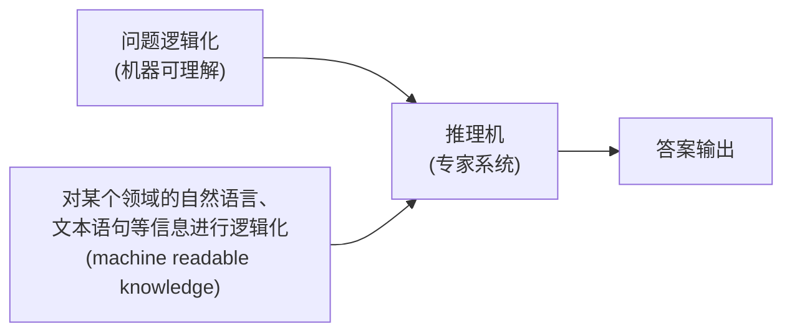

## 人工智能概述  
### 可计算思想
费马猜想与费马定理  
地方太小，写不下（费马大定理）  
英国的数学家怀尔斯证明了这个定理是成立的  

---
如何判断一个**问题**是否可以计算  
证明算术公理的相容性  

- 完备性
- 一致性
- 可判定性

图灵机的模型：程序  
任何可以计算的函数都可以使用**图灵机计算**  

|         计算载体         |    提出学者    |  计算角度   |
| :------------------: | :--------: | :-----: |
|        原始递归函数        | 哥德尔（Godel） |  数学的形式  |
| λ - 演算（λ - calculus） | 丘奇（Church） | 数理逻辑的形式 |
|         图灵机          | 图灵（Turing） |  机械的形式  |  

!!! tip "图灵测试"  
    放入机器和人  
    出 20 个问题分别进行回答  
    收集到机器和人回答的结果  
    请法官进行分辨  
    如果能区分的话，机器不具备人的认知水平  
    反之通过了图灵测试，具有**人类的智能水平**    

**习题**：  
  

!!! tip "解题"  
    1. 首先对数字进行编码（12 就是 12 个 1）  
    2. 初始化纸袋与状态  
        1. 初始状态为 $q_0$  
    3. 当前的符号为 1 的话，将其擦除，转移到状态 $q_1$，指针右移  
        1. 重复操作，擦除所有的 12 的 1  
        2. 指针指向+时, 擦除，转向状态 $q_2$，右移  
    4. 在“$q_2$”状态下，为 1 时，保持 1 不变，转移到状态 $q_3$  
        1. 右移，处理完成所有的 8 的 1  
    5. 此后指针开始左移，将原来的 12 位置的空白转变为 1，从而实现加法的效果

!!! test   
    这是手动新建的测试提示块

```ad-tip "sho"
111
```

### 智能计算方法  
- **领域**人工智能：
    - 照葫芦画瓢、任务导向（alphago）
- **通用**人工智能
    - 举一反三、从经验中学习
- **混合增强**人工智能（多种智能体的混合形式）（人类是**智能的总开关**）
    - 外骨骼机器人
    - 人类智能＋机器智能（达芬奇外科手术机器人）
    - 人、机、物联网

---
**主流**的方法：  

- **符号主义**人工智能为核心的逻辑推理
    - IBM“沃森”的推理
- **数据**驱动的机器学习：
    - 采集海量的人脸的数据，基于学习到的数据完成人脸分辨的任务（像素点的分布）
- **探索与利用**为核心的**强化**学习
    - 用问题牵引——>从经验中学习

|   学习模式    |         优势         |         不足          |
| :-------: | :----------------: | :-----------------: |
| 用**规则**教  | 与人类**逻辑推理**相似，解释性强 |    难以构建完备的知识规则库     |
|   用数据学    |      直接从数据中学       | 以深度学习为例：依赖于数据、解释性不强 |
| 用**问题**引导 |   从经验中进行能力的持续学习    |    非穷举式搜索而需更好策略     |

### 人工智能的历史进展  
人工智能发展的三次低谷  
人工智能的目的，是使机器能够具有（**模拟、延伸和扩展人类智能的能力**，具体可细分为感知、理解、推理、学习、决策等与人类智能相关的核心功能）。  

## 逻辑与推理  
### 命题逻辑  
- 定义：命题是一个**能确定**是真或者是假的陈述句
    - 原子命题：最简单的基本的命题
    - 复合命题：由原子命题组成的命题

---
通过命题连接词：  

|   p   |   q   | $\neg p$ | $p \land q$ | $p \lor q$ | $p \to q$ | $p \leftrightarrow q$ |
| :---: | :---: | :--------: | :-----------: | :----------: | :---------: | :---------------------: |
| False | False |    True    |     False     |    False     |    True     |          True           |
| False | True  |    True    |     False     |     True     |    True     |          False          |
| True  | False |   False    |     False     |     True     |    False    |          False          |
| True  | True  |   False    |     True      |     True     |    True     |          True           |

- **条件命题前者为假时，无论后者是真假，命题一定为真**
    - 如果 p，那么 q 是一种蕴含的关系（充分条件），也就是 p 是 q 的子集
    - p 不成立说明其是一个空集，是任何集合的子集，所以一定为真

---
???+ tip "**推理规则**"  
    - 假言推理：  
    - 与消解：  
    - 与导入：  
    - 双重否定：推导出本身是成立的  
    - 单向消解或单项归结：  
    - 消解或归结：

例题：  
  
V 是或，反过来是和，——>为条件推理  

---

#### 范式  
- 重要的概念，将命题公式化归为一种标准的形式，可以进行两个命题的等价判定
    - 析去范式：$\text{假设}\alpha_\mathrm{i(i=1,2,\cdots,k)}\text{为简单的合取式,则}\alpha=\alpha_1\lor\alpha_2\lor\cdots\lor\alpha_\text{k为析取范式}$
    - 合取范式：$假设\alpha_i(i=1,2,\cdots,k)为简单的析取式,则\alpha=\alpha_1\wedge\alpha_2\wedge\cdots\wedge\alpha_k为合取范式$
    - 两者合称范式
    - **析取范式由合取范式组成**，合取范式由析取范式组成
- 析取范式**不成立**当且仅当每个简单的合取**都不成立**
- 合取范式是成立的，当且仅当每个简单的析取式是**成立**的
- **任一命题**的公式都有**等**值的析取范式和合取范式（不唯一的）

### 谓词逻辑  
命题逻辑——>谓词逻辑  

**谓词逻辑中**：个体、谓词和量词  

- 个体：可以**独立存在**的具体或者抽象的概念（x 的**变元**）
- 谓词：刻画**个体属性或者是描述个体之间关系存在性**的元素，其**值为真或者是假**
    - 与**函数**的不同
        - 函数使用之后为因变量
        - 谓词使用之后变成了命题
- 事实符号化：
- 量词的引入：
    - 全称量词：所有的
    - 存在量词：存在
    - 两者统称为量词

=== "全称量词"  
    - 谓词 $P(x)$：x 能够**制造**工具。$\forall x P(x)$ 表示定义域中的所有个体能够制造工具。$P(\text{小王})$ 表示小王能够制造工具。  
=== "存在量词"  
    - 谓词 $P(x)$：x 能够制造工具。$\exists x P(x)$ 表示定义域中的存在某个 / 某些个体能够制造工具。$P(\text{小王})$ 表示小王能够制造工具（该命题或者为真、或者为假）。  

- 约束**变元**：有量词的约束 (x)
- 自由变元：没有量词的约束
- 自由变元既可以存在于量词的约束范围之内，也可以存在量词的约束范围之外

下面的公式是成立的：  

$$
\begin{gathered}(\forall x)(A(x)\lor B)\equiv(\forall x)A(x)\lor B\$\forall x)(A(x)\wedge B)\equiv(\forall x)A(x)\wedge B\$\exists x)(A(x)\lor B)\equiv(\exists x)A(x)\lor B\$\exists x)(A(x)\wedge B)\equiv(\exists x)A(x)\wedge B\end{gathered}
$$

在约束变元相同的情况下，量词的运算满足分配率  

$$
\begin{gathered}(\forall x)(A(x)\lor B(x))\equiv(\forall x)A(x)\lor(\forall x)B(x)\$\forall x)(A(x)\wedge B(x))\equiv(\forall x)A(x)\wedge(\forall x)B(x)\$\exists x)(A(x)\lor B(x))\equiv(\exists x)A(x)\lor(\exists x)B(x)\$\exists x)(A(x)\wedge B(x))\equiv(\exists x)A(x)\wedge(\exists x)B(x)\end{gathered}
$$

???+ example "描述以下的事实"  
    - 所有的国王都头戴皇冠。  
    - “所有的国王都头戴皇冠” 表示的含义为 “对于**所有的x**，如果x是国王，那么x头戴皇冠”，符号化表示为$(\forall x)(King(x) \to Head\_On(Crown, x))$。其中x是变量符号，由于x受到全称量词的约束，因此x是约束变元；Crown是一个常量符号，表示皇冠；$King(x)$是一个一元谓词，表示x是国王，$Head\_On(Crown, x)$是一个二元谓词，表示x头戴皇冠。

- 公式中存在多个量词时，多个量词都是同类型的，那么量词的顺序是可以互换的
- 反之是不可以互换的

$$
\begin{aligned}&(\forall x)(\forall y)A(x,y)\Leftrightarrow(\forall y)(\forall x)A(x,y)&&(\exists y)(\forall x)A(x,y)\Leftrightarrow(\forall x)(\exists y)A(x,y)\\&(\exists x)(\exists y)A(x,y)\Leftrightarrow(\exists y)(\exists x)A(x,y)&&(\exists x)(\forall y)A(x,y)\Leftrightarrow(\forall y)(\exists x)A(x,y)\\&(\forall x)(\forall y)A(x,y)\Rightarrow(\exists y)(\forall x)A(x,y)&&(\forall x)(\exists y)A(x,y)\Rightarrow(\exists y)(\exists x)A(x,y)\\&(\forall x)(\forall y)A(x,y)\Rightarrow(\exists x)(\forall y)A(x,y)&&(\forall y)(\exists x)A(x,y)\Rightarrow(\exists x)(\exists y)A(x,y)\end{aligned}
$$

#### 项与原子谓词公式  
- 项是描述对象的逻辑表达式
    - 常量符号和变量符号是项
    - 项组成的函数是项：$\mathrm{f(t1,t2,\cdots,tn)}$
    - 有限次使用上述的规则产生的符号串是项
- **原子谓词公式**：项数目等于对象的命题吗
- **合式**公式：
    - 命题常项、命题变项、原子谓词公式为合式公式
    - A 为合式公式，则非 A 也是**合式公式**
    - A、B 是合式公式，则 $A\land B、A\lor B、A\to B、B\to A、A\leftrightarrow B$ 是合式公式
    - A 为合式公式，x 为个体变项、$(\exists x)A(x)\neq0(\forall x)A(x)$ 也是合式公式
    - 有限次使用上述的法则构成的表达式组成的是合式公式

---
???+ example "使用合式公式描述"  
      
    
    ---
    - 解 (1) $Like(\text{Tom}, \text{Football}) \land Like(\text{Tom}, \text{Basketball})$。其中，$Like(\text{Tom}, x)$表示 Tom 喜欢x，Football 和 Basketball 分别表示踢足球和打篮球。
    - (2) $(\forall x)(Classmate(\text{Tom}, x) \to Like(x, \text{Tom}))$。其中，$Classmate(\text{Tom}, x)$表示x是 Tom 的同学，$Like(x, \text{Tom})$表示x喜欢 Tom。
    - (3) $\neg (\forall x)(Boy(x) \to Like(x, \text{Basketball}))$。其中，$Boy(x)$表示x是男生，$Like(x, \text{Basketball})$表示x喜欢打篮球。

---

#### 推理规则  
- 全称量词消去：
- 全称量词引入：
- 存在量词消去：
- 存在量词引入：

???+ example "证明"  
    

#### 自然语言的形式化  
  

#### 专家系统的构成  


课后题：  
  

### 知识图谱推理  
#### 基本概念  
- 是包含多种关系的图
- 每个节点是一个实体，任意两个节点之间的边表示两个节点间存在的关系
- 实体中存在的关系进行推理，可以得到**新的知识**

#### 归纳
归纳逻辑程序设计算法：使用一阶谓词逻辑进行知识表示  
将目标谓词作为推理的规则  

- 目标谓词：
- 目标谓词只有**一个正例**
- 反例：不会显式给出，而是从知识图谱中构建出来
- 背景知识：

推理的思路：逐步给目标的谓词添加**前提约束谓词**，使得经过目标谓词之后**不覆盖任何的反例**  
通过**信息增益**的方式来评判前提约束谓词的好坏  
**FOIL 算法**  
  
**信息增益**  
???+ tip "规则"  
    从实例（正例、反例背景知识中）出发，不断测试所得的推理规则**是否包含反例**、一旦不包含反例，则学习结束，充分展示了“归纳学习”的能力。则学习之后，将规则幅值  

#### 习题  
  
???+ info "解答"  
    - FOIL（First-Order Inductive Learner）算法通过寻找**覆盖正例且不覆盖反例**的规则  
    - 在家庭关系中，“Mother” 的定义可结合 “Couple” 和 “Father” 推导：  
    - 若 **X 和 Y 是 Couple**，且 **Y 是 Z 的 Father**，则 **X 是 Z 的 Mother**。  
    - 带入规则  
        - $X = \text{James}$，$Y = \text{David}$，$Z = \text{Ann}$；  
        - 已知 “James 和 David 是 Couple”，且 “David 是 Ann 的 Father”；  
        - 因此，满足规则条件，可推出 “James 是 Ann 的 Mother”。  
    - 验证关系的一致性  
        David 也是 Mike 的 Father（符合 “Sibling” 的家庭逻辑）；同时 James 作为 David 的 Couple，自然也成为 Mike 的 Mother，这与整体家庭关系的一致性**相互印证**，说明推导规则有效。  

### 因果推理  
#### 因果推理基本概念  
**先有鸡还是先有蛋**的问题  
辛普森悖论  

##### 主要模型  
- 结构因果模型
- 因果图：一个无回路的有向图
    - DAG 称为贝叶斯网络  
???+ tip "结构因果模型"  
    - 有两组变量集合 U 和 V 以及一组函数 f 组成（就是**因变量**的意思）
    - X 变量出现在 Y 幅值的函数中，则 X 是 Y 的**直接原因**。X 是 Y 的直接原因或者是其他原因，均称 X 是 Y 的**原因**
    - U 中的成为外生变量，V 中的为内生变量（外生是**原始**的变量）（内生都是外生的子代）
    - 每一个结构因果模型都有一个因果图与其对应

???+ tip "因果图模型"  
    - 原因：在因果图中 Y 是 X 的孩子，则 X 是 Y 的直接原因；Y 是 X 的后代，则 X 是 Y 的潜在原因  
    - 可以有效表示**联合概率**分布

---
联合概率密度  

$$
P(x_1,x_2,\cdots,x_d)=\prod_{j=1}^dP(x_j|x_{pa(j)})
$$

这就是 d 个变量的联合概率密度  

$$
x_{pa(j)}\text{表示节点}x_j\text{的父节点集合(所有指向}x_j\text{的节点})
$$

???+ tip "作业：写出联合概率形式"  
      

    $$
    P(X2​,X3​,X4​,X5​,X1​,X6​,Xi​,Xj​)=P(X2​)P(X3​)P(X4​∣X2​)P(X5​∣X3​)P(X1​∣X2​,X3​)P(X6​∣X1​,Xi​)P(Xj​∣X1​,X5​)​
    $$

#### 因果图结构  
##### 链结构  
- 是一种基本结构
- 包含三个节点两条边，其中一条由第一个节点指向第二个节点，另外一条由第二个节点指向第三个节点
- 
- X，Y 在给定 Z 时条件独立
- 所以有**链中的条件独立性定理**：  
    若 X 和 Y 之间只有一条单向的路径，变量 Z 是**截断** (intercept) 该路径的集合中的任一变量，则在**给定 Z 时，X 和 Y 条件独立**。

##### 分连  
- 三个节点，两条边
- 两条边分别由第一个点指向第二三个
- 

    $$
    \begin{aligned}&P(X,Y|Z)=\frac{P(X,Y,Z)}{P(Z)}=\frac{P(Z)P(X|Z)P(Y|Z)}{P(Z)}\\&=P(X|Z)P(Y|Z)\end{aligned}
    $$

- 定理：Z 是 X, Y 的共同原因，且 X->Y 只有一条路径，则在给定 Z 的条件, XY 条件独立

##### 汇连图
- 
- 此时的 X, Y 是**相关的**，没有上面的条件独立的性质
- 定理：上面，X, Y 是相互独立的，但是在给定 Z 和 Z 的后代时，X, Y 是**相关的**

##### D 分离  
- 定义 2.18 D - 分离：路径 p 被限定集 Z 阻塞 (block) **当且仅当**：
    - (1) 路径 p 含有**链结构** A→B→C 或分连结构 A←B→C 且中间节点 B 在 Z 中，或
    - (2) 路径 p 含有汇连结构 A→B←C 且汇连节点 B 及其后代都不在 Z 中。  
若 Z 阻塞了节点 X 和节点 Y 之间的每一条路径，则称给定 Z 时，X 和 Y 是 D - 分离，即给定 Z 时，X 和 Y **条件独立**。（**分离则独立**）  

???+ tip "题目"  
    1. 若限定集为∅时，X 和 T 相互独立。因为 X 和 T 之间含有一个汇连结构 X→Z←Y，且 Z 及其后代都不在限定集∅中，此时 X 和 T 是有向分离，即 X 和 T 相互独立；  
    2. 若限定集为 {W} 时，X 和 T 是相关的。因为 X 和 T 之间含有一个链式结构 Y→S→T（S 不在限定集中），一个分连结构 Z←Y→S（Y 不在限定集 {W} 中），一个汇连结构 X→Z←Y（Z 的后代 W 在限定集 {W} 中），根据 D - 分离的定义，这些结构都**无法阻塞** X 和 T 之间的路径，因此 X 和 T 是有向连接的，即 X 和 T 是**相关**的；  
    3. 若限定集为{W,Y}时,X和T条件独立。因为X和T之间只有有一条路径,且这条路径含有一个分连结构Z←Y→S,且Y在限定集{W,Y}中,因此Y阻塞了X和T之间的唯一路径,X和T是有向分离,即限定集为{W,Y}时,X和T条件独立,。  
      
???+ tip "题目"    
    - **选项 A**：有向边 $T \to Y$，表示 T 对 Y 存在因果影响，属于因果图模型。  
    - **选项 B**：有向边 $Y \to T$，表示 Y 对 T 存在因果影响，属于因果图模型。  
    - **选项 C**：有向边 $Y \to T$，表示 Y 对 T 存在因果影响，属于因果图模型。  
    - **选项 D**：T 和 Y 之间没有任何有向边，无法体现变量间的因果关系，因此**不属于**因果图模型。  
    

#### 因果反事实模型  
- 干预：固定系统中的变量，然后改变系统，观察其他变量的变化
- 引入了 do 算子（并表示固定不变，而**不是条件概率**）

---
**因果效应差**  


$$
Pm(Y=y|X=x,Z=z)=P(Y=y|X=x,Z=z),Pm(Z=z)=P(Z=z)
$$

- 在操纵图中，X 和 Z 是 D 分离的，可以得到因果消音的表达式：

$$
\begin{aligned}P(Y=y|&do(X=x)):\\&P(Y=y|do(X=x))=P_{m}(Y=y|X=x)\\&=\sum_{z}P_{m}(Y=y|X=x,Z=z)P_{m}(Z=z|X=x)\\&=\sum_{z}P_{m}(Y=y|X=x,Z=z)P_{m}(Z=z)\end{aligned}
$$

得到最后的使用**正常的条件表示**的因果效应：  

$$
P(Y=y|do(X=x))=\sum_{z}P(Y=y|X=x,Z=z)P(Z=z)
$$

右端只包含正常的情况下的概率  
???+ tip "因果效应"  
    定理2.8(因果效应) 给定因果图G,PA表示X的父节点集合,!则X对Y的因果效应为:  

    $$  
    P(Y=y|do(X=x))=\sum_{z}P(Y=y|X=x,PA=z)P(PA=z)  
    $$

---
**反事实模型**  
反事实描述的是个体的行为  
???+ tip "计算的三个步骤"  
    - (1) 溯因 (abduction)：利用现有的证据 E 确定环境 U；  
    - (2) 动作 (action)：对模型 M 进行修改，移除等式 X 中的变量并将其替换为 X = x，得到修正模型 Mx；  
    - (3) 预测 (prediction)：利用修正模型 Mx 和环境 U 计算反事实 Yₓ(U) 的值。

???+ tip "计算干预为用药病人的因果效应"  
    

## 搜索求解  
### 搜索算法基础  
找到最短的路线搜索  
???+ tip "概念"  
    - 状态：对当前情形的描述，刚开始的状态称为**初始状态**  
    - 动作：从当前时刻所处的状态转移到下一时刻所处的状态所做的**操作**  
    - 状态**转移**：智能体选择一个动作之后，所处的状态发生的响应的变化，有边的两点之间才能转移  
    - 路径/代价：一个状态序列：该状态序列被一系列的操作所连接  
    - 目标**测试**：评估**当前状态**是否是所求解的目标状态

每次解决的时候，算法会从已经探索过的路径中选择一条，在末尾进行一次状态转移，可以写成搜索树的形式  
  
???+ tip "说明"  
    - 一个城市，即三个**标号**为 A 的**结点**所对应**状态**相同，但是这三个节点在搜索树中却是不同结点，因为它们分别代表了从初始状态出发到达城市 A 的三条不同路径。  
    - 这三个结点表示的路径分别为：A → B → A、A → D → A 和 A → E → A。  
    - 因此需要注意的是，在搜索树中，**同一个标号一定表示相同的状态**，其含义为智能体当前所在的城市，但是**一个标号可能有多个的结点与之对应，不同的结点对应了从初始状态出发的不同路径**。  
    - 搜索算法可以被看成是一个构建搜索树的过程，从根结点（初始状态）开始，不断展开每个结点的后继结点，直到某个结点通过了目标测试。

#### 常见的搜索算法的评价指标  

|  特性   |          说明           |
| :---: | :-------------------: |
|  完备性  | 当问题存在解时，算法是否能保证找到一个解。 |
|  最优性  | 搜索算法是否能保证找到的第一个解是最优解。 |
| 时间复杂度 |      找到一个解所需时间。       |
| 空间复杂度 |  在算法的运行过程中需要消耗的内存量。   |  

完备性和最优性刻画了找到解的能力以及质量，时间复杂度空间复杂度衡量了算法的资源消耗，常用 O 来描述  

在**树搜索算法**中，集合 F 用于保存搜索树中用于下一步搜索的所有候选节点，这个集合称为**边缘集合**，有时叫做**开表**  
  

剪枝搜索：不是所有的后继结点都值得被搜索  
图搜索：不允许环路的存在  
  
通过剪枝的方式**防止闭环**存在  
???+ example "课后题"  
    - 1  
        - 广度优先搜索**按层扩展节点**。首先扩展初始节点 A（扩展顺序 1）。  
        - 然后扩展 A 的所有子节点 B、C、D（扩展顺序 2、3、4）。  
        - 接着扩展 B 的子节点 F（扩展顺序 5），C 的子节点 G（扩展顺序 6），D 的子节点 E（扩展顺序 7）。  
        - 此时，在扩展 F 时，发现 F 有到 I 的边，找到路径 $A \to B \to F \to I$，算法终止。  
    - 2  
        - 深度优先搜索优先扩展深度大的节点。首先扩展 A（扩展顺序 1）。  
        - 选择 A 的子节点中字典序较小的 B 扩展（扩展顺序 2）。  
        - 扩展 B 的子节点 F（扩展顺序 3）。  
        - 扩展 F 的子节点 I（扩展顺序 4），此时找到从 A 到 I 的路径，算法终止。  
      

### 启发式搜索  
也叫有信息搜索  
利用与所搜索的信息相关的信息  

**贪婪最佳优先搜索**：评价函数=启发函数的搜索算法  
贪婪最佳优先搜索算法时间和空间复杂度均为 O (bᵐ)，b 是搜索树**分支因子**，m 是**最大深度**  

---
 $A^*$ 算法：  
评价函数：  

$$
\mathbf{f}(n)=\mathbf{g}(n)+\mathbf{h}(n)
$$

- 代价函数 g 表示从起始到节点 n 的开销代价
- 启发函数 h 表示从节点 n 到目标节点的路径中所估算的最小开销代价值（之后的）
- 评价函数 f 为经过节点 n 具有最小开销代价值的路径（已经有的）

  

???+ tip "课后题"  
    - A 有子节点 B（代价 1）、C（代价 3）、D（代价 3）。  
        - 对于 B：$g(B) = 0 + 1 = 1$，$h(B) = 4$，$f(B) = 1 + 4 = 5$。  
        - 对于 C：$g(C) = 0 + 3 = 3$，$h(C) = 3$，$f(C) = 3 + 3 = 6$。  
        - 对于 D：$g(D) = 0 + 3 = 3$，$h(D) = 2$，$f(D) = 3 + 2 = 5$。  
    - 待扩展队列中的节点按 f 值排序，B、D（$f = 5$），C（$f = 6$）。由于 B 路径字典序**更小**，优先扩展 B。  
    - B 有子节点 F（代价 2）。  
        - 对于 F：$g(F) = 1 + 2 = 3$，$h(F) = 5$，$f(F) = 3 + 5 = 8$。  
    - 待扩展队列中的节点：D（$f = 5$）、C（$f = 6$）、F（$f = 8$）。优先扩展 D。  
    - D 有子节点 E（代价 1）。  
        - 对于 E：$g(E) = 3 + 1 = 4$，$h(E) = 5$，$f(E) = 4 + 5 = 9$。  
    - 待扩展队列中的节点：C（$f = 6$）、F（$f = 8$）、E（$f = 9$）。优先扩展 C。  
    - C 有子节点 G（代价 1）、H（代价 2）。  
        - 对于 G：$g(G) = 3 + 1 = 4$，$h(G) = 2$，$f(G) = 4 + 2 = 6$。  
        - 对于 H：$g(H) = 3 + 2 = 5$，$h(H) = 1$，$f(H) = 5 + 1 = 6$。  
    - 待扩展队列中的节点：G、H（$f = 6$），F（$f = 8$），E（$f = 9$）。G 路径字典序更小，优先扩展 G。  
    - G 有子节点 I（代价 3）。  
        - $g(I) = 4 + 3 = 7$，$h(I) = 0$，$f(I) = 7 + 0 = 7$。  
    - 此时找到终止节点 I，算法终止。  
    - 路径为 $A \to C \to G \to I$，总代价 $g(I) = 7$。  
      

### 贪婪最佳优先搜索  
- **深度优先搜索**：沿着**一条路径**尽可能深地探索，直到无法继续或者达到目标节点，然后回溯到上一个未完全探索的节点，继续探索其他分支。可以想象成在迷宫中，每次都选择一条路走到尽头，不行再回头换路。
- **广度优先搜索**：逐层地探索节点，先访问起始节点的所有邻居节点，然后再访问这些邻居节点的邻居节点，以此类推，就像在池塘中扔一块石头，波纹从中心向四周一层一层扩散。

---
最短路径的问题  
已知每个节点的相邻节点及其**距离**  
辅助信息：每个节点与目标节点间的直线距离（启发函数）  

用更快到达目标节点的节点作为下一步的选择  
不过这条路径不一定是最优的路径  
这里将启发函数作为评价函数

---

#### 启发函数与评价函数  
贪婪最佳优先搜索 (Greedy best-first search): 评价函数 f (n)（决定下一步**选择的节点**）= 启发函数 h (n)  

辅助信息（启发函数）：任意城市与终点城市 K 之间的直线距离，由于启发函数就是评价函数，所以只看这个  

要将已经发生的历史与未来相结合  

???+ tip "对这个的性能分析："  
    - 完备性：（排除环路）完备，（有环路）不完备  
    - 最优性：**非最优**  
    - 时间复杂度：O (b<sup>m</sup>)  
    - 空间复杂度：O (b<sup>m</sup>)

### 对抗搜索  
零和博弈：一方的收益意味着另一个的损失，不能合作的  
  
在两人的零和博弈时，两人的得分之后是固定的  
所以要最大化自己的得分，也就是要最小化对方的分数  
  

---
在 Minimax（一方使分数最大，一方使得分数最小） 算法中可使用**剪枝搜索算法**减少被搜索的节点数  

剪枝不影响搜索的结果  
  
???+ tip "分析"  
    - 假设有一个位于 MIN 层的结点 m，已知该结点能够向**其上 MAX** 结点**反馈的收益为 α**（alpha）。n 是与结点 m 位于同一层的某个兄弟（sibling）结点的后代结点。如果在结点 n 的后代结点被访问一部分后，知道结点 n 能够向其上一层 MAX 结点反馈收益小于 α，则**结点 n 的未被访问孩子结点将被剪枝**。  
    - 考虑位于 MAX 层的结点 m，已知结点 m 能够从其下 MIN 层结点收到的收益为 β（beta）。结点 n 是结点 m 上层结点 m' 的位于 MAX 层的后代结点，如果目前已知结点 n 能够收到的收益大于 β，则不再扩展结点 n 的未被访问后继结点，因为位于 MIN 层的结点 m' **只会选择收益小于或等于 β 的结点**来采取行动。

???+ tip "算法的步骤"  
    - **根结点（MAX 结点）的 α 值和 β 值**分别被初始化为 -∞和 +∞。  
    - 子节点继承父节点的 α 值和 β 值，再按照以下规则进行更新：  
    - 对于 **MAX 结点**，如果其孩子结点（MIN 结点）的收益大于当前的 α 值（极大层的下界），则将 α 值更新为该收益；对于 **MIN 结点**，如果其孩子结点（MAX 结点）的收益**小于**当前的 β 值（极小层的上界），则将 β 值更新为该收益。  
    - 随着搜索算法不断被执行，每个结点的 α 值和 β 值不断被更新。大体来说，每个结点的 [α,β] 从其父结点提供的初始值开始，取值按照如下形式变化：α 逐渐增加、β 逐渐减少。不难验证，如果一个结点的 **α 值和 β 值满足 α > β 的条件，则该结点尚未被访问的后续结点就可以被剪枝**（结合前面两个引理加以说明）。  
    - 实际上也是从下往上，从左往右推的  
        - 先最左边的，最下的两层，可以推出一个，再直接由这个节点再上一层，推出上一层的范围；之后再在同样的两层推理，此时这两层是  
        - 继承者上一层的范围的，就可以做出取舍  
        - 以此类推，及时更新

???+ info "课后习题"  
    

为什么是这么画的？
```Python
 MAX
 / \ 
MIN MIN 
/ \ / \ 
3 5 2 4
```

- 首先评估叶子节点，值分别为 3、5、2、4 。
- 然后计算 MIN 节点（**取子节点**的最小的）的值，左侧 MIN 节点的子节点值为 3 和 5，取最小值 3；右侧 MIN 节点的子节点值为 2 和 4，取最小值 2 。
- 最后计算 MAX 节点的值，它的子节点（两个 MIN 节点）值为 3 和 2，取最大值 3 。所以对于 MAX 方来说，选择**左侧 MIN 节点对应的决策就是最优决策**。
- 所以可以看出是**从下往上**倒着推的，max 和 min 是要决定**选择哪个子节点**

### 蒙特卡树搜索  
- 状态：
- 动作：
- 状态转移：
- 奖励：假设从第i个赌博机获得收益分数的分布为$D_i$，其均值为$\mu_i$。如果智能体在第t次行动中选择转动了第$l_t$个赌博机臂膀，那么智能体在第t次行动中所得收益分数$\hat{r}_t$ 服从分布$D_{l_t}$，$\hat{r}_t$被称为第t次行动的奖励。为了方便对多臂赌博机问题的理论研究，一般假定奖励是有界的，进一步可假设奖励的取值范围为$[0,1]$。
- 悔值函数：根据智能体的前 T 次动作，可以定义如下的悔值函数

$$
\rho_T=T\mu^*-\sum_{t=1}^T\hat{r}_t
$$

- 贪心算法：利用已有的尝试中得到的估计来指导后续的动作，需要用机制来平衡算法

---
- $\varepsilon$ 贪心算法

    $$
    l_t=\begin{cases}\operatorname{argmax}_i\bar{x}_{i,T_{(i,t-1)}},&\text{以}1-\epsilon\text{的概率}\\\text{随机的}i\in\{1,2,\cdots,K\},&\text{以}\epsilon\text{的概率}&\end{cases}
    $$

    即以 1-E 的概率选择在过去 t-1 次摇动赌博机臂膀行动中所得平均收益分数最高的赌博机进行摇动；以 E 的概率随机选择一个赌博机进行摇动

---
总结上面的想法：优先估计不确定度大的，但是对于奖励极端偏小的，不应该多计算  

---

#### 上限置信区间算法
为每个动作的奖励期望计算一个估计范围，优先采用**估计范围上限高**的动作  
  
如图，优先计算动作 2（1 的奖励太小，3 的不确定度小）  

根据霍夫丁不等式  
期望的上限为  

$$
\overline{x}_{i,T_{(i,t-1)}}+C\sqrt{\frac{2\ln t}{T_{(i,t-1)}}}
$$

在 t 次时选择使得式子取值最大的动作  

$$
l_t=\operatorname{argmax}_i\bar{x}_{i,T_{(i,t-1)}}+C\sqrt{\frac{2\ln t}{T_{(i,t-1)}}}
$$

算法起初是不知道选择节点的奖励的，只能通过选择的均值来决定选择扩展哪些节点，放弃哪些节点等等  

???+ tip "步骤"  
    - 选择：选择指算法从搜索树的**根节点**开始，向下递归选择子节点，直至到达叶子节点或者到达具有还未被扩展过的子节点的节点L。这个向下递归选择过程可由$\text{UCB1}$算法来实现，在递归选择过程中**记录下每个节点被选择次数和每个节点得到的奖励均值**。  
    - 扩展：如果节点L不是一个终止节点（或对抗搜索的终局节点），则随机扩展它的一个**未被扩展过的后继边缘节点M**。  
    - 模拟：从节点M出发，**模拟扩展搜索树**，直到**找到一个终止节点**。模拟过程使用的策略和采用$\text{UCB1}$算法实现的选择过程并不相同，前者通常会使用比较简单的策略，例如**使用随机策略**  
    - 反向传播：用模拟所得结果（终止节点的代价或游戏终局分数）**回溯更新**模拟路径中M以上（含M）节点的奖励均值和被访问次数。  

???+ tip "课后题"  
      

    - **选项 A**：蒙特卡洛树搜索的选择过程（如使用 UCB 公式），在利用已有信息（选择高价值节点）和探索新节点之间取得平衡，该说法正确。
    - **选项 B**：算法进入扩展步骤时，当前节点可能有部分子节点已被扩展，并非所有子节点必然都未被扩展，该说法错误。
    - **选项 C**：模拟步骤可以采用随机策略等，和选择步骤的策略（如基于 UCB）不一定相同，该说法正确。
    - **选项 D**：反向传播时，通常只需要更新当前模拟路径上已被扩展的节点的统计信息，该说法正确。  

## 机器学习——监督学习  
### 基本概念  
???+ tip "分类"  
    - 监督学习：数据有标签、一般为**回归或者是分类**等任务  
    - 无监督学习：数据无标签，一般为聚类或者是若干降维任务  
    - 强化学习：一般为从环境交互中学习，在不同的状态下选择什么样子的方式

- 分类任务中，监督学习的输出通常是**名义变量**
- 回归任务中，输出通常是真实数值

---

#### 分类问题  
- 标注数据
- 学习模型
- 损失函数

映射函数——预测的函数；**损失函数**是真实值与预测值之间的**差值**  

|      损失函数名称       |                                   损失函数定义                                    |
| :---------------: | :-------------------------------------------------------------------------: |
|    0 - 1 损失函数     | $Loss(y_i,f(x_i))=\begin{cases}1,f(x_i)\neq y_i\\0,f(x_i)=y_i\end{cases}$ |
|      平方损失函数       |                    $Loss(y_i,f(x_i))=(y_i - f(x_i))^2$                    |
|      绝对损失函数       |                $Loss(y_i,f(x_i))=\vert y_i - f(x_i)\vert$                 |
| 对数损失函数 / 对数似然损失函数 |            $Loss(y_i,P(y_i\vert x_i))=-\log P((y_i\vert x_i))$            |

从标签数据出发，得到一个使得损失函数最小的映射函数  

???+ tip "风险"  
    - 经验风险：  
        在**训练集**中产生的损失，（在训练集上面的表现）  
    - 期望风险：  
        **测试集**中存在无穷多数据时产生的损失（在测试集上的表现）  
      
在最小化经验风险和防止过拟合之间寻找一个平衡  

$$
\min_{f\in\Phi}\frac{1}{n}\sum_{i=1}^nLoss(y_i,f(x_i))\quad+\quad\lambda J(f)
$$

前面的项为经验风险的计算，后面的为降低模型复杂度的修正  

#### 两种方法  
=== "判别方法"  
    - 直接学习判别函数或者条件概率  
    - 关心在给定的输入数据下，预测数据的输出是什么  
    - 回归模型、神经网络  
=== "生成方法"  
    - 学习联合概率分布  
    - 典型方法为贝叶斯方法、隐马尔科夫性  
    - 联合分布或者说是似然概率求取困难

???+ tip "例题"  
    1. 模型复杂度与误差的关系
    
    - 训练误差：模型复杂度越高，拟合训练数据的能力越强，训练误差**逐渐降低**。
    - 测试误差：模型复杂度较低时，测试误差随复杂度增加而降低；但当模型过拟合（复杂度过高）时，测试误差会**逐渐升高**，呈现 “先降后升” 的 U 型曲线。
    
     1. 数据集大小的影响：数据集 A（100K）比数据集 B（10K）大得多：
    
    - **训练误差**：数据集越小（B），模型越容易拟合训练集，因此在相同模型复杂度下，B 的训练误差会**低于 A 的训练误差**。
    - **测试误差**：数据集越大（A），包含的信息越丰富，模型泛化能力更强，因此 A 的测试误差会**低于 B 的测试误差**。
    
    1. 逐一分析选项
    
    - **图 A**：训练误差中 A.Train 低于 B.Train，与 “小数据集 B 更容易拟合，训练误差更低” 矛盾，排除。
    - **图 B**：横轴是 “模型复杂度”，但训练误差的规律符合 “B.Train < A.Train，A.Test < B.Test”，且测试误差随复杂度先降后升，符合预期。
    - **图 C**：测试误差中 A.Test > B.Test，与 “大数据集 A 泛化能力更强，测试误差更低” 矛盾，排除。
    - **图 D**：横轴是 “模型复杂度”，但训练误差的规律错误（A.Train < B.Train），排除。
    
    综上，**正确答案是图 B**。  
      

### 线性回归  
身高的回归分析  
回归模型中的参数求取方法  
???+ tip "一元线性回归模型的例子"  
    常见的气温温度与火灾影响面积的直线方程  
    $y=ax+b$ 使得得到的残差值最小  
    使得$\min_{a,b}\quad L(a,b)=\sum_{i=1}^n(y_i-a\times x_i-b)^2$  
    分别对 a 和 b 求偏导数  
    最后得到的最小二乘法的方程：  

    $$  
    a=\frac{\sum_{i=0}^{n}x_{i}y_{i}-n\overline{x}\overline{y}}{\sum_{i=1}^{n}x_{i}x_{i}-n\overline{x}^{2}}  
    $$

???+ tip "题目"  
      
    1. 解释$\lambda Y^TY$起不到标准化作用  
        L₂正则化的核心是**对模型参数w添加惩罚项**，通过限制w的大小来降低模型复杂度、防止过拟合。  
        而$\lambda Y^TY$中，Y是标签向量（真实值），是**与模型参数w无关的常量**。对损失函数求关于w的偏导时，$\lambda Y^TY$的偏导为0，即该项不会对参数w的更新产生任何约束。  
        因此，$\lambda Y^TY$无法限制参数w的大小，不能起到 L₂正则化（标准化）“约束参数、防止过拟合” 的作用。  
    2. 解释第二小问  
        L₂正则化的惩罚项是$\lambda w^Tw$（$\lambda > 0$），其目的是**最小化损失时，迫使w的范数尽可能小**，从而简化模型。  
        若$\lambda < 0$，则惩罚项变为$\text{负数} \times w^Tw$。此时，为了最小化整个损失函数L，模型会倾向于**最大化w的范数**（因为负的惩罚项会让损失随w范数增大而减小）。这与 L₂正则化 “约束参数大小、防止过拟合” 的目标完全相反，会导致模型参数无限制增大，更容易过拟合，因此起不到标准化作用。

### 决策树  
银行是否借贷的决策树  
使用属性值对样本进行划分，使得得到的子样本都是同一类型的  

---
衡量样本划分结果的好坏的方式：  
使用**信息熵增益**  

$$
E(D)=-\sum_{k=1}^Kp_k\log_2p_k
$$

所有的概率的和为 1  
对划分之后的样本集的信息熵进行计算  
对子样本集分别进行计算，之后原样本集的信息熵为：  

$$
Gain(D,A)=Ent(D)-\sum_{i=1}^n\frac{|D_i|}{|D|}Ent(D_i)
$$

其中的 D 为样本集，A 为选择划分的属性，$D_i$ 为根据属性划分的子样本集，所以计算的公式为划分之后的信息熵乘以在总样本中的占比  

???+ tip "题目"  
      
    信息熵是衡量数据 “混乱程度” 的指标。熵越高，说明数据中类别越混杂，**纯度越低**；熵越低，数据类别越单一，纯度越高。
    
    - 选项 A（纯度高）：与 “高信息熵” 的含义相反，排除。
    - 选项 B（纯度低）：高信息熵意味着数据混乱、类别混杂，即纯度低，符合定义。
    - 选项 C（有用）、D（无用）：信息熵本身是衡量混乱度的指标，不能直接判定属性 “有用” 或 “无用”（属性的有用性需结合划分前后的熵减程度，即信息增益来判断），因此这两个选项不贴切。
    - 选项 E（以上都不贴切）：因选项 B 贴切，故排除。

### 线性判别分析  
让同一类别的数据抱团  

- 定义：  
    是一种基于监督学习的降维方法，对于具有标签信息的高纬样本数据，利用其类别信息，将其线性投影在一个低维空间上，在低纬空间中同一类别的尽量靠近，不同类别的尽量远离

#### 二分类问题  

$$
y(x)=w^Tx
$$

矩阵  
投影的方向：  
降维的结果  
???+ tip "步骤"  
    1. 计算数据样本集中每个类别样本的均值  
    2. 计算类内散度矩阵$S_w$和类间散度矩阵$S_b$  
    3. 根据$S_w^{-1}S_bW = \lambda W$来求解$S_w^{-1}S_b$所对应前r个最大特征值所对应特征向量$(w_1, w_2, ..., w_r)$，构成矩阵W  
    4. 通过矩阵W将每个样本映射到低维空间，实现特征降维。

???+ tip "习题"  
    第 1 题  
    线性判别分析（LDA）的核心思想是**最大化类间方差与类内方差的比值**，以此找到最优的线性投影方向，使不同类别在投影后尽可能分离，同一类别尽可能紧凑。因此该说法**正确**，答案选 A。  
    第 2 题：线性判别分析（LDA）与主成分分析（PCA）的异同  
    相同点  
    - 两者都属于**线性降维方法**，通过线性变换将高维数据映射到低维空间。  
    - 都旨在简化数据结构，便于后续的分析（如分类、可视化等）。  
    不同点  

    |维度|线性判别分析（LDA）|主成分分析（PCA）|  
    |---|---|---|  
    |**目标**|最大化**类间区分度**，使不同类别在低维空间中尽可能分离|最大化**数据方差**，保留原始数据的大部分变异信息|  
    |**监督性**|有监督（利用类别标签信息）|无监督（不依赖类别标签，仅基于数据本身的方差）|  
    |**降维后维度上限**|最多为 “类别数 - 1”（如二分类问题，最多降维到 1 维）|最多为原始数据的维度数|  
    |**应用场景**|更适合**分类任务**，强调类别间的分离性|  

### Ada Boosting 算法  
弱分类器构建强分类器  
对于复杂的分类任务，分解为若干子任务，完成方法综合，最终完成复杂的任务  
???+ tip "核心问题"  
    1. 提高上一轮未被正确分类的样本在下一轮中的权重（改变训练数据的权重）  
    2. 提高分类的误差下的弱分类器在组合强分类器重的权重  
    （加权多数表决方法来提高分类误差小的弱分类器的权重）

#### 数据样本权重初始化  
1. 先将 n 个训练物体的权重均分  
2. 分类误差：
    1. 误差函数，为没有正确分类的误差的累计$err_{m}=\sum_{i=1}^{N}w_{m,i}I(G_{m}(x_{i})\neq y_{i})$
    2. 根据分类误差计算弱分类器的权重：
    3. 该分类器的**权重**为 $\alpha_{m}=\frac{1}{2}\mathrm{ln}\frac{1-err_{m}}{err_{m}}$
    4. 错误率为 1/2 的分类器的权重是 0，相当于随机分类器的行能
3. 更新下一个分类器分类时，某一个分类数据的权重
    1. 计算公式为：$D_{m+1}=w_{m+1,i}=\frac{w_{m,i}}{z_{m}}e^{-\alpha_{m}y_{i}G_{m}(x_{i})}$
    2. 在上一个弱分类器中错误的话，权重高一点

        $$
        w_{m+1,i}=\begin{cases}\frac{W_{m,i}}{Z_m}e^{-a_m},&G_m(x_i)=y_i\\\frac{W_{m,i}}{Z_m}e^{a_m},&G_m(x_i)\neq y_i&\end{cases}
        $$

1. 以**线性加权**的方式组合弱分类器

    $$
    f(x)=\sum_{i=1}^M\alpha_mG_m(x)
    $$

    得到的就是强分类器

    $$
    G(x)=sign(f(x))=sign(\sum_{i=1}^M\alpha_mG_m(x))
    $$

    决定正负样本的值

???+ tip "步骤"  
    1. 样本的权重初始化  
    2. 分别训练 M 个基分类器（弱分类器）  
    3. 当阈值为多少时，基分类器有最小的错误率  
    4. 直到所有的样本都已经被正确的分类（曾经被正确分类也算）  
???+ example "例题"  
      
    - **选项 A**：若样本被第t轮的弱分类器错误分类，AdaBoosting 会增加其权重，使其在第$t+1$轮更受关注，该情况成立。  
    - **选项 B**：第t轮后的集成分类器（强分类器）若错误分类该样本，说明该样本 “难分类”，其权重会被增加，该情况成立。  
    - **选项 C**：若样本被到第t轮为止的大多数弱分类器错误分类，说明它是 “顽固” 的难分样本，权重会被增加，该情况成立  

## 无监督学习  
### k 均值聚类  
将相似的东西分类，学习一种映射函数  

---
- 监督学习：每一个数据上都标注上数据的类型（有一个标签）
- 无监督学习：是相似的，但是数据的**语义标签**是不知道的  
    所以对于得到的数据结果并不知道每一部分代表的语义  
    

通过**相似度**的函数衡量  
所以不同的相似度函数下聚类的结果是不一定相同的  

---
- k 均值聚类
    - n 个 m 维度的数据：$\{x_{1},x_{2},...,x_{n}\},x_{i}\in R^{m}(1\leq i\leq n)$
    - 两个 m 维度数据之间的欧式距离为

    $$
    d\left(x_{i},x_{j}\right)=\sqrt{(x_{i1}-x_{j1})^{2}+(x_{i2}-x_{j2})^{2}+\cdots+(x_{im}-x_{jm})^{2}}
    $$

    距离的值越小，两个数据之间的相似度越高
- 聚类几何数目 k（将 n 个数据分类到 k 个集合中去）

---
!!! note "k 均值算法的步骤"  
    1. 初始化聚类质心  
        - 初始化 k 个聚类质心  
        - 每个质心都在一个集合中  
    2. 将每个待聚类的数据放入唯一一个聚类集合中  
        - 计算待聚类的数据与不同质心的距离  
        - 将每个数据 $x_i$ 放入距离最小的质心所在的集合中  
    3. 根据聚类的结果，更新聚类的质心  
        - 根据聚类集合中的数据，**更新**集合质心值  
        - 即：$c_{j}=\frac{1}{|G_{j}|}\sum_{x_{i}\in G_{j}}x_{i}$  
    4. 算法迭代，重复上述的步骤，不断更新聚类的质心  
        - 迭代终止的条件：（**满足一个**就停止）  
            - 到达迭代的次数上限  
            - 前后的两次迭代中，聚类的质心基本上保持不变

---

#### 方差视角下的聚类均值  
第 i 个类的方差：  

$$
\begin{equation}
    \mathrm{var}(G_{i})=\frac{1}{|G_{i}|}\sum_{x\in G_{i}}||x-G_{i}||^{2}
\end{equation}
$$

所以使得每个聚类的方差最小  

---
???+ tip "不足"  
    1. 首先要确定**聚类的数目**，很多时候我们是不知道的  
    2. **初始化**聚类质心对聚类的结果有很大的影响  
    3. 算法是迭代进行，**时间开销非常大**  
    4. 欧式距离假设每个维度之间的重要性是一样的（实际上是有权重的）

#### 课后题  
???+ tip "可以从最小化每个类簇的方差这一视角来解释 K 均值聚类的结果，下面对这一视角描述不正确的是（）"  
    a) 最终聚类结果中每个聚类集合中所包含数据呈现出来差异性最小  
    b) 每个样本数据分别归属于与其距离最近的聚类质心所在聚类集合  
    c) 每个簇类的方差累加起来最小  
    d) 每个簇类的质心累加起来最小  
    
    ---
    - 选项分析
        - **选项 a**：K 均值聚类的目标是让同一簇内数据尽可能相似，“簇内数据差异性最小” 对应 “簇内方差最小”，描述正确。
        - **选项 b**：K 均值的迭代步骤之一是 “将样本分配给距离最近的质心所在簇”，这一操作是为了缩小簇内方差，描述正确。
        - **选项 c**：K 均值的核心目标就是 “所有簇的方差之和最小”，这是其优化的目标函数，描述正确。
        - **选项 d**：K 均值关注的是 “簇内方差”，而非 “质心的累加值”（质心是簇内数据的均值，其累加无实际意义），描述错误。  

### 主成分分析  
是一种特征降维的方法  

---
人脑在识别图像的时候，会化繁为简，过滤出主要的特征进行分析  
将高维的数据降维，同时保持原有的特征不变  

#### 方差协方差和相关系数  
**方差**：  

$$
\begin{equation}
    \mathrm{Var}(\mathbf{X})=\frac{1}{n}\sum_{i=1}^n(x_i-\boldsymbol{u})^2
\end{equation}
$$

- 与均值之差的平方和的均值

---
**协方差**：  

- 衡量**两个变量**的相关度

    $$
    \begin{equation}
        \mathrm{cov}(\mathbf{X},\mathbf{Y})=\frac{1}{n}\sum_{i=1}^n(x_i-E(X))(y_i-E(Y))
    \end{equation}
    $$

- 例子：
- 

---
- 协方差<0，为负相关

- >0，为正相关

---
**皮尔逊相关系数**：  

$$
\begin{equation}
    \mathbf{corr}(\mathbf{X},\mathbf{Y})=\frac{Cov(X,Y)}{\sqrt{Var(X)Var(Y)}}=\frac{Cov(X,Y)}{\sigma_x\sigma_y}
\end{equation}
$$

将两组变量之间的关联度规整到**一定的取值范围**内（就是线性回归方程那个公式）  
???+ tip "具有的性质"  
    - $|\text{corr}(X,Y)| \leq 1$  
    - $\text{corr}(X,Y) = 1$的充要条件是存在常数a和b, 使得$Y = aX + b$  
    - 皮尔逊相关系数是对称的，即$\text{corr}(X,Y) = \text{corr}(Y,X)$  
    - 由此衍生出如下性质：皮尔逊相关系数刻画了变量X和Y之间线性相关程度，如果$|\text{corr}(X,Y)|$的取值越大，则两者在线性相关的意义下相关程度越大。$|\text{corr}(X,Y)| = 0$表示两者不存在线性相关关系（可能存在其他非线性相关的关系）。

- 独立一定不相关
- 不相关不一定相互独立（不相关更弱）
- 独立没有任何的关系，相关是线性关系

---
???+ tip "例题"  
    下面对相关性 (correlation) 和独立性 (independence) 描述不正确的是（）  
    a) 如果两维变量线性不相关，则皮尔逊相关系数等于 0  
    b) 如果两维变量彼此独立，则皮尔逊相关系数等于 0  
    c) “不相关” 是一个比 “独立” 要强的概念，即不相关一定相互独立  
    d) 独立指两个变量彼此之间不相互影响
    
    ---
    - **选项 a**：线性不相关的定义就是皮尔逊相关系数为 0，描述正确。
    - **选项 b**：若变量独立，则它们的线性相关程度必然为 0（独立意味着没有任何关联，包括线性关联），描述正确。
    - **选项 c**：实际逻辑是 “独立” 是比 “不相关” 更强的概念 ——**独立一定不相关，但不相关不一定独立**（比如变量存在非线性关联时，可能不相关但不独立），因此 “不相关一定相互独立” 的描述错误。
    - **选项 d**：独立性的核心含义就是变量之间互不影响，描述正确。

### 主成分分析  
是一种特征降维的方法：保持数据投影之后的**方差最大**（保持原有的特征）  
  
图中，向 y 方向投影之后的方差大，特征没有削减太多，这样就变成一维的了  
  
但是还是向中间的黄线投影最好  

---
- 主成分分析的核心思想：将 n 维特征数据映射到 l 维空间（n 远大于 l），通过**去除数据间的相关性**，消除原始数据的冗余性。  
???+ tip "步骤"
    1. **数据定义**
        - 样本集合：$D = \{x_1, x_2, ..., x_n\}$（共n个d维样本，$x_i \in R^d$）
        - 数据矩阵：集合D表示为$n \times d$的矩阵$\boldsymbol{X}$
    2. **数据预处理**
        - 假设各维度特征均值已标准化为 0
    3. **映射目标**
        - 求取$d \times l$的映射矩阵$\boldsymbol{W}$（$l < d$）
    4. **降维映射**
        - 单个样本映射：$x_i$（$1 \times d$）经$\boldsymbol{W}$映射到l维空间，即$(x_i)_{1 \times d} (\boldsymbol{W})_{d \times l}$
        - 整体降维结果：降维后数据$\boldsymbol{Y} = \boldsymbol{X} \boldsymbol{W}$（$\boldsymbol{Y}$为$n \times l$矩阵）  

要使得转化之后的方差最大：$\mathbf{Y}=n\times l\quad\mathbf{X}=n\times d\quad\mathbf{W}=d\times l$  
样本空间存在很大的冗余，所以要去除相关性。  
所以映射矩阵的求法是：  

$$
\Sigma\mathbf{w}_{i}=\lambda_{i}\mathbf{w}_{i},\text{且}trace(\mathbf{W}^{T}\mathbf{\Sigma}\mathbf{W})=\sum_{i=1}^{l}\mathbf{w}_{i}^{T}\mathbf{\Sigma}\mathbf{w}_{i}=\sum_{i=1}^{l}\lambda_{i}
$$

???+ tip "算法步骤"  
    -   
    - 步骤：  
    1. 对于每个样本数据$\boldsymbol{x}_i$进行中心化处理：  
        $\boldsymbol{x}_i = \boldsymbol{x}_i - \mu, \quad \mu = \frac{1}{n}\sum_{j=1}^{n}\boldsymbol{x}_j$  
    2. 计算原始样本数据的协方差矩阵：  
        $\boldsymbol{\Sigma} = \frac{1}{n-1}\boldsymbol{X}^{\text{T}}\boldsymbol{X}$  
    3. 对协方差矩阵$\boldsymbol{\Sigma}$进行特征值分解，对所得特征根按其值大到小排序$\lambda_1 \geq \lambda_2 \geq \dots \geq \lambda_d$  
    4. 取前l个最大特征根所对应特征向量$\boldsymbol{w}_1,\boldsymbol{w}_2,\dots,\boldsymbol{w}_l$组成映射矩阵$\boldsymbol{W}$  
    5. 将每个样本数据$\boldsymbol{x}_i$按照如下方法降维：$(\boldsymbol{x}_i)_{1 \times d}(\boldsymbol{W})_{d \times l}=1 \times l$

  

???+ tip "题目"  
      
    
    ---
    - **选项 a**：主成分分析核心是将高维特征映射到低维空间，属于特征降维方法，描述正确。
    - **选项 b**：主成分分析的目标是让投影后的方差最大（保留最多信息），描述正确。
    - **选项 c**：向方差最大方向投影是为了保留更多信息，让数据差异更明显（“彰显个性”），描述正确。
    - **选项 d**：主成分分析的结果是低维数据各维度之间**不相关**（通过特征向量正交性实现），并非 “极大相关度”，描述错误。  

### 特征人脸方法  
#### 奇异值分解  
体现人脸结构的**人脸图像**来表达人脸  

---
  
人脸就是特征人脸的线性组合（使用特征人脸的线性组合来表达原始人脸数据）  
可以实现人脸特征的降维  
???+ tip "奇异值分解"  
    - 将矩阵A分解为三个子矩阵：$A = UDV^T$  
        - 矩阵U和V都是酉矩阵；  
        - 矩阵D是对角矩阵。  
        - 存在如下等式：  
        $AA^T = UDV^T (UDV^T)^T = UDV^T V D^T U^T = UDD^T U^T = UD^2 U^T$  
        不同于特征值的分解，这里**不要求**被分解的矩阵是方阵  
        通过选择 U、V 的前几行，可以实现将 A 降维的效果

???+ tip "例题"  
      

#### 特征人脸方法  
???+ tip "算法的步骤"  
    - 题目：  
    1. 对于每个人脸样本数据$\boldsymbol{x}_i$进行中心化处理：  
        $\boldsymbol{x}_i = \boldsymbol{x}_i - \mu$，其中$\mu = \frac{1}{n}\sum_{j=1}^n \boldsymbol{x}_j$  
    2. 计算原始人脸样本数据的协方差矩阵：  
        $\boldsymbol{\Sigma} = \frac{1}{n-1}\boldsymbol{X}^\text{T}\boldsymbol{X}$  
    3. 对协方差矩阵$\boldsymbol{\Sigma}$进行特征值分解，对所得特征根从大到小排序：  
        $\lambda_1 \geq \lambda_2 \geq \dots \geq \lambda_d$  
    4. 取前l个最大特征根所对应特征向量$\boldsymbol{w}_1, \boldsymbol{w}_2, \dots, \boldsymbol{w}_l$组成映射矩阵$\boldsymbol{W}$  
    5. 将每个人脸图像$\boldsymbol{x}_i$按照如下方法降维：  
        $(\boldsymbol{x}_i)_{1 \times d} (\boldsymbol{W})_{d \times l} = 1 \times l$

  
将每个人脸分别于每个特征人脸做矩阵乘法，得到一个相关系数  
每幅人脸得到的是相关系数组成的空间  

- 从数据中学习到 l 个特征人脸
- 将某个人脸映射到特征人脸的矩阵中，得到相关系数组成的特征空间（向量）
- 从而实现分类识别
-   
    相当于使用特征人脸作为线性空间的基，来表示给出的人脸（所以特征人脸之间的相关度尽可能小，正交）  
    达到将抽象的图像转化为矩阵的形式（维数）  
???+ tip "例题"  
      

### 潜在语义分析  
能不能从文章中挖掘出文章所蕴含的主题  

---
- 定义：从海量的文本数据中学习单词-单词、单词 -文档及文档-文档之间的隐性关系
- 但是一些相近的单词，或者一些单词有着一词多义  
进行奇异值分解  

1. 矩阵D是一个$R \times R$的对角矩阵，其对角线上的值按照从大到小排序：
    
    $D = diag(\sigma_1, \dots, \sigma_R)$，其中$\sigma_1 \geq \sigma_2 \geq \dots \geq \sigma_k \geq \dots \geq \sigma_R$
    
2. 矩阵U是一个$M \times R$的矩阵，U中的每一个行向量被称为 LSI 单词向量
    
3. V是一个$N \times R$的矩阵，$V^T$是一个$R \times N$的矩阵，V中的每一个行向量被称为 LSI 文档向量（LSI document vectors）  
      
重建矩阵  

- 结果：  
      
相关系数的分析  
潜在语义，挖掘单词、文章之间的关系
  
???+ tip "课后题"  
    -   
    1. **选项 a**：
        
        LSI 中单词被映射到R维隐性空间（对应矩阵U的行向量，维度R），文档也被映射到R维隐性空间（对应矩阵V的行向量，维度R），因此二者维度相同。**该描述正确**。
        
    2. **选项 b**：
        
        LSI 通过奇异值分解（SVD）对单词 - 文档矩阵进行降维，重建矩阵会过滤噪声，同时保留单词、文档间的隐性语义关系（如同义词、相关文档的关联）。**该描述正确**。
        
    1. **选项 c**：
        
        LSI 是无监督方法，仅基于单词 - 文档的共现关系进行矩阵分解，**不需要文档的类别信息**。**该描述错误**。
        
    2. **选项 d**：
        
        LSI 的隐性空间维度R由奇异值分解得到的对角矩阵D中 “非零奇异值的个数” 决定（实际应用中常取前k个最大奇异值，维度为k）。**该描述正确**。

## 深度学习   
### 前馈神经网络  
#### 若干概念  
层层递进  
大脑的神经元的结构  
卷积神经网络  
前馈神经网络  

---
- 浅层学习：  
    图像——>信息点——>表达——>视觉的词典——>单词——>直方图——>识别与聚类
- 深度学习：采用**端到端**的方法  
    输入端——>卷积、池化和误差方向传播的手段——>输出端——视觉对象

---
从神经系统到神经网络  
MCP 神经网络：  
实现的**功能**：  

1. 对相邻前向神经元输入信息进行加权累加：$\sum_{i=1}^nw_ix_i$
2. 对累加的结果进行**非线性变换**（激活函数）：$\boldsymbol{\Phi}(\sum_{i=1}^nw_ix_i)$
3. 得到输出：$y=\boldsymbol{\Phi}(\sum_{i=1}^nw_ix_i)$ (0,1 的结果)

- 任何一个神经元完成如下的任务：
    - 加权累加
    - 加权累加之后进行非线性变换，之后按照权重给到下一个神经元

---
???+ tip "激活函数"  
      
    常见的多分类激活函数：softmax 激活函数：$f(x_i)=\frac{e^{x_i}}{\sum_{j=1}^ke^{x_j}}$  
      
    通过概率的分布，可以得到分类的结果是 1  

---
- **损失函数**：  
    1. 均方误差损失函数：

        $$
        MSE=\frac{1}{n}\sum_{i=1}^n(y_i-\widehat{y_i})^2
        $$

    2. 交叉熵损失函数：  
        就是概率的损失函数（求出概率之后，与实际的分布概率差值越小越好）

        $$
        \mathrm{H}(p,q)=-\sum_{x}p(x)logq(x)
        $$

  
以上就是计算的实例  

$$
CE=-(y_1*\log(\hat{y}_1)+y_2*\log(\hat{y}_2)+y_3*\log(\hat{y}_3))
$$

这个公式就是交叉熵损失函数  
所以我们经常使用的就是 **softmax 损失**（将 softmax 与交叉熵损失函数结合）  
???+ tip "例题"  
      
    图中的第三个应该是平方项  

#### 感知机模型  
- 单层感知机——类似 MCP 的，感知机，应用较为单一（只能模拟单一的信号）
- 多层感知机模型：
    - 中间多了至少一层的隐藏层
    1. 在多层感知机中，相邻层所包含的神经元之间通常使用 “全连接” 方式进行连接。
    2. 所谓 “全连接” 是指两个相邻层之间的神经元相互成对连接，但同一层内神经元之间没有连接。
    3. 多层感知机可以模拟复杂非线性函数功能，所模拟函数的复杂性取决于网络隐藏层数目和各层中神经元数目。
    4. 感知机网络就是一种特殊的前馈神经网络，只不过它没有隐藏层，无法拟合复杂的数据。

???+ tip "课后题"  
      

#### 参数优化学习  
标注数据出发，如何优化模型参数  

---
- 梯度下降法：
    - 是一种使得损失函数**最小化**的方法
    - 一元变量所构成的 f 在 x 处的梯度为：$\frac{df(x)}{dx}=\lim_{h\to0}\frac{f(x+h)-f(x)}{h}$
        - 多元函数中梯度是对每一个变量求导组成的**向量**
        - 梯度的反方向是**函数值下降**最快的方向
    - 是参数优化时常用的方法
- 为了使得损失误差最小，使用梯度下降的方法

---

1. 假设损失函数$f(x)$是连续可微的多元变量函数，其泰勒展开如下（$\Delta x$是微小的增量）：
    
    $f(x + \Delta x) = f(x) + f'(x)\Delta x + \frac{1}{2}f''(x)(\Delta x)^2 + \dots + \frac{1}{n!}f^{(n)}(x)\ (\Delta x)^n$
    
    近似有：
    
    $f(x + \Delta x) - f(x) \approx (\nabla f(x))^T \Delta x$
    
2. 因为我们的目的是最小化损失函数$f(x)$，则需满足$f(x + \Delta x) < f(x)$，于是：
    
    $(\nabla f(x))^T \Delta x < 0$
    
1. 由于 $(\nabla f(x))^T \Delta x = \|\nabla f(x)\| \|\Delta x\| \cos\theta$，为了**最小化损失函数**，可沿着**损失函数梯度的反方向**（即 $\theta = \pi$）寻找最优参数取值，此时：
    
    $f(x + \Delta x) - f(x) = \|\nabla f(x)\| \|\Delta x\| \cos\theta = -\alpha \|\nabla f(x)\|$

**凸函数**的局部最优解就是全局最优解，所以损失函数一般采用凸函数

---
- 误差反向传播：BP 算法
- 将误差从后向前传递，将误差**分摊**给各层所有单元，从而获得各层单元所产生的误差，进而依据这个误差来让各层单元负起各自责任、**修正各单元参数**。
-   
    链式求导（相当于复合函数的求导吗）  
    步长

---
???+ tip "例子"  
  
在计算得到所有参数相对于损失函数 $\mathcal{L}$ 的偏导结果后，利用梯度下降算法，通 $w_i^\text{new} = w_i - \eta * \delta_i$ (就是使用之前的**参数减去步长×损失函数的偏导值**)来更新参数取值。然后不断迭代，直至模型参数收敛，此时损失函数减少到其最小值。  
???+ tip "例题"  
      
    
    1. **选项 a**
        
        - 描述：BP 算法是一种将输出层误差反向传播给隐藏层进行参数更新的方法
        - 判断：正确（BP 核心流程是输出层误差反向传递至隐藏层，进而更新参数）
    2. **选项 b**
        
        - 描述：BP 算法将误差从后向前传递，获得各层单元所产生误差，进而依据这个误差来让各层单元修正各单元参数
        - 判断：正确（“误差反向传递 + 依误差修正参数” 是 BP 的核心逻辑）
    3. **选项 c**
        
        - 描述：对前馈神经网络而言，BP 算法可调整相邻层神经元之间的连接权重大小
        - 判断：正确（前馈网络的核心参数是连接权重，BP 通过梯度计算调整权重）
    4. **选项 d**
        
        - 描述：在 BP 算法中，每个神经元单元可包含不可偏导的映射函数
        - 判断：错误（BP 依赖梯度下降，需映射函数（激活函数）可偏导才能计算梯度）

???+ tip "例题 2"  
      
    选项a 分析  
    
    梯度下降和随机梯度下降的核心逻辑都是**通过循环迭代更新参数**：每次迭代计算参数的梯度，沿梯度反方向调整参数，直到损失函数收敛。因此 “循环迭代更新模型参数” 是两者的共同特点，**该描述正确**。
    
    选项 b 分析
    
    随机梯度下降（SGD）的特点是**每次迭代只使用 1 个（或少量）样本计算误差**，而非 “所有样本的误差和”；“计算所有样本误差和” 是 ** 批量梯度下降（BGD）** 的做法。因此该描述混淆了 SGD 和 BGD，**错误**。
    
    选项 c 分析
    
    梯度下降的 “批量” 形式包含两种：
    
    - 批量梯度下降（BGD）：用**所有训练数据**计算梯度；
    - 小批量梯度下降（MBGD）：用 ** 部分训练数据（小批量）** 计算梯度。
        
        因此 “使用所有数据或者部分训练数据更新参数” 是梯度下降的合理操作，**该描述正确**。  

### 卷积神经网络  
#### 卷积计算  
待训练的参数的数目  
任然是以卷积核池化操作作为核心的  

1. 在图像卷积计算中，需要定义一个卷积核（kernel）：
    
    - 卷积核是一个二维矩阵，矩阵中的数值是对图像中与卷积核同样大小的子块像素点进行卷积计算时所采用的权重。
2. 卷积核中的权重系数$w_i$：
    
    - 通过数据驱动机制学习得到，用来捕获图像中某像素点及其邻域像素点所构成的特有空间模式；
    - 一旦从数据中学习得到权重系数，这些权重系数就刻画了图像中像素点构成的空间分布不同模式。

---

给定一个权重分别为$w_i(1 \leq i \leq 9)$、大小为$3×3$的卷积核以及一个$5×5$大小灰度图像。

该卷积核对图像的卷积操作就是分别以图像中$g、h、i、l、m、n、q、r$和s所在像素点位置为**中心**，形成一个$3×3$大小的**图像子块区域**，然后用卷积核所定义权重$w_i$对图像子块区域内每个像素点进行**加权累加**，所得结果即为图像子块区域中心像素点被卷积后（即滤波后）的结果。滤波也可视为在给定卷积核权重前提下，记住了邻域像素点之间的若干特定  

---
???+ tip "需要注意下面的三点"  
    1. 边界的点无法参与卷积计算  
    2. 图像卷积计算对图像进行了采样  
    3. 卷积核中的权重系数$w_i$是通过**数据驱动机制学习**得到，其用来捕获图像中某像素点及其邻域像素点所构成的特有空间模式。一旦从数据中学习得到权重系数，这些权重系数就刻画了图像中像素点构成的**空间分布不同模式**。

在卷积过程中，卷积核**中心位置**的权重系数小，且与其他卷积权重系数差别**小**，则卷积得到的图像滤波结果越**模糊**，称为**图像平滑操作**  

---
卷积操作是一个线性的累加，一定程度上防止了过拟合  
???+ tip "例题"  
      
    感受野的定义是 “输出特征图中一个像素点，对应原始输入图像的区域范围”，它是**卷积（或池化）操作对输入区域的覆盖范围属性**，并非卷积计算得到的 “特征图 / 数值结果”。
      
    下采样的核心是**减少数据维度 / 尺寸**，而卷积操作（通常配合 “步长> 1” 或后续池化）会**缩小**输出特征图的尺寸，因此卷积属于下采样的常见实现方式之一（注：若步长 = 1 且无填充，输出尺寸仅略小于输入，也符合下采样的 “尺寸缩减” 本质）。

#### 池化  
图像中存在着较多的冗余，使用某一区域字块的统计信息作为代替  

---
- 最大池化：从输入特征图的某个区域子块中，选择**值最大的像素点**，将其作为该区域子块的最大池化结果。
- 平均池化：计算输入特征图中某个区域子块内所有**像素点的均值**，将这个均值作为该区域子块的平均池化结果。  
    

  
卷积操作提取了局部的空间模式  
全连接层：局部代替整体  
全连接层的参数的数量多，现在很多的采用全局池化的操作代替全连接层  
???+ tip "例题"  
      

#### 神经网路正则化  
正则化：提高神经网络的泛化能力  
  
黑线的泛化能力更强  

---
1. **Dropout**：在训练的过程中随机丢掉一部分神经元减少神经网络的复杂度，防止过拟合  
2. 批归一化：将输入值变为均值为 0，方差为 1 的标准正态分布（映射）

---
**$l 1 和 l 2$ 的正则化**：

1. $\|\boldsymbol{W}\|_2 = \sqrt{\sum_{i=1}^N w_i^2}$
    
2. 损失函数定义（带正则项）：
    
    $\text{Loss} = \min \underbrace{\frac{1}{n}\sum_{i=1}^n \text{Loss}(y_i, f(\boldsymbol{W}, x_i))}_{\text{损失函数}} + \underbrace{\lambda}_{\text{正则化权重}} \times \underbrace{\Phi(\boldsymbol{W})}_{\text{正则化项}}$
    
1. $L_0$范数：
    
    $\|\boldsymbol{W}\|_0 = \sum_{i=1}^N \mathbb{I}[w_i \neq 0]$
    
    （$\mathbb{I}[\cdot]$为指示函数，$w_i \neq 0$时取 1，否则取 0）
    
2. $L_1$范数：
    
    $\|\boldsymbol{W}\|_1 = \sum_{i=1}^N |w_i|$
    
1. $L_2$范数：
    
    $\|\boldsymbol{W}\|_2 = \sqrt{\sum_{i=1}^N w_i^2}$

???+ tip "例题"  
      

### 深度学习在 NLP 和 CV 上的应用  
#### NLP
在自然语言理解和计算机视觉上的应用  
将词表示为 one-hot 的形式  
训练词向量的模型，训练目标有如下的形式化描述：  

---

#### CBOW 模型  
  
使用前后的单词来预测单签的单词，使得归一化的概率最大，使用单词的上下文来预测单词  

模型参数：例如：如果单词个数为 100，希望每个单词所对应的词向量维度为 300，则模型隐藏层的神经元数量为 300、模型连接权重参数为$2×100×300=60000$；如果单词个数为 1000，则模型参数为$2×1000×300=600000$。  

#### CV（图像分类和目标定位）  
可以分为两类  

1. 基于候选区域的目标检测方法：
    
    这类方法大体上分为两个步骤，第一步为产生候选区域，第二步为对候选区域分类。基于候选区域的目标检测方法的典型代表有 R-CNN、Fast R-CNN 等；

2. 单次目标检测方法：
    
    即不经过候选区域检测这个过程，直接对输入图像进行处理而得到视觉对象区域预测结果，也被称为单阶段模型。

图像分类和目标定位：多任务的  
  

---
隐含在数据内部的关系——更强的泛化能力  
  
???+ tip "例题"  
      
    词向量模型（以 Word2Vec 的 CBOW/skip-gram 为例）的结构为：
    
    - **输入层**：将单词表示为 one-hot 向量（维度等于词汇表大小）；
    - **隐藏层**：无激活函数的全连接层，隐藏层神经元数量等于词向量的维度（即最终输出的词向量长度）；
    - **输出层**：通常为 softmax 层，输出词汇表中每个单词的预测概率（CBOW 预测中心词，skip-gram 预测上下文词）。
    目标定位中，bounding box（边界框）的常用表示方式之一是$(x, y, w, h)$：
    
    - $x、y$：边界框的左上角（或中心）坐标；
    - $w、h$：边界框的宽度和高度。
        
        通过这四个参数可唯一确定图像中目标的矩形区域，因此该描述正确。  

## 强化学习  
### 基本概念  
- 智能体：强化学习的主体
- 环境：智能体之外的一切，但是常常会排除无关的因素
- 状态：智能体对环境的理解
- 动作：智能体对环境产生影响的方式
- 策略：智能体采取动作的依据
- 奖励：智能体从环境中的收益：现实中奖励和惩罚的统称  
      
???+ tip "特点"
    1. **基于评估**：强化学习利用环境评估当前策略，以此为依据进行优化
    2. **交互性**：强化学习的数据在与环境的交互中产生
    3. **序列决策过程**：智能主体在与环境的交互中需要作出一系列的决策，这些决策往往是前后关联的  
        注：现实中强化学习问题往往还具有奖励滞后，基于采样的评估等特点  
      

#### 马尔科夫决策过程  
类似随机过程中的  
  

---
使得随机过程满足马尔科夫性：$t+1$ 只与 $t$ 时刻有关  

- 为了比较不同的奖励序列，定义反馈，用来反映累加奖励：

    $$
    G_{t}=R_{t+1}+\gamma R_{t+2}+\gamma^{2}R_{t+3}+\cdots
    $$

- 其中的 $\gamma$ 为折扣系数  
    可见先甜后苦更加  
    但是以上的体现不出智能体对环境的影响，所以需要引入动作  
    状态转移（动作）

???+ tip "所以，这样来描述"  
    1. **随机变量序列**：$\{S_t\}_{t=0,1,2,\dots}$，$S_t$表示机器人第t步所在位置（即状态），每个$S_t$的取值范围为$S = \{s_1, s_2, \dots, s_9, s_d\}$  
    2. **动作集合**：$\boldsymbol{A} = \{\text{上}, \text{右}\}$  
    3. **状态转移概率**：$\text{Pr}(S_{t+1}|S_t, a_t)$，满足马尔可夫性（下一个状态仅依赖当前状态和当前动作），其中$a_t \in \boldsymbol{A}$，具体状态转移如图所示  
    4. **奖励函数**：$R(S_t, a_t, S_{t+1})$，表示从状态$S_t$执行动作$a_t$转移到$S_{t+1}$所获得的奖励  
    5. **衰退系数**：$\gamma \in [0, 1]$  

交互过程为：  

---
对于上述的机器人寻路的问题有：  
  

---
好的策略学习：在当前状态下采取一个动作之后，改行动能在未来收到最大化的反馈：  

为了对策略函数 $\pi$ 进行评估，定义：  

1. **价值函数（Value Function）**
    - 定义：$V: S \mapsto \mathbb{R}$，其中$V_\pi(s) = \mathbb{E}_\pi\left[G_t \mid S_t = s\right]$
    - 含义：在第t步处于状态s时，按照策略$\pi$行动后，未来获得反馈值的期望
2. **动作 - 价值函数（Action-Value Function）**
    - 定义：$q: S \times A \mapsto \mathbb{R}$，其中$q_\pi(s,a) = \mathbb{E}_\pi\left[G_t \mid S_t = s, A_t = a\right]$
    - 含义：在第t步处于状态s时，按照策略$\pi$采取动作a后，未来获得反馈值的期望
3. **策略学习的优化目标**  
    寻找一个最优策略$\pi^*$，使得对任意$s \in S$，$V_{\pi^*}(s)$的值最大

价值函数和动作-价值函数之间的关系是：  

$$
\begin{aligned}&V_{\pi}(s)=\mathbb{E}_{\pi}[R_{t+1}+\gamma R_{t+2}+\gamma^{2}R_{t+3}+\cdots|S_{t}=s]\\&\begin{aligned}&=\mathbb{E}_{a\sim\pi(s\cdot)}\left[\mathbb{E}_{\pi}[R_{t+1}+\gamma R_{t+2}+\gamma^{2}R_{t+3}+\cdots|S_{t}=s,A_{t}=a]\right]\\&=\sum_{a\in A}\underbrace{\pi(s,a)}_{\text{采取动作}a\text{的概率}}\times\underbrace{q_{\pi}(s,a)}_{\text{采取动作}a\text{后带来的回报期望}}\end{aligned}\\&\mathrm{1}\\&=\sum_{a\in A}\pi(s,a)q_\pi(s,a)\end{aligned}
$$

也可以使用价值函数表示动作价值函数  

---
最后得到的价值函数表达式：（贝尔曼公式）  

$$
\begin{aligned}V_{\pi}(s)&=\sum_{a\in A}\pi(s,a)\sum_{s^{\prime}\in S}Pr(s^{\prime}|s,a)\left[R(s,a,s^{\prime})+\gamma V_{\pi}(s^{\prime})\right]\\&=\mathbb{E}_{a\sim\pi(s,\cdot),s^{\prime}\sim Pr(\cdot|s,a)}[R(s,a,s^{\prime})+\gamma V_{\pi}(s^{\prime})]\end{aligned}
$$

???+ tip "例题"  
      
    
    - A. 反馈（奖励）：MRP 已包含奖励，不是新元素；
    - B. 动作：MDP 新增的核心元素，智能体通过动作干预状态转移；
    - C. 终止状态：MRP 也可包含终止状态，不是新元素；
    - D. 概率转移矩阵：MRP 已包含状态转移概率，不是新元素。

### 基于价值的强化学习  
落子价值  
基于价值的强化学习求解方法  

---
- 强化学习：找到最佳的策略，使得价值函数的值最大  
???+ tip "三种方法"
    1. **基于价值（Value-based）的方法**
        
        - 核心逻辑：对价值函数进行建模和估计，以此为依据制订策略
    2. **基于策略（Policy-based）的方法**
        
        - 核心逻辑：对策略函数直接进行建模和估计，优化策略函数使反馈最大化
    3. **基于模型（Model-based）的方法**
        
        - 核心逻辑：对环境的运作机制建模，然后进行规划（planning）等操作

---
我们现在学习的是第一种  
  

在给定策略 $\pi$ 的价值函数和动作价值函数，可以得到更佳的策略（类似于一步转移矩阵的方法）

---
- 动态规划的方法：
    - 缺点：必须先知道价值函数，不适用于无限的情况
- 对蒙特卡洛采样方法：于独立同分布的，大数定律，频率区域概率  
    从状态 1 出发找很多的序列  
    缺点：
    - 可能非常稀疏
    - 可能得到终点才有期望
- 时序差分的价值函数更新：  
      
    1. 贝尔曼方程定义：
        
        $V_\pi(s) = \mathbb{E}_{a \sim \pi(s), s' \sim \text{Pr}(\cdot|s,a)} \left[ R(s,a,s') + \gamma V_\pi(s') \right]$
        
    2. 估计方法：
        
        利用蒙特卡洛采样的思想，通过采样动作a和下一状态$s'$来估计上述期望。
        
    3. 估计值形式：
        
        $R(s,a,s') + \gamma V_\pi(s')$是对$V_\pi(s)$的一个估计值。  
    进行值的更新，直到价值函数收敛为止
- Q-learning：  
      
    直接记录的是动作-价值函数，而不是价值函数

但是会只利用而不探索，所以引入贪心算法的策略  

- 采样时策略和更新时的策略相同

???+ tip "例题"  
    
  
    - A. 价值函数与动作 - 价值函数计算：这是两种函数的计算，并非策略学习的迭代步骤；
    - B. 动态规划与 Q-Learning：是不同的算法类型，不是迭代步骤；
    - C. 贪心策略优化与 Q-Learning：Q-Learning 是算法，贪心优化是策略改进的一种方式，并非核心迭代步骤；
    - D. 策略优化与策略评估：正是策略迭代的两个核心迭代步骤，通过交替执行这两步学习最佳策略。  

## 人工智能博弈  
### 博弈论的相关概念  
纳什均衡博弈论  

---
- 相关的要素：
    - 参与者和玩家：参与的主体
    - 规则：
    - 策略：参与者采取的行动方案
    - 收益：

---
囚徒困境：  

但是甲和乙都会倾向于选择认罪：  
  
因为无论对方选择什么，自己都选择认罪才是最佳的  
个人的最佳不一定是群体的最佳  

---  
1. 分类
    - 合作博弈：
    - 非合作博弈
2. 时间：
    - 静止博弈
    - 动态博弈
3. 信息：
    - 完全信息博弈
    - 非完全信息博弈
4. 总收益
    - 零和博弈
    - 非零和博弈

---
**纳什均衡**：  
???+ tip "例题："  
      
    
    ---
    **解答**：  
    （1）：解析：1944 年冯・诺伊曼与奥斯卡・摩根斯特恩合著的《博弈论与经济行为》出版，标志着现代系统博弈理论的初步形成（纳什均衡、囚徒困境是后续发展的内容，冯・诺伊曼计算机与博弈论形成无关）。  
    （2）：解析：博弈研究的分类维度包括 “合作 / 非合作”“静态 / 动态”“完全信息 / 不完全信息” 等；而 “囚徒困境” 是博弈例子，“纳什均衡” 是博弈的解概念，二者并非分类标准。  

### 博弈策略求解方法  
虚拟遗憾最小化算法：最优反应策略  
快速找到纳什均衡  

---
**遗憾最小化算法**：以往的博弈过程中所得的遗憾程度来选择未来行为的方法  

- 遗憾值
- $|\Sigma_i|$ 表示玩家 $i$ 所有策略的**总数**。显然，如果在过往 $T$ 轮中**策略 $\sigma_i$ 所带来的遗憾值大**、其他策略 $\sigma_i'$ 所带来的遗憾值小，则在第 $T+1$ 轮选择策略 $\sigma_i$ 的**概率值 $P(\sigma_i^{T+1})$ 就大**。也就是说，带来越大遗憾值的策略具有更高的价值，因此其在后续被选择的概率就应该越大。如果没有一个能够提升前 $T$ 轮收益的策略，则在后续轮次中随机选择一种策略。依照一定的概率选择行动是为了防止对手发现自己所采取的策略（如采取遗憾值最大的策略）。
- 例子——石头剪刀布  
    假设两个玩家 A 和 B 进行石头 - 剪刀 - 布的游戏，获胜玩家收益为 1 分，失败玩家收益为 - 1 分，平局则两个玩家收益均为零分。
    
    第一局时，若玩家 A 出石头（R），玩家 B 出布（P），则此时玩家 A 的收益$\mu_A(R,P)=-1$，玩家 B 的收益为$\mu_B(P,R)=1$。
    
    对于玩家 A 来说，在玩家 B 出布（P）这个策略情况下，如果玩家 A 选择出布（P）或者剪刀（S），则玩家 A 对应的收益值$\mu_A(P,P)=0$或者$\mu_A(S,P)=1$。
    
    所以第一局之后，玩家 A 没有出布的遗憾值为$\mu_A(P,P)-\mu_A(R,P)=0-(-1)=1$，没有出剪刀的遗憾值为$\mu_A(S,P)-\mu_A(R,P)=1-(-1)=2$。
    
    所以在第二局中，玩家 A 选择石头、剪刀和布这三个策略的概率分别为 0、2/3、1/3。因此，玩家 A 趋向于在第二局中选择**出剪刀**这个策略。
- 但是当得多次决策才能有收益时：虚拟最小化算法
    - 初始化遗憾值和累加策略表为 0
    - 采用随机选择的方法来决定策略
    - 利用当前策略与对手进行博弈
    - 计算每个玩家采取每次行为后的遗憾值
    - 根据博弈结果计算每个行动的累加遗憾值大小来更新策略
    - 重复 3) 到 5) 步若干次，不断地优化策略

???+ tip "例题"  
      
    
    ---
    - A 选项描述的是 “其他玩家策略不变，只改变玩家 i 的策略后的收益之差”，符合悔恨值的计算逻辑。
    - B、C 选项涉及改变其他玩家的策略，不符合悔恨值的定义（悔恨值是玩家 i 自身策略选择的遗憾，与其他玩家策略无关）。
    - D 选项改变收益函数，并非策略选择的差异，也不符合定义。  
    在遗憾最小化算法中，悔恨值是指 “其他玩家策略固定时，玩家 i 选择当前策略的收益，与选择最优策略的收益之间的差值”。  

### 博弈论规则设计  
- 双边匹配算法：

---  
???+ tip "稳定婚姻问题："  
    - 这是一个典型的双边匹配问题，该问题是指在给定成员**偏好顺序**的情况下，为两组成员寻找稳定的匹配。  
    - 假设有 $n$ 个单身男性构成的集合 $M = \{m_1, m_2, ..., m_n\}$，以及 $n$ 个单身女性构成的集合 $F = \{f_1, f_2, ..., f_n\}$。  
    - 对于任意一名单身男性 $m_i$，都有自己爱慕的单身女性的顺序 $s_{m_i}:=f_{m_{i,1}} \succ f_{m_{i,2}} \succ ... \succ f_{m_{i,n}}$，这里 $f_{m_{i,j}}$ 表示第 $i$ 名男性所喜欢单身女性中排在第 $j$ 位的单身女性；同理，对于任意一名单身女性 $f_i$ 也有其爱慕的单身男性顺序 $s_{f_i}:=m_{f_{i,1}} \succ m_{f_{i,2}} \succ ... \succ m_{f_{i,n}}$，$m_{f_{i,j}}$ 表示第 $i$ 名女性所喜欢单身男性中排在第 $j$ 位的单身男性。  
    - 就是让这 n 对配对  

**算法的方式**：  

- 男生向最喜欢的女生表白
- 女生在表白的人中选择自己最喜欢的表白
- 没有配对的继续执行上面的

---
**单边匹配问题**：  

比如稳定室友匹配问题就是这样的问题  
  

- 首先随机分配一下
- 之后再连线
- 
- 如图所示的交易结果

???+ tip "假设某医院有七名医生负责一周的夜班值守,每人值一天夜班,但是不同医生希望值夜班的偏好有所不同(见表)。"  
      
    
    ---  
    假设给 7 名医生随机分配 7 天夜班（初始匹配示例）：
    
    |医生|初始分配的夜班|
    |---|---|
    |1|4|
    |2|2|
    |3|5|
    |4|7|
    |5|1|
    |6|3|
    |7|6|
    
    步骤 2：寻找 “交易圈”（即医生与夜班构成的环，环内每个医生都更偏好下一个医生的当前夜班）
    
    以初始匹配为例，检查医生的偏好：
    
    - 医生 1 当前分配 “4”，其偏好中 “1”>“4”→医生 1 想要 “1”（当前在医生 5 手里）
    - 医生 5 当前分配 “1”，其偏好中 “3”>“1”→医生 5 想要 “3”（当前在医生 6 手里）
    - 医生 6 当前分配 “3”，其偏好中 “6”>“3”→医生 6 想要 “6”（当前在医生 7 手里）
    - 医生 7 当前分配 “6”，其偏好中 “4”>“6”→医生 7 想要 “4”（当前在医生 1 手里）
    
    → 构成交易圈：医生 1→医生 5→医生 6→医生 7→医生 1
    
    步骤 3：执行交易圈，更新匹配
    
    交易圈内的医生交换夜班：
    
    - 医生 1 得到 “1”（从医生 5）
    - 医生 5 得到 “3”（从医生 6）
    - 医生 6 得到 “6”（从医生 7）
    - 医生 7 得到 “4”（从医生 1）
    
    步骤 4：重复寻找交易圈，直到无圈可寻
    
    继续检查剩余医生（2、3）：
    
    - 医生 2 当前分配 “2”，其偏好中 “5”>“2”→医生 2 想要 “5”（当前在医生 3 手里）
    - 医生 3 当前分配 “5”，其偏好中 “6”>“5”（但 “6” 已被医生 6 占用，无其他更优选择）
    
    → 无新交易圈，匹配稳定。
    
    最终匹配结果（经交易圈优化后）：
    
    |医生|分配的夜班|
    |---|---|
    |1|1|
    |2|2|
    |3|5|
    |4|7|
    |5|3|
    |6|6|
    |7|4|
    
    这个方法的核心是通过 “交易圈” 让医生交换更偏好的夜班，逐步优化匹配。  

## 人工智能发展与现状  
### 人工智能历史发展  
计算机的思维  
达特茅斯会议上  

---
**人工智能的三大主义**  

- **符号主义**人工智能的逻辑推理  
    
    - 语言的边界就是思想的边界
    - 推理就是计算 (reasonis nothing but reckoning): 让**一切描述同同数学一样切实有形** (tangible), 这样我们就能一眼就找出推理的错误所在。在人们有争议之时，我们可以简单地说，让我们来计算 (calculemus) 一下，而无须进一步的忙乱(ado), 就可知孰对孰错。
- **连接主义**人工智能的**数据驱动**：深度学习：多层的卷积神经网络
    - 深度学习的基本动机在于通过"**端到端学习**"这一机制来构建多层神经网络,以学习隐含在数据内部的关系,从而使学习所得特征具有更强的表达能力。
    - 神经元：加权累加，阈值输出  
          
        庞大的参数进行非线性映射  
        黑箱的效应（端到端，层层模糊）  
        不知道结果产生的原理
- 行为主义人工智能的百折不挠：强化学习  
    不断在环境中进行交互  
    序贯式的学习

### 人工智能的三大主义  
**GPT**：生成式的，预训练的，transformer（神经网络的架构）——自注意机制，自监督学习  

1. 自监督学习：（发现误差，回退回去，更改参数）
2. 有监督微调：（人教机学）
3. 人类反馈下的强化学习：

- 数据
- 模型
- 算力

---
**SORA**：从自然语言描述到合成视觉内容  
有意义的组合  

---
**DEEPSEEK**的崛起：在于对系统的模型  
全社会分享的人工智能  

### 生成式人工智能  
人工智能  
讲了一堆历史  

## 人工智能框架与系统  
### 人工智能基础软硬件构架与芯片  
#### 计算支撑框架 
  
人工智能需要大量的矩阵运算  

- 人工智能的计算与应用需要一个综合性的智能计算框架来支撑。这一计算框架可分为运行系统和开发系统，前者负责部署和运行模型，后者负责开发和训练模型。
- 在开发系统中，最基础的部分是人工智能芯片，它为人工智能提供物理上的计算支持。在芯片之上是基础软件与计算系统，例如操作系统中的文件系统和内核调度等。训练框架构建在基础的计算系统之上，用于执行人工智能所需的计算任务，如矩阵乘法、数据通信和计算图执行等。最后，开发环境将训练框架中的计算、通信和存储进行封装，提供用户简单且可扩展的编程接口，例如使用 Python 来开发 AI 模型。
- 运行系统可分为四个层次：芯片指令集标准、AI 编译框架、关键算法与模型以及 AI 垂直领域开放创新平台。芯片指令集标准定义了硬件设备上可执行的指令集，以确保软件与硬件的兼容性。AI 编译框架负责将高级模型描述转化为底层硬件可执行的指令，以充分利用硬件的计算能力。关键算法与模型是人工智能应用中的核心部分，包括机器学习和深度学习算法，以及针对特定问题领域设计的模型。AI 垂直领域开放创新平台提供了特定领域的解决方案和开发工具，帮助开发人员在特定领域中应用人工智能技术。

#### 计算结构和计算构架  
为实现人工智能算法而设计的计算框架和架构  
使用 GPU、TPU（并行计算），达到计算矩阵的效果  
FP 8  
与硬件的能力紧密相关  
 
#### 芯片  
专门设计和优化用于人工智能计算任务的硬件  

- 图形处理器（GPU）
- 张量处理器（TPU）
- 可扩展处理器（XPU）
- 类脑芯片（Neuromorphic Chip）
- 特定领域芯片（Domain-Specific Chip）(比如特斯拉的自动驾驶的芯片)

---
**GPU**：显卡，最初是为了图形的渲染设计的，但是发现在人工智能上有很好的应用（在矩阵的运算上）  

---
**TPU**：专门用于加速人工智能计算的硬件加速器  
使用了 B-float 的，将多个 TPU 使用网络连接起来  
tenserflow

---
- **可扩展处理器**（XPU）：是一种灵活的人工智能芯片，可以同时支持多种类型的计算任务，如图像处理、语音识别和自然语言处理等。XPU 的设计目标是在一颗芯片上**集成**多种类型的处理器，如 **CPU、GPU 和 DSP**（数字信号处理器）等。它们通过硬件和软件的协同工作，将不同类型的计算任务分配给最适合的处理器，以实现高效的计算和能效。
- **类脑芯片**（Neuromorphic Chip）：类脑芯片是受人脑神经元结构和功能启发而设计的人工智能芯片，旨在模拟人脑思维计算模式和学习机制，因此采用了神经元模型和突触连接的特殊架构。它们通过并行计算和事件驱动的方式进行运算，模拟神经网络的行为。类脑芯片的设计旨在提供高度的能效和低延迟，使其在模式识别、感知和自适应学习等任务中具有优势。

### 人工智能系统  
人工智能的变成框架：Tenserflow（谷歌的），PyTorch（脸书主导的）（深度学习的框架）  

#### 分布式神经网络训练算法和系统  
- 分布式神经网络训练算法是一种将神经网络训练任务分布在**多台计算设备**上并协同工作的方法。它通过将数据和计算任务划分为多个部分，分配给不同的计算节点并利用并行计算能力，加快神经网络的训练速度和性能。目前主流的并行算法主要包括数据并行、张量并行和流水线并行。
- 数据并行：当训练数据量无法放下一个计算节点时，需要把训练数据**分配到不同的计算节点上**，每个计算节点均有一份完整的模型，在其本地存放的数据上进行训练。数据并行的代价是**计算节点之间需要高频率通讯梯度或同步模型**，使得每个计算节点都能在每次迭代中使用全局模型，而在此基础上算梯度。梯度或模型的更新需要大量的网络传输，容易导致传统网络通信的高延时、低带宽，成为整个模型训练的性能瓶颈。此外，数据并行下计算节点数量不能无限扩张，假设所有计算节点的 **batch** 大小一定，随着计算节点的增加，整体系统的 batch 大小会越来越大，导致模型**收敛性能受到影响**；假设总 batch 一定，则随着计算节点增加，每个节点的 batch 会越来越小，从而使得节点内计算资源利用率降低。
- 张量并行：当机器学习模型太大时，无法存储于一个计算节点，张量并行策略按**神经元**进行划分，每一个计算节点存放到一小块模型、神经元，以达到**并行计算**的目的。模型并行的代价是在训练的每次迭代过程中需要共享神经元的结果，这个共享对网络通信的要求是低延时、高带宽，而目前基于传统网络设备的计算节点之间的延时比较高，导致共享神经元的代价特别大，故一般只在节点内部多加速器之间才能高效完成**张量并行**训练。  
    
- 流水线并行：流水线并行策略按网络层分成数个阶段，每个阶段映射到一个 GPU，每个阶段有一组连续的神经网络层组成，该阶段神经网络层的前向、后向传递均在该 GPU 上完成。流水线并行需保证每个阶段的计算负载均衡，以减少短板效应带来的负面影响。相邻阶段之间需传递神经元，故减少阶段之间跨节点的通信开销**需要低延时**、高带宽网络通信，故如何减少通信延时、提高通信带宽是充分发挥流水线并行训练潜能的关键。

---
- 资源的管理和调度：设备的分配、任务调度
- 通信的带宽

#### 网络通信的异构硬件优化  
现代的智能交换机  
像 GPU 一样变为人工智能专用的

---

#### 大规模机器学习系统的部署  
弹性调度，提高集群中 GPU 的利用率  

---

#### 延伸阅读  
- 摩尔定理：更新速度
- 登纳德缩放定律：
- 阿姆达尔定律：优化对性能影响大的地方
- 四墙困境：受限于计算墙、内存墙、通信墙、能耗墙的桎梏

