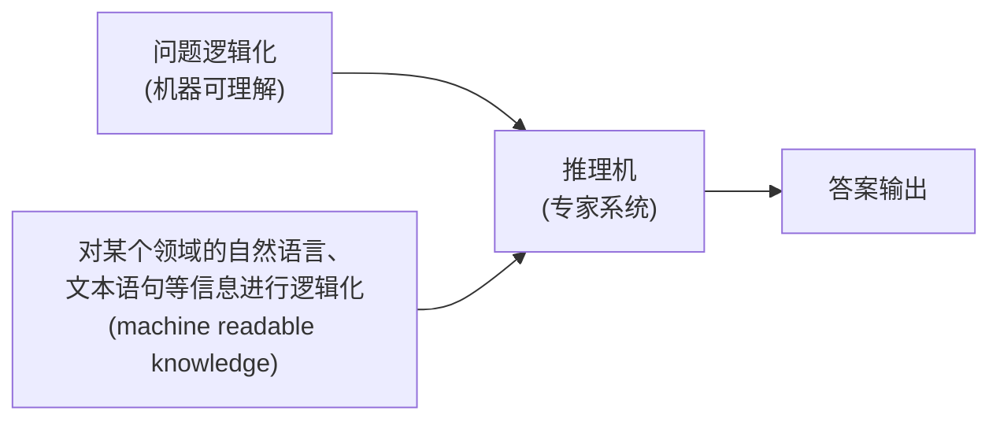

## 人工智能概述  
### 可计算思想
费马猜想与费马定理  
地方太小，写不下（费马大定理）  
英国的数学家怀尔斯证明了这个定理是成立的  

---
如何判断一个**问题**是否可以计算  
证明算术公理的相容性  

- 完备性
- 一致性
- 可判定性

图灵机的模型：程序  
任何可以计算的函数都可以使用**图灵机计算**  

|         计算载体         |    提出学者    |  计算角度   |
| :------------------: | :--------: | :-----: |
|        原始递归函数        | 哥德尔（Godel） |  数学的形式  |
| λ - 演算（λ - calculus） | 丘奇（Church） | 数理逻辑的形式 |
|         图灵机          | 图灵（Turing） |  机械的形式  |  

!!! tip "图灵测试"  
    放入机器和人  
    出 20 个问题分别进行回答  
    收集到机器和人回答的结果  
    请法官进行分辨  
    如果能区分的话，机器不具备人的认知水平  
    反之通过了图灵测试，具有**人类的智能水平**    

**习题**：  
  

!!! tip "解题"  
    1. 首先对数字进行编码（12 就是 12 个 1）  
    2. 初始化纸袋与状态  
        1. 初始状态为 $q_0$  
    3. 当前的符号为 1 的话，将其擦除，转移到状态 $q_1$，指针右移  
        1. 重复操作，擦除所有的 12 的 1  
        2. 指针指向+时, 擦除，转向状态 $q_2$，右移  
    4. 在“$q_2$”状态下，为 1 时，保持 1 不变，转移到状态 $q_3$  
        1. 右移，处理完成所有的 8 的 1  
    5. 此后指针开始左移，将原来的 12 位置的空白转变为 1，从而实现加法的效果

### 智能计算方法  
- **领域**人工智能：
    - 照葫芦画瓢、任务导向（alphago）
- **通用**人工智能
    - 举一反三、从经验中学习
- **混合增强**人工智能（多种智能体的混合形式）（人类是**智能的总开关**）
    - 外骨骼机器人
    - 人类智能＋机器智能（达芬奇外科手术机器人）
    - 人、机、物联网

---
**主流**的方法：  

- **符号主义**人工智能为核心的逻辑推理
    - IBM“沃森”的推理
- **数据**驱动的机器学习：
    - 采集海量的人脸的数据，基于学习到的数据完成人脸分辨的任务（像素点的分布）
- **探索与利用**为核心的**强化**学习
    - 用问题牵引——>从经验中学习

|   学习模式    |         优势         |         不足          |
| :-------: | :----------------: | :-----------------: |
| 用**规则**教  | 与人类**逻辑推理**相似，解释性强 |    难以构建完备的知识规则库     |
|   用数据学    |      直接从数据中学       | 以深度学习为例：依赖于数据、解释性不强 |
| 用**问题**引导 |   从经验中进行能力的持续学习    |    非穷举式搜索而需更好策略     |

### 人工智能的历史进展  
人工智能发展的三次低谷  
人工智能的目的，是使机器能够具有（**模拟、延伸和扩展人类智能的能力**，具体可细分为感知、理解、推理、学习、决策等与人类智能相关的核心功能）。  

## 逻辑与推理  
### 命题逻辑  
- 定义：命题是一个**能确定**是真或者是假的陈述句
    - 原子命题：最简单的基本的命题
    - 复合命题：由原子命题组成的命题

---
通过命题连接词：  

|   p   |   q   | \(\neg p\) | \(p \land q\) | \(p \lor q\) | \(p \to q\) | \(p \leftrightarrow q\) |
| :---: | :---: | :--------: | :-----------: | :----------: | :---------: | :---------------------: |
| False | False |    True    |     False     |    False     |    True     |          True           |
| False | True  |    True    |     False     |     True     |    True     |          False          |
| True  | False |   False    |     False     |     True     |    False    |          False          |
| True  | True  |   False    |     True      |     True     |    True     |          True           |

- **条件命题前者为假时，无论后者是真假，命题一定为真**
    - 如果 p，那么 q 是一种蕴含的关系（充分条件），也就是 p 是 q 的子集
    - p 不成立说明其是一个空集，是任何集合的子集，所以一定为真

---
???+ tip "**推理规则**"  
    - 假言推理：  
    - 与消解：  
    - 与导入：  
    - 双重否定：推导出本身是成立的  
    - 单向消解或单项归结：  
    - 消解或归结：

例题：  
  
V 是或，反过来是和，——>为条件推理  

---

#### 范式  
- 重要的概念，将命题公式化归为一种标准的形式，可以进行两个命题的等价判定
    - 析去范式：$\text{假设}\alpha_\mathrm{i(i=1,2,\cdots,k)}\text{为简单的合取式,则}\alpha=\alpha_1\lor\alpha_2\lor\cdots\lor\alpha_\text{k为析取范式}$
    - 合取范式：$假设\alpha_i(i=1,2,\cdots,k)为简单的析取式,则\alpha=\alpha_1\wedge\alpha_2\wedge\cdots\wedge\alpha_k为合取范式$
    - 两者合称范式
    - **析取范式由合取范式组成**，合取范式由析取范式组成
- 析取范式**不成立**当且仅当每个简单的合取**都不成立**
- 合取范式是成立的，当且仅当每个简单的析取式是**成立**的
- **任一命题**的公式都有**等**值的析取范式和合取范式（不唯一的）

### 谓词逻辑  
命题逻辑——>谓词逻辑  

**谓词逻辑中**：个体、谓词和量词  

- 个体：可以**独立存在**的具体或者抽象的概念（x 的**变元**）
- 谓词：刻画**个体属性或者是描述个体之间关系存在性**的元素，其**值为真或者是假**
    - 与**函数**的不同
        - 函数使用之后为因变量
        - 谓词使用之后变成了命题
- 事实符号化：
- 量词的引入：
    - 全称量词：所有的
    - 存在量词：存在
    - 两者统称为量词

=== "全称量词"  
    - 谓词 \(P(x)\)：x 能够**制造**工具。\(\forall x P(x)\) 表示定义域中的所有个体能够制造工具。\(P(\text{小王})\) 表示小王能够制造工具。  
=== "存在量词"  
    - 谓词 \(P(x)\)：x 能够制造工具。\(\exists x P(x)\) 表示定义域中的存在某个 / 某些个体能够制造工具。\(P(\text{小王})\) 表示小王能够制造工具（该命题或者为真、或者为假）。  

- 约束**变元**：有量词的约束 (x)
- 自由变元：没有量词的约束
- 自由变元既可以存在于量词的约束范围之内，也可以存在量词的约束范围之外

下面的公式是成立的：  

$$
\begin{gathered}(\forall x)(A(x)\lor B)\equiv(\forall x)A(x)\lor B\\(\forall x)(A(x)\wedge B)\equiv(\forall x)A(x)\wedge B\\(\exists x)(A(x)\lor B)\equiv(\exists x)A(x)\lor B\\(\exists x)(A(x)\wedge B)\equiv(\exists x)A(x)\wedge B\end{gathered}
$$

在约束变元相同的情况下，量词的运算满足分配率  

$$
\begin{gathered}(\forall x)(A(x)\lor B(x))\equiv(\forall x)A(x)\lor(\forall x)B(x)\\(\forall x)(A(x)\wedge B(x))\equiv(\forall x)A(x)\wedge(\forall x)B(x)\\(\exists x)(A(x)\lor B(x))\equiv(\exists x)A(x)\lor(\exists x)B(x)\\(\exists x)(A(x)\wedge B(x))\equiv(\exists x)A(x)\wedge(\exists x)B(x)\end{gathered}
$$

???+ example "描述以下的事实"  
    - 所有的国王都头戴皇冠。  
    - “所有的国王都头戴皇冠” 表示的含义为 “对于**所有的x**，如果x是国王，那么x头戴皇冠”，符号化表示为\((\forall x)(King(x) \to Head\_On(Crown, x))\)。其中x是变量符号，由于x受到全称量词的约束，因此x是约束变元；Crown是一个常量符号，表示皇冠；\(King(x)\)是一个一元谓词，表示x是国王，\(Head\_On(Crown, x)\)是一个二元谓词，表示x头戴皇冠。

- 公式中存在多个量词时，多个量词都是同类型的，那么量词的顺序是可以互换的
- 反之是不可以互换的

$$
\begin{aligned}&(\forall x)(\forall y)A(x,y)\Leftrightarrow(\forall y)(\forall x)A(x,y)&&(\exists y)(\forall x)A(x,y)\Leftrightarrow(\forall x)(\exists y)A(x,y)\\&(\exists x)(\exists y)A(x,y)\Leftrightarrow(\exists y)(\exists x)A(x,y)&&(\exists x)(\forall y)A(x,y)\Leftrightarrow(\forall y)(\exists x)A(x,y)\\&(\forall x)(\forall y)A(x,y)\Rightarrow(\exists y)(\forall x)A(x,y)&&(\forall x)(\exists y)A(x,y)\Rightarrow(\exists y)(\exists x)A(x,y)\\&(\forall x)(\forall y)A(x,y)\Rightarrow(\exists x)(\forall y)A(x,y)&&(\forall y)(\exists x)A(x,y)\Rightarrow(\exists x)(\exists y)A(x,y)\end{aligned}
$$

#### 项与原子谓词公式  
- 项是描述对象的逻辑表达式
    - 常量符号和变量符号是项
    - 项组成的函数是项：$\mathrm{f(t1,t2,\cdots,tn)}$
    - 有限次使用上述的规则产生的符号串是项
- **原子谓词公式**：项数目等于对象的命题吗
- **合式**公式：
    - 命题常项、命题变项、原子谓词公式为合式公式
    - A 为合式公式，则非 A 也是**合式公式**
    - A、B 是合式公式，则 $A\land B、A\lor B、A\to B、B\to A、A\leftrightarrow B$ 是合式公式
    - A 为合式公式，x 为个体变项、$(\exists x)A(x)\neq0(\forall x)A(x)$ 也是合式公式
    - 有限次使用上述的法则构成的表达式组成的是合式公式

---
???+ example "使用合式公式描述"  
      
    
    ---
    - 解 (1) \(Like(\text{Tom}, \text{Football}) \land Like(\text{Tom}, \text{Basketball})\)。其中，\(Like(\text{Tom}, x)\)表示 Tom 喜欢x，Football 和 Basketball 分别表示踢足球和打篮球。
    - (2) \((\forall x)(Classmate(\text{Tom}, x) \to Like(x, \text{Tom}))\)。其中，\(Classmate(\text{Tom}, x)\)表示x是 Tom 的同学，\(Like(x, \text{Tom})\)表示x喜欢 Tom。
    - (3) \(\neg (\forall x)(Boy(x) \to Like(x, \text{Basketball}))\)。其中，\(Boy(x)\)表示x是男生，\(Like(x, \text{Basketball})\)表示x喜欢打篮球。

---

#### 推理规则  
- 全称量词消去：
- 全称量词引入：
- 存在量词消去：
- 存在量词引入：

???+ example "证明"  
    

#### 自然语言的形式化  
  

#### 专家系统的构成  


课后题：  
  

### 知识图谱推理  
#### 基本概念  
- 是包含多种关系的图
- 每个节点是一个实体，任意两个节点之间的边表示两个节点间存在的关系
- 实体中存在的关系进行推理，可以得到**新的知识**

#### 归纳
归纳逻辑程序设计算法：使用一阶谓词逻辑进行知识表示  
将目标谓词作为推理的规则  

- 目标谓词：
- 目标谓词只有**一个正例**
- 反例：不会显式给出，而是从知识图谱中构建出来
- 背景知识：

推理的思路：逐步给目标的谓词添加**前提约束谓词**，使得经过目标谓词之后**不覆盖任何的反例**  
通过**信息增益**的方式来评判前提约束谓词的好坏  
**FOIL 算法**  
  
**信息增益**  
???+ tip "规则"  
    从实例（正例、反例背景知识中）出发，不断测试所得的推理规则**是否包含反例**、一旦不包含反例，则学习结束，充分展示了“归纳学习”的能力。则学习之后，将规则幅值  

#### 习题  
  
???+ info "解答"  
    - FOIL（First-Order Inductive Learner）算法通过寻找**覆盖正例且不覆盖反例**的规则  
    - 在家庭关系中，“Mother” 的定义可结合 “Couple” 和 “Father” 推导：  
    - 若 **X 和 Y 是 Couple**，且 **Y 是 Z 的 Father**，则 **X 是 Z 的 Mother**。  
    - 带入规则  
        - \(X = \text{James}\)，\(Y = \text{David}\)，\(Z = \text{Ann}\)；  
        - 已知 “James 和 David 是 Couple”，且 “David 是 Ann 的 Father”；  
        - 因此，满足规则条件，可推出 “James 是 Ann 的 Mother”。  
    - 验证关系的一致性  
        David 也是 Mike 的 Father（符合 “Sibling” 的家庭逻辑）；同时 James 作为 David 的 Couple，自然也成为 Mike 的 Mother，这与整体家庭关系的一致性**相互印证**，说明推导规则有效。  

### 因果推理  
#### 因果推理基本概念  
**先有鸡还是先有蛋**的问题  
辛普森悖论  

##### 主要模型  
- 结构因果模型
- 因果图：一个无回路的有向图
    - DAG 称为贝叶斯网络  
???+ tip "结构因果模型"  
    - 有两组变量集合 U 和 V 以及一组函数 f 组成（就是**因变量**的意思）
    - X 变量出现在 Y 幅值的函数中，则 X 是 Y 的**直接原因**。X 是 Y 的直接原因或者是其他原因，均称 X 是 Y 的**原因**
    - U 中的成为外生变量，V 中的为内生变量（外生是**原始**的变量）（内生都是外生的子代）
    - 每一个结构因果模型都有一个因果图与其对应

???+ tip "因果图模型"  
    - 原因：在因果图中 Y 是 X 的孩子，则 X 是 Y 的直接原因；Y 是 X 的后代，则 X 是 Y 的潜在原因  
    - 可以有效表示**联合概率**分布

---
联合概率密度  

$$
P(x_1,x_2,\cdots,x_d)=\prod_{j=1}^dP(x_j|x_{pa(j)})
$$

这就是 d 个变量的联合概率密度  

$$
x_{pa(j)}\text{表示节点}x_j\text{的父节点集合(所有指向}x_j\text{的节点})
$$

???+ tip "作业：写出联合概率形式"  
      

    $$
    P(X2​,X3​,X4​,X5​,X1​,X6​,Xi​,Xj​)=P(X2​)P(X3​)P(X4​∣X2​)P(X5​∣X3​)P(X1​∣X2​,X3​)P(X6​∣X1​,Xi​)P(Xj​∣X1​,X5​)​
    $$

#### 因果图结构  
##### 链结构  
- 是一种基本结构
- 包含三个节点两条边，其中一条由第一个节点指向第二个节点，另外一条由第二个节点指向第三个节点
- 
- X，Y 在给定 Z 时条件独立
- 所以有**链中的条件独立性定理**：  
    若 X 和 Y 之间只有一条单向的路径，变量 Z 是**截断** (intercept) 该路径的集合中的任一变量，则在**给定 Z 时，X 和 Y 条件独立**。

##### 分连  
- 三个节点，两条边
- 两条边分别由第一个点指向第二三个
- 

    $$
    \begin{aligned}&P(X,Y|Z)=\frac{P(X,Y,Z)}{P(Z)}=\frac{P(Z)P(X|Z)P(Y|Z)}{P(Z)}\\&=P(X|Z)P(Y|Z)\end{aligned}
    $$

- 定理：Z 是 X, Y 的共同原因，且 X->Y 只有一条路径，则在给定 Z 的条件, XY 条件独立

##### 汇连图
- 
- 此时的 X, Y 是**相关的**，没有上面的条件独立的性质
- 定理：上面，X, Y 是相互独立的，但是在给定 Z 和 Z 的后代时，X, Y 是**相关的**

##### D 分离  
- 定义 2.18 D - 分离：路径 p 被限定集 Z 阻塞 (block) **当且仅当**：
    - (1) 路径 p 含有**链结构** A→B→C 或分连结构 A←B→C 且中间节点 B 在 Z 中，或
    - (2) 路径 p 含有汇连结构 A→B←C 且汇连节点 B 及其后代都不在 Z 中。  
若 Z 阻塞了节点 X 和节点 Y 之间的每一条路径，则称给定 Z 时，X 和 Y 是 D - 分离，即给定 Z 时，X 和 Y **条件独立**。（**分离则独立**）  

???+ tip "题目"  
    1. 若限定集为∅时，X 和 T 相互独立。因为 X 和 T 之间含有一个汇连结构 X→Z←Y，且 Z 及其后代都不在限定集∅中，此时 X 和 T 是有向分离，即 X 和 T 相互独立；  
    2. 若限定集为 {W} 时，X 和 T 是相关的。因为 X 和 T 之间含有一个链式结构 Y→S→T（S 不在限定集中），一个分连结构 Z←Y→S（Y 不在限定集 {W} 中），一个汇连结构 X→Z←Y（Z 的后代 W 在限定集 {W} 中），根据 D - 分离的定义，这些结构都**无法阻塞** X 和 T 之间的路径，因此 X 和 T 是有向连接的，即 X 和 T 是**相关**的；  
    3. 若限定集为{W,Y}时,X和T条件独立。因为X和T之间只有有一条路径,且这条路径含有一个分连结构Z←Y→S,且Y在限定集{W,Y}中,因此Y阻塞了X和T之间的唯一路径,X和T是有向分离,即限定集为{W,Y}时,X和T条件独立,。  
      
???+ tip "题目"    
    - **选项 A**：有向边 \(T \to Y\)，表示 T 对 Y 存在因果影响，属于因果图模型。  
    - **选项 B**：有向边 \(Y \to T\)，表示 Y 对 T 存在因果影响，属于因果图模型。  
    - **选项 C**：有向边 \(Y \to T\)，表示 Y 对 T 存在因果影响，属于因果图模型。  
    - **选项 D**：T 和 Y 之间没有任何有向边，无法体现变量间的因果关系，因此**不属于**因果图模型。  
    

#### 因果反事实模型  
- 干预：固定系统中的变量，然后改变系统，观察其他变量的变化
- 引入了 do 算子（并表示固定不变，而**不是条件概率**）

---
**因果效应差**  


$$
Pm(Y=y|X=x,Z=z)=P(Y=y|X=x,Z=z),Pm(Z=z)=P(Z=z)
$$

- 在操纵图中，X 和 Z 是 D 分离的，可以得到因果消音的表达式：

$$
\begin{aligned}P(Y=y|&do(X=x)):\\&P(Y=y|do(X=x))=P_{m}(Y=y|X=x)\\&=\sum_{z}P_{m}(Y=y|X=x,Z=z)P_{m}(Z=z|X=x)\\&=\sum_{z}P_{m}(Y=y|X=x,Z=z)P_{m}(Z=z)\end{aligned}
$$

得到最后的使用**正常的条件表示**的因果效应：  

$$
P(Y=y|do(X=x))=\sum_{z}P(Y=y|X=x,Z=z)P(Z=z)
$$

右端只包含正常的情况下的概率  
???+ tip "因果效应"  
    定理2.8(因果效应) 给定因果图G,PA表示X的父节点集合,!则X对Y的因果效应为:  

    $$  
    P(Y=y|do(X=x))=\sum_{z}P(Y=y|X=x,PA=z)P(PA=z)  
    $$

---
**反事实模型**  
反事实描述的是个体的行为  
???+ tip "计算的三个步骤"  
    - (1) 溯因 (abduction)：利用现有的证据 E 确定环境 U；  
    - (2) 动作 (action)：对模型 M 进行修改，移除等式 X 中的变量并将其替换为 X = x，得到修正模型 Mx；  
    - (3) 预测 (prediction)：利用修正模型 Mx 和环境 U 计算反事实 Yₓ(U) 的值。

???+ tip "计算干预为用药病人的因果效应"  
    

## 搜索求解  
### 搜索算法基础  
找到最短的路线搜索  
???+ tip "概念"  
    - 状态：对当前情形的描述，刚开始的状态称为**初始状态**  
    - 动作：从当前时刻所处的状态转移到下一时刻所处的状态所做的**操作**  
    - 状态**转移**：智能体选择一个动作之后，所处的状态发生的响应的变化，有边的两点之间才能转移  
    - 路径/代价：一个状态序列：该状态序列被一系列的操作所连接  
    - 目标**测试**：评估**当前状态**是否是所求解的目标状态

每次解决的时候，算法会从已经探索过的路径中选择一条，在末尾进行一次状态转移，可以写成搜索树的形式  
  
???+ tip "说明"  
    - 一个城市，即三个**标号**为 A 的**结点**所对应**状态**相同，但是这三个节点在搜索树中却是不同结点，因为它们分别代表了从初始状态出发到达城市 A 的三条不同路径。  
    - 这三个结点表示的路径分别为：A → B → A、A → D → A 和 A → E → A。  
    - 因此需要注意的是，在搜索树中，**同一个标号一定表示相同的状态**，其含义为智能体当前所在的城市，但是**一个标号可能有多个的结点与之对应，不同的结点对应了从初始状态出发的不同路径**。  
    - 搜索算法可以被看成是一个构建搜索树的过程，从根结点（初始状态）开始，不断展开每个结点的后继结点，直到某个结点通过了目标测试。

#### 常见的搜索算法的评价指标  

|  特性   |          说明           |
| :---: | :-------------------: |
|  完备性  | 当问题存在解时，算法是否能保证找到一个解。 |
|  最优性  | 搜索算法是否能保证找到的第一个解是最优解。 |
| 时间复杂度 |      找到一个解所需时间。       |
| 空间复杂度 |  在算法的运行过程中需要消耗的内存量。   |  

完备性和最优性刻画了找到解的能力以及质量，时间复杂度空间复杂度衡量了算法的资源消耗，常用 O 来描述  

在**树搜索算法**中，集合 F 用于保存搜索树中用于下一步搜索的所有候选节点，这个集合称为**边缘集合**，有时叫做**开表**  
  

剪枝搜索：不是所有的后继结点都值得被搜索  
图搜索：不允许环路的存在  
  
通过剪枝的方式**防止闭环**存在  
???+ example "课后题"  
    - 1  
        - 广度优先搜索**按层扩展节点**。首先扩展初始节点 A（扩展顺序 1）。  
        - 然后扩展 A 的所有子节点 B、C、D（扩展顺序 2、3、4）。  
        - 接着扩展 B 的子节点 F（扩展顺序 5），C 的子节点 G（扩展顺序 6），D 的子节点 E（扩展顺序 7）。  
        - 此时，在扩展 F 时，发现 F 有到 I 的边，找到路径 \(A \to B \to F \to I\)，算法终止。  
    - 2  
        - 深度优先搜索优先扩展深度大的节点。首先扩展 A（扩展顺序 1）。  
        - 选择 A 的子节点中字典序较小的 B 扩展（扩展顺序 2）。  
        - 扩展 B 的子节点 F（扩展顺序 3）。  
        - 扩展 F 的子节点 I（扩展顺序 4），此时找到从 A 到 I 的路径，算法终止。  
      

### 启发式搜索  
也叫有信息搜索  
利用与所搜索的信息相关的信息  

**贪婪最佳优先搜索**：评价函数=启发函数的搜索算法  
贪婪最佳优先搜索算法时间和空间复杂度均为 O (bᵐ)，b 是搜索树**分支因子**，m 是**最大深度**  

---
 $A^*$ 算法：  
评价函数：  

$$
\mathbf{f}(n)=\mathbf{g}(n)+\mathbf{h}(n)
$$

- 代价函数 g 表示从起始到节点 n 的开销代价
- 启发函数 h 表示从节点 n 到目标节点的路径中所估算的最小开销代价值（之后的）
- 评价函数 f 为经过节点 n 具有最小开销代价值的路径（已经有的）

  

???+ tip "课后题"  
    - A 有子节点 B（代价 1）、C（代价 3）、D（代价 3）。  
        - 对于 B：\(g(B) = 0 + 1 = 1\)，\(h(B) = 4\)，\(f(B) = 1 + 4 = 5\)。  
        - 对于 C：\(g(C) = 0 + 3 = 3\)，\(h(C) = 3\)，\(f(C) = 3 + 3 = 6\)。  
        - 对于 D：\(g(D) = 0 + 3 = 3\)，\(h(D) = 2\)，\(f(D) = 3 + 2 = 5\)。  
    - 待扩展队列中的节点按 f 值排序，B、D（\(f = 5\)），C（\(f = 6\)）。由于 B 路径字典序**更小**，优先扩展 B。  
    - B 有子节点 F（代价 2）。  
        - 对于 F：\(g(F) = 1 + 2 = 3\)，\(h(F) = 5\)，\(f(F) = 3 + 5 = 8\)。  
    - 待扩展队列中的节点：D（\(f = 5\)）、C（\(f = 6\)）、F（\(f = 8\)）。优先扩展 D。  
    - D 有子节点 E（代价 1）。  
        - 对于 E：\(g(E) = 3 + 1 = 4\)，\(h(E) = 5\)，\(f(E) = 4 + 5 = 9\)。  
    - 待扩展队列中的节点：C（\(f = 6\)）、F（\(f = 8\)）、E（\(f = 9\)）。优先扩展 C。  
    - C 有子节点 G（代价 1）、H（代价 2）。  
        - 对于 G：\(g(G) = 3 + 1 = 4\)，\(h(G) = 2\)，\(f(G) = 4 + 2 = 6\)。  
        - 对于 H：\(g(H) = 3 + 2 = 5\)，\(h(H) = 1\)，\(f(H) = 5 + 1 = 6\)。  
    - 待扩展队列中的节点：G、H（\(f = 6\)），F（\(f = 8\)），E（\(f = 9\)）。G 路径字典序更小，优先扩展 G。  
    - G 有子节点 I（代价 3）。  
        - \(g(I) = 4 + 3 = 7\)，\(h(I) = 0\)，\(f(I) = 7 + 0 = 7\)。  
    - 此时找到终止节点 I，算法终止。  
    - 路径为 \(A \to C \to G \to I\)，总代价 \(g(I) = 7\)。  
      

### 贪婪最佳优先搜索  
- **深度优先搜索**：沿着**一条路径**尽可能深地探索，直到无法继续或者达到目标节点，然后回溯到上一个未完全探索的节点，继续探索其他分支。可以想象成在迷宫中，每次都选择一条路走到尽头，不行再回头换路。
- **广度优先搜索**：逐层地探索节点，先访问起始节点的所有邻居节点，然后再访问这些邻居节点的邻居节点，以此类推，就像在池塘中扔一块石头，波纹从中心向四周一层一层扩散。

---
最短路径的问题  
已知每个节点的相邻节点及其**距离**  
辅助信息：每个节点与目标节点间的直线距离（启发函数）  

用更快到达目标节点的节点作为下一步的选择  
不过这条路径不一定是最优的路径  
这里将启发函数作为评价函数

---

#### 启发函数与评价函数  
贪婪最佳优先搜索 (Greedy best-first search): 评价函数 f (n)（决定下一步**选择的节点**）= 启发函数 h (n)  

辅助信息（启发函数）：任意城市与终点城市 K 之间的直线距离，由于启发函数就是评价函数，所以只看这个  

要将已经发生的历史与未来相结合  

???+ tip "对这个的性能分析："  
    - 完备性：（排除环路）完备，（有环路）不完备  
    - 最优性：**非最优**  
    - 时间复杂度：O (b<sup>m</sup>)  
    - 空间复杂度：O (b<sup>m</sup>)

### 对抗搜索  
零和博弈：一方的收益意味着另一个的损失，不能合作的  
  
在两人的零和博弈时，两人的得分之后是固定的  
所以要最大化自己的得分，也就是要最小化对方的分数  
  

---
在 Minimax（一方使分数最大，一方使得分数最小） 算法中可使用**剪枝搜索算法**减少被搜索的节点数  

剪枝不影响搜索的结果  
  
???+ tip "分析"  
    - 假设有一个位于 MIN 层的结点 m，已知该结点能够向**其上 MAX** 结点**反馈的收益为 α**（alpha）。n 是与结点 m 位于同一层的某个兄弟（sibling）结点的后代结点。如果在结点 n 的后代结点被访问一部分后，知道结点 n 能够向其上一层 MAX 结点反馈收益小于 α，则**结点 n 的未被访问孩子结点将被剪枝**。  
    - 考虑位于 MAX 层的结点 m，已知结点 m 能够从其下 MIN 层结点收到的收益为 β（beta）。结点 n 是结点 m 上层结点 m' 的位于 MAX 层的后代结点，如果目前已知结点 n 能够收到的收益大于 β，则不再扩展结点 n 的未被访问后继结点，因为位于 MIN 层的结点 m' **只会选择收益小于或等于 β 的结点**来采取行动。

???+ tip "算法的步骤"  
    - **根结点（MAX 结点）的 α 值和 β 值**分别被初始化为 -∞和 +∞。  
    - 子节点继承父节点的 α 值和 β 值，再按照以下规则进行更新：  
    - 对于 **MAX 结点**，如果其孩子结点（MIN 结点）的收益大于当前的 α 值（极大层的下界），则将 α 值更新为该收益；对于 **MIN 结点**，如果其孩子结点（MAX 结点）的收益**小于**当前的 β 值（极小层的上界），则将 β 值更新为该收益。  
    - 随着搜索算法不断被执行，每个结点的 α 值和 β 值不断被更新。大体来说，每个结点的 [α,β] 从其父结点提供的初始值开始，取值按照如下形式变化：α 逐渐增加、β 逐渐减少。不难验证，如果一个结点的 **α 值和 β 值满足 α > β 的条件，则该结点尚未被访问的后续结点就可以被剪枝**（结合前面两个引理加以说明）。  
    - 实际上也是从下往上，从左往右推的  
        - 先最左边的，最下的两层，可以推出一个，再直接由这个节点再上一层，推出上一层的范围；之后再在同样的两层推理，此时这两层是  
        - 继承者上一层的范围的，就可以做出取舍  
        - 以此类推，及时更新

???+ info "课后习题"  
    

为什么是这么画的？
```Python
 MAX
 / \ 
MIN MIN 
/ \ / \ 
3 5 2 4
```

- 首先评估叶子节点，值分别为 3、5、2、4 。
- 然后计算 MIN 节点（**取子节点**的最小的）的值，左侧 MIN 节点的子节点值为 3 和 5，取最小值 3；右侧 MIN 节点的子节点值为 2 和 4，取最小值 2 。
- 最后计算 MAX 节点的值，它的子节点（两个 MIN 节点）值为 3 和 2，取最大值 3 。所以对于 MAX 方来说，选择**左侧 MIN 节点对应的决策就是最优决策**。
- 所以可以看出是**从下往上**倒着推的，max 和 min 是要决定**选择哪个子节点**

### 蒙特卡树搜索  
- 状态：
- 动作：
- 状态转移：
- 奖励：假设从第i个赌博机获得收益分数的分布为\(D_i\)，其均值为\(\mu_i\)。如果智能体在第t次行动中选择转动了第\(l_t\)个赌博机臂膀，那么智能体在第t次行动中所得收益分数\(\hat{r}_t\) 服从分布\(D_{l_t}\)，\(\hat{r}_t\)被称为第t次行动的奖励。为了方便对多臂赌博机问题的理论研究，一般假定奖励是有界的，进一步可假设奖励的取值范围为\([0,1]\)。
- 悔值函数：根据智能体的前 T 次动作，可以定义如下的悔值函数

$$
\rho_T=T\mu^*-\sum_{t=1}^T\hat{r}_t
$$

- 贪心算法：利用已有的尝试中得到的估计来指导后续的动作，需要用机制来平衡算法

---
- $\varepsilon$ 贪心算法

    $$
    l_t=\begin{cases}\operatorname{argmax}_i\bar{x}_{i,T_{(i,t-1)}},&\text{以}1-\epsilon\text{的概率}\\\text{随机的}i\in\{1,2,\cdots,K\},&\text{以}\epsilon\text{的概率}&\end{cases}
    $$

    即以 1-E 的概率选择在过去 t-1 次摇动赌博机臂膀行动中所得平均收益分数最高的赌博机进行摇动；以 E 的概率随机选择一个赌博机进行摇动

---
总结上面的想法：优先估计不确定度大的，但是对于奖励极端偏小的，不应该多计算  

---

#### 上限置信区间算法
为每个动作的奖励期望计算一个估计范围，优先采用**估计范围上限高**的动作  
  
如图，优先计算动作 2（1 的奖励太小，3 的不确定度小）  

根据霍夫丁不等式  
期望的上限为  

$$
\overline{x}_{i,T_{(i,t-1)}}+C\sqrt{\frac{2\ln t}{T_{(i,t-1)}}}
$$

在 t 次时选择使得式子取值最大的动作  

$$
l_t=\operatorname{argmax}_i\bar{x}_{i,T_{(i,t-1)}}+C\sqrt{\frac{2\ln t}{T_{(i,t-1)}}}
$$

算法起初是不知道选择节点的奖励的，只能通过选择的均值来决定选择扩展哪些节点，放弃哪些节点等等  

???+ tip "步骤"  
    - 选择：选择指算法从搜索树的**根节点**开始，向下递归选择子节点，直至到达叶子节点或者到达具有还未被扩展过的子节点的节点L。这个向下递归选择过程可由\(\text{UCB1}\)算法来实现，在递归选择过程中**记录下每个节点被选择次数和每个节点得到的奖励均值**。  
    - 扩展：如果节点L不是一个终止节点（或对抗搜索的终局节点），则随机扩展它的一个**未被扩展过的后继边缘节点M**。  
    - 模拟：从节点M出发，**模拟扩展搜索树**，直到**找到一个终止节点**。模拟过程使用的策略和采用\(\text{UCB1}\)算法实现的选择过程并不相同，前者通常会使用比较简单的策略，例如**使用随机策略**  
    - 反向传播：用模拟所得结果（终止节点的代价或游戏终局分数）**回溯更新**模拟路径中M以上（含M）节点的奖励均值和被访问次数。  

???+ tip "课后题"  
      

    - **选项 A**：蒙特卡洛树搜索的选择过程（如使用 UCB 公式），在利用已有信息（选择高价值节点）和探索新节点之间取得平衡，该说法正确。
    - **选项 B**：算法进入扩展步骤时，当前节点可能有部分子节点已被扩展，并非所有子节点必然都未被扩展，该说法错误。
    - **选项 C**：模拟步骤可以采用随机策略等，和选择步骤的策略（如基于 UCB）不一定相同，该说法正确。
    - **选项 D**：反向传播时，通常只需要更新当前模拟路径上已被扩展的节点的统计信息，该说法正确。