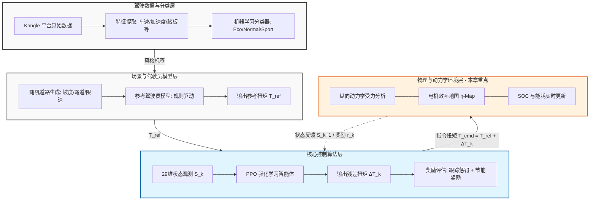

1. 题目
	1. 名字
	2. 指导老师
2. 第四页  
	放在后面一点  
	前两个问题，急迫性  
	第五页放在后面  
	痛点（现有方法怎么做，有什么问题）——要做什么  
	大概的目标  
	最后实现什么样子的意义（图文，图为主）
3. 加一个大的框架（怎么实现这个目标）
4. 逻辑关系
5. 节能对应的现实意义是什么：放到生活中计算一下具体的数值  
	主要给出绿色的图  
	把距离拉长会省出多少的电
6. 结果的动画不要太多  
	结果将真实的节能使用数字（文字量化）

在框架上加一个超链接的跳转  
三种路面的递进关系（）  
还有就是下面的图为什么会发生这种突变的时候  
重点突出的  
关系明确一点

配图

可以，整理成两个简单表格如下。

**表 1：单车百公里节能效果估算**

| 驾驶风格 | 当前仿真节能率 | 若原车电耗为 12-18 kWh/100km | 每百公里约省电 |
|---|---:|---:|---:|
| Eco | 1.63% | 11.80-17.71 kWh/100km | 0.20-0.29 kWh |
| Normal | 3.89% | 11.53-17.30 kWh/100km | 0.47-0.70 kWh |
| Sport | 23.41% | 9.19-13.79 kWh/100km | 2.81-4.21 kWh |

**表 2：按中国纯电动汽车保有量估算的年度节电潜力**

| 场景 | 假设条件 | Eco | Normal | Sport |
|---|---|---:|---:|---:|
| 保守 | 3022 万辆，1 万 km/年，12 kWh/100km | 0.59 TWh/年 | 1.41 TWh/年 | 8.49 TWh/年 |
| 中性 | 3022 万辆，1.2 万 km/年，14 kWh/100km | 0.83 TWh/年 | 1.98 TWh/年 | 11.88 TWh/年 |
| 激进 | 3022 万辆，1.5 万 km/年，18 kWh/100km | 1.33 TWh/年 | 3.18 TWh/年 | 19.10 TWh/年 |

推荐展示时重点用 `Normal` 中性场景：**约 2 TWh/年的节电潜力**，这个说法比较稳。

按当前 `results_rerun_current_all` 的最新数据，表格更新如下：

| 风格   | Eval 真实节能率 | Eval 速度 MAE | Eval 跟踪 | Stress 真实节能率 | Stress 跟踪 |
| ------ | -------------: | ----------: | -------- | ---------------: | ---------- |
| eco    |         +1.63% |   0.097 m/s | true     |           +1.17% | true       |
| normal |         +3.89% |   0.144 m/s | true     |         +105.80% | true       |
| sport  |        +23.41% |   0.117 m/s | true     |          +32.17% | true       |

注意：`normal` 的 `Stress真实节能率 +105.80%` 仍然是那个“stress 工况净能量为负导致百分比失真”的问题。展示时如果这列必须保留，建议在表下注明：**Stress 百分比仅作程序输出参考，含回收主导工况时可能超过 100%。**