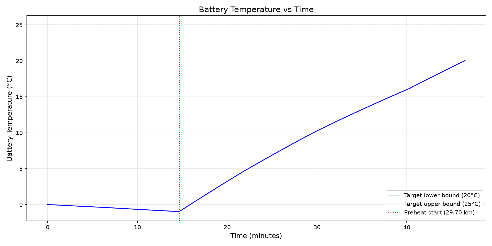
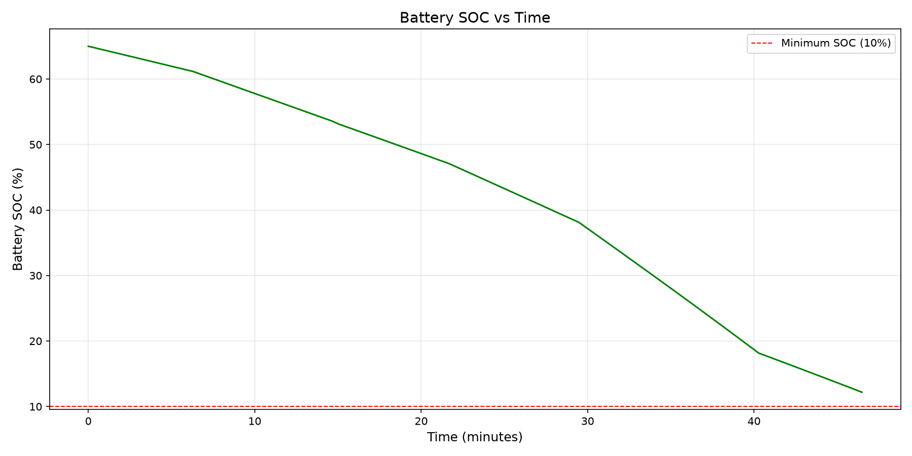
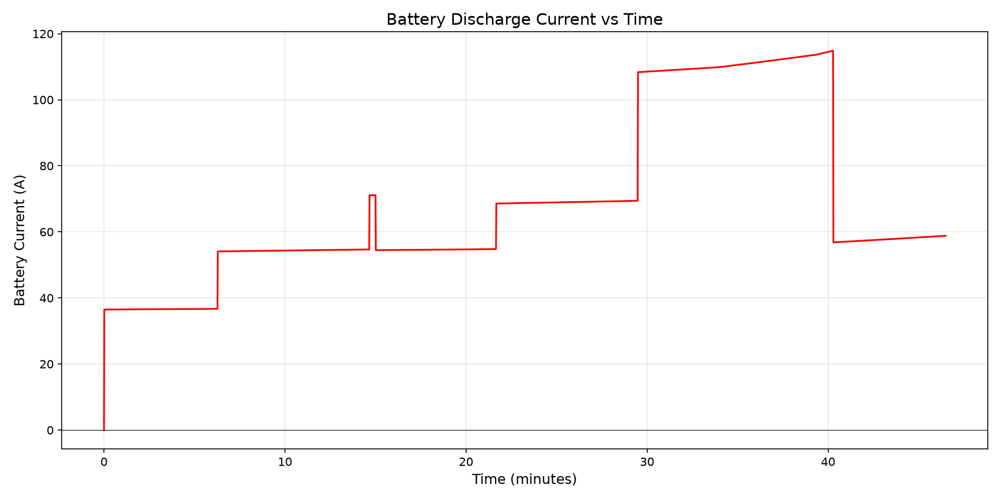
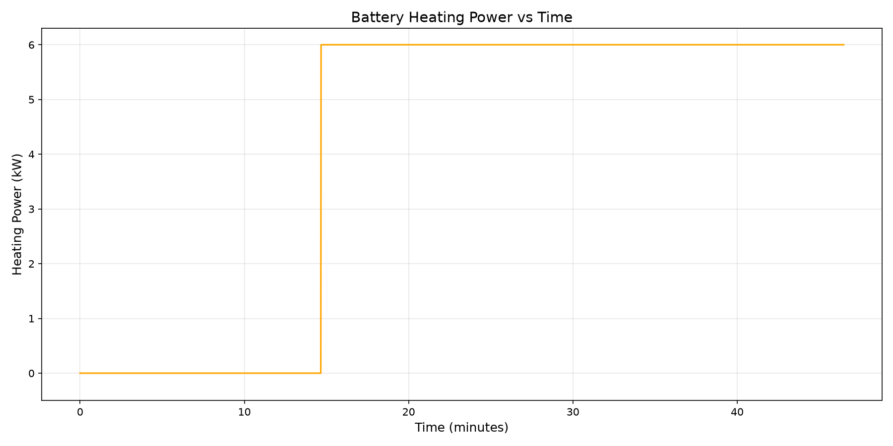
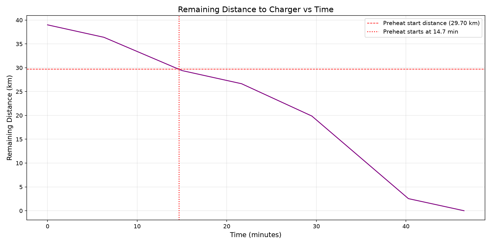

## 实践
**要求**：在⻋辆到达充电桩时，温度达标的前提下（通常 20~25℃），使得后续充电到⽬标 SOC（如 80%）的时间最短，且最⼩化整个预热过程中总的预热能耗。

### 参数
#### 恒定物理参数


#### 目标参数


#### map 图
- 电池的内阻随着电池的 SOC 以及温度的变化：  
	
- 电池的开路电压随着 SOC 以及温度的变化  
	
- 充电功率的 map 图：  
	

### 物理模型
#### 热模型

电池包温度更新基于 lumped thermal model：

```text
dT/dt = (Q_gen + Q_heat - Q_loss) / (M_BAT * CP)
```

$$
\begin{aligned}&M_{bat}\cdot c_{p,bat}\cdot\frac{dT_{bat}}{dt}=\dot{Q}_{gen}+\dot{Q}_{heat}-\dot{Q}_{loss}\\&\dot{Q}_{bat}=I_{bat}{}^{2}R_{bat}(SoC_{bat},T_{bat})\\&\dot{Q}_{heat}=\eta_{heat}\cdot P_{heat}\cdot u_{on}\end{aligned}
$$

- 当 $u_on=0$ 时，加热关闭；$u_on=1$ 时，加热开启。
- $\eta_{heat}$ : 加热效率，通常取 0.9~0.95

---

$$
\dot{Q}_{loss}=k_{env}\cdot(T_{bat}-T_{env})\quad k_{env}=h_{0}+k_{v}\cdot V_{veh}\quad
$$

通过电池的产热，加热以及散热的计算得到在**单位时间**内**电池温度的变化量** $dT$ ,需要知道初始电池温度，环境温度，电池 SOC（得到电池电阻），加热状态；以及当前的功率，电压（计算得到电流）  
代码形式：

```c
result.temp_C += (generated_heat +
                  (heating ? ETA_HEAT * P_HEAT_MAX : 0.0f) - heat_loss) *
                 dt / (M_BAT * CP);
```

其中：

- `M_BAT = 400 kg`：电池包质量。
- `CP = 1000 J/(kg*C)`：比热容。
- `generated_heat = I^2 * R`：电池内阻发热。
- `ETA_HEAT * P_HEAT_MAX`：PTC 有效加热功率。
- `heat_loss = (H0 + KV * speed) * (T_bat - T_env)`：与环境的散热，车速越高散热越强。

### 电模型

行驶和预热总功率：

```c
const float power_w = g_segs[seg].P_drive_kW * 1000.0f +
                      (heating ? P_HEAT_MAX : 0.0f);
```

根据等效电路：

```text
P = U_oc * I - I^2 * R
```

解二次方程得到电流：

```c
const float current = (fabsf(resistance) > 1.0e-8f)
                    ? (uoc - sqrtf(discriminant)) / (2.0f * resistance)
                    : power_w / fmaxf(uoc, 1.0f);
```

SOC 更新：

```c
result.soc -= current * dt / (C_NOM_AH * 3600.0f);
```

### 充电时间模型

充电时间按 PDF 3.4 的恒功率近似口径计算。先用到站终点状态查表：

```c
P_cha = f(SOC_end, T_end);
```

然后认为从 `SOC_end` 充到 `SOC_TARGET = 80%` 的过程都使用该终点充电功率：

```c
const float charge_kw = fmaxf(0.1f,
    interp_map(P_CHARGE_TEMPS, P_CHARGE_SOCS, P_CHARGE_MAP,
               temp_C, start_soc * 100.0f));

return (SOC_TARGET - start_soc) * C_NOM_AH * U_NOM * 3.6f / charge_kw;
```

这里 `C_NOM_AH * U_NOM * 3.6` 用于把 SOC 差值、电池标称能量和 kW 功率换算成秒。旧版本曾采用“充电过程每秒更新 SOC 并重新查表”的积分口径；当前版本为了贴近 PDF 原公式，改为终点功率恒定近似。

#### 使用物理模型模拟
现在使用的是变化的时间步进行物理模型的迭代：（同时兼顾速度和准确度）

| 阶段                   |                    模型时间步/间隔 |
| -------------------- | --------------------------: |
| 快速无加热基线              |                         1 s |
| 单调性趋势探测              |           1 s 模型，每约 10 s 探测 |
| 初步寻找 `t20/t25/tSOC`  |                         1 s |
| 时间边界精确修正             |                       0.2 s |
| 粗搜点加入统一池             |              全部重新用 0.2 s 计算 |
| 细搜                   |   5 s 候选间隔，每个候选用 0.2 s 物理模型 |
| 精修                   | 0.2 s 候选间隔，每个候选用 0.2 s 物理模型 |
| 全局 score/Pareto/局部极值 |           只基于统一池中的 0.2 s 候选 |
| 最终最佳结果               |                       0.2 s |
| 非单调兜底                |                全区间 0.2 s 穷举 |

### 使用的搜索算法
当前算法采用“时间边界确定可行区间 + 可行区间内分层搜索”。控制量的主键不再是浮点距离，而是从路线起点开始计数的 0.2 s 启动时间步 `start_step`；最终再把启动时刻转换成到充电桩的剩余距离。

**流程**：

```text
1. 使用1 s时间步快速找到t20、t25、tSOC的大致位置；
2. 在每个边界前后至少±1 s范围内，用0.2 s重新搜索；
3. 得到0.2 s精度的可行时间区间；
4. 使用0.2 s边界重新计算min_heat和max_heat；
5. 在可行区间内粗搜、细搜；
6. 对最佳score、充电时间最大/最小、局部极值等区域做0.2 s精修；
7. 使用最终0.2 s候选全局重评分；
8. 把最佳启动时刻换算为剩余距离输出。
```

- `FAST_DT_S = 1.0 s`：只用于快速定位三个边界和粗搜初筛。
- `FINAL_DT_S = 0.2 s`：用于边界精修、所有正式候选完整仿真和最终评分。
- `OUTER_UPDATE_S = 1.0 s`：外部导航量更新周期。每个周期中的 5 个 0.2 s 子步保持速度、驱动功率和环境温度不变。

1 s 结果不会进入最终候选池，因而不会和 0.2 s 结果共同计算同一组 score。

#### 建立时间与距离映射：
导航段给出距离和平均速度，因此每段持续时间为：

```python
segment_time_s = 3600 * segment_distance_km / speed_kmh
```

`remaining_distance_at_time()` 使用各段的精确时间和距离计算启动时刻对应的剩余距离。候选通过整数 `start_step` 去重，路线起点使用 `start_step = 0`，路线终点使用最终步编号；因此真实总里程不会再和邻近浮点网格点合并。

#### 确定边界：

下面就是定边界的流程

```text
1s二分初步定位三个边界
        ↓
检查条件趋势
        ↓
趋势正常
    → 0.2s指数扩展＋二分精修
    → 合成可行区间
    → 两端向内检查完整硬约束

趋势异常
    → 放弃二分结果
    → 0.2s全区间穷举
```

确定的边界为：

```text
t20  = 到站温度达到 20 C 的最短加热时间
t25  = 到站温度不超过 25 C 的最长加热时间
tSOC = 到站 SOC 不低于 10% 的最长加热时间

t_min = t20
t_max = min(t25, tSOC, route_total_time)
```

#### 搜索流程
在由最大、最小加热区间确定的可行区间内要进行搜索，搜索分为三层（粗筛——>细筛——>精筛）

三个层级参数为，搜索只覆盖精确可行启动步区间：

| 层级 | 积分模型 | 启动时间采样 |               下一层搜索范围 |
| ---- | -------: | -----------: | ---------------------------: |
| 粗搜 |    0.2 s |         60 s |  候选附近 ±60 s，按 5 s 采样 |
| 细搜 |    0.2 s |          5 s | 候选附近 ±5 s，按 0.2 s 采样 |
| 精搜 |    0.2 s |        0.2 s |                     不再细化 |

```python
执行全路线粗搜;
所有粗搜结果加入 coarse_pool 和 all_pool;

for (;;) {
    对 all_pool 全局重评分;
    重新计算 Pareto;

    if (存在尚未细搜的晋级粗搜候选) {
        对缺失区间执行细搜;
        结果加入 fine_pool 和 all_pool;
        continue;
    }

    if (存在尚未精修的晋级细搜候选) {
        对缺失区间执行精修;
        结果加入 final_pool 和 all_pool;
        continue;
    }

    break;
}

对 all_pool 最终全局评分;
选择可行候选中 cost 最小者；
```

正式搜索不再建立 `coarse_pool`，也不做 1 s 粗搜评分或预排序。在可行区间内每 60 s 直接用 0.2 s 模型生成 `TIME_LEVEL_COARSE` 候选，并精确保留区间首尾端点。粗搜候选必须先生成 5 s 细搜候选；只有 `TIME_LEVEL_FINE` 候选可以继续生成 0.2 s 精搜候选，不能跳级。

#### 评分规则：
能耗边界来自精确时间边界，充电时间边界来自全部已评估的可行 0.2 s 候选：

```c
energy_cost = (E - min_heat) / (max_heat - min_heat);
charge_cost = (charge_s - min_charge) / (max_charge - min_charge);
score = 0.4f * energy_cost + 0.6f * charge_cost;
```

任一分母不大于 `1.0e-6f` 时，对应归一化项取 0，避免产生 NaN。未通过 `20 C <= T_end <= 25 C` 或 `SOC_end >= 10%` 的候选不参与任何边界统计、score 或最佳结果选择。

#### 搜索之后的筛选条件
每层搜索之后，要选择合适的点进行下一层更为精细的搜索，条件如下：  

首先满足**约束**条件：

```python
// 第一层：必须满足硬约束并位于可行时间区间
candidate->feasible
&& candidate->start_step >= earliest_start_step
&& candidate->start_step <= latest_start_step

// 第二层：必须还能够向下一层扩展
&& (candidate->level == TIME_LEVEL_COARSE ||
    candidate->level == TIME_LEVEL_FINE)
&& !candidate->refined_to_next

// 第三层：满足以下任意一个保护条件
&& candidate->flags != 0
```

满足硬约束之后，满足以下的任意一个条件（**保护**）就进入下一层搜索：

```python
cand->cost <= best_cost + 0.03f        // 接近当前最优
||
cand->charge_s <= min_charge + eps     // 当前最小充电时间
||
cand->charge_s >= max_charge - eps     // 当前最大充电时间
||
cand->is_endpoint                      // 可行时间区间端点
||
cand->pareto                           // Pareto候选
||
cand->local_charge_min_or_max          // 充电时间局部最小或局部最大
||
cand->local_score_min                  // score局部最小
```

也就是：

```text
- 当前最佳 score 附近候选，阈值为 `best_score + REFINE_COST_MARGIN`，当前 `REFINE_COST_MARGIN = 0.03f`。
- 最小充电时间候选。
- 最大充电时间候选。
- 充电时间局部最大值和局部最小值。
- score 局部最小值。
- 可行区间左右端点。
- Pareto 全局 score 最优点的直接左右邻居。
- 归一化 Pareto 曲线上斜率最接近或穿过 `-0.4/0.6 = -2/3` 的代表点，最多 6 个。
- 以 `1 - cos_angle` 衡量的 Pareto 曲率拐点，最多 6 个。
```

---
其中的 Pareto 典型点（斜率匹配）的选择为：

```text
all_pool全部候选
    ↓
筛掉不满足硬约束的候选
    ↓
得到全部可行候选
    ↓
从可行候选中计算Pareto非支配候选
    ↓
由Pareto候选构成Pareto曲线
    ↓
在Pareto曲线上计算斜率和拐点
```

---

现在就是每一轮都计算每个候选的分数，给符合条件的标签，允许其进一步拓展（原来是粗的拓展到细，细到精），拓展完之后重复计算，一直重复这个，直到不产生新的可拓展的

#### 候选池子
1. 统一候选池：长期保存所有已经用 0.2 s 物理模型计算过的候选。  
其中包括：

- 时间边界搜索产生的候选；
- 每 60 s 生成的粗搜锚点；
- 粗层扩展产生的 5 s 细搜候选；
- 细层扩展产生的 0.2 s 精修候选；
- 可行和不可行候选。

```python
typedef struct {
    int start_step;              // 预热启动时刻的0.2s整数步号
    float start_distance_km;     // 对应的剩余距离
    float heat_time_s;           // 加热持续时间

    float temp_C;                // 到站温度
    float soc_pct;               // 到站SOC
    float heat_kWh;              // 加热能耗
    float charge_s;              // 后续充电时间

    float cost;                  // 当前全局归一化score
    int feasible;                // 是否满足温度/SOC硬约束

    TimeSearchLevel level;       // 当前搜索层级
    int refined_to_next;         // 是否已完成下一层扩展
    unsigned int flags;          // 本轮晋级原因
} TimeCandidate;
```

---

```text
final_pool全局评分
    ↓
同时生成coarse_batch和fine_batch
    ↓
coarse_batch生成requested_fine_steps
    ↓
新5s候选加入final_pool
    ↓
fine_batch生成requested_final_steps
    ↓
新0.2s候选加入final_pool
    ↓
整批成功
    ↓
重新对final_pool全局评分
```

### 当前的特点和风险（也就是可以优化的地方）
优点：

- 先裁剪可行时间区间，避免在全路线距离上盲目搜索。
- 0.2 s 整数步键从结构上消除浮点距离去重问题。
- 无加热前缀状态只计算一次，每个候选只仿真加热后缀。
- 每个积分步对应的导航段和实际步长在路线基线中预计算，候选仿真不重复定位导航段。
- 1 s 模型只做加速，不拥有最终否决权；趋势探针发现非单调时改走 0.2 s 全步兜底。
- 粗搜锚点、细搜候选和精搜候选在同一个 0.2 s 候选池中重评分，旧候选可以重新晋级。
- 最终边界、极值、score 和最佳距离统一来自 0.2 s 模型。

仍需关注：

- 常规边界搜索仍利用“加热越久，温度总体上升、SOC 总体下降”的物理单调性；60 s 趋势探针能识别宏观反转并触发精确兜底，但比探针间隔更窄的孤立非单调小岛仍需专门构造数据验证。
- 分层搜索不是对所有正式工况做连续数学穷举；通过固定随机种子的 0.2 s 全时间步穷举进行回归核对。

### 运行结果
#### 单个结果

  
  
  
  


```cmd
=== Initial State ===
  Battery temp:     0.0 C
  Battery SOC:      65.0 %
  Battery current:  -36.3 A
  Battery voltage:  377.5 V
  Route segments:   6

=== Route Segments ===
  Seg    Dist(km)   Spd(km/h)  Pdrive(kW)   Tamb(C)     
  1      2.595      24.830     13.720       -7.970      
  2      6.995      48.080     20.180       -8.750      
  3      2.762      24.900     14.100       -8.060      
  4      6.755      51.790     19.120       -9.120      
  5      17.356     96.460     33.070       -10.030     
  6      2.537      24.530     13.440       -8.020      

=== Algorithm (implement your solution above) ===

===== Result Verification =====
  start_distance: notified=29.64 km
  T_end_opt:      notified=20.00
  SOC_end_opt:    notified=12.20
  E_heat_opt:     notified=3.1772

===== Results =====
  start_distance = 29.64 km  (begin preheat when 29.64 km from charger)
  T_end_opt      = 20.00 C  [target: 20 ~ 25 C]
  SOC_end_opt    = 12.20 %  [min: 10 %]
  E_heat_opt     = 3.1772 kWh  (11438 kJ)
  chrg_time_s  = 1030.53 s  (to charge from 12.2% to 80%)

===== Constraint Checks =====
  [PASS] Temperature 20.00 C in [20, 25] C
  [PASS] SOC 12.20 % >= 10 %
  ALL CONSTRAINTS SATISFIED

===== Done =====
```

#### 鲁棒性测试

| 指标      |                 结果 |
| ------- | -----------------: |
| 分层搜索总耗时 |        `536.595 s` |
| 分层搜索平均  |  **`0.3577 s/工况`** |
| 单进程吞吐   |        `2.80 工况/s` |
| 平均候选数   |          `776.815` |
| 最大候选数   |             `1730` |
| 与穷举一致率  | **1500/1500，100%** |